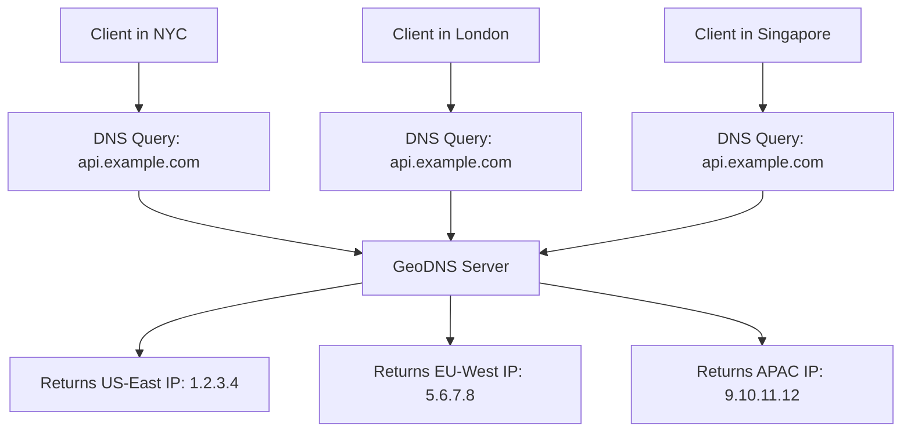

Load balancing distributes incoming requests across multiple backend servers to achieve higher throughput, availability, and fault tolerance. The type of load balancer and algorithm chosen determines performance characteristics and failure behavior.

## Layer 4 vs Layer 7 Load Balancing

The OSI layer at which load balancing operates determines what information is available for routing decisions and the performance characteristics.

### What Each Layer Can See

| Information | Layer 4 (Transport) | Layer 7 (Application) |
|-------------|--------------------|-----------------------|
| Source/destination IP | ✅ | ✅ |
| TCP/UDP port | ✅ | ✅ |
| TCP connection state | ✅ | ✅ |
| TLS SNI hostname | ✅ (from ClientHello) | ✅ |
| HTTP method, URL, path | ❌ | ✅ |
| HTTP headers, cookies | ❌ | ✅ |
| Request body content | ❌ | ✅ |
| Decrypted TLS payload | ❌ | ✅ (after termination) |

### Connection Models


  
  **NAT (Network Address Translation)** or **DSR (Direct Server Return)**

  ```
  Client ──[TCP connection]──► L4 LB ──[same connection, IP rewritten]──► Backend
  ```

  - **One TCP connection** end-to-end (client ↔ backend)  
  - Load balancer maintains connection table (src IP:port → backend IP:port)
  - **No request inspection** — forwards packets based on IP headers only
  - **Minimal latency** (~microseconds added for IP rewrite)
  - **High throughput** — near wire speed, handles millions of connections

  **DSR variant:** Backend responses bypass the load balancer entirely, going direct to client. Even higher throughput but requires backend configuration.
  

  
  **Proxy model with full request parsing**

  ```
  Client ──[TCP conn A]──► L7 LB ──[TCP conn B]──► Backend
  ```

  - **Two separate TCP connections**: client→LB and LB→backend
  - Load balancer **terminates and parses** the full HTTP request  
  - **Content-based routing** by URL path, headers, cookies, body
  - **Higher latency** (~1-5ms for HTTP parsing and new connection)
  - **Lower throughput** (CPU bound by TLS + HTTP processing)
  - **Rich features**: sticky sessions, A/B testing, request transformation

  **Connection pooling:** LB maintains persistent connections to backends, reusing them across client requests.
  


### Performance Comparison

| Characteristic | Layer 4 | Layer 7 |
|----------------|---------|---------|
| **Latency overhead** | ~10μs (packet rewrite) | ~1-5ms (HTTP parse + new conn) |
| **Throughput** | 10M+ requests/second | 100K-1M+ requests/second |
| **Memory per connection** | ~100 bytes (flow table entry) | ~10KB (HTTP parser + buffers) |
| **Max concurrent connections** | 10M+ | 100K-1M |
| **CPU utilization** | Very low | Moderate to high (TLS + parsing) |

## Load Balancing Algorithms

The algorithm determines which backend server receives each incoming request.

### Basic Algorithms

| Algorithm | Selection Method | Best For | Gotcha |
|-----------|------------------|----------|--------|
| **Round Robin** | Sequential rotation through all backends | Uniform request cost, identical backends | Doesn't account for processing time — slow requests still get next turn |
| **Weighted Round Robin** | Proportional to assigned weights | Heterogeneous backend capacities | Static weights; manual tuning when capacity changes |
| **Random** | Random backend selection | High throughput, stateless services | Surprisingly effective — approaches optimal as request count grows |
| **Least Connections** | Backend with fewest active connections | Variable request processing time | Tracks connections, not actual load — 10 heavy queries = 10 light ones |
| **Least Response Time** | Lowest average response time + fewest connections | Latency-sensitive applications | Reactive to past performance, slow to adapt to sudden changes |

### Advanced Algorithms

**IP Hash:**
```
backend = hash(client_ip) % num_backends
```
- **Use case:** Simple session affinity without cookie support
- **Problem:** Adding/removing backends reshuffles most assignments → session loss

**Consistent Hashing:**
```
Hash ring: place backends and requests on circular space
Request routes to next backend clockwise on the ring
```
- **Benefit:** Adding/removing a backend only affects `1/N` of requests
- **Requirement:** Virtual nodes (100-200 per backend) for even distribution
- **Use case:** Cache backends, session affinity, stateful services

**Power of Two Choices (P2C):**
```
1. Pick 2 backends at random
2. Route to the one with fewer active connections  
3. Achieves near-optimal load distribution with O(1) selection cost
```
- **Benefit:** Avoids thundering herd effect of pure Least Connections
- **Use case:** Microservices, service mesh — Envoy's default least-request routing uses P2C; Linkerd uses EWMA (Exponentially Weighted Moving Average), which weights recent latency history rather than raw connection count

### Algorithm Selection Guide

| Scenario | Recommended Algorithm |
|----------|----------------------|
| Identical backends, uniform requests | Round Robin |
| Identical backends, variable processing time | Least Connections or P2C |
| Different backend capacities | Weighted Round Robin |
| Session affinity required | Consistent Hashing |
| High-throughput stateless services | Random or P2C |
| Cache tier (same key → same backend) | Consistent Hashing |
| Microservices sidecar proxy | Power of Two Choices |

## Health Checks

Load balancers must detect failed backends and route traffic only to healthy ones.

### Health Check Types


  
  **Proactive monitoring** with synthetic requests

  ```
  Load Balancer → GET /health → Backend
                ← 200 OK ←
  ```

  **Configuration:**
  - **Interval:** Check every 5-30 seconds
  - **Timeout:** Mark unhealthy if no response in 3-5 seconds  
  - **Failure threshold:** Remove after N consecutive failures (typically 3-5)
  - **Recovery threshold:** Re-add after M consecutive successes (typically 2-3)

  **Health endpoint requirements:**
  - Fast response (<100ms) — avoid expensive operations
  - Check actual readiness — database connectivity, dependencies
  - Return structured info for debugging: `{"status": "ok", "db": "connected", "cache": "connected"}`

  **Considerations:**
  - **Grace periods during deploys:** New instances need time to warm up
  - **Health check load:** 10 LBs × 100 backends × 10s interval = 1000 requests/s overhead
  

  
  **Reactive monitoring** based on real request failures

  ```
  Real request → Backend
              ← 5xx error or timeout ←
  LB marks backend degraded after N failures
  ```

  **Triggers:**
  - HTTP 5xx responses (500, 502, 503, 504)
  - Connection timeouts or connection refused
  - SSL/TLS handshake failures

  **Benefits:**
  - **No extra load** — uses real application traffic
  - **Faster detection** — discovers issues immediately on first failure
  - **Real failure detection** — synthetic health checks may pass while real requests fail

  **Drawbacks:**
  - **Slower to detect** complete backend failure (needs multiple failed requests)
  - **Client impact** — some clients experience failures before backend is removed
  


### Health Check Best Practices

**Graceful shutdown:** Backends should:
1. Stop accepting new connections
2. Finish processing in-flight requests  
3. Return 503 Service Unavailable to health checks
4. LB removes from rotation, backend can safely terminate

**Dependency checks:** Health endpoints should verify:
- Database connectivity (connection pool status)
- Cache availability (Redis/Memcached)
- External API reachability (critical dependencies only)
- Disk space, memory usage (within safe thresholds)

## Session Affinity (Sticky Sessions)

Some applications store user session state in memory on specific backend servers. Session affinity ensures users consistently route to the same backend.

### Stickiness Methods

| Method | Implementation | Trade-offs |
|--------|----------------|------------|
| **IP Hash** | `hash(client_ip) % backends` | Breaks with NAT, CG-NAT routes entire ISP to same backend |
| **Cookie Injection** | LB sets cookie: `Set-Cookie: SERVERID=backend1` | Reliable, requires HTTP/HTTPS, cookie support |
| **Session ID Hash** | Hash session ID from header/cookie | Most flexible, works across protocol changes |

### Cookie Stickiness Example

**Nginx configuration:**
```nginx
upstream backend_pool {
    ip_hash;  # Built-in IP-based stickiness
    server 10.0.1.1:8080;
    server 10.0.1.2:8080; 
    server 10.0.1.3:8080;
}

# Or cookie-based with sticky module
upstream backend_pool {
    server 10.0.1.1:8080 route=a;
    server 10.0.1.2:8080 route=b;
    server 10.0.1.3:8080 route=c;
    sticky cookie srv_id expires=1h;
}
```

**HAProxy configuration:**
```
backend app_servers
    balance roundrobin
    cookie SERVERID insert indirect nocache
    server app1 10.0.1.1:8080 check cookie app1
    server app2 10.0.1.2:8080 check cookie app2  
    server app3 10.0.1.3:8080 check cookie app3
```


**Sticky sessions are an anti-pattern** for scalable architecture. When a backend fails, all sessions on that server are lost. The correct approach is **externalizing session state** to Redis, a database, or JWT tokens so any backend can serve any request. Use sticky sessions only as a temporary workaround for legacy applications that can't be refactored.


## Global Load Balancing

Global load balancing distributes traffic across multiple geographic regions to reduce latency and improve availability.

### Geographic Routing Methods

**DNS-based GeoDNS:**


**How GeoDNS works:**
1. Client makes DNS query to resolve `api.example.com`
2. Authoritative DNS server checks the **resolver's IP** (not client IP)
3. Returns the IP address of the closest regional endpoint
4. Client connects directly to that regional load balancer

**EDNS Client Subnet (ECS):** Resolvers can include client subnet in DNS queries, enabling routing by actual client location rather than resolver location:
```
DNS Query: api.example.com
EDNS: Client Subnet = 203.0.113.0/24
Response: Returns endpoint closest to 203.0.113.0/24
```

### Anycast Routing

**Single IP, multiple locations:**
```
Same IP address (1.1.1.1) advertised via BGP from multiple locations:
├─ San Francisco data center advertises 1.1.1.1/32
├─ London data center advertises 1.1.1.1/32  
├─ Singapore data center advertises 1.1.1.1/32
└─ São Paulo data center advertises 1.1.1.1/32

Client traffic routes to closest location via BGP path selection
```

**Benefits:**
- **Automatic failover** — if one location goes down, BGP re-routes to next closest
- **No DNS caching issues** — same IP works from anywhere  
- **Optimal routing** — BGP ensures shortest AS path to client

**Use cases:**
- **CDN edge servers** — Cloudflare, AWS CloudFront  
- **DNS resolvers** — 8.8.8.8 (Google), 1.1.1.1 (Cloudflare)
- **DDoS protection services** — traffic absorbed at nearest edge

### Global Server Load Balancing (GSLB)

**Intelligent DNS with health awareness:**

```
GSLB Controller monitors regional load balancers:
├─ US-East: 1000 RPS, 50ms avg latency, healthy  
├─ US-West: 500 RPS, 30ms avg latency, healthy
├─ EU: 200 RPS, 40ms avg latency, healthy
└─ APAC: 800 RPS, 60ms avg latency, degraded

DNS responses weighted by:
• Geographic proximity to client
• Current load and latency  
• Health status and capacity
• Business rules (disaster recovery)
```

**GSLB capabilities:**
- **Failover:** Remove unhealthy regions from DNS responses
- **Load-based routing:** Shift traffic from overloaded regions
- **Disaster recovery:** Automatically promote backup regions
- **Maintenance mode:** Gracefully drain traffic during updates

### Regional Architecture Patterns

**Active-Active (Multi-Regional):**
```
Clients in each region hit local load balancers
├─ US clients → US load balancer → US backends
├─ EU clients → EU load balancer → EU backends  
└─ APAC clients → APAC load balancer → APAC backends

Cross-region data consistency via:
• Eventual consistency (Cassandra, DynamoDB Global Tables)
• Conflict resolution (CRDTs, last-write-wins)
• Regional read replicas with async replication
```

**Active-Passive (Disaster Recovery):**
```
Primary: US region serves all traffic
Standby: EU region ready but not serving traffic

Failover process:
1. Health check detects US region failure
2. GSLB updates DNS responses (US → EU)  
3. EU region activated and begins serving traffic
4. RTO: 2-10 minutes (DNS TTL dependent)
```

### Global Load Balancing Tools

| Solution | Type | Capabilities |
|----------|------|-------------|
| **AWS Route 53** | DNS-based GSLB | GeoDNS, weighted routing, health checks, failover |
| **Cloudflare Load Balancing** | Anycast + intelligent DNS | Global health monitoring, traffic steering, DDoS protection |
| **F5 GTM** | Hardware/software GSLB | Advanced health monitoring, application-aware routing |
| **NS1** | DNS-based | Filter chains for complex routing logic, real-time health data |
| **Azure Traffic Manager** | DNS-based | Geographic, performance-based, weighted routing |

### Latency Optimization

**Regional endpoint selection reduces latency:**

```
Without global LB (all traffic to US):
• US client → US: 20ms RTT
• EU client → US: 120ms RTT  ← crosses Atlantic
• APAC client → US: 180ms RTT ← crosses Pacific

With global LB (regional endpoints):  
• US client → US: 20ms RTT
• EU client → EU: 15ms RTT    ← stays local
• APAC client → APAC: 25ms RTT ← stays local

Latency reduction: 80-160ms improvement for non-US clients
```

## Production Deployment Patterns

### Layered Load Balancing

Real production systems often use multiple layers:

```
Internet
    │
    ▼
L4 Load Balancer (AWS NLB, HAProxy mode tcp)
    │  ← HA for L7 layer, preserves client IP
    │  ← Handles non-HTTP protocols
    ▼  
L7 Load Balancer (Nginx, HAProxy mode http, Envoy)
    │  ← TLS termination, HTTP routing
    │  ← Authentication, rate limiting
    ▼
Application Backends
```

**Why layer them?**
- **L4 provides HA** for the L7 load balancers themselves
- **L4 handles scale** — millions of connections with minimal resources  
- **L7 provides intelligence** — content routing, app-layer features
- **Operational simplicity** — L4 rarely needs changes, L7 can be updated frequently

### Cloud Load Balancer Services

**AWS:**
- **ALB (Application Load Balancer):** L7 HTTP/HTTPS, path routing, WebSocket support
- **NLB (Network Load Balancer):** L4 TCP/UDP, preserves client IP, ultra-low latency
- **CLB (Classic Load Balancer):** Legacy, both L4 and L7 but limited features

**Google Cloud:**  
- **HTTP(S) Load Balancing:** Global L7, anycast IPs, Cloud CDN integration
- **Network Load Balancing:** Regional L4, DSR for maximum performance
- **Internal Load Balancing:** Private load balancing within VPC

**Azure:**
- **Application Gateway:** L7 with WAF, SSL termination, URL routing  
- **Load Balancer:** L4 with high availability, outbound connectivity
- **Traffic Manager:** DNS-based global load balancing

### Kubernetes Load Balancing

**Service types:**
- **ClusterIP:** Internal L4 load balancing within cluster  
- **NodePort:** Exposes service on each node's IP  
- **LoadBalancer:** Provisions cloud load balancer automatically
- **Ingress:** L7 HTTP routing with ingress controllers (Nginx, Traefik, Istio)

**Service mesh load balancing:**
- **Sidecar pattern:** Envoy proxy alongside each pod
- **Advanced algorithms:** Circuit breaking, retry logic, outlier detection  
- **Observability:** Distributed tracing, metrics for every request

Load balancing is foundational to building scalable, resilient distributed systems. The choice between L4 vs L7, algorithm selection, and global distribution strategy depends on your specific latency, throughput, and availability requirements.