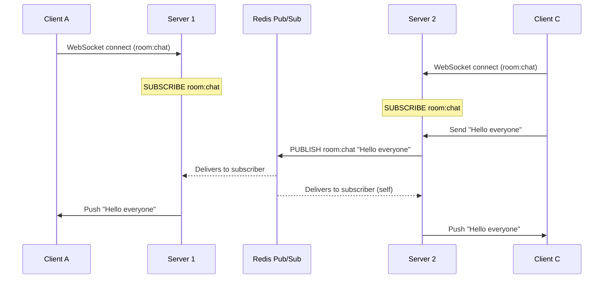

You're building a stock-trading app. Prices need to update on screen the instant they change on the exchange — but HTTP only lets the client ask, not the server tell. Polling every 100ms wastes bandwidth and hammers your servers; polling every 5s shows stale prices. The fix depends on what direction the data flows: SSE for one-way price updates, WebSockets for the bidirectional order entry channel, and long polling as the firewall fallback. Pick wrong and your scaling story falls apart at 100K concurrent users.

HTTP is request-response — the client always initiates. Real-time features (notifications, live feeds, chat) need the server to push data to the client. Three patterns exist, each with different tradeoffs.

## The Evolution of Server Push

```
Short Polling          Long Polling            SSE                    WebSocket
                                           (HTTP stream)          (protocol upgrade)

C ──GET /poll──► S     C ──GET /poll──► S    C ──GET /events──► S   C ──Upgrade──► S
C ◄── 204 ────── S     S holds open          S ◄────────────────    ◄══════════════►
(repeat every Ns)      S ◄── 200 (data) ─    S sends chunks         (full duplex)
                       C ──GET /poll──► S     as they arrive         continuously
                       (reconnect)
```

Short polling wastes requests — the server almost always has nothing new. Long polling and SSE are HTTP-based; WebSocket is a separate protocol.

## Long Polling

The client sends a request. The server holds the connection open until it has data to send (or a timeout fires), then responds. The client immediately sends another request.

```
Client                          Server
  │──── GET /notifications ────►│
  │                             │ (holds open — 29s elapsed)
  │◄─── 200 {"msg": "new order"}│
  │──── GET /notifications ────►│ (immediately reconnects)
  │                             │ (timeout — 30s)
  │◄─── 204 No Content ─────────│
  │──── GET /notifications ────►│
```

**Key properties:**
- Standard HTTP — works through every proxy, firewall, load balancer
- One in-flight request per client at all times
- Reconnect overhead: each cycle pays TCP/TLS setup (unless keep-alive reuses the connection)
- Server must correlate the reconnecting client back to its state

**Where long polling is still used:** Twilio, Stripe webhooks fallback, environments where WebSockets are blocked by firewalls.

## Server-Sent Events (SSE)

The client makes a single HTTP GET. The server responds with `Content-Type: text/event-stream` and keeps the response body open, writing events as they occur. The client never closes the connection voluntarily.

```
GET /events HTTP/1.1
Accept: text/event-stream

HTTP/1.1 200 OK
Content-Type: text/event-stream
Cache-Control: no-cache

data: {"type":"price_update","symbol":"AAPL","price":189.42}\n\n

event: alert\n
data: {"msg":"order filled"}\n\n

: heartbeat\n\n
```

**Wire format:**

| Field | Meaning |
|-------|---------|
| `data:` | Event payload (one line per field, blank line terminates event) |
| `event:` | Named event type (client uses `addEventListener('alert', ...)`) |
| `id:` | Last-event-ID; sent as `Last-Event-ID` header on reconnect |
| `retry:` | Tells client how many ms to wait before reconnecting |
| `: comment` | Heartbeat / keep-alive (ignored by client, prevents proxy timeout) |

**Auto-reconnect:** The browser's `EventSource` API reconnects automatically with `Last-Event-ID`, allowing the server to resume from where the stream left off.

**HTTP/2 advantage:** Each SSE subscription is one HTTP/2 stream — many subscriptions share a single TCP connection. Under HTTP/1.1, browsers cap connections at 6 per origin, limiting concurrent SSE streams.

## WebSockets

WebSocket starts as HTTP, then upgrades to a persistent full-duplex TCP connection. Either side can send frames at any time.

**Upgrade handshake:**

```
GET /ws HTTP/1.1
Upgrade: websocket
Connection: Upgrade
Sec-WebSocket-Key: dGhlIHNhbXBsZSBub25jZQ==
Sec-WebSocket-Version: 13

HTTP/1.1 101 Switching Protocols
Upgrade: websocket
Connection: Upgrade
Sec-WebSocket-Accept: s3pPLMBiTxaQ9kYGzzhZRbK+xOo=
```

After the 101, the connection is no longer HTTP. The server and client exchange **frames**, not requests/responses.

**Frame types:**

| Opcode | Purpose |
|--------|---------|
| `0x1` Text | UTF-8 payload (JSON messages) |
| `0x2` Binary | Raw bytes (Protobuf, MessagePack, audio) |
| `0x8` Close | Graceful shutdown with status code |
| `0x9` Ping | Keepalive probe |
| `0xA` Pong | Keepalive reply |

**Key properties:**
- Full-duplex — server and client both push without waiting
- Binary support — efficient for audio, video, game state
- No built-in auto-reconnect — application must implement
- Each connection is a stateful, persistent TCP socket (important for scaling)

## Side-by-Side Comparison

| | Long Polling | SSE | WebSocket |
|---|---|---|---|
| **Direction** | Server → Client | Server → Client | Bidirectional |
| **Protocol** | HTTP | HTTP | ws:// / wss:// |
| **Persistent connection** | No (reconnects each cycle) | Yes | Yes |
| **Browser API** | `fetch` / `XMLHttpRequest` | `EventSource` | `WebSocket` |
| **Auto-reconnect** | Manual | ✅ Built-in (`EventSource`) | Manual |
| **HTTP/2 multiplexing** | ✅ | ✅ | ❌ (separate TCP) |
| **Binary support** | ❌ | ❌ (text only) | ✅ |
| **Proxy / firewall friendly** | ✅ (plain HTTP) | ✅ (plain HTTP) | Sometimes blocked |
| **Load balancer support** | ✅ | ✅ | Requires sticky sessions |
| **Overhead per message** | High (HTTP headers each cycle) | Low (chunked stream) | Very low (2–10 byte frame header) |

## Scaling WebSocket Connections

WebSocket connections are **stateful** — a persistent TCP socket exists between the client and a specific server process. This breaks horizontal scaling assumptions.

**Problem: message fan-out across instances**



Each server subscribes to Redis (or Kafka, NATS) channels. When a message arrives on any server, it publishes to the bus; all other servers deliver it to their connected clients.

**Sticky sessions:** Without pub/sub, the load balancer must route a client to the same server every time (sticky by IP or session cookie). This creates uneven load and complicates deploys.


A single WebSocket server process typically handles 10k–100k concurrent connections before hitting file descriptor limits or memory pressure. Plan connection counts early — a chat app with 1M online users needs ~10–100 WebSocket server processes.


**SSE scaling is simpler:** SSE is stateless from the load balancer's perspective — any server can serve an SSE stream as long as it can subscribe to the same event source (database, message bus). No sticky sessions required.

## When to Use Each

| Use case | Best fit | Reason |
|----------|----------|--------|
| Live notifications (new email, order update) | SSE | Server→client only; HTTP/2 multiplexing; auto-reconnect |
| Live dashboard / stock ticker | SSE | Continuous server push; no client→server messages needed |
| Chat / collaborative editing | WebSocket | Bidirectional — client and server both send frequently |
| Multiplayer game state | WebSocket | Binary frames, low overhead, low latency |
| Live sports scores | SSE | Broadcast to many clients; server push only |
| Presence indicators ("X is typing") | WebSocket | Client must push events to server |
| Environment blocks WebSockets (corporate proxy) | SSE or Long Polling | HTTP-based protocols bypass WS restrictions |
| IoT telemetry ingest | WebSocket | Binary, persistent, bidirectional for command & control |


**Interview tip:** Pick from the data direction: "Server-to-client only (notifications, dashboards, tickers) → SSE. It's plain HTTP, `EventSource` auto-reconnects for free, and over HTTP/2 each subscription is a stream on one TCP connection. Bidirectional (chat, collaboration) → WebSockets, accepting the cost: stateful connections need sticky sessions, a server tops out at 10K–100K concurrent connections, and cross-instance fan-out requires Redis pub/sub. Long polling only as a fallback when corporate proxies block WebSockets."


## Test Your Understanding


WebSocket connections are **stateful and pinned to a specific server**. Server 1 has no direct connection to User B. The message must go through a **shared pub/sub layer**:

1. Server 1 receives the message from User A via WebSocket
2. Server 1 publishes the message to a pub/sub bus (Redis Pub/Sub, NATS, or Kafka)
3. Server 2, subscribed to the same channel, receives the message
4. Server 2 pushes it to User B via User B's WebSocket connection

Without this pub/sub layer, messages can only be delivered to users connected to the same server instance. This is the fundamental scaling challenge of WebSockets — they require external infrastructure for cross-server message routing.



Under **HTTP/1.1**, browsers limit connections to **6 per origin**. Each SSE subscription holds one connection open. With 5 tabs each having an SSE connection, that's 5 of 6 available connections consumed — leaving only 1 for all other HTTP requests (page loads, API calls, images). A 6th tab's SSE connection blocks entirely.

**Fix:** Enable **HTTP/2**. SSE subscriptions become HTTP/2 streams multiplexed over a single TCP connection. Hundreds of SSE subscriptions share one connection, and the 6-connection limit no longer applies. Alternatively, use a **shared worker** or **BroadcastChannel API** to fan one SSE connection to all tabs.



During a rolling deploy, WebSocket servers are shut down one at a time. Each server shutdown **kills all WebSocket connections on that instance** — there's no way to gracefully migrate a stateful TCP connection to another server.

**Mitigations:**
1. **Graceful drain:** Before shutdown, the server sends a WebSocket close frame (opcode 0x8) to all connected clients with a reason code. Clients see the close and reconnect to another server via the load balancer.
2. **Client-side reconnect with exponential backoff and jitter:** Clients must implement automatic reconnection. Add jitter to prevent a reconnect storm where all clients from the drained server hit the LB simultaneously.
3. **Connection state in Redis:** Store session/room membership in Redis, not in server memory. When clients reconnect to a different server, that server can restore context from Redis.
4. **Deploy in small batches:** Terminate 1 server at a time with sufficient delay for clients to reconnect before the next server goes down.



Stock prices are **server-to-client only** — the client doesn't need to send data back on the same channel. SSE is the better fit because:

1. **No sticky sessions needed** — SSE is stateless from the LB's perspective. Any server can serve an SSE stream as long as it subscribes to the same price feed.
2. **Auto-reconnect** — `EventSource` API handles reconnection with `Last-Event-ID` automatically. WebSockets require manual reconnect logic.
3. **HTTP/2 multiplexing** — 100K SSE streams share a manageable number of TCP connections. WebSocket connections are each a separate TCP socket.
4. **Simpler infrastructure** — no pub/sub layer needed for cross-server routing (each server independently subscribes to the price feed).

**When WebSockets are necessary:** If clients also need to **send** data — e.g., placing orders, subscribing to specific symbols in real time, or implementing a trading interface where the server needs to acknowledge client actions on the same connection.



In a **thread-per-request** server model (e.g., traditional Tomcat, Spring MVC synchronous), each long-polling connection holds a thread for 30 seconds doing nothing. With 10K concurrent clients, that's 10K threads blocked — consuming memory (~1MB stack per thread) and exhausting the thread pool.

**SSE avoids this because it's designed for async I/O.** The server opens the connection and registers a callback — no thread is held. When data is available, the event loop writes to the connection. Frameworks like Node.js (event loop), Spring WebFlux (reactive), and Go (goroutines) handle thousands of concurrent SSE connections on a handful of OS threads.

**Fix for long polling:** Switch to an **async servlet** (Servlet 3.0+), DeferredResult in Spring, or move to SSE/WebSockets. The underlying issue isn't the protocol — it's using a synchronous server for a long-lived connection pattern.

