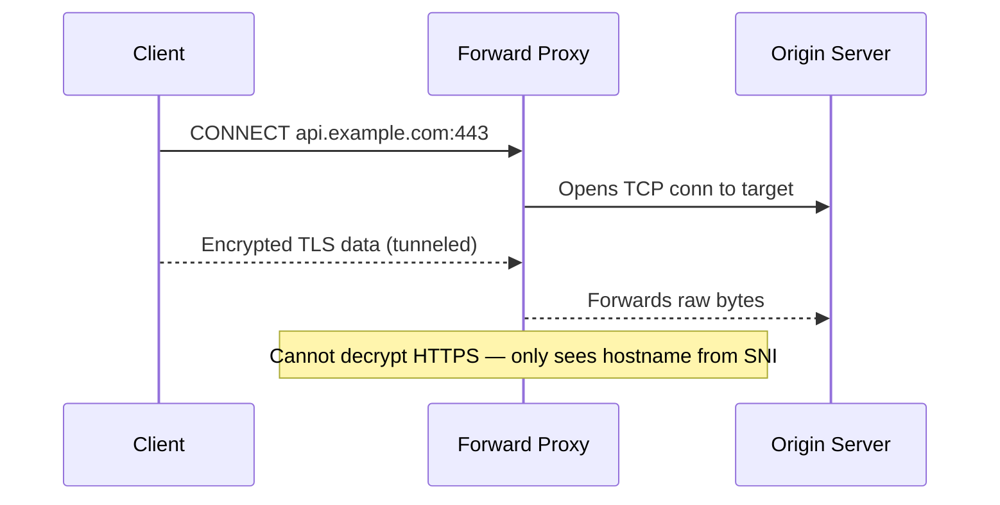
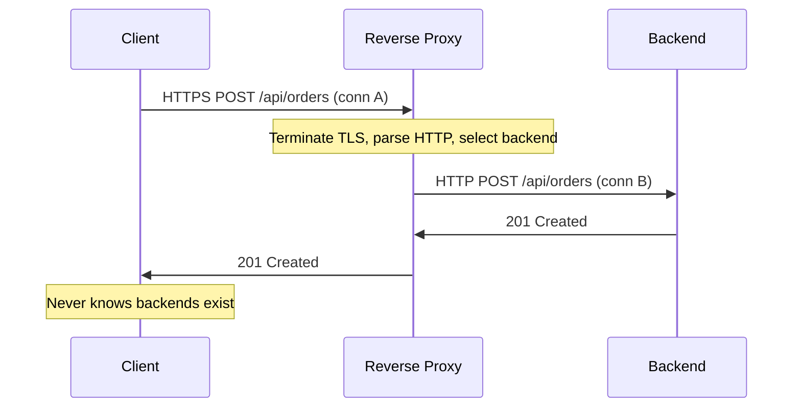

You're running 12 microservices behind a single domain. Clients only know about `api.example.com`, but `/users/*` needs to land on the User service, `/orders/*` on the Order service, TLS needs to be terminated centrally, JWTs validated before any backend sees the request, and you want to canary the Payment service to 5% of traffic. All of that lives in one place: the reverse proxy.

A proxy sits between two parties in a connection. The direction it faces determines its capabilities.

| | Forward Proxy | Reverse Proxy |
|---|---|---|
| **Sits in front of** | Clients | Servers |
| **Represents** | Clients to the internet | Servers to clients |
| **Client knows about it?** | Yes (explicitly configured) | No (transparent) |
| **Primary purpose** | Privacy, filtering, egress control | Load balancing, TLS termination, caching |

## Forward Proxy



A forward proxy acts on behalf of clients. The client explicitly configures its browser or app to route traffic through it. For HTTPS, it establishes a TCP tunnel via `CONNECT` — the proxy forwards raw bytes without decrypting, so it can only filter by **hostname/IP**, not by URL path or headers.

| Use Case | Example |
|---|---|
| **Corporate egress control** | Block social media; allow only approved SaaS domains |
| **Anonymity** | VPN services, Tor — hide client IP from destination |
| **Bandwidth optimization** | Cache OS updates at the office proxy |
| **Geo-circumvention** | Proxy in another country to bypass regional restrictions |

## Reverse Proxy



A reverse proxy acts on behalf of servers. Clients believe they're talking to the origin, but they're hitting the proxy. It **terminates the client connection**, makes a routing decision, and **opens a new connection** to the backend (the terminate-and-reoriginate model).

### Core Capabilities


  
  ```
  Client ──[TLS 1.3]──► Proxy ──[HTTP]──► Backend (internal network)
  ```

  - Centralized cert management — one cert per domain, not per backend
  - Offloads CPU-intensive TLS from application servers
  - **SNI-based routing:** One proxy terminates TLS for multiple domains on the same IP by reading `server_name` in the TLS ClientHello
  - **OCSP Stapling:** Proxy caches certificate revocation status, eliminating the browser's round trip to the CA
  

  
  Proxy buffers the **full request body** before connecting to the backend:

  - **Slow-client protection:** A client uploading 10MB at 1KB/s doesn't hold a backend connection for hours
  - **Slowloris defense:** Attackers sending headers very slowly never reach the backend (Slowloris is a DoS attack that holds connections open by sending partial HTTP requests extremely slowly)
  - **Trade-off:** Large uploads require memory proportional to body size — configure `client_max_body_size`
  

  
  Maintains persistent TCP connections to backends, reused across client requests:

  ```
  Short-lived client conns ──┐
                              ├──► Pool [conn1, conn2, conn3] ──► Backend
  Short-lived client conns ──┘    (persistent, reused)
  ```

  Eliminates TCP + TLS handshake overhead per request (100–300ms saved). Configure pool size, connection lifetime, and keepalive settings.
  


### Client IP Preservation

The backend sees the **proxy's IP**, not the client's. Standard headers recover the real IP:

```http
X-Forwarded-For: 203.0.113.5, 10.0.0.1
X-Real-IP: 203.0.113.5
X-Forwarded-Proto: https
```


**Never trust the leftmost IP in `X-Forwarded-For`** for auth or rate limiting. A malicious client can send `X-Forwarded-For: 1.2.3.4` and the proxy appends to it. Always read the IP added by your **first trusted proxy**, or configure the proxy to overwrite the header entirely.


### Use Cases

| Use Case | How |
|---|---|
| **Microservices routing** | Route `/users/*` → User Service, `/orders/*` → Order Service |
| **Canary / blue-green deploys** | Route 5% traffic to new version via weighted upstreams |
| **Rate limiting** | Per-client quotas at the proxy layer |
| **Auth gateway** | Validate JWT/API keys before forwarding — backends trust the proxy |
| **Response transformation** | Strip internal headers, add CORS, reshape JSON |


**Nginx:**
```nginx
upstream backend_pool {
    least_conn;
    keepalive 32;
    server 10.0.0.1:8080 weight=3;
    server 10.0.0.2:8080 weight=1;
    server 10.0.0.3:8080 backup;
}

server {
    listen 443 ssl http2;
    server_name api.example.com;
    ssl_certificate /etc/ssl/api.crt;
    ssl_certificate_key /etc/ssl/api.key;

    location /api/v1/ {
        proxy_pass http://backend_pool;
        proxy_set_header X-Real-IP $remote_addr;
        proxy_set_header X-Forwarded-For $proxy_add_x_forwarded_for;
        proxy_next_upstream error timeout http_502 http_503;
    }
}
```

**HAProxy:**
```
frontend https_frontend
    bind *:443 ssl crt /etc/ssl/api.pem
    default_backend app_servers

backend app_servers
    balance leastconn
    option httpchk GET /health
    server app1 10.0.0.1:8080 check
    server app2 10.0.0.2:8080 check
    server app3 10.0.0.3:8080 check backup
```


## API Gateway = Reverse Proxy + Application Intelligence

An API gateway adds auth, rate limiting, analytics, and service discovery on top of reverse proxy capabilities.

| Capability | Reverse Proxy | API Gateway |
|---|---|---|
| Load balancing, TLS, routing | ✅ | ✅ |
| **Auth** (JWT, OAuth, API keys) | Basic | ✅ Full |
| **Per-user rate limiting** | Per-IP only | ✅ Per-user/key/quota |
| **Request transformation** | Header manipulation | ✅ JSON reshaping, protocol translation |
| **Service discovery** | Static config | ✅ Dynamic (Consul, K8s, Eureka) |
| **Analytics** | Access logs | ✅ API metrics, usage tracking |

**Request aggregation (BFF pattern):** Mobile app calls `GET /dashboard` → gateway fans out to User, Order, and Payment services → merges into one response. Reduces round trips on metered connections.

**Protocol translation:** Client sends REST/JSON → gateway converts to gRPC/Protobuf for internal services.

## System Design Placement

```
Internet → L4 LB (NLB/HAProxy TCP) → L7 Reverse Proxy / API Gateway → Backends
              │                              │
              ├─ HA for the proxy layer      ├─ TLS termination
              ├─ Preserves client IP         ├─ HTTP routing, auth
              └─ Handles non-HTTP traffic    └─ Connection pooling, rate limiting
```


**Interview tip:** "I'd put an L4 LB at the front for HA and to preserve client IP via PROXY protocol. Behind it, an L7 reverse proxy (Nginx or Envoy) does TLS termination, path-based routing, connection pooling, and request buffering against slow clients and Slowloris. That's also where I'd land canary deploys via weighted upstreams. When I need per-user auth, rate limiting, or request transformation, I'd promote it to an API gateway like Kong or Envoy. Two pitfalls: never trust the leftmost `X-Forwarded-For` — read the IP from your first trusted proxy. And the L7 layer adds 1–5ms from terminate-and-reoriginate, so for ultra-low-latency or non-HTTP traffic, stay at L4 with DSR."


## Test Your Understanding


**Acceptable when:** Proxy and backends are in the same trusted network (same VPC, same rack), the network is not shared with untrusted workloads, and compliance requirements don't mandate end-to-end encryption.

**Must re-encrypt when:**
- PCI-DSS, HIPAA, or similar compliance mandates encryption in transit end-to-end
- The backend network is multi-tenant or shared
- Zero-trust architecture is in place (assume the network is hostile)

In practice, service meshes (Istio, Linkerd) solve this with sidecar-to-sidecar **mTLS** (mutual TLS, where both client and server present certificates to authenticate each other) — the application never handles TLS itself.



The proxy **appends** the real client IP to the existing `X-Forwarded-For`, resulting in `X-Forwarded-For: 10.0.0.1, <real-ip>`. If the backend naively reads the leftmost IP, the attacker appears to be `10.0.0.1` — bypassing per-IP rate limits or impersonating an internal address.

**Fix:** Configure the proxy to **count hops from the right**. If you have exactly one trusted proxy, the rightmost IP is the real client. Or use `X-Real-IP` which the proxy sets to the direct connection IP (not appendable). Some frameworks (Express `trust proxy`, Django `NUM_PROXIES`) support this natively.



**Stay with a reverse proxy** when you only need: TLS termination, path-based routing, static load balancing, connection pooling, and basic per-IP rate limiting. Nginx/Envoy handle these with minimal overhead.

**Promote to an API gateway** when you need:
- **Per-user authentication and authorization** (JWT validation, OAuth token introspection, RBAC per endpoint)
- **Per-user/API-key rate limiting** with quotas and tiered plans
- **Dynamic service discovery** (backends register/deregister without config reload)
- **Request transformation** (protocol translation, JSON reshaping, request aggregation)
- **API analytics** (per-endpoint metrics, usage tracking, billing)

The cost of a gateway: added latency (5–20ms for auth + transformation), another system to operate, and potential single point of failure if not HA'd properly.



With buffering enabled, the proxy attempts to buffer the **entire 500MB request body** in memory before forwarding to the backend. This can OOM the proxy or exhaust buffer capacity, especially under concurrent large uploads.

**Mitigations:**
1. **`client_max_body_size`** — reject uploads over a threshold (e.g., 50MB) with `413 Content Too Large`
2. **Disable buffering for upload endpoints** — `proxy_request_buffering off` in Nginx passes data to the backend as a stream (but loses slow-client protection for that route)
3. **Dedicated upload path** — route large uploads to a separate endpoint that handles them directly (e.g., pre-signed S3 URLs), bypassing the proxy entirely
4. **Disk buffering** — some proxies can buffer to disk instead of memory, trading I/O latency for memory safety



When the signing key rotates, the gateway can't validate tokens signed with the old key if it only knows the new key. In-flight requests with old tokens get **401 Unauthorized** — a brief authentication outage.

**Design for key rotation:**
1. **JWKS (JSON Web Key Set) endpoint:** The gateway fetches keys from `/.well-known/jwks.json`. The issuer publishes **both old and new keys** during the rotation window. The gateway tries all keys in the set until one validates.
2. **Cache with TTL:** Gateway caches the JWKS with a short TTL (5–10 min). On validation failure, it re-fetches the JWKS before returning 401 — this catches key rotations between cache refreshes.
3. **`kid` (Key ID) header:** Each JWT's header includes a `kid` that identifies which key signed it. The gateway looks up the specific key by `kid` from the JWKS, avoiding trial-and-error.
4. **Overlap period:** The issuer keeps the old key in the JWKS for at least as long as the longest-lived token (e.g., if access tokens expire in 15 min, keep the old key for 15 min after rotation).

