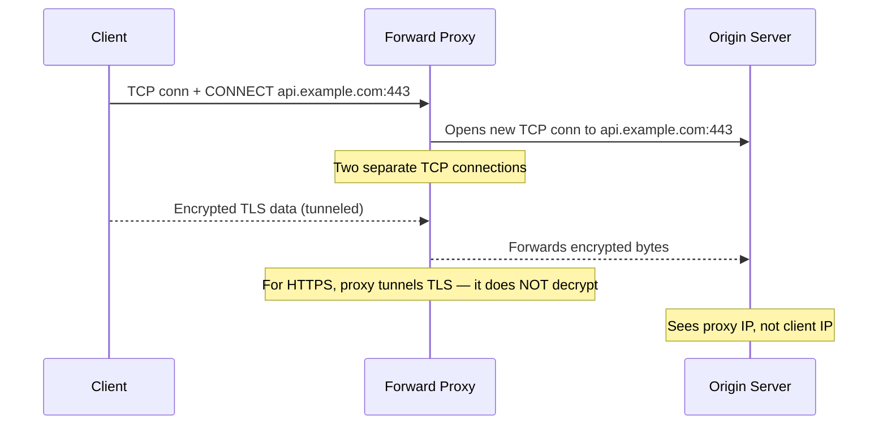
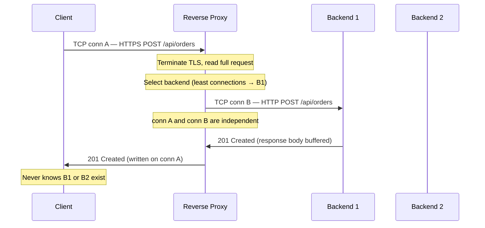

A proxy sits between two parties in a connection. The direction it faces determines the name, capabilities, and use cases.

| | Forward Proxy | Reverse Proxy |
|---|---|---|
| **Sits in front of** | Clients | Servers |
| **Represents** | Clients to the internet | Servers to clients |
| **Client knows about it?** | Yes (explicitly configured) | No (transparent) |
| **Server knows about it?** | No | Yes |
| **Primary purpose** | Privacy, filtering, egress control | Load balancing, TLS termination, caching |

## Forward Proxy



A forward proxy acts on behalf of clients. The client explicitly configures their browser or application to route traffic through the proxy server.

### HTTPS Tunneling

For HTTPS traffic, the client sends a `CONNECT` request to establish a TCP tunnel:

```http
CONNECT api.example.com:443 HTTP/1.1
Host: api.example.com:443
```

The proxy establishes a connection to the target server and forwards raw bytes back and forth. **The proxy cannot decrypt TLS traffic** — it only sees the target hostname from the SNI extension in the ClientHello.

This limitation means forward proxies can only filter by:
- Target hostname/IP (from CONNECT or SNI)
- Connection patterns and timing
- Traffic volume

They cannot inspect HTTP headers, request paths, or response content for HTTPS traffic.

### Use Cases

| Use Case | How | Example |
|----------|-----|---------|
| **Corporate egress control** | All outbound traffic routes through proxy; policy engine allows/blocks domains | Block social media during work hours; allow only business-critical SaaS |
| **Content filtering** | DNS-based or SNI-based blocking of categories | Parental controls, corporate compliance (block adult content, gambling) |
| **Anonymity/Privacy** | Client IP hidden from destination servers | VPN services, Tor network, privacy-focused browsing |
| **Bandwidth optimization** | Cache frequently requested content, compress responses | Office proxy caches OS updates, reduces internet bandwidth usage |
| **Geographic circumvention** | Proxy located in different country/region | Access geo-blocked content, bypass regional restrictions |

### Common Forward Proxy Tools

- **Squid**: Open-source caching proxy with authentication and access control
- **Nginx**: Can be configured as forward proxy with `proxy_pass` and resolver directives
- **Corporate solutions**: Zscaler, Bluecoat ProxySG, Forcepoint
- **Consumer VPNs**: NordVPN, ExpressVPN (simplified forward proxy model)

## Reverse Proxy



A reverse proxy acts on behalf of servers. Clients believe they're talking directly to the origin server, but they're actually hitting the proxy.

### The Terminate-and-Reoriginate Model

Unlike Layer 4 load balancers that forward packets, a reverse proxy:

1. **Terminates the client connection** — reads the full HTTP request
2. **Makes routing decisions** based on URL path, headers, cookies, or request body
3. **Opens a new connection to the selected backend**
4. **Forwards the request** and buffers the response
5. **Returns the response** to the client on the original connection

This model enables powerful capabilities but adds latency (typically 1-5ms overhead).

### Core Capabilities


  
  The reverse proxy terminates TLS and forwards plaintext HTTP to backends:

  ```
  Client ──[TLS 1.3]──► Proxy ──[HTTP]──► Backend (internal network)
  ```

  **Benefits:**
  - Centralized certificate management — one cert per domain, not per backend
  - Offloads CPU-intensive TLS operations from application servers
  - Enables HTTP inspection for routing and security

  **SNI-based routing:** A single proxy can terminate TLS for multiple domains on the same IP by reading the `server_name` extension in the TLS ClientHello.

  **OCSP Stapling:** Proxy fetches and caches certificate revocation status, stapling it to the handshake to eliminate the browser's round trip to the CA.
  

  
  Distributes incoming requests across multiple backend servers:

  ```
  Client requests        Backend pool
  ──────────────────    ──────────────
  GET /api/users   ──►  Server A (least connections)
  POST /api/orders ──►  Server B (round robin)
  GET /health      ──►  Server C (weighted)
  ```

  **Algorithms:** Round robin, least connections, weighted, IP hash, consistent hashing
  **Health checks:** Active probes (`GET /health`) or passive failure detection
  **Session affinity:** Cookie-based or IP-based sticky sessions when needed
  

  
  Proxy buffers the **full request body** from the client before connecting to the backend:

  - **Slow client protection:** A client uploading a 10MB file at 1KB/s doesn't hold a backend connection for 3 hours
  - **Slowloris defense:** Attackers sending headers very slowly never reach the backend
  - **Backend efficiency:** Backend connections are held only for the time to process complete requests

  **Trade-off:** Large uploads require memory proportional to body size — configure `client_max_body_size` limits.
  

  
  Maintains persistent TCP connections to backends, reused across client requests:

  ```
  Client connections (short-lived)    Backend pool (persistent)
  ──────────────────────────────     ───────────────────────────
  Client 1 (closes after response) ┐
  Client 2 (closes after response) ├─► Pool: [conn1, conn2, conn3] ──► Backend
  Client 3 (closes after response) ┘         (never closed, reused)
  ```

  **Benefit:** Eliminates TCP + TLS handshake overhead on every request (100-300ms saved)
  **Configuration:** Pool size per backend, connection lifetime limits, keepalive settings
  


### Header Management and Client IP Preservation

Since the reverse proxy opens a new connection, the backend sees the **proxy's IP**, not the client's.

**Standard headers for client IP recovery:**
```http
X-Forwarded-For: 203.0.113.5, 10.0.0.1, 10.0.0.2
X-Real-IP: 203.0.113.5
X-Forwarded-Proto: https
X-Forwarded-Host: api.example.com
```


**Security note:** Never trust the leftmost IP in `X-Forwarded-For` for authentication or rate limiting. A malicious client can send `X-Forwarded-For: 1.2.3.4` and the proxy will append to it. Always read the IP added by your **first trusted proxy** or configure the proxy to overwrite the header entirely.


**Forwarded header (RFC 7239):** More structured alternative:
```http
Forwarded: for=203.0.113.5;proto=https;host=api.example.com
```

### Circuit Breaking and Fault Tolerance

Reverse proxies can implement circuit breakers to prevent cascading failures:

**Circuit breaker states:**
- **Closed** (normal): Requests flow through to backends
- **Open** (tripped): Proxy returns immediate errors without contacting backends
- **Half-open** (testing): Proxy sends probe requests to test backend recovery

**Triggers:** N consecutive failures, error rate above threshold, response times above limit

### Use Cases

| Use Case | Implementation | Benefit |
|----------|---------------|---------|
| **Microservices aggregation** | Route `/api/users/*` → User Service, `/api/orders/*` → Order Service | Single API endpoint for clients; service boundaries hidden |
| **Blue/green deployments** | Route 100% traffic to blue, then gradually shift to green | Zero-downtime deployments |
| **Canary releases** | Route 5% traffic to new version, 95% to stable | Risk mitigation for new features |
| **Rate limiting** | Per-client request quotas at the proxy layer | Protect backends from overload |
| **Authentication gateway** | Validate JWT/API keys before forwarding requests | Centralized auth logic; backends trust proxy |
| **Response transformation** | Strip internal headers, add CORS headers, reshape JSON | API contract management |

### Production Tools

**Nginx Configuration Example:**
```nginx
upstream backend_pool {
    least_conn;
    keepalive 32;          # connection pool size
    server 10.0.0.1:8080 weight=3;
    server 10.0.0.2:8080 weight=1;
    server 10.0.0.3:8080 backup;
}

server {
    listen 443 ssl http2;
    server_name api.example.com;

    ssl_certificate     /etc/ssl/api.crt;
    ssl_certificate_key /etc/ssl/api.key;
    ssl_stapling on;

    # Request buffering for slow clients
    client_max_body_size 10m;
    proxy_request_buffering on;

    location /api/v1/ {
        proxy_pass         http://backend_pool;
        proxy_http_version 1.1;
        proxy_set_header   Connection "";
        proxy_set_header   Host $host;
        proxy_set_header   X-Real-IP $remote_addr;
        proxy_set_header   X-Forwarded-For $proxy_add_x_forwarded_for;
        proxy_set_header   X-Forwarded-Proto $scheme;
        
        # Timeouts
        proxy_connect_timeout 5s;
        proxy_send_timeout    60s;
        proxy_read_timeout    60s;
        
        # Health checks
        proxy_next_upstream error timeout http_500 http_502 http_503;
    }

    # Static content bypass
    location /static/ {
        root /var/www/assets;
        expires 1y;
        add_header Cache-Control "public, immutable";
    }
}
```

**HAProxy Configuration Example:**
```
frontend https_frontend
    bind *:443 ssl crt /etc/ssl/api.pem
    http-request set-header X-Forwarded-Proto https
    default_backend app_servers

backend app_servers
    balance leastconn
    option httpchk GET /health
    cookie SERVERID insert indirect nocache
    server app1 10.0.0.1:8080 check cookie app1
    server app2 10.0.0.2:8080 check cookie app2
    server app3 10.0.0.3:8080 check cookie app3 backup
```

## API Gateway: Reverse Proxy++

An API Gateway is a reverse proxy enhanced with application-layer intelligence:

| Capability | Reverse Proxy | API Gateway |
|------------|---------------|-------------|
| Load balancing | ✅ | ✅ |
| TLS termination | ✅ | ✅ |
| Request routing | ✅ (URL-based) | ✅ (URL, headers, JWT claims) |
| **Authentication** | Basic (HTTP auth) | ✅ (JWT, API keys, OAuth 2.0) |
| **Authorization** | ❌ | ✅ (RBAC, per-endpoint policies) |
| **Rate limiting** | Basic (per-IP) | ✅ (per-user, per-API key, quotas) |
| **Request transformation** | Header manipulation | ✅ (JSON reshaping, protocol translation) |
| **Analytics** | Access logs | ✅ (API metrics, usage tracking) |
| **Service discovery** | Static backend config | ✅ (Consul, Kubernetes, Eureka) |

### API Gateway Use Cases

**Request aggregation (Backend for Frontend pattern):**
```
Mobile client request: GET /api/dashboard
  ├─ Gateway calls User Service: GET /users/123
  ├─ Gateway calls Order Service: GET /users/123/orders
  ├─ Gateway calls Payment Service: GET /users/123/wallet
  └─ Gateway merges responses → single JSON response to client
```

**Protocol translation:**
```
Client: REST/JSON over HTTPS
  └─ Gateway transforms to: gRPC over HTTP/2 to internal services
```

**Common API Gateway Solutions:**
- **Kong**: Open-source, Lua-based plugins, high performance
- **AWS API Gateway**: Managed service, tight AWS integration
- **Apigee**: Enterprise-grade, extensive policy management
- **Traefik**: Modern, Docker/Kubernetes native
- **Envoy**: Service mesh component, gRPC-first

## System Design Placement

In a well-architected system, you'll often see layered proxies:

```
DNS Resolution
    ↓
L4 Load Balancer (AWS NLB / HAProxy mode tcp)
    ↓  ← High availability for the proxy layer itself
    ↓  ← Preserves client IP via PROXY protocol
    ↓
L7 Reverse Proxy / API Gateway (Nginx / Kong / Envoy)
    ↓  ← TLS termination, HTTP routing, authentication
    ↓  ← Connection pooling to backends
    ↓
Backend Services / Microservices
```

**Why this layering?**
- **L4 layer** provides HA for the L7 proxies and handles non-HTTP protocols
- **L7 layer** provides application intelligence and HTTP-specific features
- **Backend layer** focuses purely on business logic

When designing systems:
- **Include a reverse proxy** when you have multiple backends, need TLS termination, or want centralized routing logic
- **Upgrade to API gateway** when you need authentication, rate limiting, or request transformation
- **Add L4 in front** when you need HA for the proxy itself or handle non-HTTP traffic

The reverse proxy is typically the **first component clients reach** after DNS resolution in any distributed system architecture.