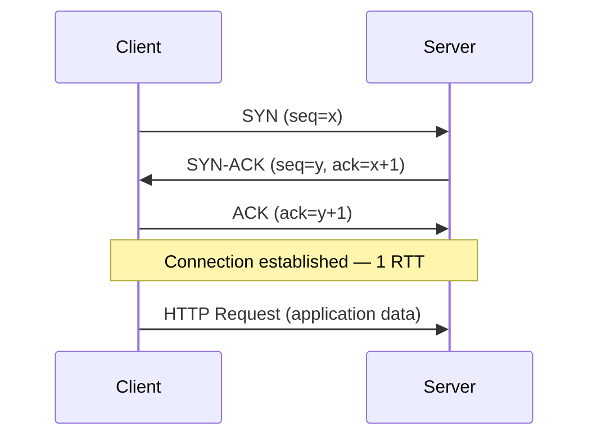
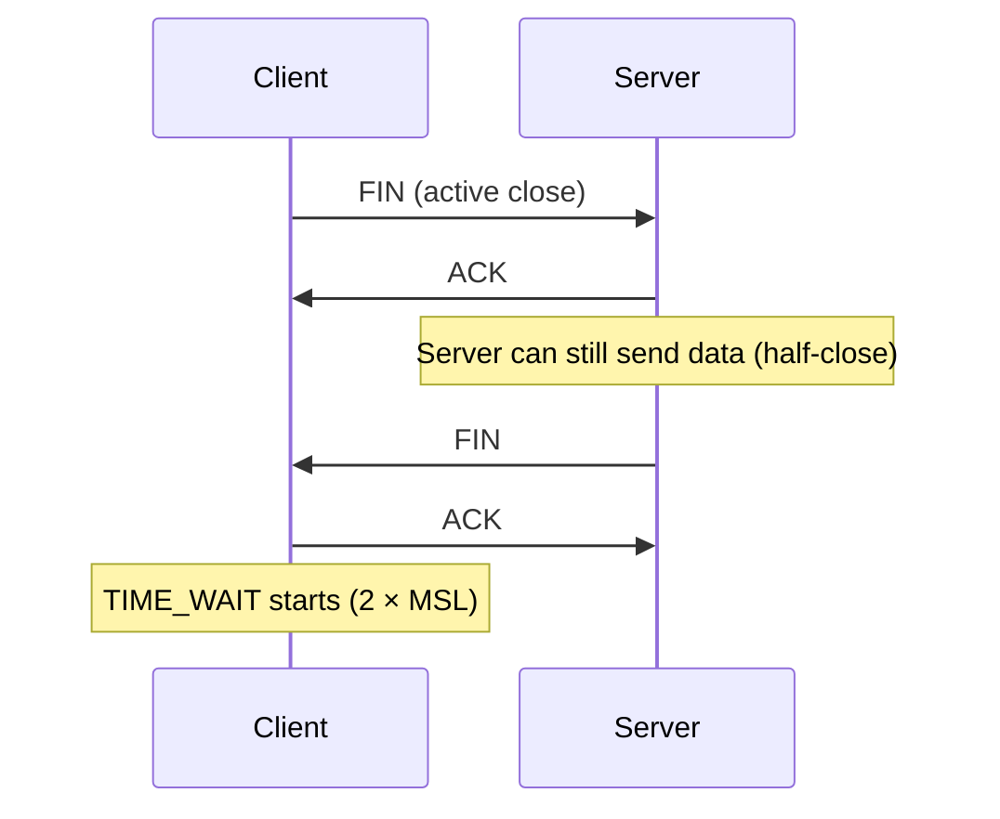

TCP and UDP are the two transport-layer protocols that almost everything on the internet runs on. They sit above IP and below application protocols like HTTP, DNS, and WebSocket.

| | TCP | UDP |
|---|---|---|
| Connection | Stateful (3-way handshake) | Connectionless |
| Delivery guarantee | Yes (retransmit on loss) | No |
| Ordering | Yes (sequence numbers) | No |
| Flow control | Yes (receive window) | No |
| Congestion control | Yes (slow start, AIMD) | No |
| Header size | 20 bytes minimum | 8 bytes |
| Latency | Higher (handshake + reliability overhead) | Lower |
| Use cases | HTTP, database, file transfer, SSH | DNS, video streaming, gaming, VoIP, QUIC |

## TCP

### 3-Way Handshake

Every TCP connection starts with a 3-way handshake before any application data is exchanged.



Cost: **1 RTT before the first byte of application data**. TLS adds an additional 1 RTT on top (TLS 1.3), making the total **2 RTTs** for a new HTTPS connection.

The handshake allocates state on both sides (socket buffers, sequence numbers, congestion window). This is why half-open connections and SYN floods are effective attacks — they exhaust this state.

### Reliable Ordered Delivery

- Every byte has a **sequence number**
- Receiver sends **ACK** for received data; ACK number = next expected byte
- Sender starts a **retransmission timer** on each segment; retransmits if ACK not received before timeout
- Receiver **buffers out-of-order segments** and delivers to the application only in order

```
Sender:   [1][2][3][4][5]
Network:      ↑ packet 2 lost
Receiver: [1]   [3][4][5]  ← buffers 3,4,5; delivers only 1 to app
Receiver sends: ACK 2 (NACK, requesting retransmit)
Sender retransmits: [2]
Receiver: [1][2][3][4][5]  ← delivers 2,3,4,5 to app
```

This in-order delivery requirement is the root cause of **TCP-level head-of-line blocking** (covered in HTTP/2 and HTTP/3).

### Flow Control — Receive Window

The receiver advertises how much buffer space it has. The sender cannot have more than `rwnd` bytes of unacknowledged data in flight.

```
Receiver buffer: [  consumed  |    available (rwnd=4KB)   ]
Sender: may only send 4KB before receiving an ACK
```

If the application is reading slowly, `rwnd` shrinks → sender slows down → no buffer overflow at the receiver.

**Window scaling:** The original TCP window field is 16 bits (max 65KB). For high-bandwidth or high-latency links (e.g., 10Gbps WAN), 65KB in flight is insufficient. The Window Scale option (negotiated during handshake) multiplies the window by up to 2¹⁴ — enabling windows up to 1GB.

### Congestion Control

TCP infers network congestion from packet loss and adjusts the send rate. The **congestion window** (`cwnd`) limits how much the sender sends, independent of `rwnd`.

Effective send rate = `min(cwnd, rwnd)`


  
  Starts cautiously to probe available bandwidth.

  - Initial `cwnd` = 10 MSS (Maximum Segment Size, ~14KB)
  - `cwnd` **doubles** every RTT (exponential growth)
  - Continues until `cwnd` reaches `ssthresh` (slow start threshold)
  - On loss: `ssthresh = cwnd/2`, restart from initial `cwnd`

  New connections always go through slow start — this is why the first few seconds of a large transfer are slow. HTTP/2's single connection amplifies this: one connection means one slow start.
  

  
  Once past `ssthresh`, TCP shifts to linear growth.

  - **Additive Increase**: `cwnd += 1 MSS` per RTT
  - **Multiplicative Decrease**: on loss, `cwnd = cwnd / 2`
  - Net effect: "probe up, back off hard" — the sawtooth pattern

  ```
  cwnd
    ↑       /\      /\      /\
    |      /  \    /  \    /  \
    |     /    \  /    \  /    \
    |____/      \/      \/      \___
    ssthresh        time →
  ```

  AIMD ensures fairness between competing flows — all flows converge to equal share of bottleneck bandwidth.
  

  
  Avoids waiting for retransmission timeout (which can be 200ms–1s).

  - Receiver sends **duplicate ACKs** for each out-of-order segment received
  - **3 duplicate ACKs** → sender retransmits the missing segment immediately, without waiting for timeout
  - Combined with **Fast Recovery**: `ssthresh = cwnd/2`, `cwnd = ssthresh` (not full restart)

  Fast retransmit + recovery recovers from isolated packet loss quickly. Timeout-based retransmit is only triggered for more severe loss or when duplicate ACKs don't arrive.
  



**BBR (Bottleneck Bandwidth and Round-trip propagation time):** Google's 2016 congestion control algorithm. Instead of reacting to loss, BBR models the network's bottleneck bandwidth and minimum RTT, and sends at the estimated optimal rate. More aggressive than AIMD on long-fat pipes; used by Google, YouTube, and many CDNs.


### Connection Teardown — TIME_WAIT

TCP uses a 4-way teardown. Either side initiates by sending FIN.



The active closer enters **TIME_WAIT** for `2 × MSL` (Maximum Segment Lifetime — 30–60 seconds on Linux, making TIME_WAIT last 60–120 seconds).

**Why TIME_WAIT exists:**
1. Ensures the final ACK reaches the server (if lost, server retransmits FIN; client must be alive to re-ACK)
2. Prevents delayed packets from an old connection from being misinterpreted by a new connection on the same src:dst IP:port pair

**TIME_WAIT at scale:**

At high connection rates (100K+ connections/second), sockets pile up in TIME_WAIT. Each socket holds a port. The default local port range is ~28,000 ports → exhausted quickly.

| Mitigation | How |
|------------|-----|
| `net.ipv4.tcp_tw_reuse = 1` | Reuse TIME_WAIT sockets for new outbound connections if safe (requires timestamps) |
| `net.ipv4.ip_local_port_range = 1024 65535` | Increase available local ports from ~28K to ~64K |
| **Connection pooling** | Reuse TCP connections instead of closing after each request — eliminates most TIME_WAIT accumulation |
| `SO_REUSEPORT` | Multiple sockets can bind the same port; load distributed across sockets |


`tcp_tw_recycle` (older Linux) aggressively recycled TIME_WAIT sockets but broke connections from clients behind NAT — multiple clients share one IP and their timestamps were non-monotonic from the server's perspective. It was removed in Linux 4.12. Do not use it.


### Half-Open Connections

A half-open connection exists when one side believes the connection is established but the other does not (crash, NAT timeout, network partition).

- NAT devices drop mappings after idle timeout (typically 30s–5 minutes). The client still holds the socket; the NAT has forgotten the mapping.
- The remote side sends data → NAT has no mapping → returns RST → connection reset
- Without application-level data flow, half-open connections can persist indefinitely

**Detection:**
- **TCP keepalive**: kernel sends probe packets after idle period (`tcp_keepalive_time`, default 2 hours — far too long for most applications)
- **Application heartbeat**: preferred over TCP keepalive; more control, works across proxies that strip TCP options

### SYN Flood

An attacker sends SYN packets without completing the handshake. The server allocates state for each half-open connection in the **SYN backlog**. When the backlog is full, legitimate SYNs are dropped.

**SYN cookies** (default on Linux):
- Server encodes connection state into the Initial Sequence Number (ISN) of the SYN-ACK
- No memory allocated until the client's ACK arrives
- ACK carries the encoded state — server reconstructs the connection from it
- Attackers never send ACK → no memory consumed

## UDP

UDP provides only two things beyond raw IP: port numbers (multiplexing) and an optional checksum.

```
UDP Header (8 bytes):
┌──────────────┬──────────────┐
│  Src Port    │  Dst Port    │
├──────────────┼──────────────┤
│  Length      │  Checksum    │
└──────────────┴──────────────┘
│  Payload (application data) │
```

Each UDP datagram is **independent**. There is no connection state, no retransmission, no ordering, no flow control. If a packet is lost, it is gone.

**What UDP gives you:**
- No handshake latency — send immediately
- No head-of-line blocking — each datagram is independent
- Multicast and broadcast support (TCP is unicast only)
- Application controls retry logic (if needed)

## Why QUIC Chose UDP

TCP is implemented in the OS kernel. Deploying a change to TCP behavior requires an OS update across all devices — a multi-year rollout. The internet had been unable to evolve TCP for decades due to this.

QUIC runs in user space (part of the application binary). Updating QUIC behavior requires only an application update. By building on UDP, QUIC:
- Bypasses kernel TCP entirely
- Reimplements reliability, ordering, and flow control — per stream, independently
- Adds 0-RTT resumption, connection migration, and built-in TLS 1.3
- Can be deployed and iterated on at app-update speed

See [HTTP/3 and QUIC](../http-3) for the full treatment.

## Use Cases

| Protocol | Use | Reason |
|----------|-----|--------|
| TCP | HTTP/1.1, HTTP/2 | Reliability and ordering required |
| TCP | Database queries (PostgreSQL, MySQL) | Results must be complete and ordered |
| TCP | File transfer (SFTP, rsync) | Every byte must arrive |
| TCP | SSH | Interactive; cannot lose keystrokes |
| UDP | DNS | Single request/response; latency matters more than reliability; retry at app layer |
| UDP | Video streaming (RTP/RTSP) | Occasional loss acceptable; retransmitting old frames wastes bandwidth |
| UDP | Online gaming | Old positional updates are useless; prefer freshest data over completeness |
| UDP | VoIP | Real-time; old audio frames are worthless; retransmit would arrive too late |
| UDP | QUIC (HTTP/3) | Reliability reimplemented in user space with independent streams |
| UDP | DHCP, NTP, SNMP | Simple request/response; broadcast support needed |
