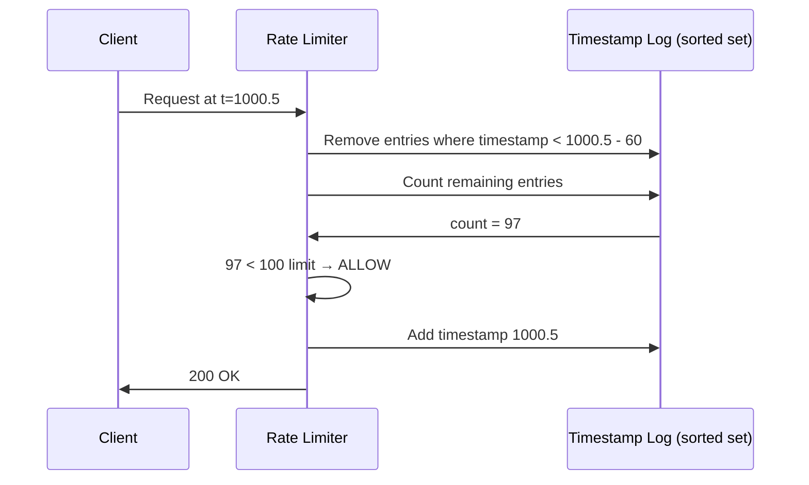
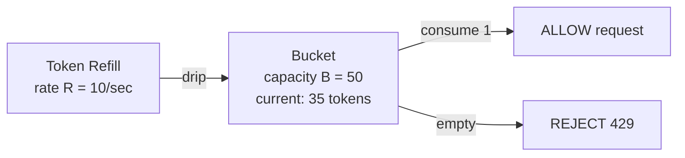
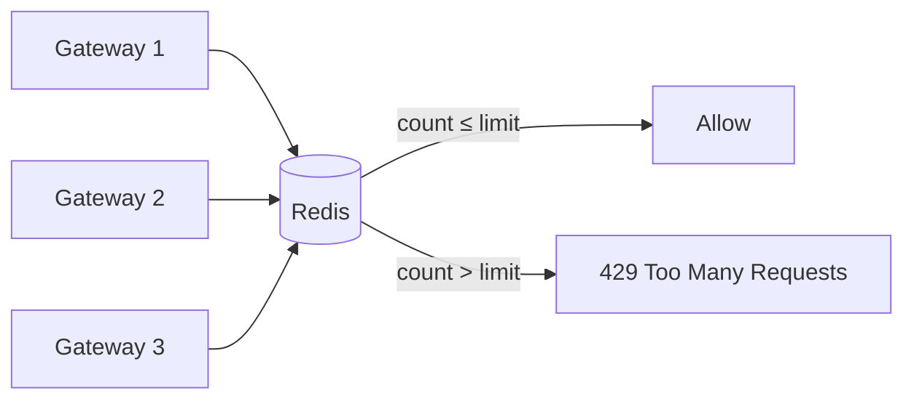

Your API receives 10,000 requests per second from a single client. Without rate limiting, that client's traffic saturates your database connection pool, causing timeouts for every other user. Rate limiting caps how many requests a client can make in a given time period — protecting backend resources, enforcing fair usage, and preventing abuse.

The algorithm you choose determines the precision, memory cost, burst tolerance, and implementation complexity of your rate limiter.

## Fixed Window Counter

Divide time into fixed-duration windows (e.g., 1-minute intervals). Maintain a counter per client per window. Increment on each request. Reject when the counter exceeds the limit.

```
Window:  [12:00:00 — 12:01:00]   [12:01:00 — 12:02:00]
Counter:       0 → 1 → ... → 100      0 → 1 → ...

Request at 12:00:45, counter=99 → ALLOW (counter → 100)
Request at 12:00:46, counter=100 → REJECT (limit reached)
Request at 12:01:00, counter resets → ALLOW (counter → 1)
```

**Redis implementation:**

```python
def fixed_window(client_id, limit, window_seconds):
    key = f"rate:{client_id}:{int(time.time()) // window_seconds}"
    count = redis.incr(key)
    if count == 1:
        redis.expire(key, window_seconds)
    return count <= limit
```

### The Boundary Burst Problem

A client can send `limit` requests at the end of one window and `limit` requests at the start of the next — effectively 2× the intended rate across a short period.

```
Limit: 100 requests per minute

Window 1: [12:00 — 12:01]  Window 2: [12:01 — 12:02]
           ............▓▓▓▓▓|▓▓▓▓▓............
           100 requests     | 100 requests
           in last 5 sec    | in first 5 sec

= 200 requests in a 10-second span — double the intended rate
```

This is acceptable for many use cases but dangerous for resource-sensitive operations like payment processing.

## Sliding Window Log

Store the exact timestamp of every request in a sorted log. On each new request, remove timestamps older than the window, count remaining entries, and allow or reject.



**Redis sorted set implementation:**

```python
def sliding_window_log(client_id, limit, window_seconds):
    key = f"rate:{client_id}"
    now = time.time()
    window_start = now - window_seconds

    pipe = redis.pipeline()
    pipe.zremrangebyscore(key, 0, window_start)  # remove expired
    pipe.zadd(key, {str(now): now})               # add current
    pipe.zcard(key)                                # count
    pipe.expire(key, window_seconds)               # TTL cleanup
    _, _, count, _ = pipe.execute()

    return count <= limit
```

**Precision:** eliminates the boundary burst problem — the window slides with every request.

**Cost:** O(N) memory per client where N = number of requests in the window. For a high-volume API (10K requests/minute per client), this stores 10K timestamps per client. At scale, this is expensive.

## Sliding Window Counter

An approximation that combines the simplicity of fixed windows with the smoothness of a sliding window. Maintain counters for the **current** and **previous** fixed windows. Weight the previous window's counter by the overlap fraction.

```
Current window:  [12:01:00 — 12:02:00]  counter = 40
Previous window: [12:00:00 — 12:01:00]  counter = 85
Time now: 12:01:15 → 25% into current window → 75% overlap with previous

Estimated count = previous × (1 - elapsed%) + current
                = 85 × 0.75 + 40
                = 63.75 + 40 = 103.75 → REJECT (limit = 100)
```

```python
def sliding_window_counter(client_id, limit, window_seconds):
    now = time.time()
    current_window = int(now) // window_seconds
    previous_window = current_window - 1
    elapsed = (now % window_seconds) / window_seconds

    current_count = int(redis.get(f"rate:{client_id}:{current_window}") or 0)
    previous_count = int(redis.get(f"rate:{client_id}:{previous_window}") or 0)

    estimated = previous_count * (1 - elapsed) + current_count
    if estimated >= limit:
        return False

    redis.incr(f"rate:{client_id}:{current_window}")
    redis.expire(f"rate:{client_id}:{current_window}", window_seconds * 2)
    return True
```

**Memory:** O(2) keys per client — constant regardless of request volume. This is the sweet spot for most production rate limiters.

**Accuracy:** an approximation, not exact. The error is small and bounded — Cloudflare uses this algorithm for their rate limiting layer.

## Token Bucket

A bucket holds tokens up to a maximum capacity B. Tokens are added at a fixed rate R (e.g., 10 tokens/second). Each request consumes one token. If the bucket is empty, the request is rejected.



```
Time 0:   bucket = 50 (full)
Time 0-3: 45 requests arrive → bucket = 5
Time 3-4: 10 tokens refilled → bucket = 15
Time 4:   20 requests arrive → 15 allowed, 5 rejected → bucket = 0
Time 5:   10 tokens refilled → bucket = 10
```

**Key property:** token bucket allows **bursts** up to B while maintaining a long-term average rate of R. This is what makes it the most practical algorithm — it handles real traffic patterns where requests arrive in clusters.

```python
def token_bucket(client_id, rate, capacity):
    key = f"bucket:{client_id}"
    now = time.time()

    bucket = redis.hgetall(key)
    tokens = float(bucket.get("tokens", capacity))
    last_refill = float(bucket.get("last_refill", now))

    # Refill tokens based on elapsed time
    elapsed = now - last_refill
    tokens = min(capacity, tokens + elapsed * rate)

    if tokens < 1:
        return False  # reject

    tokens -= 1
    redis.hset(key, mapping={"tokens": tokens, "last_refill": now})
    redis.expire(key, int(capacity / rate) + 1)
    return True
```

**Used by:** AWS API Gateway, Stripe, GitHub API. Most real-world rate limiters use token bucket or a variant.


**Race condition in naive implementations.** The read-modify-write cycle (read current tokens → compute refill → decrement → write back) is not atomic. Two concurrent requests can both read tokens=1, both decrement, and both succeed — allowing 2 requests when only 1 should pass. Use Redis Lua scripts or `MULTI`/`EXEC` to make the operation atomic.


## Leaky Bucket

Requests enter a FIFO queue (the bucket). The bucket drains at a fixed rate. If the queue is full, new requests are dropped.

```
Requests arrive: [R1, R2, R3, R4, R5] at once
Queue capacity: 3
Drain rate: 1 request/second

t=0:  Queue: [R1, R2, R3]  R4, R5 → DROPPED
t=1:  Process R1, Queue: [R2, R3]
t=2:  Process R2, Queue: [R3]
t=3:  Process R3, Queue: []
```

**Difference from token bucket:** leaky bucket enforces a **constant** output rate with no bursts. Token bucket allows bursts up to capacity. Leaky bucket smooths traffic; token bucket accommodates bursty traffic.

**Used by:** network traffic shaping, NGINX `limit_req` with `burst` and `nodelay` parameters.

## Comparison

| Algorithm | Memory | Precision | Burst Handling | Complexity | Best For |
|-----------|--------|-----------|---------------|------------|----------|
| **Fixed window** | O(1) per client | Low (boundary burst) | None — hard cutoff at window | Lowest | Simple API quotas |
| **Sliding window log** | O(N) per client | Exact | None | Medium | Low-volume, high-precision needs |
| **Sliding window counter** | O(1) per client | Approximate | None | Low | Production rate limiters at scale |
| **Token bucket** | O(1) per client | Exact | Allows bursts up to B | Medium | Most real-world APIs (AWS, Stripe) |
| **Leaky bucket** | O(queue size) | Exact | Smooths to constant rate | Medium | Traffic shaping, network QoS |

## Distributed Rate Limiting

A single-node rate limiter is straightforward — all request counters live in one process. In a distributed system with multiple API gateway instances, you need shared state.

### Centralized Counter (Redis)

All gateway instances increment the same Redis key. Atomic operations (`INCR`, Lua scripts) ensure correctness.



**Atomic sliding window counter in Lua:**

```lua
-- KEYS[1] = rate limit key
-- ARGV[1] = window (seconds), ARGV[2] = limit, ARGV[3] = now (timestamp)
local key = KEYS[1]
local window = tonumber(ARGV[1])
local limit = tonumber(ARGV[2])
local now = tonumber(ARGV[3])

redis.call('ZREMRANGEBYSCORE', key, 0, now - window)
local count = redis.call('ZCARD', key)

if count < limit then
    redis.call('ZADD', key, now, now .. math.random())
    redis.call('EXPIRE', key, window)
    return 1  -- allowed
else
    return 0  -- rejected
end
```

### Per-Node with Sync

Each gateway maintains a local counter and periodically synchronizes with a central store. Faster (no Redis RTT per request) but allows brief over-limit windows during sync gaps.

| Approach | Latency per check | Accuracy | Redis failure mode |
|----------|-------------------|----------|-------------------|
| **Centralized** | +1 RTT to Redis (~1ms local, ~10ms cross-region) | Exact | Fail open (allow all) or fail closed (reject all) |
| **Per-node + sync** | Local (µs) | Approximate during sync gaps | Degrades to per-node limiting |

### Response Headers

Standard rate limit headers inform clients of their current state:

```
HTTP/1.1 200 OK
X-RateLimit-Limit: 100
X-RateLimit-Remaining: 42
X-RateLimit-Reset: 1680307200

HTTP/1.1 429 Too Many Requests
Retry-After: 30
X-RateLimit-Limit: 100
X-RateLimit-Remaining: 0
```


**Interview tip:** When designing a rate limiter, state the algorithm and why: "I'd use a token bucket with Redis — it allows burst traffic up to the bucket capacity while maintaining a long-term average rate. The bucket state is two fields (tokens, last_refill) stored in a Redis hash, checked atomically via a Lua script. For fault tolerance, I'd fail open on Redis failure — briefly allowing extra traffic is better than rejecting all requests." This shows you've thought about the algorithm choice, the distributed coordination, and the failure mode.
