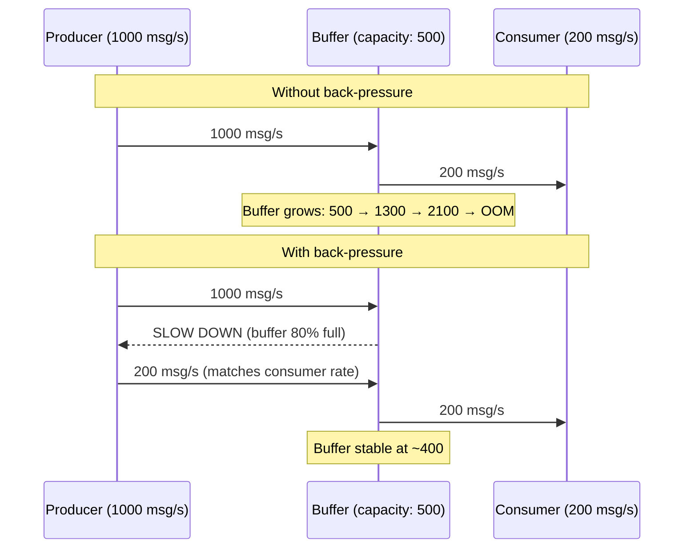
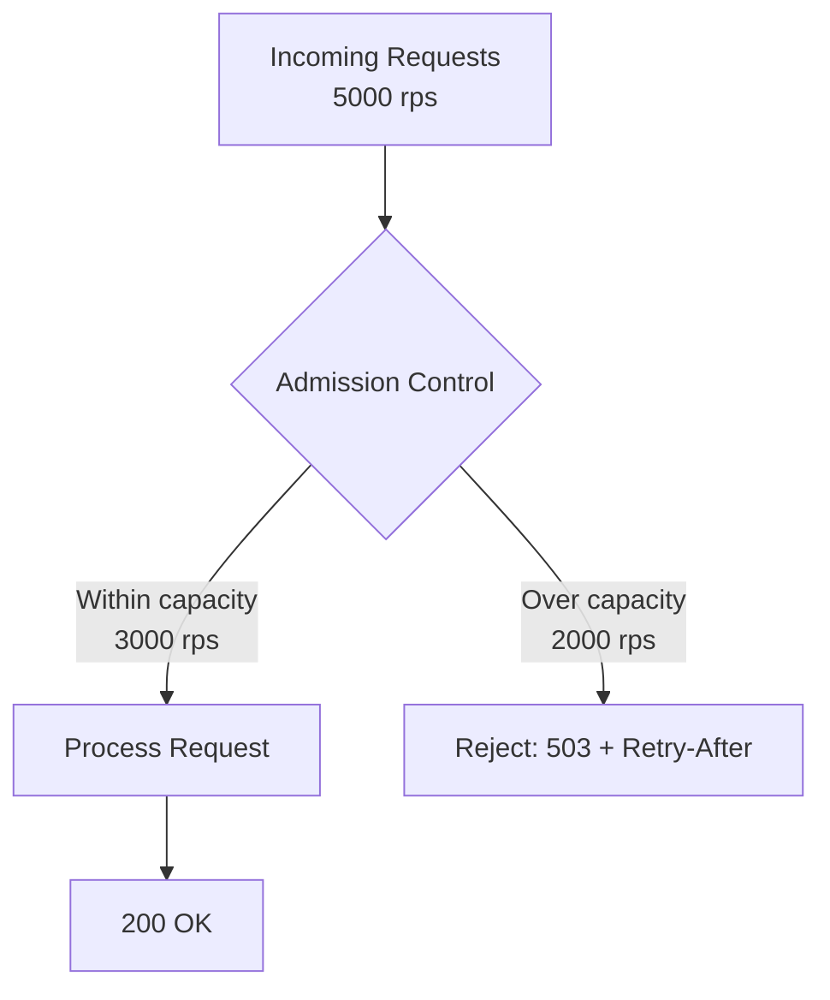

A producer generates events faster than the consumer can process them. Without intervention, the in-between buffer grows without bound — first exhausting memory, then triggering OOM kills, cascading failures, or silent data loss when the buffer is eventually dropped. **Back-pressure** and **load shedding** are two complementary strategies for handling overload: back-pressure slows down the producer; load shedding drops excess work to protect the system.

## Back-Pressure

Back-pressure is a flow control mechanism where a downstream component signals the upstream component to slow down. The signal propagates backward through the pipeline, reducing the input rate to match the processing capacity.



### TCP Flow Control

TCP has built-in back-pressure via the **receive window**. The receiver advertises how many bytes it can accept; the sender cannot exceed this. When the receiver's buffer fills, the window shrinks to zero — the sender blocks.

```
Sender sends 64KB → Receiver buffer: 64KB / 128KB
Sender sends 64KB → Receiver buffer: 128KB / 128KB (full)
Receiver advertises window = 0 → Sender pauses
Receiver processes 32KB → Receiver advertises window = 32KB
Sender sends 32KB → flow continues
```

This is why a slow HTTP client causes the server's `write()` call to block — TCP back-pressure propagates from the client through the kernel to the application.

### Reactive Streams

The [Reactive Streams](https://www.reactive-streams.org/) specification standardizes back-pressure for async pipelines. The consumer requests N items from the producer — the producer sends at most N, then waits for the next request.

```
Subscriber → Publisher: request(10)     // I can handle 10 items
Publisher → Subscriber: onNext(item) × 10
Subscriber → Publisher: request(5)      // processed some, ready for 5 more
Publisher → Subscriber: onNext(item) × 5
```

**Implementations:** Java `Flow` (JDK 9+), Project Reactor (`Flux`/`Mono`), RxJava (`Flowable`), Akka Streams.

```java
// Reactor example: consumer controls the pace
Flux.range(1, 1_000_000)
    .onBackpressureBuffer(1000, dropped -> log.warn("Dropped: {}", dropped))
    .publishOn(Schedulers.boundedElastic())
    .subscribe(item -> {
        process(item);  // slow consumer
    });
```

### Message Queue Back-Pressure

**Kafka:** consumers control their own pace — they call `poll()` when ready. If a consumer falls behind, its lag grows but the broker is not affected. Back-pressure is implicit: the consumer simply doesn't poll faster than it can process.

**RabbitMQ:** `prefetch_count` limits how many unacknowledged messages a consumer holds. The broker stops sending when the prefetch limit is reached — back-pressure from consumer to broker.

```python
# RabbitMQ: consumer-level back-pressure
channel.basic_qos(prefetch_count=10)  # max 10 unacked messages

def callback(ch, method, properties, body):
    process(body)          # slow processing
    ch.basic_ack(method.delivery_tag)  # ack → broker sends next

channel.basic_consume(queue='tasks', on_message_callback=callback)
```

## Load Shedding

When back-pressure alone cannot reduce the incoming rate (e.g., user-facing HTTP traffic — you can't tell browsers to slow down), the system must **shed load**: intentionally reject or drop requests to protect core functionality.



### Priority-Based Shedding

Not all requests are equal. Shed lowest-priority traffic first:

| Priority | Traffic Type | Shed First? |
|----------|-------------|-------------|
| **Critical** | Checkout, payment, authentication | Never shed (last resort) |
| **High** | Product page, search, cart | Shed under extreme overload |
| **Medium** | Recommendations, reviews, analytics | Shed early |
| **Low** | Health checks, background sync, telemetry | Shed first |

```python
def admission_control(request, current_load, capacity):
    priority = classify_priority(request)

    if current_load < capacity * 0.7:
        return ALLOW  # under 70% — allow everything

    if current_load < capacity * 0.85:
        if priority in ("low",):
            return REJECT  # shed low-priority
        return ALLOW

    if current_load < capacity * 0.95:
        if priority in ("low", "medium"):
            return REJECT  # shed low + medium
        return ALLOW

    # Over 95% — only critical traffic
    if priority != "critical":
        return REJECT
    return ALLOW
```

### Where to Shed

Shed as **early** as possible in the request path — before the request consumes resources:

```
User → CDN → Load Balancer → API Gateway → Service → Database
                                  ↑
                        Shed here (cheapest rejection point)
```

**API Gateway / reverse proxy:** NGINX `limit_req` with `burst` and `nodelay`, Envoy's adaptive concurrency limiter, AWS ALB connection limits.

**Application-level:** track in-flight request count; reject with 503 when count exceeds threshold. This is more precise than infrastructure-level shedding because it can account for request cost (a simple GET vs an expensive aggregation query).

### CoDel (Controlled Delay)

A sophisticated load shedding algorithm used by Google's Stubby/gRPC framework. Instead of shedding based on queue depth, CoDel tracks **how long requests spend in the queue**. If the minimum queue delay exceeds a threshold for a sustained period, CoDel starts dropping requests from the head of the queue.

```
Request enters queue at t=1000
Request dequeued at t=1015 → queue delay = 15ms

If min queue delay > 5ms for the last 100ms interval:
  → start dropping requests
  → drop rate increases over time until queue delay drops below 5ms
```

**Why head-of-queue drops?** The oldest request in the queue is the most likely to have already timed out at the client — returning a response for it is wasted work.

## Back-Pressure vs Load Shedding

| Property | Back-Pressure | Load Shedding |
|----------|--------------|---------------|
| Mechanism | Slow down the producer | Drop excess requests |
| Data loss | None — all messages eventually processed | Yes — dropped requests are lost |
| Works when | Producer is controllable (internal pipeline, message queue) | Producer is uncontrollable (user HTTP traffic, external API) |
| Latency impact | Increases producer-side latency (waiting) | Keeps latency low for admitted requests |
| Failure mode | Cascading slowdown if back-pressure propagates too far | Partial unavailability (some users get 503) |

In practice, both are used together:
- **Back-pressure** within internal async pipelines (Kafka consumers, stream processing, database write queues)
- **Load shedding** at the system boundary (API gateway, load balancer) for external traffic


**Interview tip:** When discussing system overload, say: "At the API gateway, I'd use load shedding with priority classification — health checks and analytics are shed first, checkout traffic is protected. Inside the system, the Kafka consumer uses back-pressure implicitly — it polls at its own pace, and consumer lag is monitored. If lag exceeds 5 minutes, we scale the consumer group horizontally. The key principle is: reject early at the boundary, propagate back-pressure through internal pipelines." This shows you understand the distinction between controllable and uncontrollable traffic sources.
