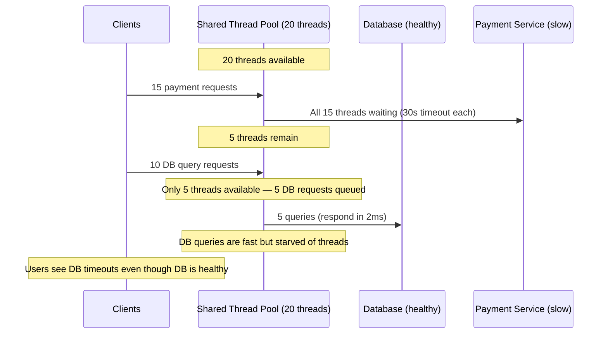
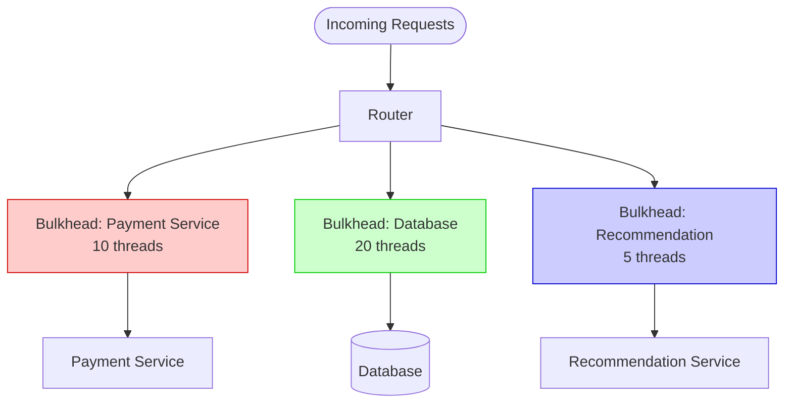
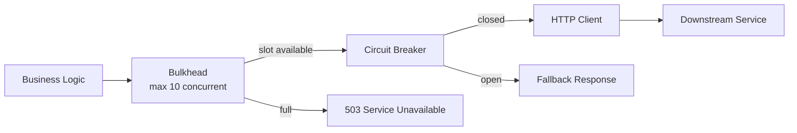

Named after the watertight compartments in a ship's hull — if one compartment floods, the bulkheads prevent water from reaching the rest of the ship. The bulkhead pattern applies the same principle to software: isolate failure domains so one slow or failing dependency cannot exhaust the resources shared by all other operations.

## The Problem: Resource Exhaustion

A typical service has a fixed thread pool (or connection pool) shared across all downstream calls. When one downstream slows down, its in-flight requests hold threads. Other downstream calls — even healthy ones — queue up waiting for threads.



The payment service's slowness has **cascaded** to the database path. The bulkhead pattern prevents this by giving each dependency its own isolated resource pool.

## Thread Pool Bulkhead

Allocate a **separate thread pool** per downstream dependency. A slow dependency can only exhaust its own pool.



```
Payment service goes down:
  - Payment bulkhead: 10/10 threads blocked → payment requests rejected
  - Database bulkhead: 20/20 threads available → DB queries unaffected
  - Recommendation bulkhead: 5/5 threads available → recommendations unaffected
```

**Resilience4j thread pool bulkhead:**

```java
ThreadPoolBulkheadConfig config = ThreadPoolBulkheadConfig.custom()
    .maxThreadPoolSize(10)          // max concurrent calls
    .coreThreadPoolSize(5)          // baseline threads
    .queueCapacity(20)              // overflow queue before rejection
    .keepAliveDuration(Duration.ofSeconds(20))
    .build();

ThreadPoolBulkhead paymentBulkhead = ThreadPoolBulkhead.of("payment", config);

CompletionStage<Response> result = paymentBulkhead.executeSupplier(
    () -> paymentClient.charge(order)
);
```

**Trade-off:** each thread pool consumes memory and OS resources. In a service with 10 downstream dependencies, 10 thread pools with 20 threads each means 200 threads — significant overhead.

## Semaphore Bulkhead

Instead of separate thread pools, use a **semaphore** (concurrent call counter) per dependency. The calling thread is the same — no separate pool — but only N concurrent requests are allowed per dependency.

```python
import asyncio

class SemaphoreBulkhead:
    def __init__(self, max_concurrent):
        self._semaphore = asyncio.Semaphore(max_concurrent)

    async def execute(self, func, *args, **kwargs):
        acquired = self._semaphore.locked()
        if self._semaphore._value == 0:
            raise BulkheadFullException(
                f"Bulkhead full: {self._semaphore._bound} concurrent calls active"
            )
        async with self._semaphore:
            return await func(*args, **kwargs)

payment_bulkhead = SemaphoreBulkhead(max_concurrent=10)
db_bulkhead = SemaphoreBulkhead(max_concurrent=20)
```

| Property | Thread Pool Bulkhead | Semaphore Bulkhead |
|----------|---------------------|--------------------|
| Isolation level | Full — separate OS threads | Partial — shared thread, limited concurrency |
| Overhead | High (thread creation, context switching) | Low (counter increment) |
| Timeout handling | Thread pool can enforce timeout via `Future.get(timeout)` | Caller must handle timeout separately |
| Best for | Blocking I/O (JDBC, synchronous HTTP calls) | Non-blocking / async I/O (Netty, async HTTP clients) |

## Practical Example: Premium vs Free Tier

Bulkheads can isolate workloads by **priority**, not just by dependency. Give premium users a dedicated resource pool:

```
Incoming requests:
  └── Authentication middleware identifies user tier
      ├── Premium users → Premium bulkhead (30 threads, 200ms SLA)
      └── Free users → Free bulkhead (10 threads, best-effort)

Under load:
  - Free bulkhead fills up → free users get 503
  - Premium bulkhead still has capacity → premium users unaffected
```

This is the pattern behind AWS service quotas, Stripe's rate limit tiers, and any multi-tenant system that guarantees SLAs for paying customers.

## Combined with Circuit Breaker

Bulkhead and circuit breaker solve different problems and compose naturally:

| Pattern | What it prevents |
|---------|-----------------|
| **Bulkhead** | Resource exhaustion — limits how many concurrent calls can be in-flight to a dependency |
| **Circuit breaker** | Repeated calls to broken dependency — stops all calls after failure threshold |



**Execution order matters:** bulkhead → circuit breaker → timeout → retry → HTTP call.

If the circuit breaker is outside the bulkhead, an open circuit returns a fallback instantly without consuming a bulkhead slot — efficient. If the circuit breaker is inside the bulkhead, each fallback response consumes a bulkhead slot even though no real call is made — wasteful.


**Interview tip:** When discussing service resilience, say: "I'd use a bulkhead per downstream dependency to prevent a slow payment service from starving the database path. The payment bulkhead allows 10 concurrent calls — request 11 gets rejected immediately with a 503 instead of queueing. Inside the bulkhead, a circuit breaker monitors error rates and stops all calls if the payment service is consistently failing. This way, a partial outage in one dependency doesn't cascade to the entire system." This shows you understand both isolation (bulkhead) and fail-fast (circuit breaker) as complementary patterns.
