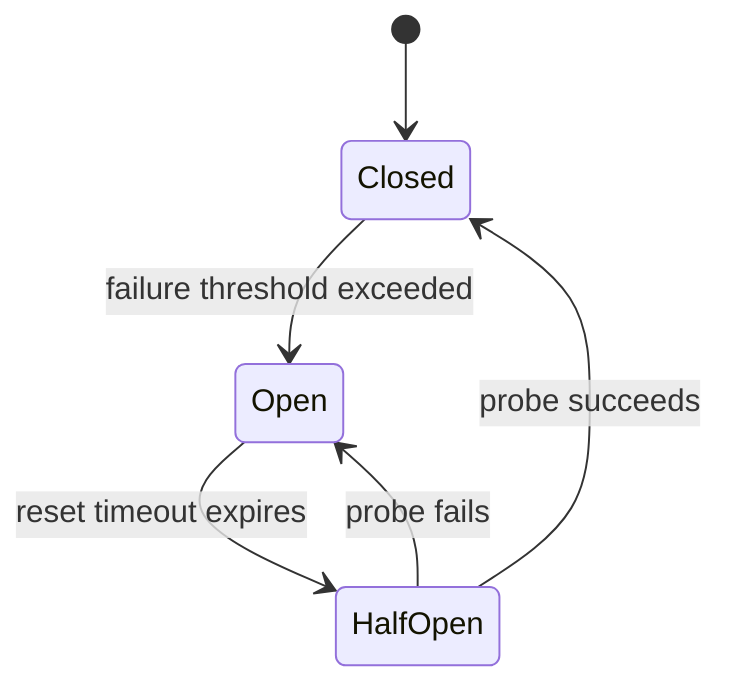
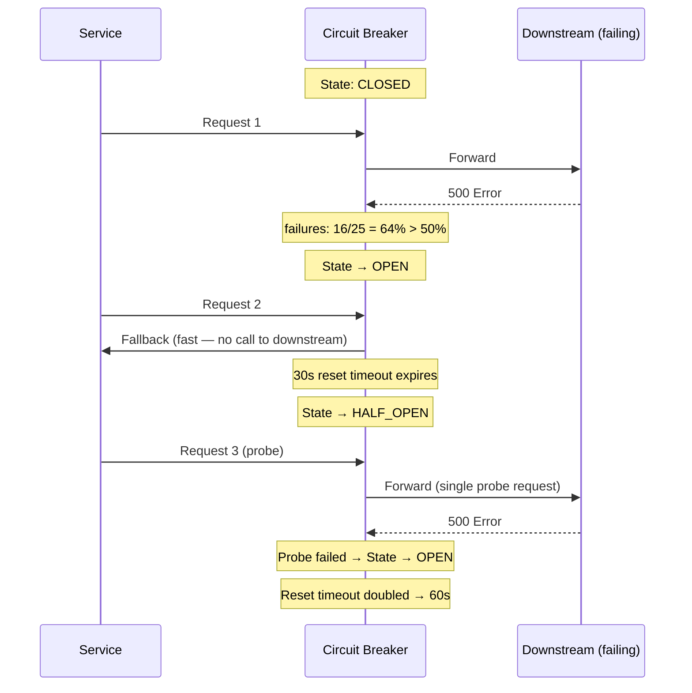
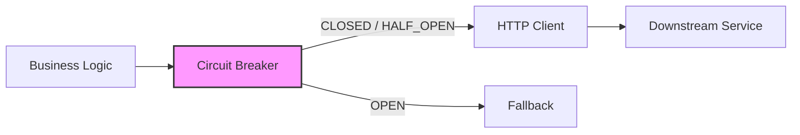

Your order service calls a payment service. The payment service is down. Every order request now waits 30 seconds for a TCP timeout, exhausting your thread pool. Within minutes, the order service itself appears down — not because of its own bug, but because it kept calling a dead dependency. The circuit breaker pattern prevents this cascade: after detecting repeated failures, it **stops making calls** to the failing service and fails fast with a fallback response.

## The Three States

A circuit breaker is a state machine with three states:



| State | Behavior |
|-------|----------|
| **Closed** | Normal operation. Requests pass through to the downstream service. Failures are counted. |
| **Open** | Fail fast. No requests reach the downstream service. Return a fallback response immediately. |
| **Half-Open** | Recovery probe. A limited number of requests are allowed through. If they succeed, the circuit closes. If they fail, it reopens. |

## When the Circuit Trips

The breaker monitors a **rolling time window** of call results and trips when the failure rate crosses a threshold.

```
Rolling window: last 60 seconds, minimum 20 calls

Call results in window: ✓✓✓✗✓✗✓✗✗✗✓✗✗✓✗✗✗✓✗✗✗✓✗✗✗
Total calls: 25
Failures: 16
Failure rate: 16/25 = 64%

Threshold: 50% → TRIP → circuit opens
```

**Failure definition matters.** Not all errors should count:
- **Count:** HTTP 5xx, connection timeouts, connection refused
- **Don't count:** HTTP 4xx (client errors — the downstream is working fine, the request is bad), slow but successful responses (handle with separate timeout configuration)

```python
class CircuitBreaker:
    def __init__(self, failure_threshold=0.5, min_calls=20, reset_timeout=30):
        self.state = "CLOSED"
        self.failure_count = 0
        self.success_count = 0
        self.last_failure_time = None
        self.failure_threshold = failure_threshold
        self.min_calls = min_calls
        self.reset_timeout = reset_timeout

    def call(self, func, *args, **kwargs):
        # OPEN: short-circuit unless reset timeout has elapsed.
        if self.state == "OPEN":
            if time.time() - self.last_failure_time >= self.reset_timeout:
                # Transition OPEN -> HALF_OPEN; reset counters so a single
                # probe failure or success cleanly decides the next state.
                self.state = "HALF_OPEN"
                self._reset_counters()
            else:
                return self.fallback()

        try:
            result = func(*args, **kwargs)
            self._on_success()
            return result
        except Exception:
            self._on_failure()
            return self.fallback()

    def _on_success(self):
        if self.state == "HALF_OPEN":
            # Probe succeeded -> close the circuit and start fresh.
            self.state = "CLOSED"
            self._reset_counters()
        self.success_count += 1

    def _on_failure(self):
        self.failure_count += 1
        self.last_failure_time = time.time()

        # In HALF_OPEN, a single probe failure immediately re-opens.
        if self.state == "HALF_OPEN":
            self.state = "OPEN"
            return

        # In CLOSED, only trip once we've seen enough calls to be confident.
        total = self.failure_count + self.success_count
        if total >= self.min_calls and self.failure_count / total >= self.failure_threshold:
            self.state = "OPEN"

    def _reset_counters(self):
        self.failure_count = 0
        self.success_count = 0
```

## Reset Timeout and Exponential Backoff

When the circuit opens, it stays open for a **reset timeout** before transitioning to half-open. If the half-open probe fails and the circuit reopens, the reset timeout should increase to avoid hammering a recovering service.

```
First trip:   reset_timeout = 30s
Second trip:  reset_timeout = 60s
Third trip:   reset_timeout = 120s
...
Cap at:       reset_timeout = 300s (max backoff)
```



## Fallback Strategies

When the circuit is open, the service must return **something** — crashing is worse than degrading. The fallback is always use-case specific:

| Strategy | Example | When to use |
|----------|---------|-------------|
| **Cached response** | Return the last known good response from cache | Read-heavy endpoints where stale data is acceptable (product catalog, user profile) |
| **Static default** | Return a hardcoded default value | Feature flags, configuration values, default recommendations |
| **Degraded feature** | Show cached data with a "data may be stale" banner | Dashboard, analytics, non-critical UI elements |
| **Empty response** | Return empty list or null fields | Recommendations, related products — absence is better than error |
| **Error with retry hint** | Return 503 with `Retry-After` header | Client-facing APIs where the client can retry |


**Never silently swallow the failure.** A circuit breaker that returns a fallback must also emit metrics (circuit state changes, fallback invocations). If the circuit is open for 10 minutes and nobody notices, the fallback becomes the feature — and the real service never gets fixed. Alert on circuit open duration.


## Placement in the Architecture

The circuit breaker sits between the **calling service** and the **HTTP/gRPC client** that makes downstream calls. It wraps the network call, not the business logic.



**Per-dependency breakers:** Each downstream service gets its own circuit breaker. If the payment service is down, the inventory service calls should not be affected. A single shared breaker across all dependencies defeats the purpose.

## Libraries

| Library | Language | Key Features |
|---------|----------|-------------|
| **Resilience4j** | Java | Ring buffer-based sliding window, configurable failure/slow-call predicates, integrates with Spring Boot |
| **Polly** | .NET | Fluent API, advanced fallback chaining, bulkhead + circuit breaker + retry composition |
| **Hystrix** | Java | Netflix; now in maintenance mode — use Resilience4j instead |
| **opossum** | Node.js | Event-based, supports Prometheus metrics |
| **gobreaker** | Go | Simple; implements the Sony pattern (closed → open → half-open) |

## Circuit Breaker + Timeout + Retry

These three patterns work together but must be composed carefully:

```
Request → Retry (2 attempts, exponential backoff)
           → Timeout (3 seconds per attempt)
              → Circuit Breaker
                 → HTTP Client → Downstream
```

| Pattern | Purpose | Relationship |
|---------|---------|-------------|
| **Timeout** | Prevents indefinite waiting on a single call | Inner — applied to each individual call |
| **Retry** | Handles transient failures | Middle — retries the timed-out or failed call |
| **Circuit breaker** | Prevents repeated calls to a broken dependency | Outer — stops retries entirely when failure rate is high |

**Wrong composition:** Retry wrapping circuit breaker → retries against an open circuit (wastes time on immediate fallbacks). **Right composition:** Circuit breaker wrapping retry → circuit counts each retry attempt as a failure, trips faster when the downstream is genuinely down.


**Interview tip:** When discussing service resilience, say: "Each downstream call goes through a circuit breaker. If the payment service error rate exceeds 50% in a 60-second window, the circuit opens and we return a cached response for 30 seconds, then probe with a single request. I'd use per-dependency breakers — a failure in the recommendation service shouldn't block checkout." This shows you understand cascading failures and isolation, not just the state machine.
