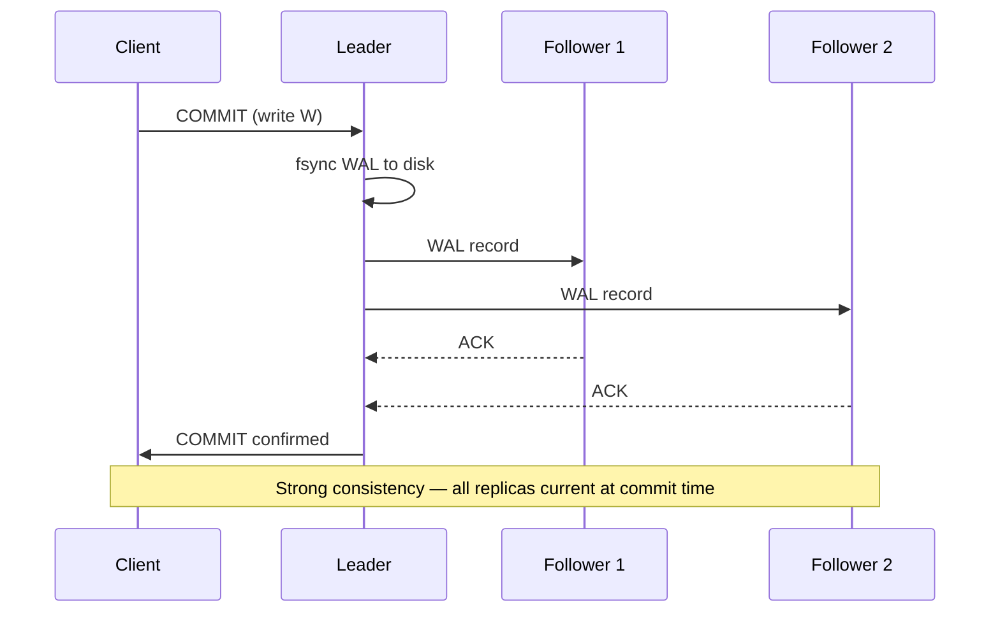
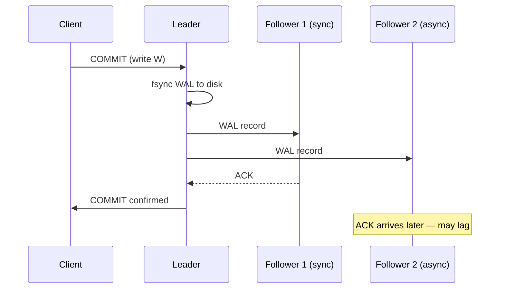
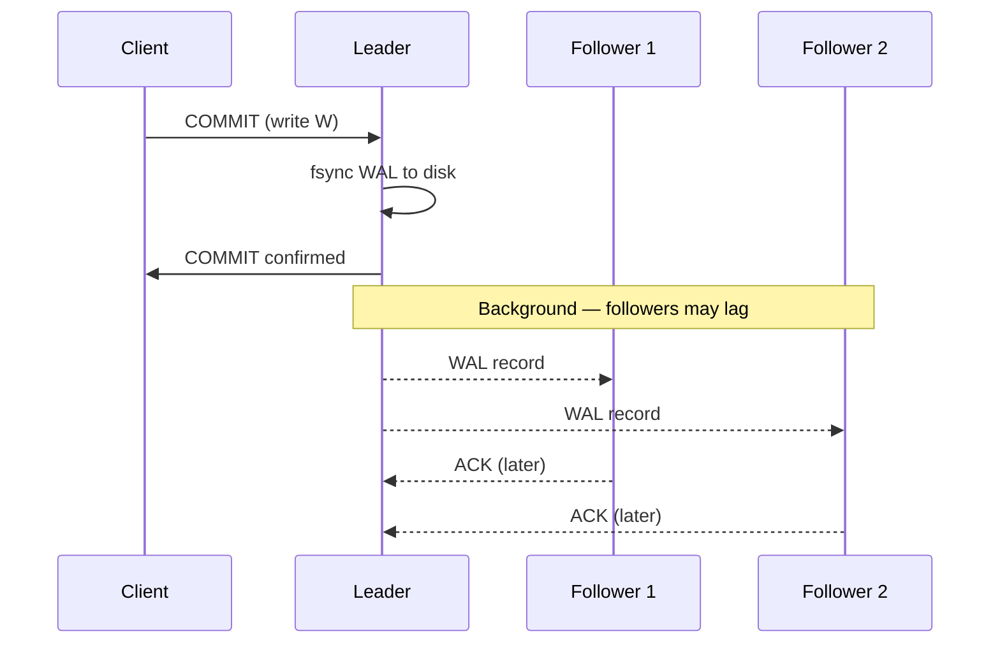
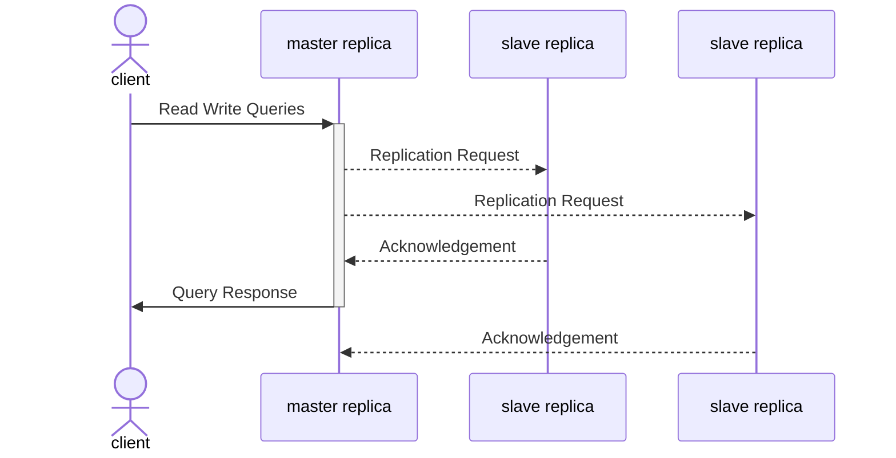

The consistency model your system provides is a direct consequence of how you configure replication. Choose synchronous replication and you get strong consistency — at the cost of availability and write latency. Choose asynchronous and you get low latency and high availability — but clients can observe stale or out-of-order data. Every production database sits somewhere on this spectrum, and the right answer depends on the operation.

## Synchronous Replication

The leader does not acknowledge a write until at least one (or all) replicas have confirmed they received and persisted the data. The client is guaranteed that any subsequent read from any replica returns the written value.



**Guarantees:** zero replication lag, zero data loss on leader failure, linearizable reads from any replica.

**Cost:** write latency equals the round-trip time to the **slowest** replica. One unresponsive follower blocks all writes. This makes fully synchronous replication impractical for most production workloads.

## Semi-Synchronous Replication

A practical middle ground: the leader waits for **one** follower to ACK before confirming the write. The remaining followers replicate asynchronously.



If the synchronous follower fails, the leader promotes the next fastest async follower to become the new synchronous target. This guarantees that **at least two nodes** (leader + one follower) always hold every committed write.

**PostgreSQL configuration:**

```sql
-- Make one standby synchronous
ALTER SYSTEM SET synchronous_standby_names = 'FIRST 1 (standby1, standby2)';
-- Per-transaction override for non-critical writes
SET LOCAL synchronous_commit = 'local';  -- skip replica confirmation
```

**MySQL semi-sync:**

```sql
-- On the primary
INSTALL PLUGIN rpl_semi_sync_master SONAME 'semisync_master.so';
SET GLOBAL rpl_semi_sync_master_enabled = 1;
SET GLOBAL rpl_semi_sync_master_wait_for_slave_count = 1;
```

## Asynchronous Replication

The leader acknowledges the write as soon as it persists locally. Followers receive changes in the background and may lag behind by milliseconds, seconds, or — under load — minutes.



**Guarantees:** lowest write latency, highest availability (one slow replica does not block writes).

**Risks:** clients reading from a lagging follower see stale data. If the leader fails before an unacknowledged write reaches any follower, that write is permanently lost.

This is the default mode in PostgreSQL (`synchronous_commit = on` only durably writes to the leader; standby replication is async unless configured otherwise) and MySQL (async replication is the default).


**"Eventually consistent" has no time bound.** Asynchronous replication guarantees that followers converge to the leader's state — but "eventually" could mean 50 ms or 5 minutes depending on replication throughput, network conditions, and follower load. Design read paths around this uncertainty: if something must be current, read from the leader or use [session guarantees](../replication-lag).


## Comparison

| Property | Fully Synchronous | Semi-Synchronous | Asynchronous |
|----------|------------------|------------------|-------------|
| Write latency | Slowest replica RTT | Fastest replica RTT | Local fsync only |
| Data loss on leader crash | None | None (1 replica guaranteed current) | Possible (unreplicated writes lost) |
| Read consistency (any replica) | Linearizable | Strong for sync follower; eventual for others | Eventual |
| Availability under replica failure | Blocked until recovery | Failover to next follower | Unaffected |
| Use case | Financial ledgers, metadata stores | Most OLTP databases | Analytics replicas, cross-region copies |

## Choosing the Right Mode

The correct answer is almost always **per-operation**, not per-system:

| Operation | Required Consistency | Replication Mode |
|-----------|---------------------|-----------------|
| Account balance before debit | Linearizable | Read from leader or sync replica |
| User profile after own edit | Read-your-writes | [Session guarantee](../replication-lag) or leader read |
| News feed timeline | Eventual | Read from nearest async replica |
| Inventory count before purchase | Strong | Synchronous or leader read with lock |
| Analytics dashboard | Eventual (seconds-stale acceptable) | Async read replica |

The theoretical underpinnings — linearizability, sequential consistency, causal consistency, eventual consistency — are covered in [Consistency Models (distributed)](../distributed/consistency-models). This page focuses on how replication configuration delivers those guarantees in practice. For the anomalies that arise under asynchronous replication (stale reads, monotonic read violations, causal ordering violations), see [Replication Lag](../replication-lag).


**Interview tip:** When an interviewer asks about consistency in a replicated database, connect the replication mode to the consistency guarantee: "For the balance check, I'd read from the leader to get linearizable consistency — the write was synchronously replicated to one standby for durability, so failover is safe. For the activity feed, I'd read from the nearest async replica and tolerate seconds-stale data to keep read latency low." This shows you treat consistency as a per-operation cost decision, not a system-wide toggle.


### Hybrid Replication

The Hybrid Replication Model, also known as Semi-Synchronous Replication, combines features of both synchronous and asynchronous replication. In this model, the system processes a write operation synchronously to at least one replica (ensuring immediate acknowledgment to the client) while asynchronously replicating the write to other replicas.

