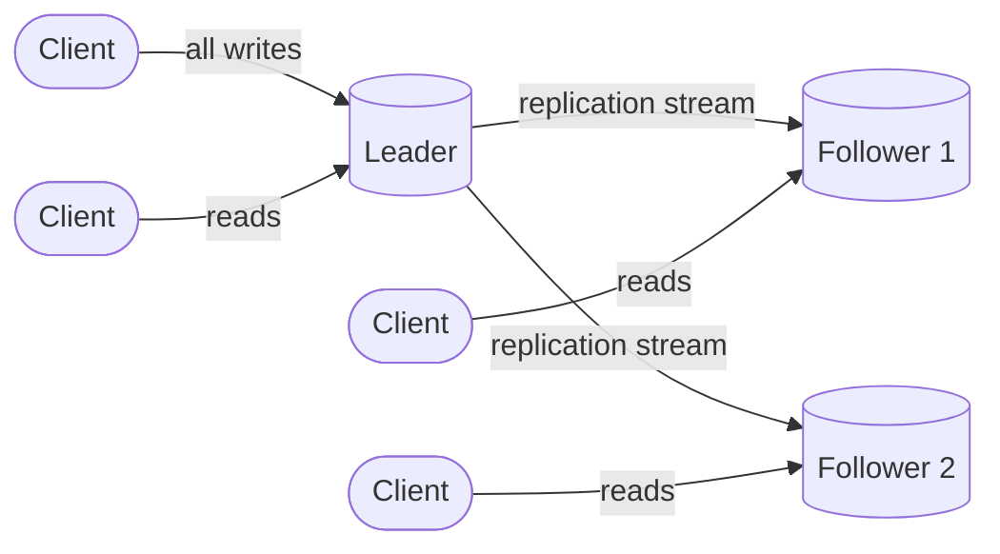
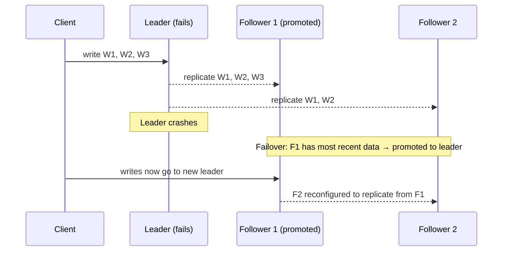

Most production databases replicate data using a single leader (primary) that handles all writes. Changes flow from the leader to one or more followers (replicas) that serve read traffic. This is the default replication model in PostgreSQL, MySQL, MongoDB, and most managed database services (RDS, Cloud SQL, Atlas).

## How It Works



Every write goes to the leader. The leader persists the change locally (WAL fsync), then streams it to followers via a replication log. Followers apply changes in order and serve read traffic. The leader can also serve reads, but in read-heavy systems, offloading reads to followers reduces primary load.

## Setting Up New Followers

Adding a new follower to a running cluster cannot be done by simply copying the data directory — clients are writing continuously, so a naive copy would be inconsistent.

{}

### Take a consistent snapshot

Capture a point-in-time snapshot of the leader's data without locking the database for writes. Most databases provide this: `pg_basebackup` (PostgreSQL), `mysqldump --single-transaction` (MySQL), or filesystem-level snapshots.

### Transfer the snapshot

Copy the snapshot to the new follower node. This can be hundreds of gigabytes for large databases — tools like `rsync` or cloud snapshot restore speed this up.

### Connect and catch up

The follower connects to the leader and requests all changes since the snapshot's position in the replication log (LSN in PostgreSQL, binlog coordinates in MySQL). The leader streams the backlog.

### Follower is caught up

Once the follower has processed all pending changes, it is in sync and can serve read traffic. It continues receiving the live replication stream.

{}

## Handling Follower Failure

When a follower crashes and restarts, it knows the last transaction it applied (recorded in its local replication state). It reconnects to the leader and requests all changes from that point onward. The leader streams the missed transactions, and the follower catches up. No manual intervention needed — this is automatic in all modern databases.

## Handling Leader Failure (Failover)

When the leader fails, a follower must be promoted to become the new leader. This process is called **failover**.



{}

### Detect leader failure

Monitoring systems or follower nodes detect that the leader is unresponsive (missed heartbeats, failed health checks). Typical timeout: 10–30 seconds.

### Select the new leader

The follower with the most recent replication state is the best candidate — it has the least data loss. In consensus-based systems (Raft), an election determines the winner.

### Reconfigure the cluster

Clients must direct writes to the new leader. Other followers must replicate from the new leader. DNS updates, virtual IP failover, or proxy reconfiguration handles the routing change.

{}

### Challenges in Failover

| Challenge | Risk | Mitigation |
|-----------|------|-----------|
| **Data loss** | With async replication, the new leader may be missing writes that the old leader accepted but hadn't replicated yet | Use semi-synchronous replication — at least one follower confirms each write before the leader ACKs |
| **Split brain** | Network partition causes two nodes to both believe they are the leader, accepting conflicting writes | Fencing tokens, epoch numbers, or STONITH ("Shoot The Other Node In The Head") — forcibly power off the old leader |
| **Client redirection** | Clients continue writing to the old leader if DNS TTL hasn't expired or connection pools are stale | Use a proxy layer (HAProxy, PgBouncer) with fast health checks; virtual IP failover for sub-second redirection |


**Split brain is the most dangerous failure mode.** If two nodes both accept writes as leader, those writes are conflicting and at least one set will be lost during reconciliation. Automated failover tools (Patroni for PostgreSQL, Orchestrator for MySQL) implement fencing to prevent this — they ensure the old leader is shut down before the new leader starts accepting writes.


## Replication Topologies

```
Single leader, direct replicas (standard):
    Leader → Follower 1
           → Follower 2
           → Follower 3

Chained (relay):
    Leader → Follower 1 (relay) → Follower 2 → Follower 3
    ↑ reduces leader fan-out, but adds cumulative lag

Multi-region:
    Leader (us-east) ─── async ───► Regional Follower (eu-west)
                    ─── async ───► Regional Follower (ap-south)
```

| Topology | Leader network load | Lag profile | Use case |
|----------|-------------------|------------|----------|
| Direct replicas | Fan-out to all | Lowest (no relay) | ≤5 replicas |
| Relay chain | Low (one stream) | Cumulative per hop | Many replicas, read-heavy |
| Multi-region async | Low (one stream per region) | 50–200ms cross-region | Geographic read locality |

## Why Not Multi-Leader?

In leader-based replication, **only one node accepts writes**. This avoids the write conflict problem entirely — there's a single serialization point for all mutations. Multi-leader replication (where multiple nodes accept writes) introduces write conflicts that require resolution strategies (last-write-wins, CRDTs, application-level merge). The complexity is significant and only justified when write latency from a single region is unacceptable — covered in [Multi-Region Design](../../distributed/multi-region-design).

## What This Means in Practice

| Database | Default mode | Leader election | Replication log |
|----------|-------------|----------------|----------------|
| **PostgreSQL** | Async streaming | Manual or Patroni | WAL (physical) or logical |
| **MySQL** | Async | Manual or Orchestrator/Group Replication | Binlog (statement or row) |
| **MongoDB** | Replica set (async, priority-based election) | Automatic (Raft-like) | Oplog |
| **Amazon RDS** | Multi-AZ (sync standby) + read replicas (async) | Automatic | WAL/binlog |


**Interview tip:** When discussing replication, say: "I'd use single-leader replication — the leader handles all writes, and followers replicate asynchronously for read scaling. For durability, I'd configure semi-synchronous replication so at least one follower confirms each write before the client gets an ACK — this means zero data loss on leader failure as long as the confirmed follower is promoted. Failover is handled by Patroni (PostgreSQL) or Orchestrator (MySQL) with fencing to prevent split brain. Reads that can tolerate seconds of lag go to followers; reads that must be current go to the leader." This covers the write path, durability guarantee, failover safety, and read routing — the four things interviewers evaluate.

