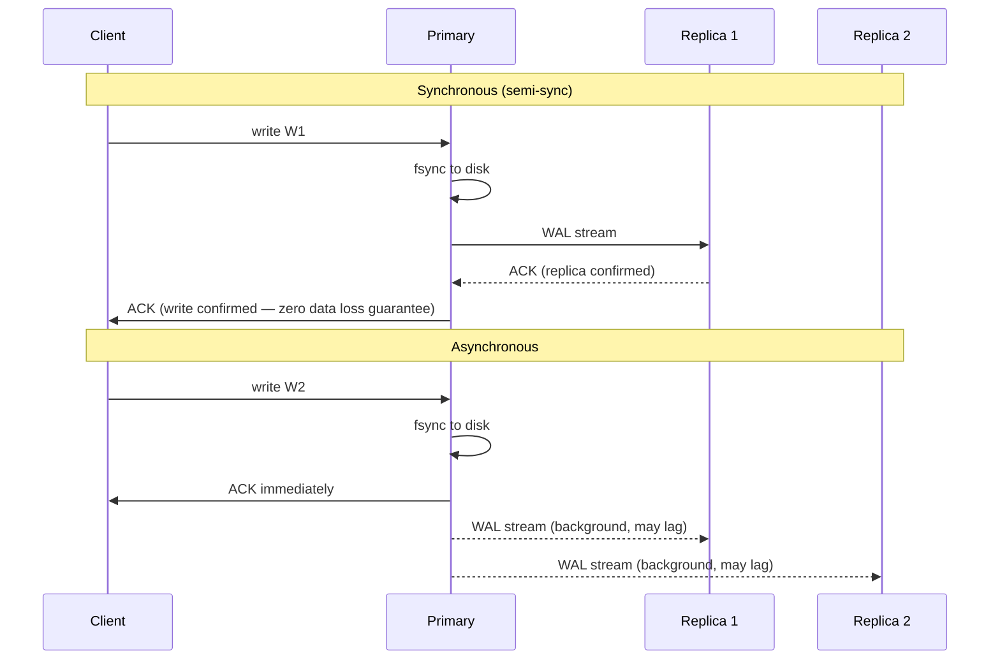
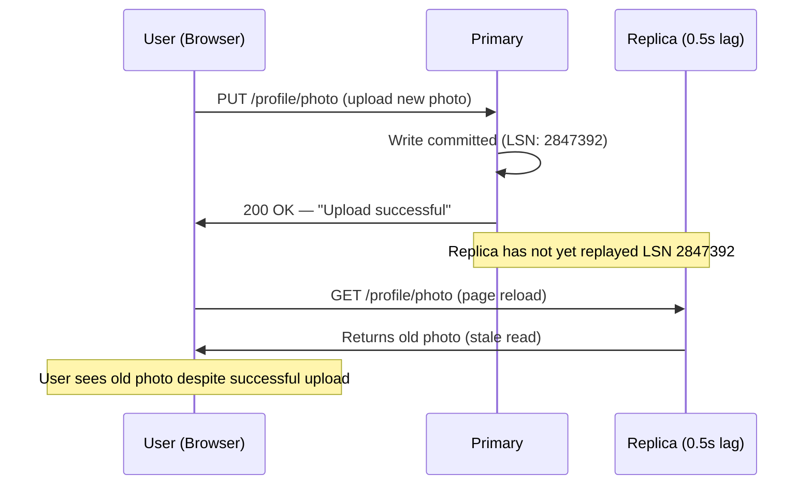

A read replica is a copy of the primary database that serves read traffic. The primary handles all writes; replicas receive those writes asynchronously (usually) and apply them to their local state. The gap between a write landing on the primary and becoming visible on a replica is **replication lag**.

## Synchronous vs Asynchronous Replication

Every replication deployment chooses a durability vs. latency tradeoff on every write.



| Mode | Write latency | Durability on primary failure | Replication lag |
|------|--------------|-------------------------------|-----------------|
| **Synchronous** | Primary RTT + at least one replica RTT | Zero data loss (replica is current) | Zero — replica confirmed before ACK |
| **Semi-synchronous** | Primary RTT + fastest replica RTT | Zero data loss to the confirmed replica | Near-zero for the confirmed replica |
| **Asynchronous** | Primary RTT only | Data loss possible (unacknowledged writes) | Milliseconds to seconds; minutes under load |
| **Fully synchronous** (all replicas) | Primary RTT + slowest replica RTT | Zero data loss to any replica | Zero — but one slow replica blocks all writes |

**Why asynchronous dominates in practice:** A fully synchronous write requires every replica to ACK before the client receives confirmation. One replica with a slow network, disk issue, or maintenance window stalls all writes. PostgreSQL's default is asynchronous replication; `synchronous_commit` can be set to `remote_write` or `on` (synchronous) per-transaction.

**Semi-sync compromise (MySQL, PostgreSQL):** require at least one replica to ACK, then return to the client. Eliminates data loss on primary failure as long as the confirmed replica is promoted. All other replicas remain asynchronous.

## What Replication Lag Means

Replication lag is the wall-clock delay between a write being committed on the primary and that write being visible on a given replica.

```
t=0ms:   Write W1 committed on Primary
t=0ms:   W1 sent to replica in binlog/WAL stream
t=3ms:   W1 received by Replica 1 (network RTT)
t=4ms:   W1 applied to Replica 1's storage engine
t=4ms:   Replica 1 lag = 4ms

Under heavy write load:
t=0ms:   Write W1 committed on Primary
         Replica's apply queue is backlogged (CPU-bound replay)
t=8000ms: W1 finally applied to Replica 1
t=8000ms: Replica 1 lag = 8 seconds
```

**Sources of lag:**

| Source | Mechanism |
|--------|-----------|
| Network latency | WAN replication (cross-region) adds 50–200ms baseline |
| Single-threaded replay | MySQL 5.6 and earlier replays binlog in a single thread; a large write burst builds queue depth |
| DDL operations | `ALTER TABLE` on a large table locks replay on the replica until complete |
| Long-running transactions | Replica must replay the entire transaction before anything after it becomes visible |
| I/O saturation on replica | Replica's disk can't keep up with primary's write rate |

**Measuring lag:** `SHOW REPLICA STATUS` (`Seconds_Behind_Source`), PostgreSQL `pg_stat_replication.write_lag / flush_lag / replay_lag`, CloudWatch `ReplicaLag` for RDS.

## Consistency Anomalies From Lag

### Read-Your-Writes Violation

A user writes data and immediately reads it back — but the read is served by a lagging replica.



**Solutions:**

1. **Read from primary after own write:** Track a "last write timestamp" per user. If the current time minus that timestamp is less than the replica's estimated lag, route the read to the primary. After the lag window, reads fall back to replicas.

2. **Sticky primary routing:** After any write, route all subsequent reads for that user session to the primary for N seconds. A cookie or session attribute marks the "elevated routing" window. Adds primary load proportional to write frequency.

3. **LSN-based causal reads:** The primary returns the Log Sequence Number (LSN) or binlog position after the write. The application sends this token with subsequent reads. A replica compares its current applied LSN — if it has caught up to the token, it serves the read; otherwise it waits or forwards to primary.

```
Write response header: X-LSN: 2847392
Read request header:   X-Min-LSN: 2847392
Replica rejects if replica_applied_lsn < 2847392, proxies to primary instead
```

PostgreSQL 14+ supports this natively with `pg_current_wal_lsn()` on writes and `pg_last_wal_replay_lsn()` checks on replicas.

### Monotonic Reads Violation

A user reads fresh data from Replica A, then the next request hits Replica B (which is more lagged). The user sees data moving backward in time.

```
t=0:  User1 posts comment C1
t=5s: C1 replicated to Replica A (lag: 2s)
      C1 NOT YET replicated to Replica B (lag: 8s)

t=6s: User2 reads from Replica A → sees C1
t=7s: User2 reads from Replica B → C1 not found ← time-travel backward
```

**Solution — sticky replica routing:** Hash the user ID to a specific replica. All requests from a given user go to the same replica. If that replica fails, re-hash to the next available; brief inconsistency is acceptable during the failover window.

### Consistent Prefix Reads Violation

Causally related writes replicated to different shards or leaders can arrive at a replica in the wrong order.

```
Write 1: "Question: what is 2+2?"  (goes to shard 1)
Write 2: "Answer: 4"               (goes to shard 2)

Shard 2 replica is ahead of shard 1 replica:
User reads from both replicas:
  Sees "Answer: 4" (from shard 2)
  Does not yet see "Question: what is 2+2?" (shard 1 lagging)
```

**Solution:** Route causally related writes to the same partition. Use a vector clock or monotonic version token to detect ordering violations at read time.

## When Replication Lag Causes Production Bugs

| Scenario | Symptom | Root cause |
|----------|---------|------------|
| User updates email, app reads it back | "Email not updated" despite success toast | Cache-aside pattern reads from lagging replica |
| Inventory check before purchase | Oversells: two users both "see" stock > 0 | Reads from replica; stock decremented on primary |
| Session state after login | User sees logged-out state on next page | Session stored on primary; next read hits lagging replica |
| Like count after clicking Like | Count appears unchanged | Aggregate query on replica; increment not yet applied |
| Feed shows old post as "unread" after marking read | Mark read on primary; feed read from lagging replica |
| A/B test assignment after flag toggle | Users see old variant | Feature flag propagation lags behind flag write |

**The invariant:** any data the user just mutated must be read from the primary (or a replica confirmed current) until the lag window closes. Any data the system reads to make a decision that has monetary or correctness consequences (inventory, balances, idempotency keys) must come from the primary.

## Replication Topologies

```
Single Primary (standard):
           Primary
          /       \
     Replica1   Replica2   ← all replicas receive from primary

Chained (relay):
    Primary → Replica1 (relay) → Replica2 → Replica3
    ↑ reduces primary fan-out, but adds lag through chain

Multi-region (cross-DC):
    Primary (us-east) ──── async ────► Regional Replica (eu-west)
                      ──── async ────► Regional Replica (ap-south)
    Cross-region lag: 50–200ms baseline
```

| Topology | Lag profile | Primary network load | Use case |
|----------|------------|---------------------|----------|
| Single primary, direct replicas | Lowest (no relay) | Fan-out to all replicas | ≤5 replicas |
| Relay chain | Cumulative per hop | Low on primary | Many replicas, read-heavy |
| Multi-region async | 50–200ms cross-region | Low (one stream per region) | Geographic read locality |
| Synchronous standby + async pool | Zero lag on standby; normal lag on pool | Low | HA with zero data loss |

## Routing Architecture

A production deployment needs a routing layer that knows which reads can tolerate lag and which cannot.

```
Application writes:
  ┌─────────────┐
  │  App Server │
  └──────┬──────┘
         │ all writes
         ▼
   ┌──────────┐
   │ Primary  │ ←── authoritative reads (inventory, balances, dedup checks)
   └──────────┘
         │ WAL stream
    ─────┼──────────────────────────
         ▼           ▼           ▼
   ┌──────────┐ ┌──────────┐ ┌──────────┐
   │Replica 1 │ │Replica 2 │ │Replica 3 │ ←── stale-OK reads (feeds, profiles, counts)
   └──────────┘ └──────────┘ └──────────┘
         ▲
   read router (pgBouncer, ProxySQL, AWS RDS Proxy)
   routes based on:
   - query annotation (/* read_from=replica */ or hint)
   - session "freshness" token
   - application-layer routing flag
```

**Read/write split proxies:** ProxySQL (MySQL), pgBouncer + HAProxy (PostgreSQL), AWS RDS Proxy, PlanetScale's query routing. These inspect queries and route `SELECT` to replicas, `INSERT/UPDATE/DELETE` to primary. Transactions are always routed to primary.

**Query annotations:**
```sql
/* read=replica */ SELECT * FROM products WHERE id = 99;
/* read=primary */ SELECT stock FROM inventory WHERE product_id = 99 FOR UPDATE;
```

## Replica Promotion on Primary Failure

When the primary fails, a replica must be promoted. The promoted replica becomes the new primary. The key risk: if the promoted replica is lagging, it is missing the writes that were committed on the old primary but not yet replicated.

```
Primary committed writes: W1, W2, W3, W4, W5
Replica 1 applied:        W1, W2, W3          ← lag: W4, W5 missing
Replica 2 applied:        W1, W2, W3, W4      ← lag: W5 missing

Primary fails at t=100.
Replica 2 is promoted (most current).
W5 is permanently lost — it existed only in the failed primary's write buffer.
```

**Semi-sync replication** prevents this: W5 would not have been ACK'd to the client until Replica 2 confirmed it. If Replica 2 fails before ACKing, the primary times out and downgrades to async — a brief window where data loss is again possible.

**Cascading failure risk during promotion:**
1. Replica 2 promoted to primary
2. Replica 1 must be reconfigured to replicate from new primary (Replica 2)
3. Replication position offset may not match — manual `CHANGE REPLICATION SOURCE TO` or orchestrator tooling required
4. Reads that were hitting Replica 1 may return stale or inconsistent data during reconfiguration

Automated failover tools (Orchestrator for MySQL, Patroni for PostgreSQL, AWS RDS Multi-AZ) handle promotion, replica reconfiguration, and DNS failover automatically, typically within 30–60 seconds.


In a system design interview, state upfront which reads can tolerate replication lag (feeds, counts, search indexes) and which cannot (inventory checks, balance reads, idempotency lookups). Route the latter to the primary explicitly. This distinction separates candidates who understand distributed systems from those who treat "add read replicas" as a free scaling win.

