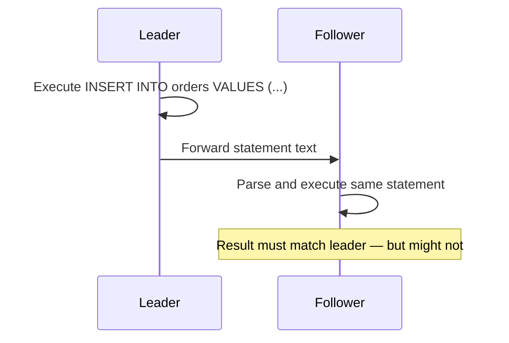
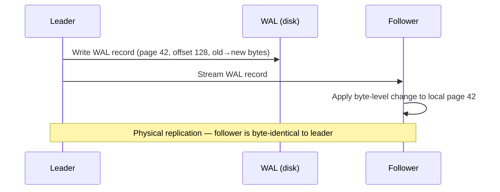
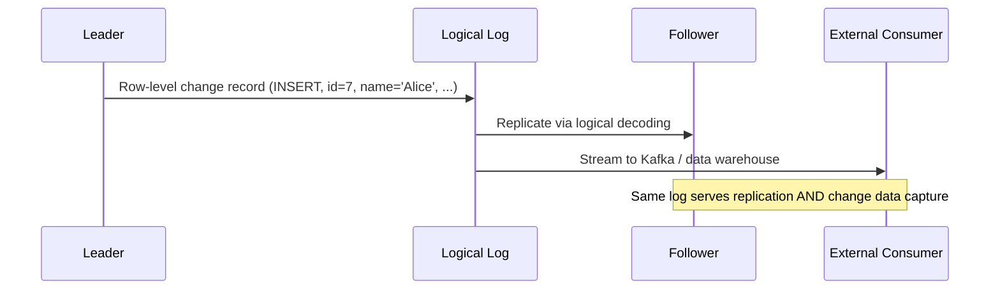

A leader-based replication system needs a mechanism to get data changes from the leader to the followers. The choice of mechanism affects what you can do with the replicated data — version compatibility, cross-engine replication, change data capture, and zero-downtime upgrades all depend on it.

## Statement-Based Replication

The leader logs every write statement (`INSERT`, `UPDATE`, `DELETE`) and sends them to each follower. The follower parses and executes each statement as if it received it from a client.



**Where it breaks:**

| Problem | Example | Why it fails |
|---------|---------|-------------|
| Nondeterministic functions | `NOW()`, `RAND()`, `UUID()` | Each replica evaluates independently → different values |
| Auto-increment columns | `INSERT` with `AUTO_INCREMENT` | Followers must execute in the exact same order as the leader |
| Side effects | Triggers, stored procedures, UDFs | May depend on local state that differs across replicas |

**Workaround:** The leader can replace nondeterministic function calls with fixed return values in the statement log (MySQL did this in early versions).

**Verdict:** Fragile. Largely abandoned in favor of row-based replication. MySQL used statement-based replication by default before version 5.7.7.

## Write-Ahead Log (WAL) Shipping

The leader's WAL — the sequential log of every byte-level change to data pages — is streamed directly to the follower. The follower replays the same page-level changes to reconstruct an identical on-disk state.



**PostgreSQL streaming replication** uses this approach. The standby connects to the primary and continuously receives WAL records:

```
# postgresql.conf on primary
wal_level = replica
max_wal_senders = 5

# recovery.conf on standby (or standby.signal in PG 12+)
primary_conninfo = 'host=primary-host port=5432'
```

### Limitation: Storage Engine Coupling

WAL records describe **which bytes changed in which disk blocks**. This ties replication to the exact storage format — the leader and follower must run:
- The same storage engine
- The same database version (or a compatible one)

This makes **zero-downtime rolling upgrades** difficult: you cannot run the leader on v15 and a follower on v16 if the on-disk page format changed between versions. The standard approach is to upgrade the follower first, promote it, then upgrade the old leader — but this requires the WAL format to be backward-compatible between those two versions.

## Logical (Row-Based) Log Replication

Instead of shipping physical byte changes, the leader writes a **logical log** — a description of what changed at the row level, decoupled from the storage engine format.

### Log Content

| Operation | What the log records |
|-----------|---------------------|
| `INSERT` | New values of all columns |
| `DELETE` | Enough to identify the row (primary key, or all column values if no PK) |
| `UPDATE` | Row identifier + new values of changed columns |
| `COMMIT` | Marker indicating a transaction's set of changes is complete |



**MySQL binlog** (in `ROW` format, default since 5.7.7) and **PostgreSQL logical replication** (via `pgoutput` plugin) both implement this approach:

```sql
-- PostgreSQL: create a logical replication publication
CREATE PUBLICATION my_pub FOR TABLE orders, customers;

-- On the subscriber
CREATE SUBSCRIPTION my_sub
  CONNECTION 'host=primary-host dbname=mydb'
  PUBLICATION my_pub;
```

```sql
-- MySQL: verify binlog format
SHOW VARIABLES LIKE 'binlog_format';  -- should return ROW
```

### Why This Is the Standard Today

| Advantage | Why it matters |
|-----------|---------------|
| **Version independence** | Leader and follower can run different DB versions — the log format is stable across releases |
| **Cross-engine replication** | PostgreSQL → MySQL is possible via logical decoding |
| **Change data capture (CDC)** | External systems (Kafka, data warehouses) consume the same log stream — this is the foundation of the [Outbox Pattern](../distributed/outbox-pattern) |
| **Selective replication** | Replicate a subset of tables or columns |
| **Human-readable** | Row-level changes are easier to debug than byte-level diffs |

## Trigger-Based Replication

When replication requirements go beyond what the database engine provides — replicating a subset of data, moving between different database types, or applying custom conflict resolution — the replication logic moves to the application layer.

**Mechanisms:**

| Tool | How it works |
|------|-------------|
| **Triggers + stored procedures** | A `BEFORE`/`AFTER` trigger fires on every write, logging the change to a separate audit table. An external process reads that table and applies changes to the target. |
| **Log-reading tools** | Oracle GoldenGate, Debezium, Maxwell read the database's transaction log and emit change events to an external system (Kafka, another database). |

```sql
-- Example: trigger-based change capture
CREATE TABLE orders_changelog (
    id SERIAL PRIMARY KEY,
    order_id INT,
    operation VARCHAR(10),
    changed_at TIMESTAMP DEFAULT NOW(),
    new_data JSONB
);

CREATE OR REPLACE FUNCTION capture_order_change() RETURNS TRIGGER AS $$
BEGIN
    INSERT INTO orders_changelog (order_id, operation, new_data)
    VALUES (NEW.id, TG_OP, row_to_json(NEW)::jsonb);
    RETURN NEW;
END;
$$ LANGUAGE plpgsql;

CREATE TRIGGER orders_audit
    AFTER INSERT OR UPDATE ON orders
    FOR EACH ROW EXECUTE FUNCTION capture_order_change();
```

**Trade-off:** higher overhead per write (trigger execution + changelog table insert) and more moving parts to maintain. Use this only when built-in replication cannot satisfy the requirement.

## Comparison

| Method | Coupling | Version Compat | CDC Support | Performance | Status |
|--------|----------|---------------|-------------|-------------|--------|
| Statement-based | Low | Good | Poor | Good | Legacy — largely replaced |
| WAL shipping | **High** (byte-level) | Poor (same version) | None | Best (no transformation) | Standard for physical standbys |
| Logical (row-based) | Low | Good | **Excellent** | Good (slight overhead) | **Standard for most use cases** |
| Trigger-based | Low | Good | Custom | Worst (trigger overhead) | Niche — custom requirements only |


**Interview tip:** When discussing database replication, say: "I'd use logical replication — it decouples the replication format from the storage engine, supports cross-version upgrades, and doubles as a CDC stream. For a hot standby where byte-identical state and minimal lag matter (like a failover target), WAL shipping is better because it skips the logical decoding overhead." This shows you understand the tradeoff, not just the mechanism.
