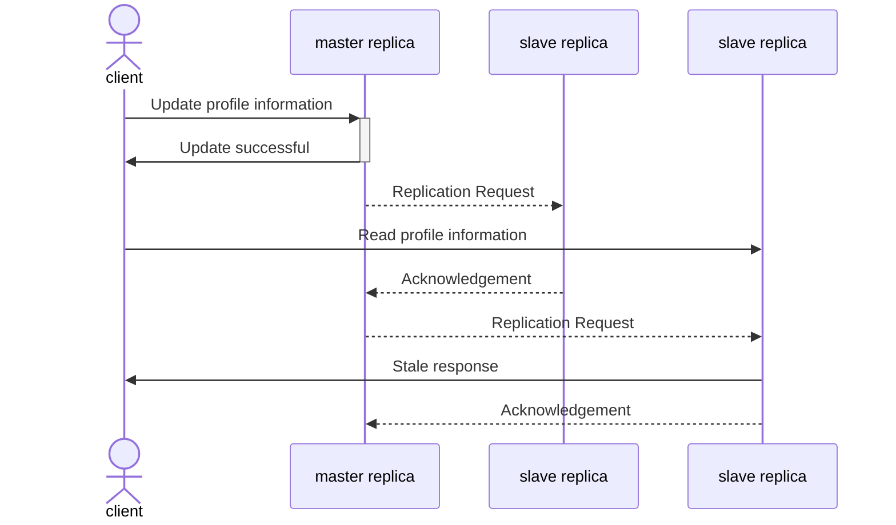
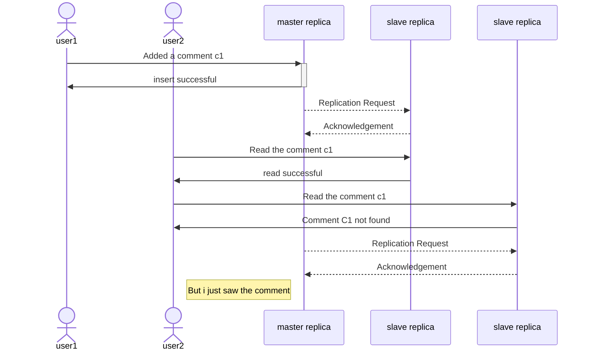
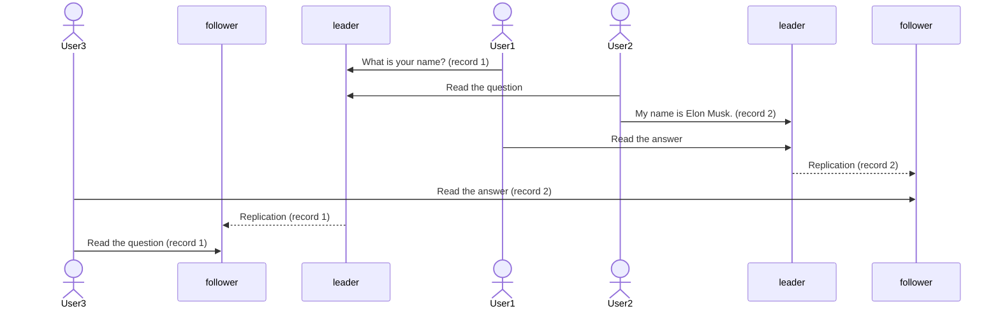

The delay, known as **replication lag**, between a write occurring on the leader and being reflected on a follower may be minimal, often just a fraction of a second, making it practically imperceptible.

Scaling the architecture is achievable by adding more follower nodes. However, this scalability is typically viable with asynchronous replication. Attempting synchronous replication to all followers could render the entire system unavailable for writing in the event of a single node failure or network outage.

The term "eventually consistency" is ambiguous. In general, there is no strict limit to how far a replica can lag behind. However, operational conditions, such as a system nearing capacity or network issues, can cause the lag to extend to several seconds or even minutes.

## Problems with Replication Lag

### Reading Your Own Writes

If the user views the data shortly after making a write, the new data may not yet have reached the replica. For example, user updated their social media profile information and immediately reloads the page.

 This can be solved using **read-after-write consistency**, also known as **read-your-writes consistency**.

#### Implementation Strategies

 - When reading data that could be modified by the user, retrieve it from the leader. For instance, user profiles on a social network are typically editable only by the profile owner. Therefore, a straightforward guideline is to read the user's own profile from the leader and read other users' profiles from a follower.

- The client can store the timestamp of its latest write, allowing the system to guarantee that the replica serving reads for that user reflects updates at least until that timestamp. If a replica is not sufficiently up-to-date, the read can be directed to another replica, or the query can wait until the replica catches up. The timestamp could be either a logical timestamp (indicating the order of writes, like a log sequence number) or the system's actual clock.

- Complications arise when a user accesses the service from multiple devices. Approaches relying on remembering the user's last update timestamp become challenging, as the code on one device lacks knowledge of updates on the other device. Centralizing this metadata becomes necessary to address such challenges.

### Monotonic Reads

It’s possible for a user to see things `moving backward in time`. This can happen if a user makes several reads from different replicas.

**Monotonic reads** ensure prevention of certain anomalies. While it offers a lesser guarantee than strong consistency, it is stronger than eventual consistency.

One approach to achieving monotonic reads is to ensure each user consistently reads from the same replica (while different users can read from different replicas). For instance, the replica can be chosen based on a hash of the user ID rather than randomly. However, in the event of replica failure, the user's queries will need to be redirected to an alternative replica.

### Consistent Prefix Reads

Consider the following conversation.

- User1: What is your name?
- User2: My name is Elon Musk.

These records have dependency on each other. The order of the records matter here. Now, imagine User3 is observing this conversation from a follower may see the response as follows.

- User2: My Name is Elon Musk.
- User1: What is your name?

Preventing this anomaly necessitates a different guarantee: **consistent prefix reads**. This guarantee asserts that if a sequence of writes occurs in a specific order, any reader observing those writes will perceive them in the same order.

This challenge is particularly pronounced in partitioned (sharded) databases. One solution is to ensure that causally related writes are stored in the same partition. However, in certain applications, achieving this efficiently may pose challenges.