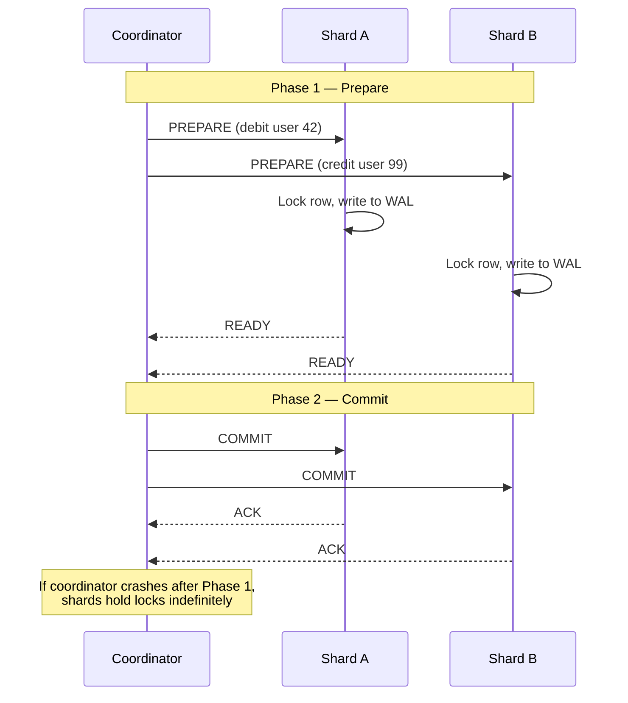
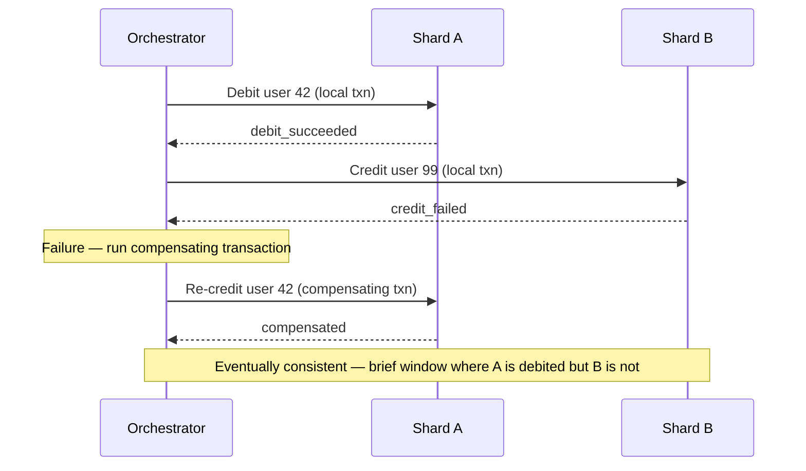

Sharding is horizontal partitioning — splitting a single database into multiple independent databases (shards), each owning a subset of the data. It is the last resort for scaling writes past what a single primary can handle, and it introduces operational complexity that cannot be undone without a full migration.

## Why Sharding Exists

A single database node has hard limits:

| Constraint | Symptom | Vertical scale limit |
|-----------|---------|---------------------|
| **Write throughput** | WAL fsync, lock contention, index updates at high write rate | ~100k–200k simple writes/sec on high-end hardware |
| **Storage** | Table size exceeds disk capacity | ~100 TB on a single machine, expensive |
| **Working set** | Hot data exceeds RAM → buffer pool misses → disk I/O | Largest cloud instance ~24 TB RAM; prohibitively costly |
| **Connection count** | Thousands of concurrent clients exhaust per-connection memory | ~10k connections at ~5–10 MB/conn = 50–100 GB RAM just for connections |

Read replicas solve read throughput. Connection pooling (PgBouncer) solves connection limits. Only write throughput and storage size require sharding.


Exhaust every other option before sharding: vertical scaling, read replicas, caching, query optimization, connection pooling, and archiving cold data. Sharding is operationally irreversible — cross-shard joins, foreign keys, and multi-shard transactions become permanent application-level concerns.


## Shard Key Selection

The shard key determines how rows are distributed. It is the most consequential decision in the sharding design — changing it later requires a full data migration.

A good shard key satisfies three properties simultaneously:

**High cardinality** — enough distinct values to fill all shards and future shards. A shard key with only 10 distinct values can never distribute data across more than 10 shards.

**Even distribution** — no single value (or small set of values) dominates. A shard key of `country_code` where 60% of users are `US` means one shard carries 60% of the load regardless of how many shards exist.

**Query locality** — the most common queries include the shard key in the predicate. A query without the shard key must be sent to all shards (scatter-gather). If the most common query is `WHERE user_id = ?`, shard on `user_id`. If the most common query is `WHERE tenant_id = ?` and `tenant_id` has high cardinality, shard on `tenant_id`.

**Avoid monotonically increasing keys as the shard key** — `created_at`, `auto_increment id`, and `ObjectId` all route all new inserts to the last shard. This is a write hotspot: one shard receives 100% of writes while all others are idle.

```
Bad shard key (auto-increment ID with range sharding):

Shard 1: IDs 1–1M      ← cold, filled years ago
Shard 2: IDs 1M–2M     ← cold
Shard 3: IDs 2M–3M     ← all new inserts land here — hot write shard
```

## Hash-Based Sharding

```
shard_id = hash(shard_key) % N
```

The hash function maps the shard key to a uniformly distributed integer. The modulo assigns it to a shard. All shards receive roughly equal key counts.

```
Users sharded by hash(user_id) % 4:

user_id=1001  → hash=8341  → 8341%4=1 → Shard 1
user_id=1002  → hash=2951  → 2951%4=3 → Shard 3
user_id=1003  → hash=6204  → 6204%4=0 → Shard 0
user_id=1004  → hash=1127  → 1127%4=3 → Shard 3
```

**What makes hash sharding good:**
- Even write and storage distribution — hash functions spread keys uniformly
- O(1) shard lookup — compute the shard from the key, no metadata lookup needed
- No hotspots from monotonically increasing keys — hash(created_at) distributes evenly

**What makes hash sharding hard:**

*Range queries require scatter-gather.* A query `WHERE created_at BETWEEN ? AND ?` cannot be answered from one shard — rows in the date range are spread across all shards. The application sends the query to all N shards and merges results.

```
SELECT * FROM orders WHERE user_id = 42         ← routed to 1 shard ✅
SELECT * FROM orders WHERE created_at > '2024'  ← sent to all N shards ❌
```

*Resharding requires full data movement.* When N changes (add a shard), `hash(key) % (N+1)` remaps almost all keys. Use consistent hashing instead of modulo to reduce movement to ~1/N of keys.

## Range-Based Sharding

The shard key's value space is divided into contiguous ranges. Each shard owns one range.

```
Orders sharded by order_id range:

Shard 0: order_id [0,       10,000,000)
Shard 1: order_id [10M,     20,000,000)
Shard 2: order_id [20M,     30,000,000)
Shard 3: order_id [30M,     ∞)

order_id=15,423,100 → Shard 1 (binary search on range boundaries)
```

**What makes range sharding good:**
- Range queries on the shard key hit one shard (or a small number of contiguous shards)
- Data sorted within each shard — efficient for `ORDER BY shard_key` queries
- Hot data naturally concentrates in recent shards — those shards can be given more resources

**What makes range sharding hard:**

*Monotonic key hotspot.* If the shard key is `created_at` or an auto-increment ID, all new rows go to the last shard. Every write hits one shard; all others are read-only.

```
Time-based range sharding for an event log:
  Shard 0: Jan data  ← cold, read-only
  Shard 1: Feb data  ← cold, read-only
  Shard 2: Mar data  ← all current writes ← HOT
```

*Uneven shard sizes.* If user activity is not uniform across the key range, some shards grow larger than others. Requires periodic rebalancing (splitting overloaded shards, merging underloaded ones).

**Mitigation:** Pre-split ranges based on expected data distribution; use the chunk migration system (like HBase regions or CockroachDB ranges) to automatically rebalance when shards become uneven.

## Directory-Based Sharding

A central **shard map** (lookup table) explicitly records which shard owns which key range or key value. The application queries the shard map to find the correct shard.

```
Shard map (stored in a highly available metadata store):

tenant_id=acme        → Shard 2
tenant_id=globex      → Shard 0
tenant_id=initech     → Shard 2
tenant_id=umbrella    → Shard 1

Query: SELECT * FROM orders WHERE tenant_id = 'acme'
  1. Lookup 'acme' in shard map → Shard 2
  2. Query Shard 2 directly
```

**What makes directory sharding good:**
- Maximum flexibility — any key can be remapped to any shard without data movement
- Supports non-uniform sharding — large tenants get their own shard; small tenants are co-located
- Tenant isolation — a large customer can be migrated to a dedicated shard without changing the application's routing logic

**What makes directory sharding hard:**

*The shard map is a SPOF and bottleneck.* Every query requires a shard map lookup. If the shard map is unavailable, the entire application is unavailable. If the shard map is slow, every query is slow.

Mitigation: cache the shard map aggressively in the application process (invalidate on mapping changes), replicate the shard map across multiple availability zones, use a fast in-memory store (Redis, etcd) for the map.

*Shard map consistency.* During a shard migration, the map must be updated atomically with the data movement. A window where the map points to the old shard but data has moved (or vice versa) causes incorrect results.

**Used by:** DynamoDB (partition map), Vitess (VSchema), many multi-tenant SaaS platforms (tenant-to-database routing).

## Comparison

| | Hash sharding | Range sharding | Directory sharding |
|---|---|---|---|
| **Distribution** | Even (by design) | Uneven if key is monotonic | Explicit control |
| **Range queries on shard key** | ❌ Scatter-gather | ✅ Single shard | ✅ Single shard (if range in one entry) |
| **Hotspot risk** | Low | High (monotonic keys) | Manageable (explicit mapping) |
| **Resharding complexity** | High (most keys move without consistent hashing) | Medium (split ranges, move data) | Low (update map entry) |
| **Lookup cost** | O(1) — compute | O(log N) — binary search on boundaries | O(1) with cache; extra hop without |
| **Operational overhead** | Low | Medium | High (shard map must be maintained) |

## Cross-Shard Operations

Sharding eliminates the ability to atomically operate across rows on different shards. This is the core operational cost of sharding.

### Cross-Shard Reads: Scatter-Gather

A query whose predicate does not include the shard key must fan out to all shards.

```
"Find all orders placed in the last 24 hours" (shard key = user_id)

Application:
  1. Send query to all N shards in parallel
  2. Wait for all N responses
  3. Merge results (union, sort, deduplicate)
  4. Apply LIMIT/OFFSET on merged result

Latency = max(shard_1_latency, shard_2_latency, ..., shard_N_latency)
          + merge overhead
```

Scatter-gather latency is dominated by the slowest shard. A single slow shard (GC pause, hot spot, network hiccup) stalls the entire query. At N=100 shards, the probability of at least one slow shard per query is near 1.

**Mitigation:** Design the primary access pattern to always include the shard key. Secondary access patterns that require scatter-gather should be served from a denormalized secondary store (Elasticsearch, a separate read replica aggregating all shards, or a data warehouse).

### Cross-Shard Writes: Distributed Transactions

A write that must atomically modify rows on two different shards requires distributed coordination.

**Two-Phase Commit (2PC):**



2PC is **blocking** — if the coordinator fails after Phase 1, shards hold locks indefinitely until the coordinator recovers. It also adds at minimum 2 RTTs to every cross-shard write.

**Saga pattern (preferred for long-running or high-throughput operations):**

Break the transaction into a sequence of local transactions, each with a compensating transaction for rollback.



Sagas are eventually consistent — there is a window where Shard A is debited but Shard B is not yet credited. This is acceptable for many use cases (order fulfillment, payment processing) and avoids distributed locks.

**Best strategy: avoid cross-shard writes by design.** Choose a shard key that co-locates related data that must be written together. For a payment system: shard by `wallet_id`. For a multi-tenant SaaS: shard by `tenant_id` — all of one tenant's data is on one shard, enabling single-shard transactions.

### Foreign Keys Are Gone

Database-enforced foreign keys (`REFERENCES`) only work within a single database instance. Across shards, referential integrity is the application's responsibility.

```
-- On a sharded system, this constraint cannot exist:
orders.user_id REFERENCES users(id)  -- users and orders may be on different shards

-- Application must manually ensure:
-- 1. Before inserting an order, verify user exists (cross-shard read)
-- 2. Before deleting a user, verify no orders reference them (cross-shard scan)
```

### Globally Unique IDs

Auto-increment IDs from each shard will collide. User `id=1` on Shard A and `id=1` on Shard B are different users.

| Strategy | How | Tradeoff |
|----------|-----|----------|
| **UUID v4** | Random 128-bit ID | Globally unique; unordered (bad for B-tree clustering) |
| **UUID v7** | Timestamp-prefixed 128-bit | Globally unique; sortable by creation time |
| **Snowflake ID** (Twitter) | 64-bit: `timestamp(41) + datacenter(5) + worker(5) + sequence(12)` | Compact, sortable, requires worker ID coordination |
| **Shard-prefixed ID** | `shard_id + local_auto_increment` | Encodes shard in ID — easy to route; couples ID to original shard |
| **Centralized ID service** | Dedicated service issues monotonic IDs in batches | Simple; ID service is a SPOF and throughput bottleneck |

Snowflake IDs (or variants) are the standard at FAANG. They are 64-bit (fits in a `BIGINT`), roughly time-ordered (good for B-tree clustering), and require no coordination beyond initial worker ID assignment.

## Resharding

Resharding — changing the number of shards — is one of the most disruptive operations in a distributed system.

### Consistent Hashing for Minimal Movement

Using consistent hashing instead of `hash % N` means adding one shard moves only ~1/N of keys (see [Consistent Hashing](../consistent-hashing)). This is the standard approach for distributed caches and NoSQL systems (Cassandra token ring, Redis Cluster slot migration).

### Double-Write Migration (Zero-Downtime for Relational DBs)

For relational databases that don't support native resharding:

```
Phase 1 — Dual write:
  Application writes to OLD sharding scheme AND NEW sharding scheme simultaneously
  New scheme starts empty; gradually fills as writes arrive

Phase 2 — Backfill:
  Background job copies existing data from old scheme to new scheme
  Handles conflicts: if a row exists in both, new scheme wins (it has the latest write)

Phase 3 — Read cutover:
  Once backfill is complete + verified, switch reads to new scheme

Phase 4 — Cleanup:
  Stop writing to old scheme; decommission old shards
```

Double-write increases write latency during migration (two writes instead of one) and requires the application to handle both schemes simultaneously. It is the safest approach because any step is reversible until Phase 3.

### Online Split Tooling

Purpose-built tools manage live shard splits without application changes:
- **Vitess (MySQL):** `vtctl` commands initiate shard splits; traffic is automatically shifted via VTGate routing
- **CockroachDB:** ranges split and rebalance automatically; no operator intervention
- **MongoDB:** chunk migration managed by the balancer process

## Sharding at Different Layers

| Layer | Approach | Examples | Tradeoff |
|-------|---------|---------|---------|
| **Application code** | Route queries to the correct DB based on shard key | Shopify (per-tenant DB), GitHub (MySQL sharding) | Full control; significant application complexity |
| **Middleware proxy** | Transparent sharding proxy between app and DB | Vitess (MySQL), ProxySQL, Citus coordinator | App sees one DB; proxy adds latency hop |
| **Database-native** | Database handles sharding internally | Cassandra, MongoDB, CockroachDB, DynamoDB | Simplest operationally; less control over placement |
