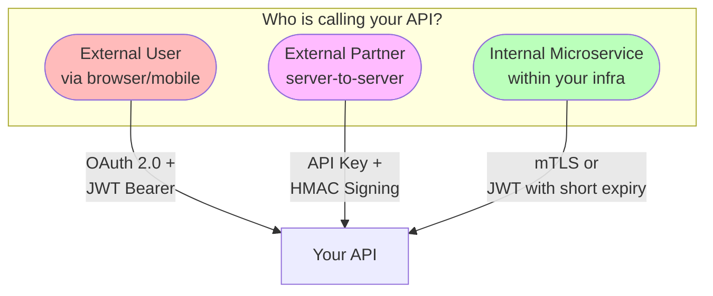
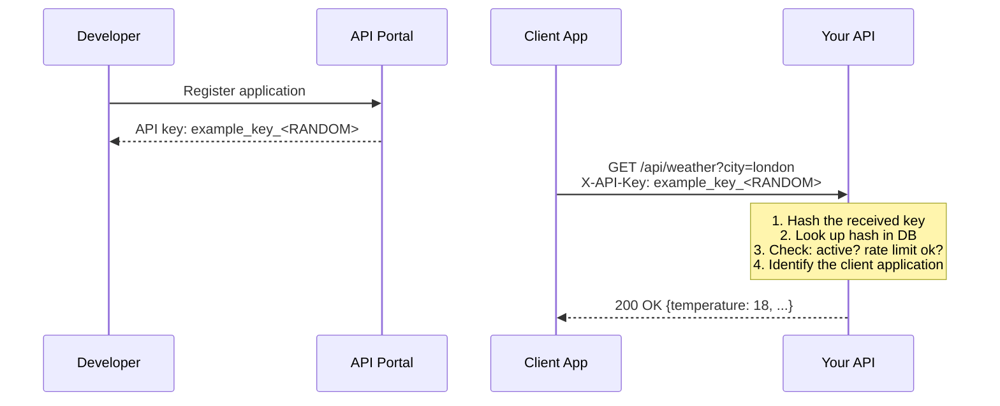
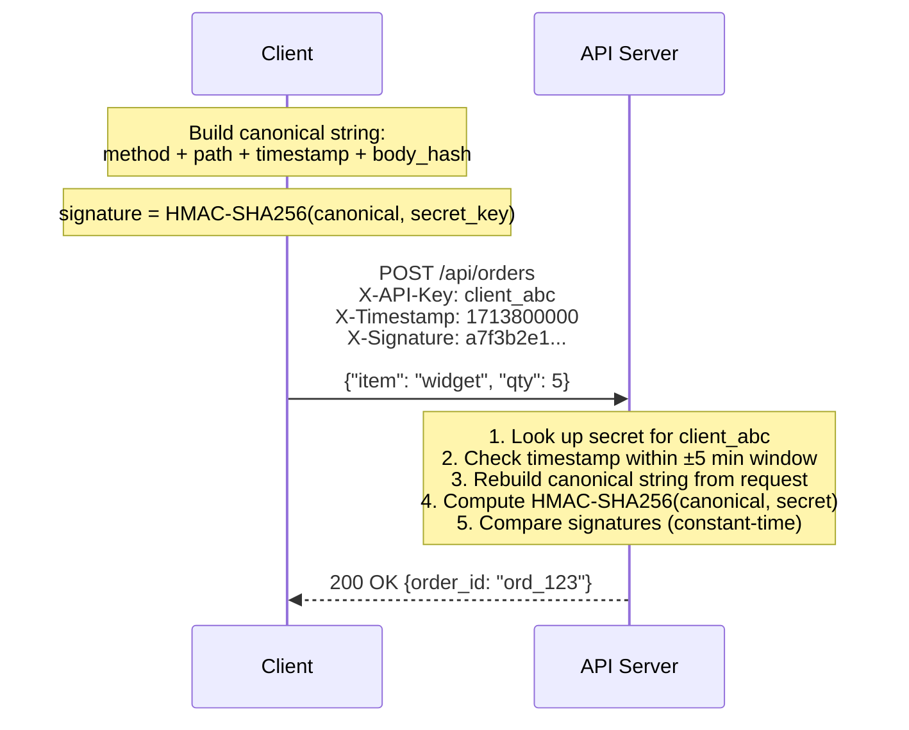
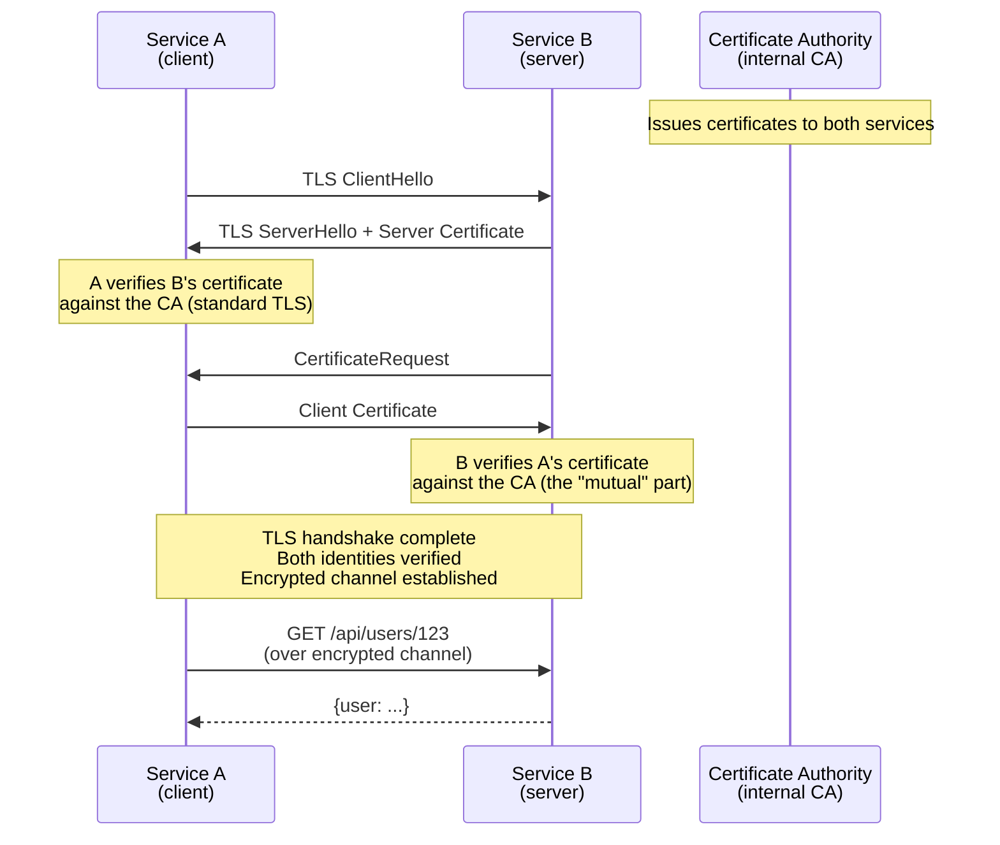
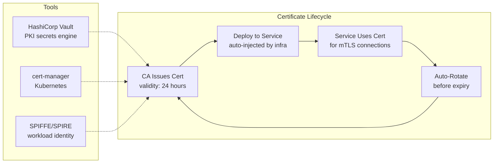
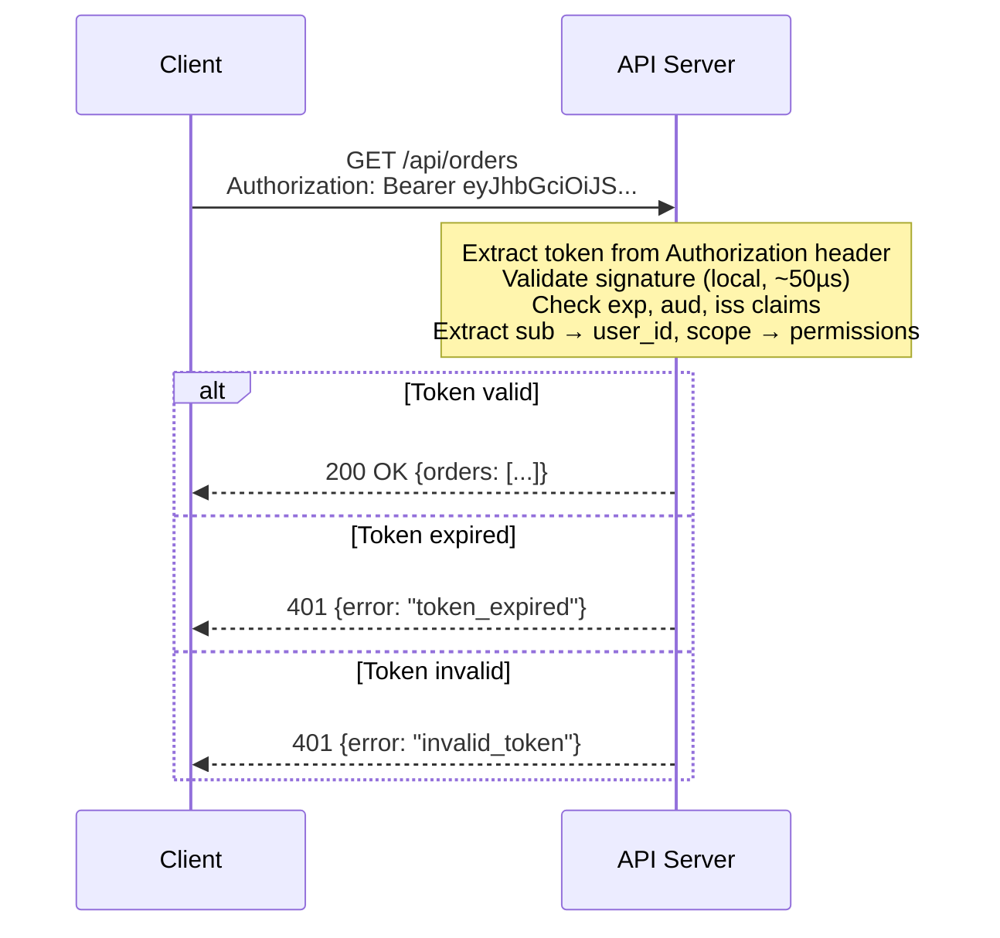
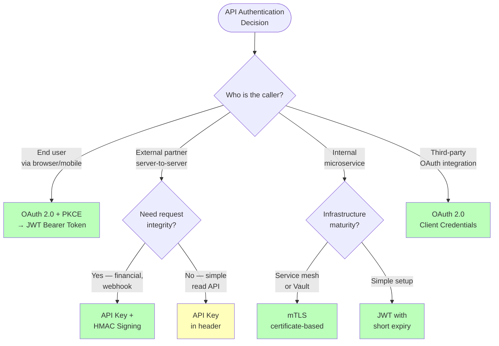
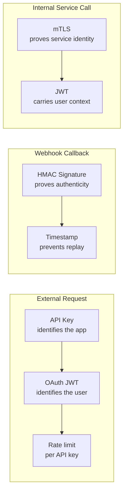

Your company exposes a public REST API. A mobile app, a partner's backend server, and an internal billing microservice all need to call it — but each has fundamentally different trust characteristics. The mobile app is on a user's device (untrusted, can be reverse-engineered). The partner's server is in their data center (semi-trusted, you control access but not their infrastructure). The internal microservice is inside your VPC (trusted, you control both sides). **Using the same authentication scheme for all three is either too weak for one or too complex for another.** Each integration pattern has a purpose-built authentication mechanism, and choosing the wrong one creates security holes or unnecessary friction.

## The Landscape: What Problem Does Each Scheme Solve?



| Caller | Trust level | Auth scheme | Why this one |
|--------|------------|-------------|-------------|
| **User via app** | Low — device is untrusted | OAuth 2.0 + JWT Bearer | Delegated auth, scoped permissions, revocable |
| **External partner** | Medium — you control their access, not their code | API key + HMAC signing | Simple identity + tamper-proof requests |
| **Internal service** | High — you control both sides | mTLS or JWT | Strong mutual identity, zero user involvement |

## API Keys

### The Problem They Solve

You need a simple way to identify which application is calling your API, enforce per-client rate limits, and revoke access if a client misbehaves. You don't need to know *which user* is making the request — just *which application*.

### How They Work

An API key is an opaque random string (typically 32–64 characters) issued to each client. The client includes it in every request, usually in a header.



### Why Hash the Key?

API keys are credentials — they grant access to your API. If your database is breached and keys are stored in plaintext, every client is instantly compromised. Hashing with SHA-256 means the attacker gets hashes they can't reverse.

```
Stored in DB:       key_hash = SHA256("example_key_...")
Attacker steals DB: sees "a1b2c3d4e5..." (useless without the original key)
Client sends key:   server computes SHA256(received_key), compares with stored hash
```

**Treat API keys exactly like passwords:** hash before storing, transmit only over HTTPS, allow rotation, support revocation.

### Limitations of API Keys Alone

| Problem | Why API keys can't solve it |
|---------|---------------------------|
| **No tamper protection** | An attacker who intercepts the key can replay any request, modify parameters, or forge new requests |
| **No request integrity** | The server can't verify that the request body wasn't modified in transit (beyond TLS) |
| **No user identity** | API keys identify the *application*, not the *user* — can't do per-user authorization |
| **Shared secret risk** | The key is sent with every request — if any request is logged with headers, the key is exposed |

For public APIs with simple needs (weather data, maps), API keys are sufficient. For APIs handling sensitive data or money, you need something stronger.

## HMAC Signing

### The Problem It Solves

An API key proves *who* the caller is, but it doesn't prove the request wasn't **tampered with** in transit. Even over HTTPS, there are scenarios where request integrity matters beyond transport-level encryption:

- **Logging systems** that capture request headers (including the API key) — anyone with log access can forge requests
- **Replay attacks** — an attacker records a legitimate request and replays it later
- **Proxy manipulation** — a misconfigured intermediary proxy could modify request parameters

HMAC signing proves three things: (1) the request came from someone who holds the shared secret, (2) the request body was not modified, and (3) the request is fresh (not a replay).

### How It Works

The client constructs a **canonical string** from the request components, computes an HMAC-SHA256 signature using a shared secret, and sends the signature with the request. The server reconstructs the same canonical string and verifies the signature.



{}

### Client builds canonical string

A deterministic representation of the request: `METHOD\nPATH\nTIMESTAMP\nSHA256(body)`. Sorting keys in the body ensures the same JSON always produces the same hash.

### Client computes signature

`HMAC-SHA256(canonical_string, secret_key)` — the secret key is never sent over the wire. Only the signature is transmitted.

### Server verifies

The server looks up the client's secret by API key, rebuilds the same canonical string from the received request, computes the expected signature, and does a **constant-time comparison** (prevents timing attacks).

{}

### Replay Attack Prevention

```
Without timestamp:
  Attacker captures: POST /transfer {amount: 1000, to: "attacker"} + valid signature
  Attacker replays the exact same request 1 hour later → succeeds

With timestamp (±5 min window):
  t=0:    Client sends request with timestamp=1713800000, valid signature
  t=301s: Attacker replays with timestamp=1713800000
          Server: |now - 1713800000| = 301 > 300 → REJECT
  
  Attacker tries changing timestamp to current time:
          But signature was computed with the original timestamp
          Changing the timestamp invalidates the signature → REJECT
```

The timestamp is **included in the signed canonical string**, so the attacker can't modify it without invalidating the signature, and can't replay the original request after the time window expires.

### Who Uses HMAC Signing?

| Service | How they use it |
|---------|----------------|
| **AWS (Signature V4)** | Signs method + path + headers + body hash + timestamp with secret access key |
| **Stripe (webhook signatures)** | Signs webhook payload with endpoint secret; receiver verifies to prevent spoofed webhooks |
| **Twilio** | Signs request body for webhook callbacks |
| **GitHub (webhook secrets)** | HMAC-SHA256 of webhook payload, verified by the receiver |

## mTLS (Mutual TLS)

### The Problem It Solves

Standard TLS (HTTPS) verifies that the **server** is who it claims to be — the client checks the server's certificate. But the server doesn't verify the client's identity at the TLS level. Any client that can reach the endpoint can send requests.

For internal microservices, you need **both sides** to prove their identity: Service A must prove it's Service A before Service B accepts its request. This is the **authentication** part of zero-trust networking.



### Why mTLS for Internal Services?

| Property | Why it matters |
|----------|---------------|
| **Identity at the transport layer** | The service identity is proven *before* any application code runs — the TLS handshake itself is the authentication |
| **No shared secrets in application code** | Unlike API keys or JWTs, there's no token to leak in logs, environment variables, or error messages |
| **Certificate rotation is automated** | Tools like cert-manager (Kubernetes), Vault, or SPIFFE/SPIRE auto-rotate certificates without deploys |
| **Works with any protocol** | gRPC, HTTP, TCP — anything that runs over TLS. Protocol-agnostic |
| **Service mesh integration** | Istio/Envoy sidecar proxies handle mTLS transparently — application code is unaware |

### Certificate Management at Scale



**Short-lived certificates** (hours, not years) are the modern best practice. If a certificate is compromised, it expires before the attacker can exploit it. This eliminates the need for a Certificate Revocation List (CRL) or OCSP — the certificate simply stops working.

### When mTLS Is Overkill

mTLS adds complexity: certificate authority setup, cert distribution, rotation automation, and debugging TLS handshake failures. For simpler internal service communication, **JWT with short expiry** is often sufficient and easier to operate.

## JWT Bearer Tokens

### The Problem They Solve

After a user authenticates (via OAuth 2.0), the application needs to include proof of authentication in every subsequent API call. The server must validate this proof **without calling the auth server on every request** — at 100K requests/second, that would be a bottleneck.

JWTs solve this because they're **self-contained**: the token itself carries the claims (user ID, scopes, expiry) and a cryptographic signature. Any server with the public key can validate the token locally.

(The mechanics of JWT structure, signing, and validation are covered in detail in the [JWT post](../jwt). This section focuses on the Bearer token **usage pattern**.)



### Bearer Token Security Rules

The word "Bearer" means **whoever bears (holds) this token is granted access**. There's no proof of possession — if someone steals the token, they can use it.

```
Rules:
  1. ALWAYS transmit over HTTPS (never HTTP)
  2. NEVER log tokens (mask in logs: "Bearer eyJ...REDACTED")
  3. NEVER embed in URLs (?token=...) — URLs are logged everywhere
  4. Store in memory or httpOnly secure cookies — never localStorage
  5. Short expiry (15 min) to limit stolen token window
```


**Never put Bearer tokens in URL query parameters.** URLs appear in server access logs, browser history, referer headers, and proxy logs. A token in a URL `?access_token=eyJ...` is visible to every intermediary that handles the request. Always use the `Authorization: Bearer` header.


## Choosing the Right Scheme: Decision Framework



### Head-to-Head Comparison

| Property | API Key | HMAC Signing | mTLS | JWT Bearer |
|----------|---------|-------------|------|-----------|
| **Identity proof** | Application ID | Application ID + request integrity | Service identity (certificate) | User + application identity |
| **Request integrity** | No | Yes (signed body + path + timestamp) | Yes (TLS encryption) | No (token only, not request body) |
| **Replay protection** | No | Yes (timestamp window) | Yes (TLS session) | Partial (expiry, but within window) |
| **Setup complexity** | Minimal | Moderate (signing logic on client) | High (CA, cert distribution, rotation) | Moderate (auth server, JWKS) |
| **Revocation** | Delete key from DB | Delete key from DB | Revoke certificate (or wait for expiry) | Short expiry + refresh token revocation |
| **Credential exposure risk** | Key in every request header | Key never sent — only signature | Certificate on disk, auto-rotated | Token in every request header |
| **Validation cost** | DB lookup per request | DB lookup + HMAC computation | TLS handshake (then session reuse) | Local crypto only (~50µs) |

### Real-World Patterns

| Scenario | Recommended scheme | Example |
|----------|-------------------|---------|
| **Public API for developers** | API key (identity) + OAuth 2.0 (user data access) | Google Maps API key + OAuth for user data |
| **Webhook receiver** | HMAC signature verification | Stripe webhook `Stripe-Signature` header |
| **Internal microservices** | mTLS (service mesh) or JWT service tokens | Istio sidecar proxies handle mTLS transparently |
| **Mobile app accessing user data** | OAuth 2.0 Authorization Code + PKCE → JWT Bearer | Instagram API, Spotify API |
| **Partner server integration** | API key + HMAC signing | AWS S3 API (Signature V4) |
| **CLI tool or CI/CD pipeline** | OAuth 2.0 Device Flow or short-lived API token | `gh auth login`, `aws configure` |
| **Service-to-service (no user)** | OAuth 2.0 Client Credentials → JWT | Backend billing service calling user API |

### Layering Schemes Together

In practice, production APIs often **combine** multiple schemes:



**Example: Stripe's model**

- **Public API calls:** API key (`example_key_...`) in `Authorization: Bearer` header identifies the merchant account + authenticates
- **Webhook deliveries to your server:** HMAC-SHA256 signature in `Stripe-Signature` header, verified with your webhook secret
- **User-initiated actions:** OAuth 2.0 Connect for platform integrations, JWT for session management


**Interview tip:** When API authentication comes up, say: "I'd choose the scheme based on the caller type. For user-facing requests from a mobile app, OAuth 2.0 with PKCE gives me delegated auth and scoped JWT Bearer tokens — validated locally at the API gateway with zero DB calls. For external partner integrations that modify data, I'd use API keys for identity plus HMAC request signing — the partner signs the method, path, timestamp, and body hash with their secret key, which prevents tampering and replay attacks. For internal service-to-service calls, mTLS with short-lived certificates from an internal CA gives me mutual identity verification at the transport layer — the service mesh handles it transparently. API keys are stored hashed (like passwords), JWTs are validated by signature check against JWKS, and HMAC uses constant-time comparison to prevent timing attacks." This shows you match the scheme to the trust model and understand the security details.

