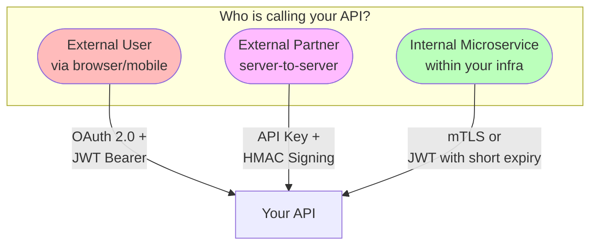

Your company exposes a public REST API. A mobile app, a partner's backend server, and an internal billing microservice all need to call it — but each has fundamentally different trust characteristics. The mobile app is on a user's device (untrusted, can be reverse-engineered). The partner's server is in their data center (semi-trusted, you control access but not their infrastructure). The internal microservice is inside your VPC (trusted, you control both sides). **Using the same authentication scheme for all three is either too weak for one or too complex for another.** Each integration pattern has a purpose-built authentication mechanism, and choosing the wrong one creates security holes or unnecessary friction.

## The Landscape: What Problem Does Each Scheme Solve?

| Caller | Trust level | Auth scheme | Why this one |
|--------|------------|-------------|-------------|
| **User via app** | Low — device is untrusted | OAuth 2.0 + JWT Bearer | Delegated auth, scoped permissions, revocable |
| **External partner** | Medium — you control their access, not their code | API key + HMAC signing | Simple identity + tamper-proof requests |
| **Internal service** | High — you control both sides | mTLS or JWT | Strong mutual identity, zero user involvement |

## Test Your Understanding


**Because the strength you need is set by the trust model, and mTLS is the wrong tool for untrusted, user-facing clients.** Provisioning and rotating client certificates on millions of phones (or in a browser) is impractical, and a cert embedded in an app can be extracted like any other secret — so it buys little against an untrusted device. mTLS shines for *services* you control on both ends, where an internal CA and a service mesh automate certs.

**The point of the landscape:** match the scheme to the caller — OAuth/JWT for users, API key + HMAC for partners, mTLS for internal services. Over-applying the 'strongest' one adds friction without adding real security.



**The device is untrusted, and anything shipped in the app can be extracted** — via decompilation, a proxy like mitmproxy, or reading the binary. Once pulled, the key identifies *the app*, not the user, so an attacker can replay it and call the API as the app, indistinguishable from legitimate traffic — and you can't revoke it without breaking every user who shares that key.

**Right pattern:** user-facing mobile clients use OAuth 2.0 Authorization Code + PKCE to obtain short-lived, per-user JWT Bearer tokens. No long-lived shared secret sits on the device.

