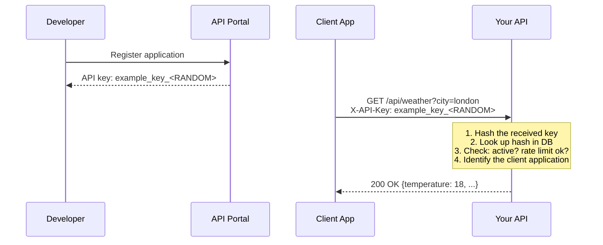

## API Keys

### The Problem They Solve

You need a simple way to identify which application is calling your API, enforce per-client rate limits, and revoke access if a client misbehaves. You don't need to know *which user* is making the request — just *which application*.

### How They Work

An API key is an opaque random string (typically 32–64 characters) issued to each client. The client includes it in every request, usually in a header.



### Why Hash the Key?

API keys are credentials — they grant access to your API. If your database is breached and keys are stored in plaintext, every client is instantly compromised. Hashing with SHA-256 means the attacker gets hashes they can't reverse.

```
Stored in DB:       key_hash = SHA256("example_key_...")
Attacker steals DB: sees "a1b2c3d4e5..." (useless without the original key)
Client sends key:   server computes SHA256(received_key), compares with stored hash
```

**Treat API keys exactly like passwords:** hash before storing, transmit only over HTTPS, allow rotation, support revocation.

### Limitations of API Keys Alone

| Problem | Why API keys can't solve it |
|---------|---------------------------|
| **No tamper protection** | An attacker who intercepts the key can replay any request, modify parameters, or forge new requests |
| **No request integrity** | The server can't verify that the request body wasn't modified in transit (beyond TLS) |
| **No user identity** | API keys identify the *application*, not the *user* — can't do per-user authorization |
| **Shared secret risk** | The key is sent with every request — if any request is logged with headers, the key is exposed |

For public APIs with simple needs (weather data, maps), API keys are sufficient. For APIs handling sensitive data or money, you need something stronger.

## Test Your Understanding


**Query parameters are logged everywhere.** HTTPS encrypts the URL in transit, but: (1) Server access logs record the full URL including the key. (2) Browser history stores it. (3) Intermediary proxies (CDN, API gateway) may log URLs. (4) Referrer headers leak the URL to external links.

**Fix:** Send API keys in a header: `Authorization: Bearer abc123` or `X-API-Key: abc123`. Headers are not logged by default in most HTTP servers and never appear in browser history or referrer headers.



**A single database leak instantly compromises every client.** Plaintext keys are credentials in the clear — an attacker who reads the table can impersonate every partner at once. The ability to email a key back is a symptom of the same flaw: if *you* can recover it, so can anyone who steals the store.

**Fix:** treat keys like passwords — store only a hash (e.g., SHA-256), compare the hash of the presented key on each request, and if a partner loses a key, *rotate* (issue new, revoke old) rather than recover it.

