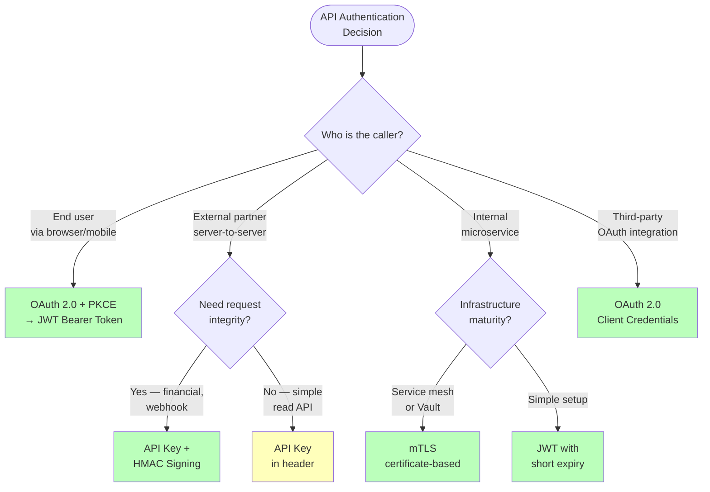
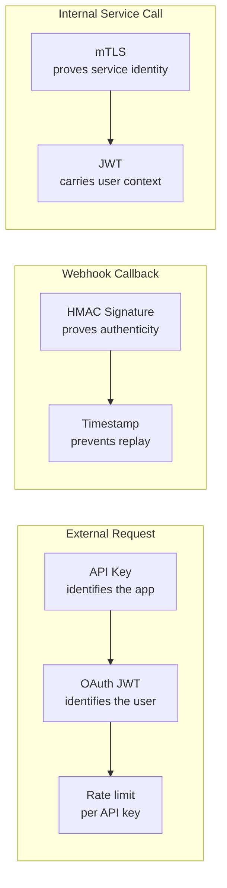

## Choosing the Right Scheme: Decision Framework

### Head-to-Head Comparison

| Property | API Key | HMAC Signing | mTLS | JWT Bearer |
|----------|---------|-------------|------|-----------|
| **Identity proof** | Application ID | Application ID + request integrity | Service identity (certificate) | User + application identity |
| **Request integrity** | No | Yes (signed body + path + timestamp) | Yes (TLS encryption) | No (token only, not request body) |
| **Replay protection** | No | Yes (timestamp window) | Yes (TLS session) | Partial (expiry, but within window) |
| **Setup complexity** | Minimal | Moderate (signing logic on client) | High (CA, cert distribution, rotation) | Moderate (auth server, JWKS) |
| **Revocation** | Delete key from DB | Delete key from DB | Revoke certificate (or wait for expiry) | Short expiry + refresh token revocation |
| **Credential exposure risk** | Key in every request header | Key never sent — only signature | Certificate on disk, auto-rotated | Token in every request header |
| **Validation cost** | DB lookup per request | DB lookup + HMAC computation | TLS handshake (then session reuse) | Local crypto only (~50µs) |

### Real-World Patterns

| Scenario | Recommended scheme | Example |
|----------|-------------------|---------|
| **Public API for developers** | API key (identity) + OAuth 2.0 (user data access) | Google Maps API key + OAuth for user data |
| **Webhook receiver** | HMAC signature verification | Stripe webhook `Stripe-Signature` header |
| **Internal microservices** | mTLS (service mesh) or JWT service tokens | Istio sidecar proxies handle mTLS transparently |
| **Mobile app accessing user data** | OAuth 2.0 Authorization Code + PKCE → JWT Bearer | Instagram API, Spotify API |
| **Partner server integration** | API key + HMAC signing | AWS S3 API (Signature V4) |
| **CLI tool or CI/CD pipeline** | OAuth 2.0 Device Flow or short-lived API token | `gh auth login`, `aws configure` |
| **Service-to-service (no user)** | OAuth 2.0 Client Credentials → JWT | Backend billing service calling user API |

### Layering Schemes Together

In practice, production APIs often **combine** multiple schemes:

**Example: Stripe's model**

- **Public API calls:** secret API key (`sk_live_...`) sent via HTTP Basic auth (`Authorization: Basic <base64(sk_live_...:)>`) identifies the merchant account + authenticates
- **Webhook deliveries to your server:** HMAC-SHA256 signature in `Stripe-Signature` header, verified with your webhook secret
- **User-initiated actions:** OAuth 2.0 Connect for platform integrations, JWT for session management


**Interview tip:** When API authentication comes up, say: "I'd choose the scheme based on the caller type. For user-facing requests from a mobile app, OAuth 2.0 with PKCE gives me delegated auth and scoped JWT Bearer tokens — validated locally at the API gateway with zero DB calls. For external partner integrations that modify data, I'd use API keys for identity plus HMAC request signing — the partner signs the method, path, timestamp, and body hash with their secret key, which prevents tampering and replay attacks. For internal service-to-service calls, mTLS with short-lived certificates from an internal CA gives me mutual identity verification at the transport layer — the service mesh handles it transparently. API keys are stored hashed (like passwords), JWTs are validated by signature check against JWKS, and HMAC uses constant-time comparison to prevent timing attacks." This shows you match the scheme to the trust model and understand the security details.


## Test Your Understanding


**The two requirements are about two different principals, so you layer two schemes.** An **API key** identifies the *application* — perfect for rate-limiting and billing per client — but it says nothing about the *user* and can't safely grant access to a user's private data. For that you need **OAuth 2.0**: the user delegates scoped access and your app receives a JWT Bearer token representing *that user*.

**Combined:** API key (app identity + quota) + OAuth/JWT (user identity + scoped data access). Google Maps-style keys plus OAuth for user data is the canonical example.



**Verify the HMAC signature Stripe attaches, using your shared webhook secret.** Stripe signs the raw payload (plus a timestamp) with a secret only you and Stripe know and sends it in the `Stripe-Signature` header. You recompute `HMAC-SHA256(payload, webhook_secret)` and compare (constant-time). A spoofed request can't produce a valid signature without the secret, and the timestamp bounds replay.

**Why not mTLS or a bearer token here?** The caller is *them* calling *you* — you can't hand Stripe a token, and you don't control their client certs. A shared-secret signature is the natural fit for verifying inbound webhooks.

