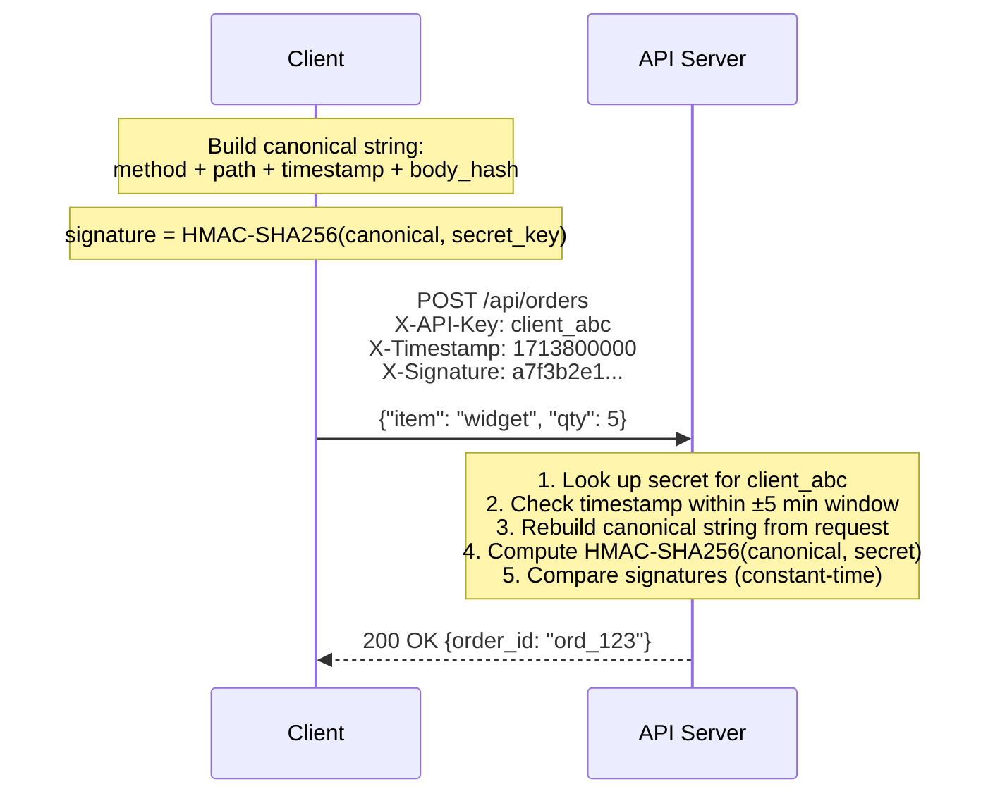

## HMAC Signing

### The Problem It Solves

An API key proves *who* the caller is, but it doesn't prove the request wasn't **tampered with** in transit. Even over HTTPS, there are scenarios where request integrity matters beyond transport-level encryption:

- **Logging systems** that capture request headers (including the API key) — anyone with log access can forge requests
- **Replay attacks** — an attacker records a legitimate request and replays it later
- **Proxy manipulation** — a misconfigured intermediary proxy could modify request parameters

HMAC signing proves three things: (1) the request came from someone who holds the shared secret, (2) the request body was not modified, and (3) the request is fresh (not a replay).

### How It Works

The client constructs a **canonical string** from the request components, computes an HMAC-SHA256 signature using a shared secret, and sends the signature with the request. The server reconstructs the same canonical string and verifies the signature.



{}

### Client builds canonical string

A deterministic representation of the request: `METHOD\nPATH\nTIMESTAMP\nSHA256(body)`. Sorting keys in the body ensures the same JSON always produces the same hash.

### Client computes signature

`HMAC-SHA256(canonical_string, secret_key)` — the secret key is never sent over the wire. Only the signature is transmitted.

### Server verifies

The server looks up the client's secret by API key, rebuilds the same canonical string from the received request, computes the expected signature, and does a **constant-time comparison** (prevents timing attacks).

{}

### Replay Attack Prevention

```
Without timestamp:
  Attacker captures: POST /transfer {amount: 1000, to: "attacker"} + valid signature
  Attacker replays the exact same request 1 hour later → succeeds

With timestamp (±5 min window):
  t=0:    Client sends request with timestamp=1713800000, valid signature
  t=301s: Attacker replays with timestamp=1713800000
          Server: |now - 1713800000| = 301 > 300 → REJECT
  
  Attacker tries changing timestamp to current time:
          But signature was computed with the original timestamp
          Changing the timestamp invalidates the signature → REJECT
```

The timestamp is **included in the signed canonical string**, so the attacker can't modify it without invalidating the signature, and can't replay the original request after the time window expires.

### Who Uses HMAC Signing?

| Service | How they use it |
|---------|----------------|
| **AWS (Signature V4)** | Signs method + path + headers + body hash + timestamp with secret access key |
| **Stripe (webhook signatures)** | Signs webhook payload with endpoint secret; receiver verifies to prevent spoofed webhooks |
| **Twilio** | Signs request body for webhook callbacks |
| **GitHub (webhook secrets)** | HMAC-SHA256 of webhook payload, verified by the receiver |

## Test Your Understanding


**Replay attack prevention.** Without a timestamp window, an attacker who captures a valid signed request can replay it indefinitely. The signature remains valid because nothing in the request changes.

With a 5-minute window: the attacker must replay within 5 minutes (limiting the attack window). Additionally, the server can store seen request IDs (nonces) for the 5-minute window and reject duplicates — this achieves true replay protection with bounded memory.

**Why the signature alone doesn't help:** HMAC proves the request wasn't tampered with, not that it's fresh. The timestamp (included in the signed payload) adds freshness. A replayed request has a valid signature but a stale timestamp.



**A normal `==` short-circuits on the first differing byte, leaking timing.** By measuring how long a rejection takes, an attacker can recover the correct signature one byte at a time — turning an infeasible brute force into a feasible one. A constant-time compare always examines the full length, so response time reveals nothing about *how much* of the signature was right.

**Rule:** compare secrets, MACs, and tokens with a constant-time function (e.g., `hmac.compare_digest`), never `==`.

