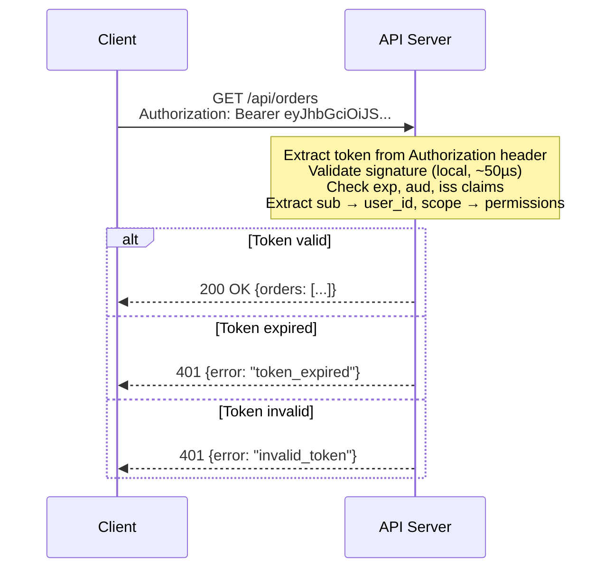

## JWT Bearer Tokens

### The Problem They Solve

After a user authenticates (via OAuth 2.0), the application needs to include proof of authentication in every subsequent API call. The server must validate this proof **without calling the auth server on every request** — at 100K requests/second, that would be a bottleneck.

JWTs solve this because they're **self-contained**: the token itself carries the claims (user ID, scopes, expiry) and a cryptographic signature. Any server with the public key can validate the token locally.

(The mechanics of JWT structure, signing, and validation are covered in detail in the [JWT post](../../jwt). This section focuses on the Bearer token **usage pattern**.)



### Bearer Token Security Rules

The word "Bearer" means **whoever bears (holds) this token is granted access**. There's no proof of possession — if someone steals the token, they can use it.

```
Rules:
  1. ALWAYS transmit over HTTPS (never HTTP)
  2. NEVER log tokens (mask in logs: "Bearer eyJ...REDACTED")
  3. NEVER embed in URLs (?token=...) — URLs are logged everywhere
  4. Store in memory or httpOnly secure cookies — never localStorage
  5. Short expiry (15 min) to limit stolen token window
```


**Never put Bearer tokens in URL query parameters.** URLs appear in server access logs, browser history, referer headers, and proxy logs. A token in a URL `?access_token=eyJ...` is visible to every intermediary that handles the request. Always use the `Authorization: Bearer` header.


## Test Your Understanding


**Token relay / confused deputy.** Service B forwards Service A's token to Service C. If B is compromised, the attacker can use captured tokens to impersonate A to any downstream service. B also gains more access than it should — it acts as A, not as itself.

**Fix:** **Token exchange.** Service B calls the auth server's token exchange endpoint (RFC 8693) to get a new token scoped to B's identity and B's permissions for calling C. The new token identifies B as the caller (with A as the original subject). C can enforce B-specific policies.

For service meshes: use **mTLS** for service identity (each service has its own certificate) and pass user context via headers, not by forwarding the user's JWT.



**'Bearer' means whoever holds the token is granted access — there's no proof of possession.** `localStorage` is readable by any JavaScript on the page, so an XSS payload can exfiltrate the token in one line and replay it from anywhere until it expires. The token carries no binding to the browser or user, so the server can't tell the thief from the victim.

**Mitigations:** store tokens in memory or `httpOnly` secure cookies (out of JS reach), keep access-token TTLs short, always use HTTPS, and never log or put tokens in URLs. Proof-of-possession schemes (DPoP / mTLS-bound tokens) remove the pure-bearer risk entirely.

