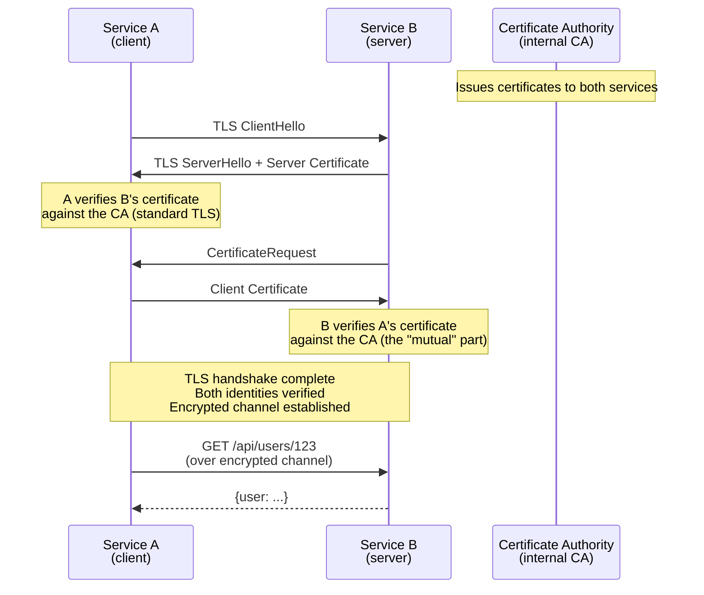
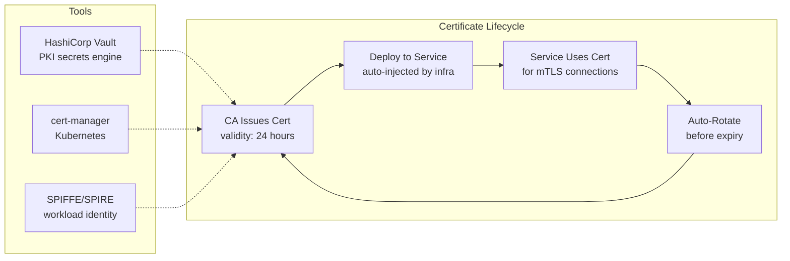

## mTLS (Mutual TLS)

### The Problem It Solves

Standard TLS (HTTPS) verifies that the **server** is who it claims to be — the client checks the server's certificate. But the server doesn't verify the client's identity at the TLS level. Any client that can reach the endpoint can send requests.

For internal microservices, you need **both sides** to prove their identity: Service A must prove it's Service A before Service B accepts its request. This is the **authentication** part of zero-trust networking.

### Why mTLS for Internal Services?

| Property | Why it matters |
|----------|---------------|
| **Identity at the transport layer** | The service identity is proven *before* any application code runs — the TLS handshake itself is the authentication |
| **No shared secrets in application code** | Unlike API keys or JWTs, there's no token to leak in logs, environment variables, or error messages |
| **Certificate rotation is automated** | Tools like cert-manager (Kubernetes), Vault, or SPIFFE/SPIRE auto-rotate certificates without deploys |
| **Works with any protocol** | gRPC, HTTP, TCP — anything that runs over TLS. Protocol-agnostic |
| **Service mesh integration** | Istio/Envoy sidecar proxies handle mTLS transparently — application code is unaware |

### Certificate Management at Scale

**Short-lived certificates** (hours, not years) are the modern best practice. If a certificate is compromised, it expires before the attacker can exploit it. This eliminates the need for a Certificate Revocation List (CRL) or OCSP — the certificate simply stops working.

### When mTLS Is Overkill

mTLS adds complexity: certificate authority setup, cert distribution, rotation automation, and debugging TLS handshake failures. For simpler internal service communication, **JWT with short expiry** is often sufficient and easier to operate.

## Test Your Understanding


**Client authentication.** In standard TLS the *client* verifies the *server's* certificate, but the server accepts any client that can reach it — it has no cryptographic proof of who's calling. mTLS adds the reverse leg: the server also requests and verifies the client's certificate against the shared CA. Now both ends prove identity *before* any application code runs.

**Why it matters for zero-trust:** Service B can enforce 'only Service A may call me' at the transport layer, instead of trusting a network boundary or an easily-forwarded bearer token.



**No — short lifetimes *are* the revocation mechanism.** A compromised cert is useful only until it expires, and 24 hours later it simply stops working with no action needed. That sidesteps CRL/OCSP entirely, which are notoriously painful operationally (distribution lag, soft-fail behavior, extra round-trips).

**The catch:** it only works if issuance and rotation are automated (Vault, cert-manager, SPIFFE/SPIRE). If rotation is manual, short lifetimes cause outages instead — the very reason long-lived certs (and thus CRLs) existed in the first place.

