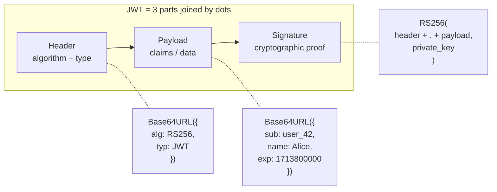
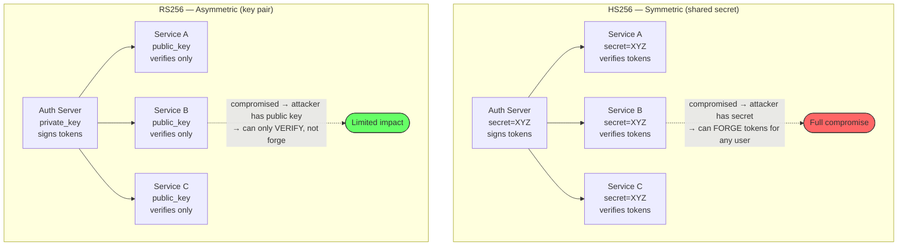
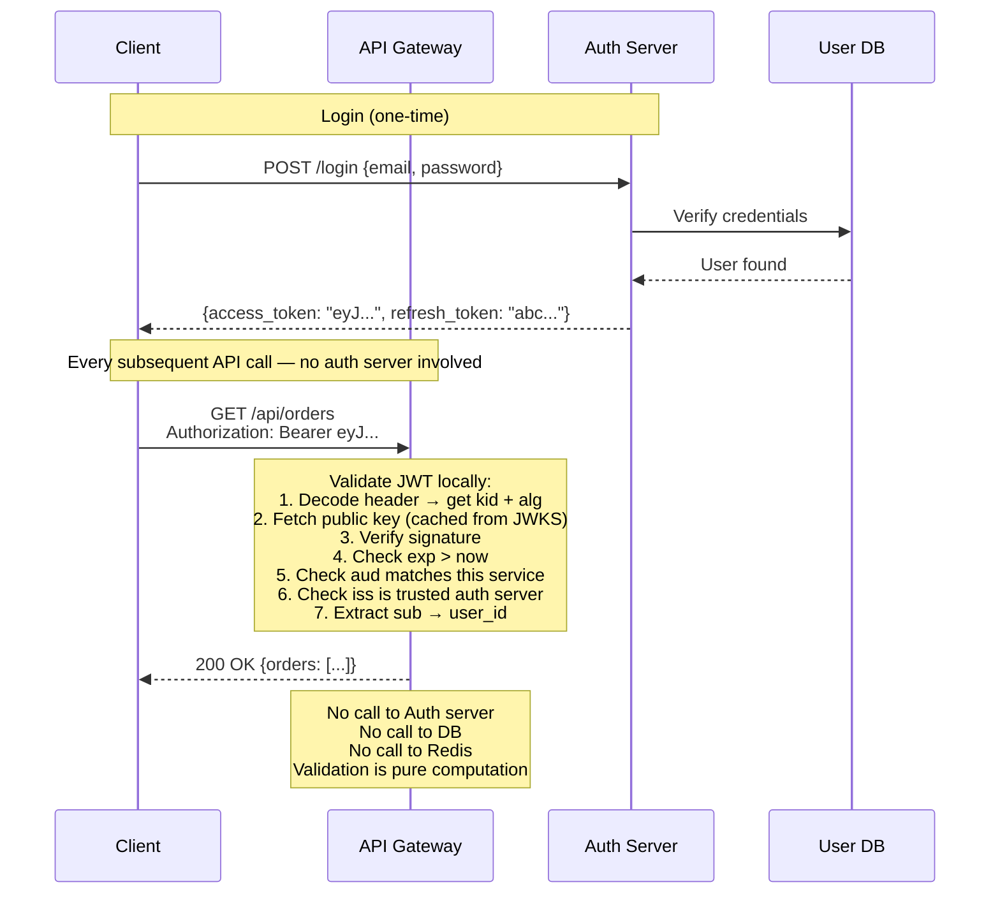
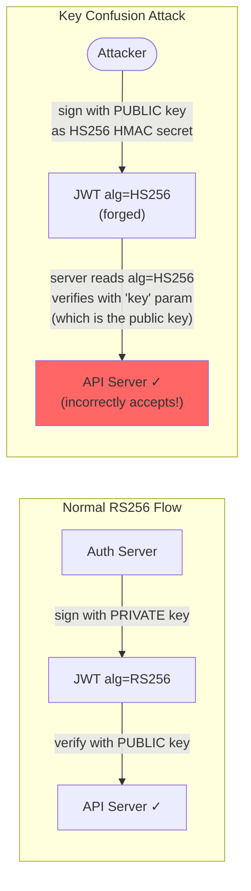
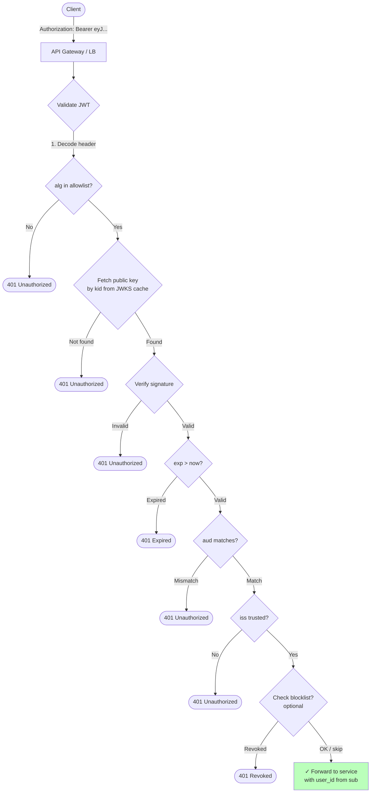

Your web application has 20 servers behind a load balancer. A user logs in on server 3, and their next request lands on server 11. How does server 11 know this user is authenticated? With traditional sessions, server 3 stored the session in memory — server 11 has no idea who this user is. You could use a shared session store (Redis), but now every single API request requires a round-trip to Redis. At 100K requests per second, that's 100K Redis lookups per second — just for authentication. **JWTs solve this by encoding the authentication proof into the token itself**, so any server can verify it locally with zero external calls.

## The Problem: Stateful Sessions Don't Scale

```mermaid
flowchart TB
    subgraph "Stateful Sessions (the problem)"
        C1([User]) -->|"request + session_id=abc"| LB1[Load Balancer]
        LB1 --> S1[Server 1<br/>sessions: {abc: user_42}]
        LB1 --> S2[Server 2<br/>sessions: {}]
        LB1 --> S3[Server 3<br/>sessions: {}]
    end

    subgraph "Problem: request routed to Server 2"
        S2 -->|"session abc not found<br/>→ 401 Unauthorized"| C1
    end
```

**Three ways to fix this, each with trade-offs:**

| Approach | How it works | Problem |
|----------|-------------|---------|
| **Sticky sessions** | LB routes same user to same server | Server crash loses all sessions; uneven load |
| **Shared session store** | All servers read from Redis/Memcached | Every request needs a DB round-trip; Redis is a SPOF |
| **Self-contained token (JWT)** | Token carries the proof; any server validates locally | Token can't be revoked before expiry (without extra infra) |

JWT chooses the third approach: **move the session data into the token itself**, signed cryptographically so it can't be tampered with. Any server with the signing key (or public key) can validate the token — no shared state, no external calls.

## JWT Structure

A JWT is three Base64URL-encoded segments separated by dots:

```
header.payload.signature

eyJhbGciOiJSUzI1NiIsInR5cCI6IkpXVCJ9.
eyJzdWIiOiJ1c2VyXzQyIiwibmFtZSI6IkFsaWNlIiwiaWF0IjoxNzEzNzk5MTAwLCJleHAiOjE3MTM4MDAwMDB9.
SflKxwRJSMeKKF2QT4fwpMeJf36POk6yJV_adQssw5c
```



### Header

The header declares the signing algorithm and token type:

```json
{
  "alg": "RS256",
  "typ": "JWT",
  "kid": "key-2024-01"
}
```

- `alg`: the algorithm used to create the signature (HS256, RS256, ES256, etc.)
- `typ`: always "JWT"
- `kid` (optional): key ID — tells the verifier which key was used for signing (essential when rotating keys)

### Payload (Claims)

The payload contains **claims** — key-value pairs of data. JWT defines standard registered claims plus any custom claims you need:

```json
{
  "iss": "https://auth.example.com",
  "sub": "user_42",
  "aud": "https://api.example.com",
  "exp": 1713800000,
  "iat": 1713799100,
  "jti": "a1b2c3d4-unique-id",
  "name": "Alice Smith",
  "role": "admin",
  "scope": "read write"
}
```

| Claim | Name | Purpose | Why it matters |
|-------|------|---------|---------------|
| `iss` | Issuer | Who created this token | Prevents accepting tokens from untrusted auth servers |
| `sub` | Subject | Who the token represents (user ID) | Identifies the user across requests |
| `aud` | Audience | Who this token is intended for | Prevents a token for App A from being used at App B |
| `exp` | Expiration | When the token becomes invalid | Without this, a stolen token works forever |
| `iat` | Issued At | When the token was created | Detect tokens issued before a security event |
| `nbf` | Not Before | Token isn't valid until this time | For tokens pre-issued before a launch |
| `jti` | JWT ID | Unique identifier for this token | Enables revocation via blocklist and replay detection |

### Signature

The signature ensures **integrity and authenticity**: if anyone modifies the header or payload, the signature won't match, and the token is rejected.

```
Signature = Algorithm(
    Base64URL(header) + "." + Base64URL(payload),
    key
)
```

The key depends on the algorithm — and the algorithm choice is one of the most consequential decisions in JWT architecture.

## Signing Algorithms: HS256 vs RS256

### The Problem Each Solves

**HS256 (HMAC-SHA256):** Symmetric — the same secret key signs and verifies. Simple, but every service that needs to verify tokens must have the secret. If any one of 20 microservices is compromised, the attacker can **forge** tokens.

**RS256 (RSA-SHA256):** Asymmetric — a private key signs, a public key verifies. Only the auth server holds the private key. All other services verify with the public key, which is safe to distribute. A compromised microservice can verify tokens but **cannot forge** them.



```python
import jwt
import time
from cryptography.hazmat.primitives.asymmetric import rsa
from cryptography.hazmat.primitives import serialization

# ===== HS256 (Symmetric) =====

SHARED_SECRET = "super-secret-key-shared-everywhere"

def create_token_hs256(user_id: str, role: str) -> str:
    payload = {
        "sub": user_id,
        "role": role,
        "iat": int(time.time()),
        "exp": int(time.time()) + 900,  # 15 minutes
    }
    return jwt.encode(payload, SHARED_SECRET, algorithm="HS256")

def verify_token_hs256(token: str) -> dict:
    return jwt.decode(token, SHARED_SECRET, algorithms=["HS256"])


# ===== RS256 (Asymmetric) =====

# Auth server generates and holds the private key
private_key = rsa.generate_private_key(
    public_exponent=65537, key_size=2048
)
# Public key distributed to all verifying services
public_key = private_key.public_key()

def create_token_rs256(user_id: str, role: str) -> str:
    """Only the auth server can sign — it has the private key."""
    payload = {
        "sub": user_id,
        "role": role,
        "iss": "https://auth.example.com",
        "aud": "https://api.example.com",
        "iat": int(time.time()),
        "exp": int(time.time()) + 900,
        "jti": str(uuid.uuid4()),
    }
    return jwt.encode(payload, private_key, algorithm="RS256")

def verify_token_rs256(token: str) -> dict:
    """Any service can verify — only needs the public key."""
    return jwt.decode(
        token, public_key,
        algorithms=["RS256"],           # explicit algorithm
        audience="https://api.example.com",  # validate audience
        issuer="https://auth.example.com",   # validate issuer
    )
```

### Algorithm Comparison

| Property | HS256 (Symmetric) | RS256 (Asymmetric) |
|----------|-------------------|-------------------|
| **Key model** | One shared secret for sign + verify | Private key signs, public key verifies |
| **Key distribution** | Secret must be on every verifier (risky) | Only public key on verifiers (safe) |
| **Compromise impact** | Any compromised service can forge tokens | Only auth server compromise allows forging |
| **Performance** | Faster (~10µs sign, ~10µs verify) | Slower (~1ms sign, ~50µs verify) |
| **Key rotation** | Must update secret on all services simultaneously | Rotate private key; publish new public key via JWKS |
| **Best for** | Single-service systems, internal tools | Distributed microservices, third-party verification |

### JWKS: Publishing Public Keys

In RS256 systems, the auth server publishes its public keys at a **JWKS (JSON Web Key Set)** endpoint. Verifying services fetch keys from this endpoint and cache them.

```json
// GET https://auth.example.com/.well-known/jwks.json
{
  "keys": [
    {
      "kty": "RSA",
      "kid": "key-2024-01",
      "use": "sig",
      "n": "0vx7agoebGcQ...",
      "e": "AQAB"
    },
    {
      "kty": "RSA",
      "kid": "key-2024-02",
      "use": "sig",
      "n": "1b9x2aGhcQL...",
      "e": "AQAB"
    }
  ]
}
```

The `kid` in the JWT header tells the verifier which key in the JWKS to use. This enables **seamless key rotation**: publish a new key, start signing with it, and verifiers automatically pick it up from the JWKS endpoint. Old tokens signed with the previous key remain valid until they expire.

## Stateless Authentication: How Validation Works

This is the core benefit of JWTs — **zero external calls to validate a request**:



```python
import time

class JWTValidator:
    """Stateless JWT validation — no external calls needed."""

    def __init__(self, jwks_client, expected_issuer: str,
                 expected_audience: str):
        self.jwks = jwks_client  # caches public keys from JWKS endpoint
        self.issuer = expected_issuer
        self.audience = expected_audience

    def validate(self, token: str) -> dict:
        """Validate JWT and return claims. Raises on any failure."""

        # 1. Decode header WITHOUT verifying (to get kid and alg)
        unverified_header = jwt.get_unverified_header(token)
        kid = unverified_header.get("kid")
        alg = unverified_header.get("alg")

        # 2. CRITICAL: reject 'none' algorithm
        if alg is None or alg.lower() == "none":
            raise SecurityError("Algorithm 'none' is not allowed")

        # 3. CRITICAL: only allow expected algorithms
        if alg not in ["RS256", "ES256"]:
            raise SecurityError(f"Algorithm '{alg}' is not allowed")

        # 4. Get the signing key from JWKS
        public_key = self.jwks.get_key(kid)
        if not public_key:
            raise SecurityError(f"Unknown key ID: {kid}")

        # 5. Verify signature, expiry, issuer, audience
        try:
            claims = jwt.decode(
                token,
                public_key,
                algorithms=["RS256", "ES256"],  # allowlist, not from header
                audience=self.audience,
                issuer=self.issuer,
                options={
                    "require": ["exp", "iat", "sub", "iss", "aud"],
                },
            )
        except jwt.ExpiredSignatureError:
            raise AuthenticationError("Token has expired")
        except jwt.InvalidAudienceError:
            raise AuthenticationError("Token audience mismatch")
        except jwt.InvalidIssuerError:
            raise AuthenticationError("Token issuer not trusted")
        except jwt.InvalidSignatureError:
            raise SecurityError("Token signature is invalid")

        return claims
```

### Session Store vs JWT: Performance at Scale

```
Shared session store (Redis):
  100K requests/second × 1 Redis lookup each = 100K Redis ops/s
  Latency: +0.5–2ms per request (network round-trip to Redis)
  Failure mode: Redis down → all auth fails

JWT (stateless):
  100K requests/second × 0 external calls = 0 Redis ops/s
  Latency: +50µs per request (local cryptographic verification)
  Failure mode: nothing to fail — pure computation

  Performance gain: ~20–40× less latency for auth per request
  Operational gain: no session store to scale, replicate, or monitor
```

## JWT Security Pitfalls

JWTs are secure **when implemented correctly**, but several common mistakes create critical vulnerabilities.

### Pitfall 1: The `alg: none` Attack

#### The Problem

The JWT spec defines `"alg": "none"` for unsigned tokens (used in development). If a server naively reads the algorithm from the token header and uses it for verification, an attacker can:

1. Take a valid token
2. Modify the payload (change `role: "user"` to `role: "admin"`)
3. Set the header to `"alg": "none"`
4. Remove the signature
5. The server "verifies" with algorithm `none` — which always succeeds

```
Original token (signed):
  Header:    {"alg": "RS256", "kid": "key-1"}
  Payload:   {"sub": "user_42", "role": "user"}
  Signature: [valid RSA signature]

Attacker-modified token:
  Header:    {"alg": "none"}
  Payload:   {"sub": "user_42", "role": "admin"}  ← elevated privileges
  Signature: [empty]

Vulnerable server reads alg from header → "none" → no verification → accepts!
```

#### The Fix

**Never read the algorithm from the token.** Always specify the allowed algorithms in your verification code:

```python
# VULNERABLE — reads algorithm from token header
claims = jwt.decode(token, key, algorithms=jwt.get_unverified_header(token)["alg"])

# SECURE — explicit algorithm allowlist
claims = jwt.decode(token, key, algorithms=["RS256"])
```

### Pitfall 2: Key Confusion (HS256 / RS256 Mix-Up)

#### The Problem

An RS256 system uses a public/private key pair. The public key is published (JWKS). An attacker:

1. Downloads the public key from the JWKS endpoint
2. Creates a token signed with HS256 using the **public key as the HMAC secret**
3. Sends the token to the server

If the server reads `"alg": "HS256"` from the header and verifies using HS256 with the same "key" (which happens to be the public key string), the signature matches — because HMAC(payload, public_key) is valid when checked with HMAC(payload, public_key).



#### The Fix

**Never let the token dictate the algorithm.** Hardcode the expected algorithm and key type:

```python
# VULNERABLE — flexible algorithm from token
claims = jwt.decode(token, key)  # library picks algorithm from header

# SECURE — explicit algorithm, correct key type
claims = jwt.decode(token, rsa_public_key, algorithms=["RS256"])
# If attacker sends alg=HS256, library rejects it because
# the key is an RSA public key, not an HMAC secret
```

### Pitfall 3: Missing Audience Validation

#### The Problem

Two services (App A and App B) trust the same auth server. A user authenticates with App A and receives a JWT. The attacker takes that JWT and sends it to App B's API. Without audience validation, App B accepts it — because the signature is valid and the issuer is trusted.

```
User authenticates with App A → JWT {aud: "app-a.com", sub: "user_42"}
Attacker sends this JWT to App B's API
App B checks: signature valid? ✓  issuer trusted? ✓  not expired? ✓
App B does NOT check: aud == "app-b.com"? ✗
→ App B accepts the token — user_42 gains access to App B without authorization
```

#### The Fix

Always validate `aud`:

```python
claims = jwt.decode(
    token, key,
    algorithms=["RS256"],
    audience="https://api.app-b.com",  # MUST match the aud claim
)
# Token with aud="https://api.app-a.com" will be rejected
```

### Pitfall 4: Tokens That Live Too Long

#### The Problem

A JWT with `exp` set to 30 days is essentially a session cookie with no server-side revocation. If stolen, the attacker has 30 days of access. Unlike a session ID, you can't delete it from a database to revoke it.

#### The Fix

Short expiry (5–15 minutes) + refresh token (covered in the OAuth 2.0 & OIDC post). The short window limits the damage of a stolen access token.

### Pitfall 5: Storing Sensitive Data in the Payload

#### The Problem

JWTs are **signed, not encrypted**. The payload is Base64URL-encoded — anyone can decode it. Do not put passwords, SSNs, credit card numbers, or other secrets in the payload.

```python
import base64, json

token = "eyJhbGciOiJSUzI1NiJ9.eyJzdWIiOiJ1c2VyXzQyIiwic3NuIjoiMTIzLTQ1LTY3ODkifQ.signature"

# Anyone can read the payload — no key needed:
payload = token.split(".")[1]
# Add padding for Base64
payload += "=" * (4 - len(payload) % 4)
data = json.loads(base64.urlsafe_b64decode(payload))
print(data)  # {"sub": "user_42", "ssn": "123-45-6789"} ← exposed!
```

**Rule:** Only put data in the JWT that you'd be comfortable putting in an HTTP header. Use JWE (JSON Web Encryption) if you truly need encrypted tokens — but consider whether the data belongs in the token at all.

## JWT in the Request Pipeline



## Token Size Considerations

JWTs grow with every claim you add. Since the token is sent in the `Authorization` header of **every request**, size matters:

```
Minimal JWT (sub + exp only):     ~200 bytes
Typical JWT (standard claims):     ~400 bytes
Heavy JWT (roles, permissions):    ~800 bytes
Excessive JWT (full user profile): ~2 KB+

HTTP header size limits:
  - Most servers: 8 KB default (nginx, Apache)
  - AWS ALB: 16 KB total headers
  - Cloudflare: 16 KB total headers

At 2 KB per token × 100K requests/second = 200 MB/s of bandwidth just for auth headers
```


**Keep JWTs lean.** Include only the claims needed for authorization decisions (user ID, role, scopes). Do not embed full user profiles, permission lists, or org hierarchies. If a service needs detailed user data, fetch it from a user service using the `sub` claim — don't bloat every HTTP request.


## JWT vs Opaque Tokens vs Sessions

| Property | JWT (self-contained) | Opaque token (reference) | Server-side session |
|----------|---------------------|--------------------------|-------------------|
| **Validation** | Local (cryptographic) | Remote (introspection endpoint or DB lookup) | Remote (session store lookup) |
| **Latency** | ~50µs (CPU only) | +1–20ms (network call) | +0.5–2ms (Redis call) |
| **Revocation** | Hard (need blocklist) | Easy (delete from DB) | Easy (delete from store) |
| **Scalability** | Excellent (stateless) | Good (centralized token store) | Moderate (shared session store) |
| **Token size** | 400–800 bytes | 32–64 bytes (just a random string) | 32 bytes (session ID cookie) |
| **Data in token** | Claims visible to client | Nothing — server looks up data | Nothing — server looks up data |
| **Best for** | Microservices, cross-domain APIs, mobile apps | When instant revocation is required | Traditional server-rendered web apps |


**Interview tip:** When discussing authentication in a system design interview, say: "I'd use JWTs for stateless authentication. The auth server issues a short-lived RS256-signed JWT (15-minute expiry) containing the user ID, role, and audience claim. API servers validate the token locally by checking the signature against the public key cached from the JWKS endpoint — no DB or Redis round-trip per request. RS256 over HS256 because only the auth server needs the private key; compromising an API server doesn't let attackers forge tokens. I'd always validate `aud` to prevent cross-service token misuse, hardcode the algorithm allowlist to prevent the `alg: none` and key-confusion attacks, and keep the payload minimal — just `sub`, `role`, `scope`, `exp`, and `aud`. For revocation, short token TTL handles most cases; for instant revocation (compromised account), I'd add a Redis-backed JTI blocklist checked by the API gateway." This covers the mechanism, key management, all three pitfalls, and the revocation trade-off — exactly what interviewers probe.

