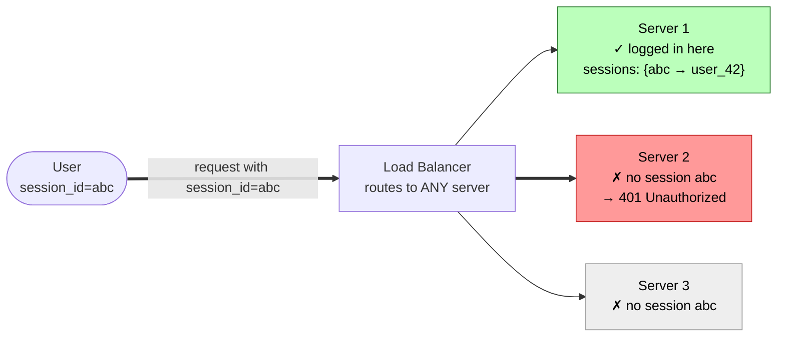

Your web application has 20 servers behind a load balancer. A user logs in on server 3, and their next request lands on server 11. How does server 11 know this user is authenticated? With traditional sessions, server 3 stored the session in memory — server 11 has no idea who this user is. You could use a shared session store (Redis), but now every single API request requires a round-trip to Redis. At 100K requests per second, that's 100K Redis lookups per second — just for authentication. **JWTs solve this by encoding the authentication proof into the token itself**, so any server can verify it locally with zero external calls.

## The Problem: Stateful Sessions Don't Scale

**Three ways to fix this, each with trade-offs:**

| Approach | How it works | Problem |
|----------|-------------|---------|
| **Sticky sessions** | LB routes same user to same server | Server crash loses all sessions; uneven load |
| **Shared session store** | All servers read from Redis/Memcached | Every request needs a DB round-trip; Redis is a SPOF |
| **Self-contained token (JWT)** | Token carries the proof; any server validates locally | Token can't be revoked before expiry (without extra infra) |

JWT chooses the third approach: **move the session data into the token itself**, signed cryptographically so it can't be tampered with. Any server with the signing key (or public key) can validate the token — no shared state, no external calls.

## Test Your Understanding


**Every user pinned to a restarting server is logged out.** Sticky sessions keep the session in one server's memory, so when a rolling deploy (or a crash, or a scale-down) removes that server, the sessions that lived only there vanish. You also get uneven load: long-lived users pile onto a few "hot" servers while freshly added ones sit idle, because existing users stay pinned.

**Why JWT sidesteps this:** the proof travels inside the token, so any server can serve any request. Deploys, crashes, and autoscaling become invisible to authenticated users.



**Instant, server-side revocation.** With a session store, logging a user out (or killing a stolen session) is a single delete — the very next request fails because the entry is gone. A JWT is validated locally with no lookup, so a still-valid-but-unwanted token keeps working until it expires.

**Designing around it:** short access-token TTLs (5–15 min) to shrink the exposure window, a revocable refresh token, and — only if you need an instant kill — a JTI blocklist checked at the gateway (which trades back some of the statelessness).

