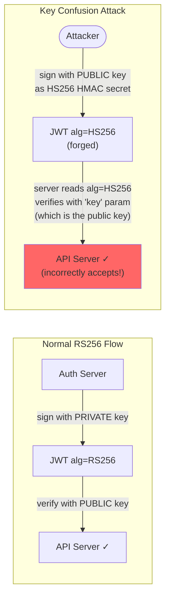
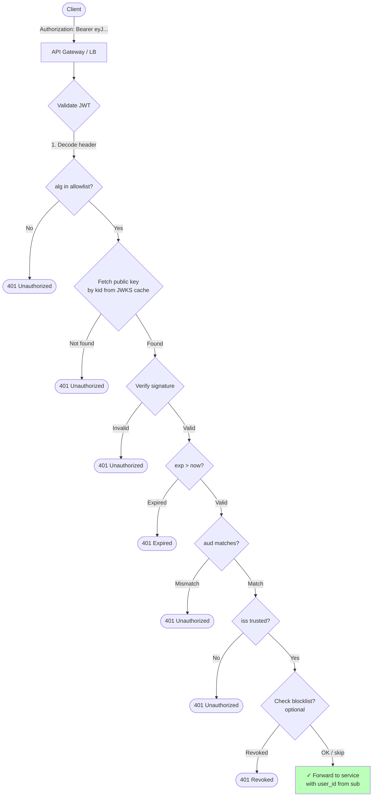

## JWT Security Pitfalls

JWTs are secure **when implemented correctly**, but several common mistakes create critical vulnerabilities.

### Pitfall 1: The `alg: none` Attack

#### The Problem

The JWT spec defines `"alg": "none"` for unsigned tokens (used in development). If a server naively reads the algorithm from the token header and uses it for verification, an attacker can:

1. Take a valid token
2. Modify the payload (change `role: "user"` to `role: "admin"`)
3. Set the header to `"alg": "none"`
4. Remove the signature
5. The server "verifies" with algorithm `none` — which always succeeds

```
Original token (signed):
  Header:    {"alg": "RS256", "kid": "key-1"}
  Payload:   {"sub": "user_42", "role": "user"}
  Signature: [valid RSA signature]

Attacker-modified token:
  Header:    {"alg": "none"}
  Payload:   {"sub": "user_42", "role": "admin"}  ← elevated privileges
  Signature: [empty]

Vulnerable server reads alg from header → "none" → no verification → accepts!
```

#### The Fix

**Never read the algorithm from the token.** Always specify the allowed algorithms in your verification code:

```python
# VULNERABLE — reads algorithm from token header
claims = jwt.decode(token, key, algorithms=jwt.get_unverified_header(token)["alg"])

# SECURE — explicit algorithm allowlist
claims = jwt.decode(token, key, algorithms=["RS256"])
```

### Pitfall 2: Key Confusion (HS256 / RS256 Mix-Up)

#### The Problem

An RS256 system uses a public/private key pair. The public key is published (JWKS). An attacker:

1. Downloads the public key from the JWKS endpoint
2. Creates a token signed with HS256 using the **public key as the HMAC secret**
3. Sends the token to the server

If the server reads `"alg": "HS256"` from the header and verifies using HS256 with the same "key" (which happens to be the public key string), the signature matches — because HMAC(payload, public_key) is valid when checked with HMAC(payload, public_key).



#### The Fix

**Never let the token dictate the algorithm.** Hardcode the expected algorithm and key type:

```python
# VULNERABLE — flexible algorithm from token
claims = jwt.decode(token, key)  # library picks algorithm from header

# SECURE — explicit algorithm, correct key type
claims = jwt.decode(token, rsa_public_key, algorithms=["RS256"])
# If attacker sends alg=HS256, library rejects it because
# the key is an RSA public key, not an HMAC secret
```

### Pitfall 3: Missing Audience Validation

#### The Problem

Two services (App A and App B) trust the same auth server. A user authenticates with App A and receives a JWT. The attacker takes that JWT and sends it to App B's API. Without audience validation, App B accepts it — because the signature is valid and the issuer is trusted.

```
User authenticates with App A → JWT {aud: "app-a.com", sub: "user_42"}
Attacker sends this JWT to App B's API
App B checks: signature valid? ✓  issuer trusted? ✓  not expired? ✓
App B does NOT check: aud == "app-b.com"? ✗
→ App B accepts the token — user_42 gains access to App B without authorization
```

#### The Fix

Always validate `aud`:

```python
claims = jwt.decode(
    token, key,
    algorithms=["RS256"],
    audience="https://api.app-b.com",  # MUST match the aud claim
)
# Token with aud="https://api.app-a.com" will be rejected
```

### Pitfall 4: Tokens That Live Too Long

#### The Problem

A JWT with `exp` set to 30 days is essentially a session cookie with no server-side revocation. If stolen, the attacker has 30 days of access. Unlike a session ID, you can't delete it from a database to revoke it.

#### The Fix

Short expiry (5–15 minutes) + refresh token (covered in the OAuth 2.0 & OIDC post). The short window limits the damage of a stolen access token.

### Pitfall 5: Storing Sensitive Data in the Payload

#### The Problem

JWTs are **signed, not encrypted**. The payload is Base64URL-encoded — anyone can decode it. Do not put passwords, SSNs, credit card numbers, or other secrets in the payload.

```python
import base64, json

token = "eyJhbGciOiJSUzI1NiJ9.eyJzdWIiOiJ1c2VyXzQyIiwic3NuIjoiMTIzLTQ1LTY3ODkifQ.signature"

# Anyone can read the payload — no key needed:
payload = token.split(".")[1]
# Add padding for Base64
payload += "=" * (4 - len(payload) % 4)
data = json.loads(base64.urlsafe_b64decode(payload))
print(data)  # {"sub": "user_42", "ssn": "123-45-6789"} ← exposed!
```

**Rule:** Only put data in the JWT that you'd be comfortable putting in an HTTP header. Use JWE (JSON Web Encryption) if you truly need encrypted tokens — but consider whether the data belongs in the token at all.

## JWT in the Request Pipeline



## Test Your Understanding


**Missing audience validation.** Without `aud`, any service that trusts the same signing key accepts the token. The payment JWT works everywhere — effectively a skeleton key.

**Fix:** Include `aud: "payment-api"` in the token. Each service validates that `aud` matches itself. The admin API rejects tokens with `aud: "payment-api"` even though the signature is valid. This is **cross-service token misuse** — one of the most common JWT security gaps.



**The `alg: none` attack.** Some JWT libraries accept `alg: none` (no signature) if the server doesn't explicitly restrict allowed algorithms. The attacker: (1) Decodes the JWT, (2) changes `alg` to `none`, (3) modifies the payload (e.g., `role: admin`), (4) removes the signature, (5) sends it. A vulnerable library sees `alg: none`, skips verification, and trusts the payload.

**Fix:** **Hardcode the allowed algorithm list** server-side — never derive it from the token's `alg` header. E.g., `allowedAlgorithms: ["RS256"]`. Reject any token with a different `alg`. This also prevents the **key confusion attack** where an attacker sets `alg: HS256` and signs with the RS256 public key (which is publicly available).



**A 30-day JWT is an un-revocable 30-day password.** JWTs are validated locally with no server lookup, so there's no delete-to-revoke. A token stolen on day 1 grants access until day 30 — through password changes, logouts, everything. The smooth UX hides an enormous blast radius.

**Fix:** short-lived access token (5–15 min) + a long-lived **refresh token** that *is* stored server-side and revocable. Users still get seamless sessions via silent refresh, but a stolen access token dies in minutes and you can kill the refresh token instantly.

