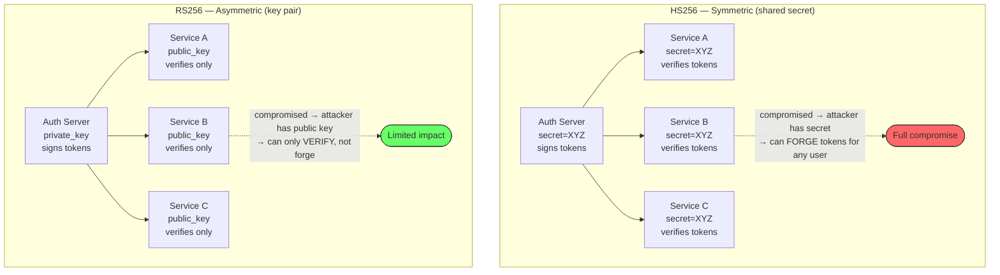

## Signing Algorithms: HS256 vs RS256

### The Problem Each Solves

**HS256 (HMAC-SHA256):** Symmetric — the same secret key signs and verifies. Simple, but every service that needs to verify tokens must have the secret. If any one of 20 microservices is compromised, the attacker can **forge** tokens.

**RS256 (RSA-SHA256):** Asymmetric — a private key signs, a public key verifies. Only the auth server holds the private key. All other services verify with the public key, which is safe to distribute. A compromised microservice can verify tokens but **cannot forge** them.



```python
import jwt
import time
import uuid
from cryptography.hazmat.primitives.asymmetric import rsa
from cryptography.hazmat.primitives import serialization

# ===== HS256 (Symmetric) =====

SHARED_SECRET = "super-secret-key-shared-everywhere"

def create_token_hs256(user_id: str, role: str) -> str:
    payload = {
        "sub": user_id,
        "role": role,
        "iat": int(time.time()),
        "exp": int(time.time()) + 900,  # 15 minutes
    }
    return jwt.encode(payload, SHARED_SECRET, algorithm="HS256")

def verify_token_hs256(token: str) -> dict:
    return jwt.decode(token, SHARED_SECRET, algorithms=["HS256"])


# ===== RS256 (Asymmetric) =====

# Auth server generates and holds the private key
private_key = rsa.generate_private_key(
    public_exponent=65537, key_size=2048
)
# Public key distributed to all verifying services
public_key = private_key.public_key()

def create_token_rs256(user_id: str, role: str) -> str:
    """Only the auth server can sign — it has the private key."""
    payload = {
        "sub": user_id,
        "role": role,
        "iss": "https://auth.example.com",
        "aud": "https://api.example.com",
        "iat": int(time.time()),
        "exp": int(time.time()) + 900,
        "jti": str(uuid.uuid4()),
    }
    return jwt.encode(payload, private_key, algorithm="RS256")

def verify_token_rs256(token: str) -> dict:
    """Any service can verify — only needs the public key."""
    return jwt.decode(
        token, public_key,
        algorithms=["RS256"],           # explicit algorithm
        audience="https://api.example.com",  # validate audience
        issuer="https://auth.example.com",   # validate issuer
    )
```

### Algorithm Comparison

| Property | HS256 (Symmetric) | RS256 (Asymmetric) |
|----------|-------------------|-------------------|
| **Key model** | One shared secret for sign + verify | Private key signs, public key verifies |
| **Key distribution** | Secret must be on every verifier (risky) | Only public key on verifiers (safe) |
| **Compromise impact** | Any compromised service can forge tokens | Only auth server compromise allows forging |
| **Performance** | Faster (~10µs sign, ~10µs verify) | Slower (~1ms sign, ~50µs verify) |
| **Key rotation** | Must update secret on all services simultaneously | Rotate private key; publish new public key via JWKS |
| **Best for** | Single-service systems, internal tools | Distributed microservices, third-party verification |

### JWKS: Publishing Public Keys

In RS256 systems, the auth server publishes its public keys at a **JWKS (JSON Web Key Set)** endpoint. Verifying services fetch keys from this endpoint and cache them.

```json
// GET https://auth.example.com/.well-known/jwks.json
{
  "keys": [
    {
      "kty": "RSA",
      "kid": "key-2024-01",
      "use": "sig",
      "n": "0vx7agoebGcQ...",
      "e": "AQAB"
    },
    {
      "kty": "RSA",
      "kid": "key-2024-02",
      "use": "sig",
      "n": "1b9x2aGhcQL...",
      "e": "AQAB"
    }
  ]
}
```

The `kid` in the JWT header tells the verifier which key in the JWKS to use. This enables **seamless key rotation**: publish a new key, start signing with it, and verifiers automatically pick it up from the JWKS endpoint. Old tokens signed with the previous key remain valid until they expire.

## Test Your Understanding


**Total compromise.** With HS256, the signing secret is the same key used for both signing and verification. The attacker can now **forge arbitrary JWTs** — create tokens for any user, any role, any scope. All 12 API servers trust these forged tokens because they share the same secret.

**Fix:** Use **RS256 (asymmetric).** The auth server holds the private key (signs). API servers hold only the public key (verifies). Compromising an API server gives the attacker the public key — which is already public. They can verify tokens but can't forge them. Only the auth server can sign.



**Keep both public keys in the JWKS, distinguished by `kid`.** Every token's header carries the `kid` of the key that signed it, so verifiers select the matching public key — old tokens resolve to the old key, new tokens to the new one, and both validate. Once the last old token has expired (minutes, for short-lived tokens), you drop the old key from the JWKS.

**The trap:** rotating by *replacing* the single key invalidates every outstanding token at once → mass logout. Overlapping keys via `kid` is exactly what makes rotation seamless.

