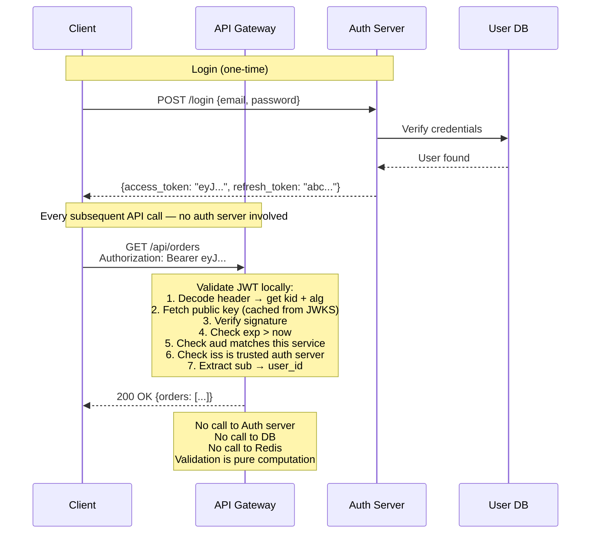

## Stateless Authentication: How Validation Works

This is the core benefit of JWTs — **zero external calls to validate a request**:



```python
import time

class JWTValidator:
    """Stateless JWT validation — no external calls needed."""

    def __init__(self, jwks_client, expected_issuer: str,
                 expected_audience: str):
        self.jwks = jwks_client  # caches public keys from JWKS endpoint
        self.issuer = expected_issuer
        self.audience = expected_audience

    def validate(self, token: str) -> dict:
        """Validate JWT and return claims. Raises on any failure."""

        # 1. Decode header WITHOUT verifying (to get kid and alg)
        unverified_header = jwt.get_unverified_header(token)
        kid = unverified_header.get("kid")
        alg = unverified_header.get("alg")

        # 2. CRITICAL: reject 'none' algorithm
        if alg is None or alg.lower() == "none":
            raise SecurityError("Algorithm 'none' is not allowed")

        # 3. CRITICAL: only allow expected algorithms
        if alg not in ["RS256", "ES256"]:
            raise SecurityError(f"Algorithm '{alg}' is not allowed")

        # 4. Get the signing key from JWKS
        public_key = self.jwks.get_key(kid)
        if not public_key:
            raise SecurityError(f"Unknown key ID: {kid}")

        # 5. Verify signature, expiry, issuer, audience
        try:
            claims = jwt.decode(
                token,
                public_key,
                algorithms=["RS256", "ES256"],  # allowlist, not from header
                audience=self.audience,
                issuer=self.issuer,
                options={
                    "require": ["exp", "iat", "sub", "iss", "aud"],
                },
            )
        except jwt.ExpiredSignatureError:
            raise AuthenticationError("Token has expired")
        except jwt.InvalidAudienceError:
            raise AuthenticationError("Token audience mismatch")
        except jwt.InvalidIssuerError:
            raise AuthenticationError("Token issuer not trusted")
        except jwt.InvalidSignatureError:
            raise SecurityError("Token signature is invalid")

        return claims
```

### Session Store vs JWT: Performance at Scale

```
Shared session store (Redis):
  100K requests/second × 1 Redis lookup each = 100K Redis ops/s
  Latency: +0.5–2ms per request (network round-trip to Redis)
  Failure mode: Redis down → all auth fails

JWT (stateless):
  100K requests/second × 0 external calls = 0 Redis ops/s
  Latency: +50µs per request (local cryptographic verification)
  Failure mode: nothing to fail — pure computation

  Performance gain: ~20–40× less latency for auth per request
  Operational gain: no session store to scale, replicate, or monitor
```

## Test Your Understanding


**No — the JWKS is fetched once and cached.** Public keys change only on rotation (rare), so verifiers pull the key set on startup (or the first time they see a new `kid`) and cache it in memory. Steady-state validation is signature check + claim checks — pure CPU, ~50µs, no network. A request triggers a fetch only the first time an unknown `kid` appears, after which it's cached again.

**Contrast:** session stores and token introspection hit the network on *every* request — the exact bottleneck JWTs remove.



**The JWT is a snapshot.** The role was baked into the token when it was issued; the gateway validates that token locally and never consults the database, so it can't see the change until a *new* token is issued (on the next refresh). That's the core trade-off of stateless auth: per-request freshness traded for zero-lookup speed.

**Mitigations:** short access-token TTL so stale claims self-correct quickly; for security-critical demotions, revoke the refresh token (blocks renewal) and/or add the token's JTI to a gateway blocklist for instant effect.

