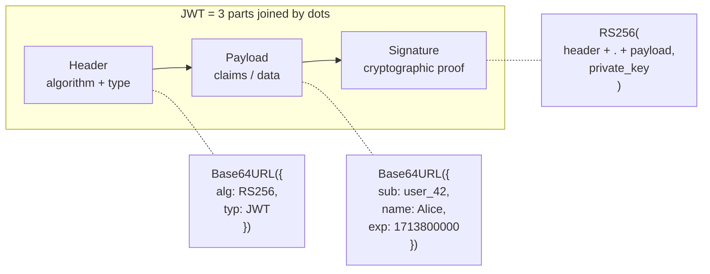

## JWT Structure

A JWT is three Base64URL-encoded segments separated by dots:

```
header.payload.signature

eyJhbGciOiJSUzI1NiIsInR5cCI6IkpXVCJ9.
eyJzdWIiOiJ1c2VyXzQyIiwibmFtZSI6IkFsaWNlIiwiaWF0IjoxNzEzNzk5MTAwLCJleHAiOjE3MTM4MDAwMDB9.
SflKxwRJSMeKKF2QT4fwpMeJf36POk6yJV_adQssw5c
```



### Header

The header declares the signing algorithm and token type:

```json
{
  "alg": "RS256",
  "typ": "JWT",
  "kid": "key-2024-01"
}
```

- `alg`: the algorithm used to create the signature (HS256, RS256, ES256, etc.)
- `typ`: always "JWT"
- `kid` (optional): key ID — tells the verifier which key was used for signing (essential when rotating keys)

### Payload (Claims)

The payload contains **claims** — key-value pairs of data. JWT defines standard registered claims plus any custom claims you need:

```json
{
  "iss": "https://auth.example.com",
  "sub": "user_42",
  "aud": "https://api.example.com",
  "exp": 1713800000,
  "iat": 1713799100,
  "jti": "a1b2c3d4-unique-id",
  "name": "Alice Smith",
  "role": "admin",
  "scope": "read write"
}
```

| Claim | Name | Purpose | Why it matters |
|-------|------|---------|---------------|
| `iss` | Issuer | Who created this token | Prevents accepting tokens from untrusted auth servers |
| `sub` | Subject | Who the token represents (user ID) | Identifies the user across requests |
| `aud` | Audience | Who this token is intended for | Prevents a token for App A from being used at App B |
| `exp` | Expiration | When the token becomes invalid | Without this, a stolen token works forever |
| `iat` | Issued At | When the token was created | Detect tokens issued before a security event |
| `nbf` | Not Before | Token isn't valid until this time | For tokens pre-issued before a launch |
| `jti` | JWT ID | Unique identifier for this token | Enables revocation via blocklist and replay detection |

### Signature

The signature ensures **integrity and authenticity**: if anyone modifies the header or payload, the signature won't match, and the token is rejected.

```
Signature = Algorithm(
    Base64URL(header) + "." + Base64URL(payload),
    key
)
```

The key depends on the algorithm — and the algorithm choice is one of the most consequential decisions in JWT architecture.

## Test Your Understanding

{{< details title="A developer pastes a JWT into a Base64 decoder, sees {'sub':'user_42','role':'admin'} in plaintext, and files a bug: 'our tokens aren't encrypted, anyone can read them.' Are they right?" closed="true" >}}
**Right that it's readable, wrong that it's a bug.** A JWT is **signed, not encrypted** — Base64URL is encoding, not encryption. The signature guarantees **integrity and authenticity** (nobody can alter the claims without invalidating it), not **confidentiality**. Anyone holding the token can read the payload.

**The real rule:** never put secrets (passwords, SSNs, card numbers) in the payload — treat it as public. If you genuinely need a confidential payload, use JWE (encrypted tokens), but first ask whether that data belongs in the token at all.



**The signature no longer matches.** It's computed over `Base64URL(header) + "." + Base64URL(payload)`; change one byte of the payload and the recomputed signature differs from the attached one. The verifier recomputes over the received header+payload and compares — mismatch → rejected.

**Why they can't re-sign:** re-signing needs the signing key — the shared secret (HS256) or the auth server's private key (RS256) — which they don't have. (Setting `alg` to `none` to skip the check is a separate attack, covered on the Security Pitfalls page.)

