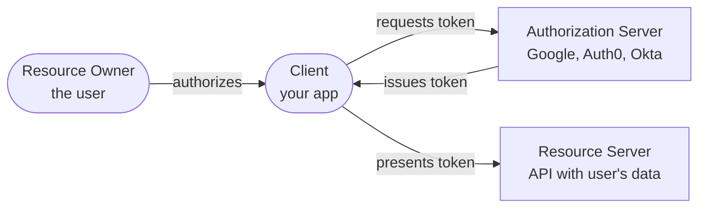
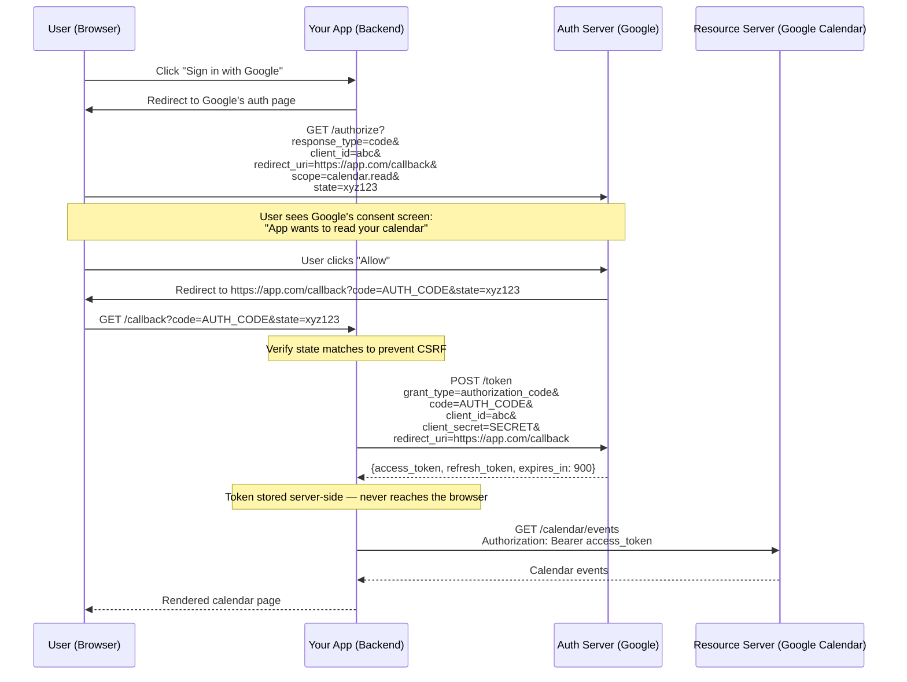
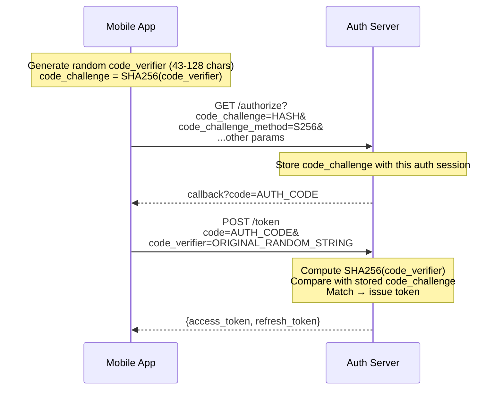
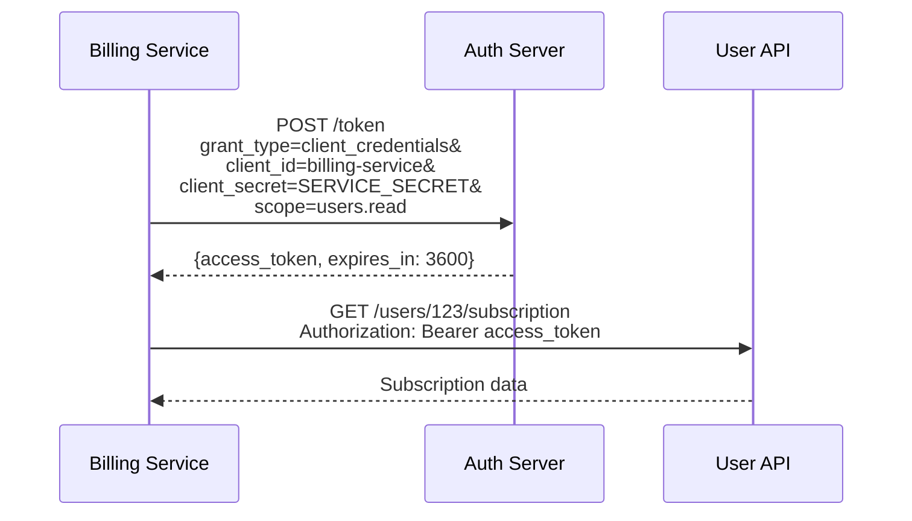
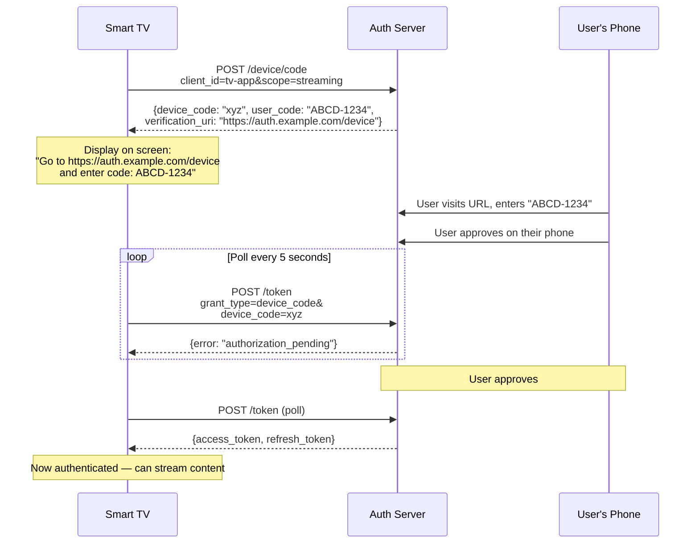
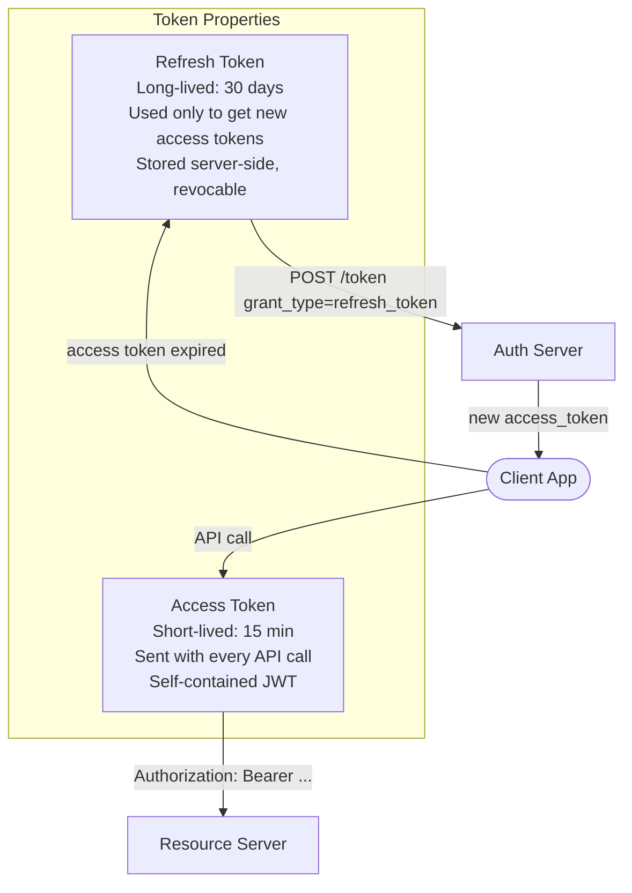
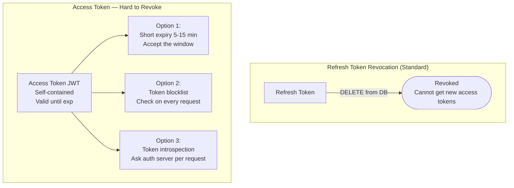
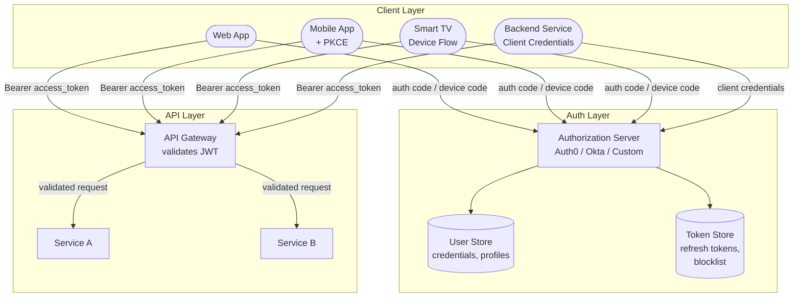

A user clicks "Sign in with Google" on your application. Within seconds, they're logged in — your app knows their name, email, and profile picture — without ever seeing their Google password. Meanwhile, a background microservice calls your billing API using its own credentials, with no user involved at all. And on a smart TV with no keyboard, a user types a short code displayed on screen into their phone to authorize a streaming app. **These are three completely different authentication scenarios, and OAuth 2.0 has a specific grant type designed for each one.**

## The Problem OAuth 2.0 Solves

Before OAuth, if a third-party app wanted to access your data on another service, you had to give that app **your password**. 

```
2007: Yelp wants to import your Gmail contacts to find friends

  Yelp: "Enter your Gmail email and password"
  User: enters gmail credentials into Yelp's form
  Yelp: logs into Gmail as the user, scrapes contacts

Problems:
  1. Yelp has your Gmail password — can read all your email
  2. You can't limit Yelp to "contacts only" — it has full access
  3. To revoke Yelp's access, you must change your Gmail password
     (which breaks every other app you shared it with)
  4. If Yelp is breached, your Gmail password is exposed
```

OAuth 2.0 solves this by introducing **delegated authorization**: the user grants a specific, limited permission to a third-party app without sharing their credentials. The app receives a **token** — not a password — that grants only the permissions the user approved, and the user can revoke it at any time without changing their password.

## Core Concepts

Before diving into flows, four roles appear in every OAuth interaction:



| Role | What it is | Example |
|------|-----------|---------|
| **Resource Owner** | The user who owns the data | You, with your Google account |
| **Client** | The application requesting access | Your web app, mobile app, or CLI tool |
| **Authorization Server** | Issues tokens after authenticating the user | Google's OAuth server, Auth0, Okta |
| **Resource Server** | The API that holds protected data | Google Calendar API, your company's user API |

## Grant Types: Matching the Flow to the Client

OAuth 2.0 defines multiple "grant types" — each is a different protocol flow optimized for a specific type of client. Using the wrong grant type creates security vulnerabilities.

### Authorization Code Grant (User-Facing Web/Mobile Apps)

This is the **most common and most secure** flow for applications where a user is present. The key security property: the access token is never exposed to the user's browser.

#### The Problem It Solves

A web application needs to act on behalf of a user (e.g., read their Google Calendar). The app must prove to Google that the user consented, but the app's backend — not the browser — should hold the sensitive token.

#### The Flow



**Why the extra "code" step?** The authorization code is a short-lived, one-time-use intermediary. It's exchanged for the real token in a **back-channel** request (server-to-server) that includes the `client_secret`. This means:
- The access token is never in the browser's URL bar or history
- The `client_secret` proves the app's identity (a stolen auth code is useless without it)
- The exchange happens over a server-to-server HTTPS connection, not through the user's browser

### PKCE: Protecting Public Clients

#### The Problem It Solves

Mobile apps and single-page applications (SPAs) **cannot securely store a `client_secret`**. The app's code is on the user's device — any secret embedded in it can be extracted. Without a secret, a stolen authorization code can be exchanged by an attacker.

```
Attack without PKCE:

  1. User clicks "Login" in a mobile app
  2. OS opens browser → Google auth page → user approves
  3. Google redirects back to the app: myapp://callback?code=AUTH_CODE
  4. A malicious app registered for the same URL scheme intercepts the redirect
  5. Malicious app exchanges AUTH_CODE for an access token
  6. Malicious app now has access to the user's data
```

#### How PKCE Prevents This

PKCE (Proof Key for Code Exchange, pronounced "pixy") ties the authorization code to the specific client that requested it, without needing a stored secret.



```python
import hashlib
import base64
import os

def generate_pkce_pair() -> tuple[str, str]:
    """Generate PKCE code_verifier and code_challenge."""
    # code_verifier: 43-128 character random string
    code_verifier = base64.urlsafe_b64encode(os.urandom(32)).rstrip(b"=").decode()

    # code_challenge: SHA-256 hash of verifier, base64url-encoded
    digest = hashlib.sha256(code_verifier.encode()).digest()
    code_challenge = base64.urlsafe_b64encode(digest).rstrip(b"=").decode()

    return code_verifier, code_challenge

# Usage:
verifier, challenge = generate_pkce_pair()
# Send challenge in /authorize request
# Send verifier in /token request
# Server checks: SHA256(verifier) == challenge
```

**Why the attacker can't use a stolen code:** The malicious app intercepts the `AUTH_CODE` but doesn't have the `code_verifier` (it was generated in memory by the legitimate app and never transmitted). Without the verifier, the token exchange fails.

### Client Credentials Grant (Service-to-Service)

#### The Problem It Solves

A backend microservice needs to call another internal API. There is no user involved — the service itself is the client and needs to authenticate as itself.



No browser, no redirect, no user consent. The service proves its identity with its `client_id` + `client_secret` (or mTLS certificate) and receives a token scoped to the permissions assigned to that service.

### Device Authorization Grant (TVs, CLIs, IoT)

#### The Problem It Solves

A smart TV, game console, or CLI tool has no browser and limited input capability. The user can't type a URL or interact with a web-based consent screen on the device itself.



The device polls the auth server until the user completes authorization on a separate device with a full browser and keyboard.

## Token Lifecycle: Access + Refresh

OAuth 2.0 uses a **two-token pattern** that balances security with usability:



### Why Two Tokens?

```
Problem with long-lived access tokens:
  Access token valid for 30 days
  Token is stolen on day 1
  Attacker has 29 days of unauthorized access
  You can't revoke it (it's self-contained / stateless)

Problem with short-lived access tokens only:
  Access token valid for 15 minutes
  User must re-login every 15 minutes
  Terrible user experience

Solution: two tokens with different properties:
  Access token: short-lived (15 min), self-contained, stateless validation
  Refresh token: long-lived (30 days), stored in DB, can be revoked instantly

  If access token is stolen → attacker has at most 15 minutes
  If refresh token is stolen → revoke it immediately in the DB
  Normal users → seamlessly get new access tokens via refresh, never re-login
```

```python
import time
import jwt

class TokenService:
    """Issue and manage OAuth tokens."""

    def __init__(self, signing_key: str, db):
        self.signing_key = signing_key
        self.db = db

    def issue_access_token(self, user_id: str, scopes: list[str],
                           expires_in=900) -> str:
        """Issue a short-lived JWT access token (15 min default)."""
        payload = {
            "sub": user_id,
            "scope": " ".join(scopes),
            "iat": int(time.time()),
            "exp": int(time.time()) + expires_in,
            "type": "access",
        }
        return jwt.encode(payload, self.signing_key, algorithm="RS256")

    async def issue_refresh_token(self, user_id: str,
                                  client_id: str) -> str:
        """Issue a long-lived refresh token (stored in DB)."""
        token = generate_secure_random_string(64)
        await self.db.insert("refresh_tokens", {
            "token_hash": hash_token(token),  # store hash, not raw
            "user_id": user_id,
            "client_id": client_id,
            "issued_at": int(time.time()),
            "expires_at": int(time.time()) + 30 * 86400,  # 30 days
            "revoked": False,
        })
        return token

    async def refresh(self, refresh_token: str) -> dict:
        """Exchange a refresh token for a new access token."""
        token_hash = hash_token(refresh_token)
        record = await self.db.query_one(
            "SELECT * FROM refresh_tokens "
            "WHERE token_hash = %s AND revoked = FALSE",
            (token_hash,)
        )

        if not record:
            raise InvalidTokenError("Refresh token invalid or revoked")
        if record["expires_at"] < time.time():
            raise InvalidTokenError("Refresh token expired")

        # Issue new access token
        access_token = self.issue_access_token(
            record["user_id"], scopes=["read", "write"]
        )

        # Rotate refresh token (invalidate old, issue new)
        await self.db.update("refresh_tokens",
            where={"token_hash": token_hash},
            values={"revoked": True})
        new_refresh = await self.issue_refresh_token(
            record["user_id"], record["client_id"]
        )

        return {
            "access_token": access_token,
            "refresh_token": new_refresh,
            "expires_in": 900,
        }
```

### Refresh Token Rotation

When a refresh token is used, issue a **new** refresh token and invalidate the old one. This limits the damage if a refresh token is stolen:

```
Without rotation:
  Attacker steals refresh_token_A on day 1
  Attacker uses refresh_token_A on day 15 → gets new access token ✓
  Legitimate user uses refresh_token_A on day 16 → also works ✓
  Both have valid access — theft is invisible

With rotation:
  Attacker steals refresh_token_A on day 1
  Legitimate user uses refresh_token_A on day 2 → gets refresh_token_B
  Attacker uses refresh_token_A on day 15 → REVOKED (already used)
  Auth server detects reuse → revokes entire refresh token family
  User must re-authenticate (inconvenient, but safe)
```

## OIDC: Adding Identity on Top of OAuth

#### The Problem It Solves

OAuth 2.0 is an **authorization** protocol — it answers "what can this app do?" but not "who is the user?" When your app receives an access token from Google, the access token lets you call the Google Calendar API, but it doesn't directly tell you the user's name, email, or profile picture.

Before OIDC, apps had to make a separate API call to a `/userinfo` endpoint after getting the access token — an extra round-trip, and every provider had a different endpoint and response format.

```
OAuth 2.0 alone:
  App gets access_token from Google
  App calls GET https://www.googleapis.com/oauth2/v1/userinfo
  Google returns: {name: "Alice", email: "alice@gmail.com"}
  → Extra API call, provider-specific endpoint

OIDC:
  App gets access_token + id_token from Google (in the same token response)
  id_token is a JWT containing: {name: "Alice", email: "alice@gmail.com", sub: "12345"}
  → No extra API call, standardized format across all OIDC providers
```

**OIDC (OpenID Connect)** is a thin identity layer on top of OAuth 2.0. It adds one thing: the **ID token** — a JWT that contains standardized user identity claims, returned alongside the access token.

```mermaid
flowchart TB
    subgraph "OAuth 2.0 (Authorization)"
        AT2[Access Token<br/>Grants API access<br/>"app can read calendar"]
    end

    subgraph "OIDC (Identity, on top of OAuth)"
        IDT[ID Token JWT<br/>Contains user identity<br/>name, email, sub]
    end

    AS2[Auth Server] -->|"scope includes 'openid'"| IDT
    AS2 -->|"scope includes 'calendar.read'"| AT2

    style IDT fill:#bfb,stroke:#333
```

### ID Token Structure

```
Header:  {"alg": "RS256", "kid": "key-id-1"}
Payload: {
  "iss": "https://accounts.google.com",     // who issued this token
  "sub": "1098234710293",                    // unique user ID at the provider
  "aud": "your-app-client-id",              // intended recipient (your app)
  "exp": 1713800000,                         // expiry timestamp
  "iat": 1713799100,                         // issued at
  "nonce": "abc123",                         // replay protection
  "name": "Alice Smith",                     // OIDC standard claim
  "email": "alice@gmail.com",               // OIDC standard claim
  "email_verified": true,                    // OIDC standard claim
  "picture": "https://..."                   // OIDC standard claim
}
Signature: RS256(header + "." + payload, google_private_key)
```

**Triggering OIDC:** Add `openid` to the `scope` parameter in the authorization request. Additional scopes like `profile` and `email` request specific identity claims.

```
# OAuth 2.0 only (authorization):
scope=calendar.read

# OIDC (authorization + identity):
scope=openid profile email calendar.read
       ↑      ↑      ↑
       |      |      └── include email + email_verified claims
       |      └── include name + picture claims
       └── trigger OIDC → return an id_token
```

## Token Revocation

### The Problem

Access tokens are **self-contained JWTs** — the resource server validates them by checking the signature and expiry locally, with no call to the auth server. This makes them fast to validate but **impossible to revoke before expiry** without additional infrastructure.

```
Scenario: employee is terminated at 2:00 PM
  Their access token expires at 2:15 PM
  For 15 minutes, they can still call APIs with a valid token
  The resource server has no way to know the token should be rejected
```

### Revocation Strategies



| Strategy | How it works | Latency impact | Revocation speed |
|----------|-------------|----------------|-----------------|
| **Short-lived access tokens** | Set `exp` to 5–15 minutes; revoke refresh token to prevent renewal | None (stateless validation) | Up to 15 min delay |
| **Token blocklist** | Store revoked token JTIs in Redis; resource server checks on each request | +1ms (Redis lookup) | Instant |
| **Token introspection** (RFC 7662) | Resource server calls auth server's `/introspect` endpoint for every request | +5–20ms (HTTP call) | Instant |
| **Refresh token revocation only** | Revoke refresh token in DB; wait for access token to expire naturally | None | Up to access token TTL |

```python
class TokenBlocklist:
    """Instant access token revocation via Redis blocklist."""

    def __init__(self, redis):
        self.redis = redis

    async def revoke(self, token_jti: str, expires_at: int):
        """Add token to blocklist until its natural expiry."""
        ttl = expires_at - int(time.time())
        if ttl > 0:
            await self.redis.set(f"revoked:{token_jti}", "1", ex=ttl)

    async def is_revoked(self, token_jti: str) -> bool:
        """Check if a token has been revoked."""
        return await self.redis.exists(f"revoked:{token_jti}") == 1

# In the resource server's auth middleware:
async def validate_request(token: str, blocklist: TokenBlocklist):
    payload = jwt.decode(token, public_key, algorithms=["RS256"])

    # Check blocklist for revoked tokens
    if await blocklist.is_revoked(payload.get("jti")):
        raise UnauthorizedError("Token has been revoked")

    return payload
```

**Production recommendation:** Use short-lived access tokens (15 min) + refresh token revocation for most cases. Add a token blocklist (Redis) only if you need **instant** revocation for high-security scenarios (employee termination, compromised accounts).

## Full Architecture



### Where Validation Happens

| Component | Validates | How |
|-----------|----------|-----|
| **API Gateway** | Access token signature + expiry + audience | Local JWT validation (no auth server call) — fast, stateless |
| **Auth Server** | Refresh tokens, authorization codes | DB lookup — stateful |
| **Resource Server** | Scopes (does token grant the required permission?) | Read `scope` claim from validated JWT |
| **Token blocklist (optional)** | Is token revoked? | Redis lookup — 1ms overhead per request |


**Always validate the `aud` (audience) claim.** A token issued for `app-a.example.com` should not be accepted by `app-b.example.com`. Without audience validation, a malicious app can take a token intended for its own API and use it against your API — if both trust the same auth server. This is one of the most common OAuth implementation mistakes.


## OAuth 2.0 Grant Type Decision Matrix

| Grant type | Client type | User present? | Secret storable? | Use case |
|-----------|------------|--------------|-----------------|----------|
| **Authorization Code** | Server-side web app | Yes | Yes (backend) | Standard web login, "Sign in with Google" |
| **Authorization Code + PKCE** | Mobile app, SPA | Yes | No (public client) | Mobile login, browser-only apps |
| **Client Credentials** | Backend service | No | Yes (server env) | Service-to-service API calls, cron jobs |
| **Device Authorization** | TV, CLI, IoT | Yes (on separate device) | No | Smart TV login, CLI auth (`gh auth login`) |
| ~~Implicit~~ | ~~SPA~~ | ~~Yes~~ | ~~No~~ | **Deprecated** — use Auth Code + PKCE instead |
| ~~Resource Owner Password~~ | ~~Trusted first-party~~ | ~~Yes~~ | ~~Yes~~ | **Deprecated** — anti-pattern, sends password to client |


**Interview tip:** When auth comes up in a system design interview, say: "For user-facing login, I'd use OAuth 2.0 Authorization Code flow with PKCE — the user authenticates with the identity provider, my app gets an authorization code, and exchanges it for a short-lived access token (15-minute JWT) plus a long-lived refresh token (stored server-side, revocable). The access token is self-contained — the API gateway validates it locally by checking the signature, expiry, and audience claim, with no auth server round-trip. For service-to-service calls, I'd use the client credentials grant. If I need user identity (name, email), I add the `openid` scope to trigger OIDC, which returns an ID token JWT alongside the access token. To revoke access, I revoke the refresh token in the database — the access token expires naturally within 15 minutes. For instant revocation in critical cases, I'd add a Redis token blocklist." This covers the right grant type, token lifecycle, validation strategy, OIDC, and revocation — the five things interviewers evaluate.

