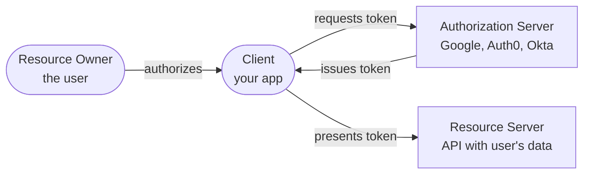

A user clicks "Sign in with Google" on your application. Within seconds, they're logged in — your app knows their name, email, and profile picture — without ever seeing their Google password. Meanwhile, a background microservice calls your billing API using its own credentials, with no user involved at all. And on a smart TV with no keyboard, a user types a short code displayed on screen into their phone to authorize a streaming app. **These are three completely different authentication scenarios, and OAuth 2.0 has a specific grant type designed for each one.**

## The Problem OAuth 2.0 Solves

Before OAuth, if a third-party app wanted to access your data on another service, you had to give that app **your password**. 

```
2007: Yelp wants to import your Gmail contacts to find friends

  Yelp: "Enter your Gmail email and password"
  User: enters gmail credentials into Yelp's form
  Yelp: logs into Gmail as the user, scrapes contacts

Problems:
  1. Yelp has your Gmail password — can read all your email
  2. You can't limit Yelp to "contacts only" — it has full access
  3. To revoke Yelp's access, you must change your Gmail password
     (which breaks every other app you shared it with)
  4. If Yelp is breached, your Gmail password is exposed
```

OAuth 2.0 solves this by introducing **delegated authorization**: the user grants a specific, limited permission to a third-party app without sharing their credentials. The app receives a **token** — not a password — that grants only the permissions the user approved, and the user can revoke it at any time without changing their password.

## Core Concepts

Before diving into flows, four roles appear in every OAuth interaction:



| Role | What it is | Example |
|------|-----------|---------|
| **Resource Owner** | The user who owns the data | You, with your Google account |
| **Client** | The application requesting access | Your web app, mobile app, or CLI tool |
| **Authorization Server** | Issues tokens after authenticating the user | Google's OAuth server, Auth0, Okta |
| **Resource Server** | The API that holds protected data | Google Calendar API, your company's user API |

## Test Your Understanding


**Full account access, no scoping, no clean revocation, and a credential leak on breach.** With your password the app can read *all* your email (not just contacts), act as you anywhere Gmail login works, and stay in even after — the only way to revoke is to change your password, which breaks every other app you shared it with. If the app is breached, your actual credential leaks.

**Delegated authorization fixes each:** the app gets a **scoped token** (contacts-only), never your password; you **revoke that token** independently at any time; and a breach exposes a limited, revocable token instead of your credential.



**Resource Owner = you** (you own the calendar). **Client = the scheduling app** (it wants access). **Authorization Server = Google's OAuth server** (it authenticates you and issues the token). **Resource Server = the Google Calendar API** (it holds the data and honors the token).

**Who never sees your password: the Client.** You authenticate directly with Google's authorization server; the app only ever receives a scoped access token. That separation — the app never touches the credential — is the whole point of OAuth.

