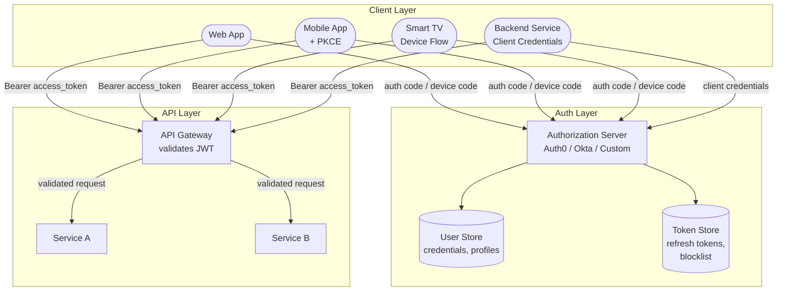

## Full Architecture

### Where Validation Happens

| Component | Validates | How |
|-----------|----------|-----|
| **API Gateway** | Access token signature + expiry + audience | Local JWT validation (no auth server call) — fast, stateless |
| **Auth Server** | Refresh tokens, authorization codes | DB lookup — stateful |
| **Resource Server** | Scopes (does token grant the required permission?) | Read `scope` claim from validated JWT |
| **Token blocklist (optional)** | Is token revoked? | Redis lookup — 1ms overhead per request |


**Always validate the `aud` (audience) claim.** A token issued for `app-a.example.com` should not be accepted by `app-b.example.com`. Without audience validation, a malicious app can take a token intended for its own API and use it against your API — if both trust the same auth server. This is one of the most common OAuth implementation mistakes.


## OAuth 2.0 Grant Type Decision Matrix

| Grant type | Client type | User present? | Secret storable? | Use case |
|-----------|------------|--------------|-----------------|----------|
| **Authorization Code** | Server-side web app | Yes | Yes (backend) | Standard web login, "Sign in with Google" |
| **Authorization Code + PKCE** | Mobile app, SPA | Yes | No (public client) | Mobile login, browser-only apps |
| **Client Credentials** | Backend service | No | Yes (server env) | Service-to-service API calls, cron jobs |
| **Device Authorization** | TV, CLI, IoT | Yes (on separate device) | No | Smart TV login, CLI auth (`gh auth login`) |
| ~~Implicit~~ | ~~SPA~~ | ~~Yes~~ | ~~No~~ | **Deprecated** — use Auth Code + PKCE instead |
| ~~Resource Owner Password~~ | ~~Trusted first-party~~ | ~~Yes~~ | ~~Yes~~ | **Deprecated** — anti-pattern, sends password to client |


**Interview tip:** When auth comes up in a system design interview, say: "For user-facing login, I'd use OAuth 2.0 Authorization Code flow with PKCE — the user authenticates with the identity provider, my app gets an authorization code, and exchanges it for a short-lived access token (15-minute JWT) plus a long-lived refresh token (stored server-side, revocable). The access token is self-contained — the API gateway validates it locally by checking the signature, expiry, and audience claim, with no auth server round-trip. For service-to-service calls, I'd use the client credentials grant. If I need user identity (name, email), I add the `openid` scope to trigger OIDC, which returns an ID token JWT alongside the access token. To revoke access, I revoke the refresh token in the database — the access token expires naturally within 15 minutes. For instant revocation in critical cases, I'd add a Redis token blocklist." This covers the right grant type, token lifecycle, validation strategy, OIDC, and revocation — the five things interviewers evaluate.


## Test Your Understanding


**Without PKCE:** The attacker exchanges the stolen authorization code for access + refresh tokens at the token endpoint. Since SPAs are public clients (no client secret), nothing stops the attacker. They now have full API access as the victim.

**PKCE prevents this:** The client generates a random `code_verifier` and sends its hash (`code_challenge`) with the authorization request. When exchanging the code for tokens, the client sends the original `code_verifier`. The auth server verifies `hash(code_verifier) == code_challenge`. The attacker has the code but not the `code_verifier` (it was never transmitted), so the token exchange fails.



**Access tokens are self-contained and can't be revoked.** The API validates the JWT locally (signature + expiry) with no server round-trip. A revoked-but-unexpired JWT is still accepted for up to 15 minutes.

**Fixes:** (1) Revoke the **refresh token** in the database — the attacker can't get new access tokens after the current one expires. (2) For instant revocation: maintain a **JTI (JWT ID) blocklist** in Redis, checked by the API gateway on every request. This trades the stateless benefit of JWT for immediate revocation capability. (3) Shorten access token lifetime to 5 minutes to reduce the exposure window.



**Blast radius:** Anyone with repo access can impersonate the service. The secret doesn't expire, can't be scoped per-environment, and is visible in Git history even after deletion.

**Fixes:** (1) Store secrets in a vault (HashiCorp Vault, AWS Secrets Manager) and inject at runtime via environment variables. (2) Use **short-lived certificates** via mTLS — the service proves identity with a certificate issued by an internal CA, rotating automatically. No shared secret. (3) In cloud environments, use **workload identity** (AWS IAM roles, GCP service accounts) — the platform provides credentials automatically, no secrets to manage.

