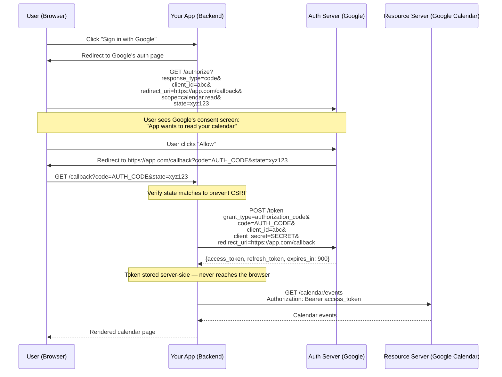
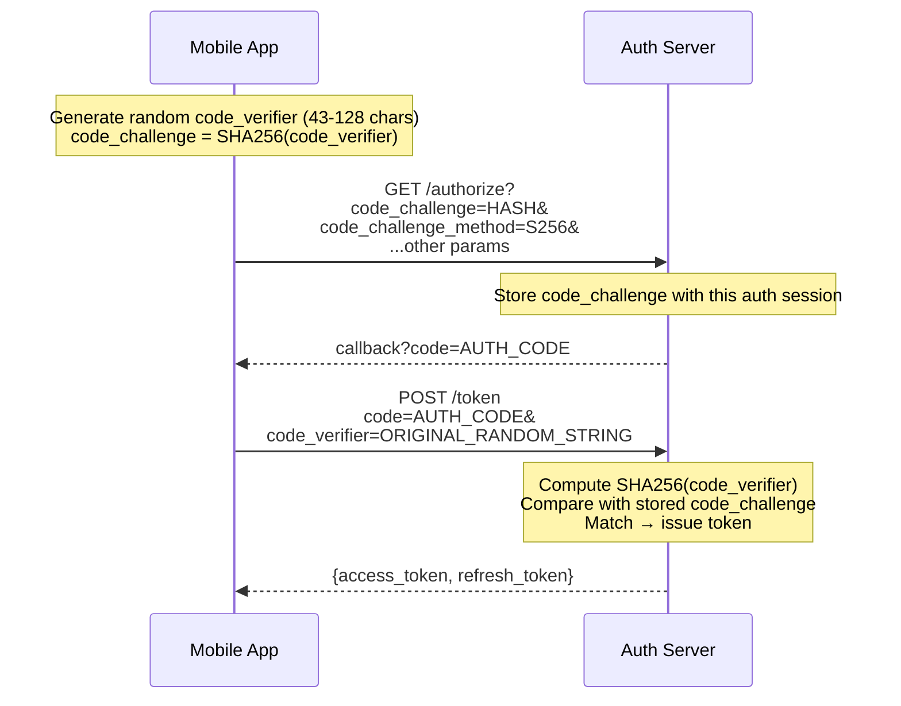
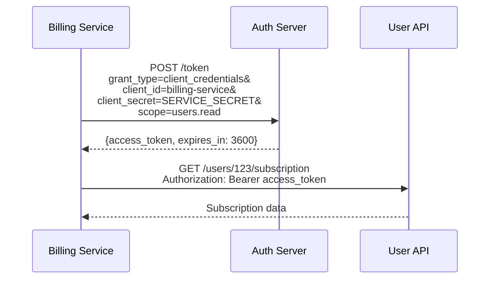
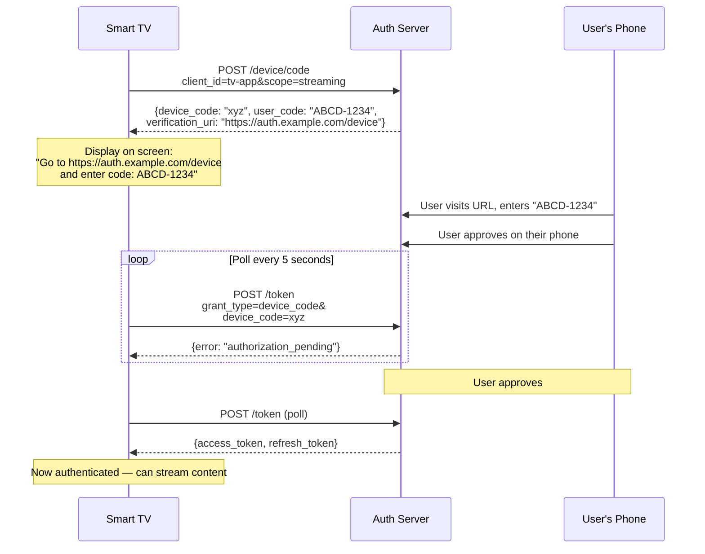

## Grant Types: Matching the Flow to the Client

OAuth 2.0 defines multiple "grant types" — each is a different protocol flow optimized for a specific type of client. Using the wrong grant type creates security vulnerabilities.

### Authorization Code Grant (User-Facing Web/Mobile Apps)

This is the **most common and most secure** flow for applications where a user is present. The key security property: the access token is never exposed to the user's browser.

#### The Problem It Solves

A web application needs to act on behalf of a user (e.g., read their Google Calendar). The app must prove to Google that the user consented, but the app's backend — not the browser — should hold the sensitive token.

#### The Flow



**Why the extra "code" step?** The authorization code is a short-lived, one-time-use intermediary. It's exchanged for the real token in a **back-channel** request (server-to-server) that includes the `client_secret`. This means:
- The access token is never in the browser's URL bar or history
- The `client_secret` proves the app's identity (a stolen auth code is useless without it)
- The exchange happens over a server-to-server HTTPS connection, not through the user's browser

### PKCE: Protecting Public Clients

#### The Problem It Solves

Mobile apps and single-page applications (SPAs) **cannot securely store a `client_secret`**. The app's code is on the user's device — any secret embedded in it can be extracted. Without a secret, a stolen authorization code can be exchanged by an attacker.

```
Attack without PKCE:

  1. User clicks "Login" in a mobile app
  2. OS opens browser → Google auth page → user approves
  3. Google redirects back to the app: myapp://callback?code=AUTH_CODE
  4. A malicious app registered for the same URL scheme intercepts the redirect
  5. Malicious app exchanges AUTH_CODE for an access token
  6. Malicious app now has access to the user's data
```

#### How PKCE Prevents This

PKCE (Proof Key for Code Exchange, pronounced "pixy") ties the authorization code to the specific client that requested it, without needing a stored secret.



**Why the attacker can't use a stolen code:** The malicious app intercepts the `AUTH_CODE` but doesn't have the `code_verifier` (it was generated in memory by the legitimate app and never transmitted). Without the verifier, the token exchange fails.

### Client Credentials Grant (Service-to-Service)

#### The Problem It Solves

A backend microservice needs to call another internal API. There is no user involved — the service itself is the client and needs to authenticate as itself.



No browser, no redirect, no user consent. The service proves its identity with its `client_id` + `client_secret` (or mTLS certificate) and receives a token scoped to the permissions assigned to that service.

### Device Authorization Grant (TVs, CLIs, IoT)

#### The Problem It Solves

A smart TV, game console, or CLI tool has no browser and limited input capability. The user can't type a URL or interact with a web-based consent screen on the device itself.



The device polls the auth server until the user completes authorization on a separate device with a full browser and keyboard.

## Test Your Understanding


**To keep the token out of the browser.** The redirect URL is visible in the address bar, browser history, and server/referrer logs — returning a token there (the old **Implicit** flow) exposes it. Instead the server returns a short-lived, single-use **code**, which the app's *backend* exchanges for the token over a server-to-server back channel, including the `client_secret` (or PKCE verifier). The token itself never travels through the user agent.

**That's also why Implicit is deprecated:** Authorization Code + PKCE gives browser-only apps the same no-secret capability without ever putting a token in a URL.



**The TV can't render a consent page or let the user type credentials — Authorization Code assumes a capable browser on the same device.** The **Device Authorization Grant** solves this: the TV shows a short code and a URL, the user approves on their *phone*, and the TV **polls** the token endpoint until authorization completes.

**The takeaway:** pick the grant by *client capability and trust*, not habit — Authorization Code + PKCE for browsers/mobile, Client Credentials for service-to-service, Device flow for input-constrained devices.

