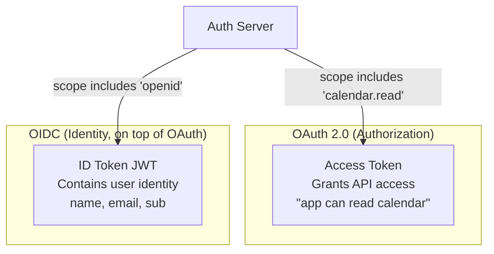

## OIDC: Adding Identity on Top of OAuth

#### The Problem It Solves

OAuth 2.0 is an **authorization** protocol — it answers "what can this app do?" but not "who is the user?" When your app receives an access token from Google, the access token lets you call the Google Calendar API, but it doesn't directly tell you the user's name, email, or profile picture.

Before OIDC, apps had to make a separate API call to a `/userinfo` endpoint after getting the access token — an extra round-trip, and every provider had a different endpoint and response format.

```
OAuth 2.0 alone:
  App gets access_token from Google
  App calls GET https://www.googleapis.com/oauth2/v1/userinfo
  Google returns: {name: "Alice", email: "alice@gmail.com"}
  → Extra API call, provider-specific endpoint

OIDC:
  App gets access_token + id_token from Google (in the same token response)
  id_token is a JWT containing: {name: "Alice", email: "alice@gmail.com", sub: "12345"}
  → No extra API call, standardized format across all OIDC providers
```

**OIDC (OpenID Connect)** is a thin identity layer on top of OAuth 2.0. It adds one thing: the **ID token** — a JWT that contains standardized user identity claims, returned alongside the access token.



### ID Token Structure

```
Header:  {"alg": "RS256", "kid": "key-id-1"}
Payload: {
  "iss": "https://accounts.google.com",     // who issued this token
  "sub": "1098234710293",                    // unique user ID at the provider
  "aud": "your-app-client-id",              // intended recipient (your app)
  "exp": 1713800000,                         // expiry timestamp
  "iat": 1713799100,                         // issued at
  "nonce": "abc123",                         // replay protection
  "name": "Alice Smith",                     // OIDC standard claim
  "email": "alice@gmail.com",               // OIDC standard claim
  "email_verified": true,                    // OIDC standard claim
  "picture": "https://..."                   // OIDC standard claim
}
Signature: RS256(header + "." + payload, google_private_key)
```

**Triggering OIDC:** Add `openid` to the `scope` parameter in the authorization request. Additional scopes like `profile` and `email` request specific identity claims.

```
# OAuth 2.0 only (authorization):
scope=calendar.read

# OIDC (authorization + identity):
scope=openid profile email calendar.read
       ↑      ↑      ↑
       |      |      └── include email + email_verified claims
       |      └── include name + picture claims
       └── trigger OIDC → return an id_token
```

## Test Your Understanding


**They serve different purposes and different audiences.** The **ID token** is for *your app* — it answers 'who is the user?' (name, email, `sub`) and its `aud` is your client ID. The **access token** is for the *resource server* — it answers 'what may the bearer do?' and is what the Calendar API expects. Sending the ID token to the API is an audience mismatch; a correct API rejects it.

**Rule of thumb:** ID token → consumed by the client to establish identity/session; access token → presented to APIs for authorization. Don't cross the streams.



**`openid` makes the authorization server also return an ID token — a signed JWT of standardized identity claims — alongside the access token.** Plain OAuth is an *authorization* protocol: the access token lets you call an API but doesn't reliably tell you who the user is, or in a standard shape. Before OIDC, apps made an extra, provider-specific `/userinfo` call and parsed bespoke responses.

**OIDC standardizes identity on top of OAuth:** add `openid` (plus `profile`, `email`) and every compliant provider returns the same claim shape (`sub`, `name`, `email`, …) in the ID token — no extra round-trip, portable across providers.

