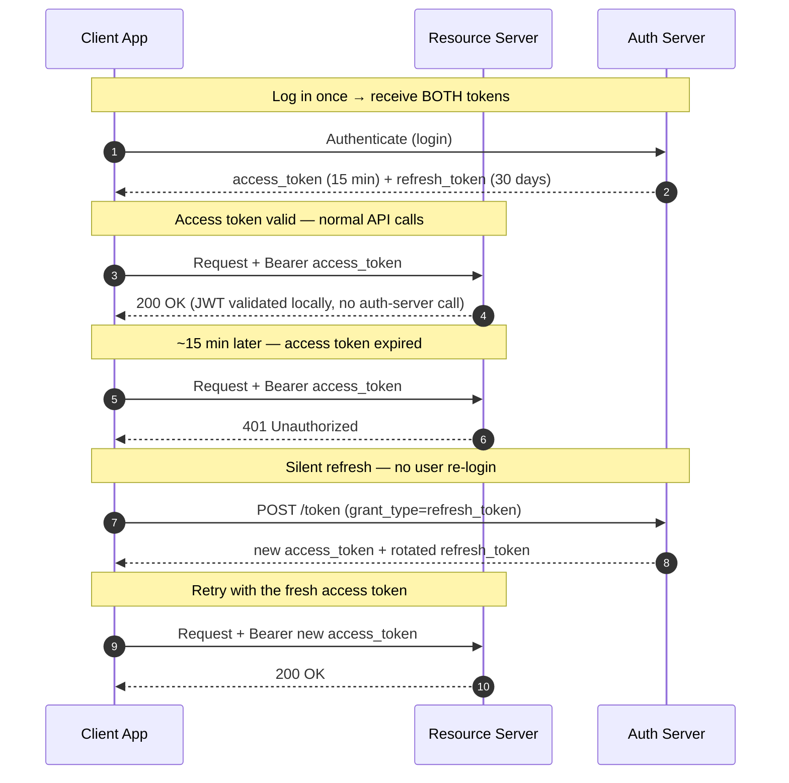

## Token Lifecycle: Access + Refresh

OAuth 2.0 uses a **two-token pattern** that balances security with usability:



### Why Two Tokens?

```
Problem with long-lived access tokens:
  Access token valid for 30 days
  Token is stolen on day 1
  Attacker has 29 days of unauthorized access
  You can't revoke it (it's self-contained / stateless)

Problem with short-lived access tokens only:
  Access token valid for 15 minutes
  User must re-login every 15 minutes
  Terrible user experience

Solution: two tokens with different properties:
  Access token: short-lived (15 min), self-contained, stateless validation
  Refresh token: long-lived (30 days), stored in DB, can be revoked instantly

  If access token is stolen → attacker has at most 15 minutes
  If refresh token is stolen → revoke it immediately in the DB
  Normal users → seamlessly get new access tokens via refresh, never re-login
```

### Refresh Token Rotation

When a refresh token is used, issue a **new** refresh token and invalidate the old one. This limits the damage if a refresh token is stolen:

```
Without rotation:
  Attacker steals refresh_token_A on day 1
  Attacker uses refresh_token_A on day 15 → gets new access token ✓
  Legitimate user uses refresh_token_A on day 16 → also works ✓
  Both have valid access — theft is invisible

With rotation:
  Attacker steals refresh_token_A on day 1
  Legitimate user uses refresh_token_A on day 2 → gets refresh_token_B
  Attacker uses refresh_token_A on day 15 → REVOKED (already used)
  Auth server detects reuse → revokes entire refresh token family
  User must re-authenticate (inconvenient, but safe)
```

## Test Your Understanding


**One token can't be both safe and convenient; two tokens split the job.** A single long-lived token is convenient, but because access tokens are self-contained and validated locally, a stolen one works until it expires with no way to revoke. A single short-lived token is safe but forces constant re-login.

**The split:** the **access token** is short-lived (≈15 min) and self-contained for fast, stateless API validation; the **refresh token** is long-lived but stored server-side and revocable, used only to mint new access tokens. A stolen access token dies in minutes; a stolen refresh token can be killed in the database; normal users refresh silently and never re-login.



**A rotated (already-used) refresh token being replayed means it was stolen** — either the attacker or the real client is using a stale copy, and the server can't tell which. Since each refresh token is single-use, seeing A again after it rotated is a reuse event.

**Action:** revoke the **entire refresh-token family** (all descendants, including B) and force re-authentication. It's inconvenient for the real user but guarantees the thief is locked out — turning silent token theft into a detectable, contained event.

