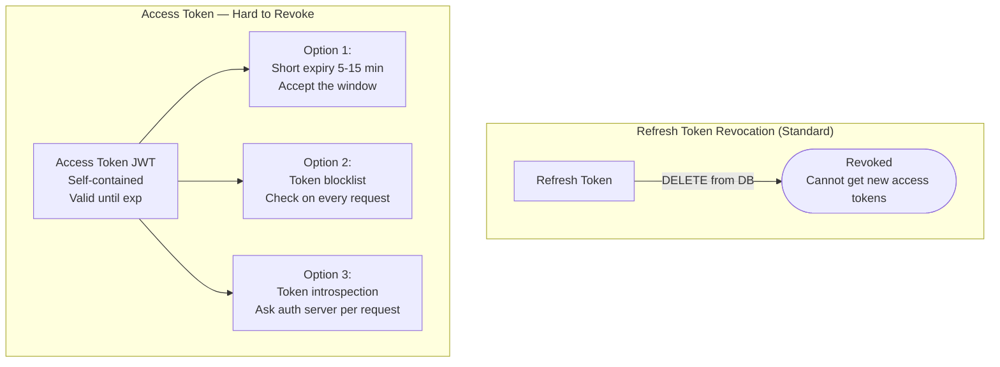

## Token Revocation

### The Problem

Access tokens are **self-contained JWTs** — the resource server validates them by checking the signature and expiry locally, with no call to the auth server. This makes them fast to validate but **impossible to revoke before expiry** without additional infrastructure.

```
Scenario: employee is terminated at 2:00 PM
  Their access token expires at 2:15 PM
  For 15 minutes, they can still call APIs with a valid token
  The resource server has no way to know the token should be rejected
```

### Revocation Strategies



| Strategy | How it works | Latency impact | Revocation speed |
|----------|-------------|----------------|-----------------|
| **Short-lived access tokens** | Set `exp` to 5–15 minutes; revoke refresh token to prevent renewal | None (stateless validation) | Up to 15 min delay |
| **Token blocklist** | Store revoked token JTIs in Redis; resource server checks on each request | +1ms (Redis lookup) | Instant |
| **Token introspection** (RFC 7662) | Resource server calls auth server's `/introspect` endpoint for every request | +5–20ms (HTTP call) | Instant |
| **Refresh token revocation only** | Revoke refresh token in DB; wait for access token to expire naturally | None | Up to access token TTL |

**Production recommendation:** Use short-lived access tokens (15 min) + refresh token revocation for most cases. Add a token blocklist (Redis) only if you need **instant** revocation for high-security scenarios (employee termination, compromised accounts).

## Test Your Understanding


**Self-contained access tokens are validated locally, so there's nothing central to delete.** The resource server checks the signature and `exp` on its own — it never asks the auth server 'is this still valid?' — so a revoked-but-unexpired JWT keeps working until 2:15. Revoking the **refresh token** stops *renewal*, but the current access token still has up to 15 minutes of life.

**To cut it instantly:** add the token's JTI to a **Redis blocklist** the gateway checks per request (≈1 ms), or use **token introspection** (ask the auth server each call). Both restore instant revocation at the cost of the per-request lookup that stateless tokens were designed to avoid.



**The whole point of self-contained tokens: stateless, zero-lookup validation.** Per-request introspection turns every call into a network round-trip to the auth server (+5–20 ms) and makes it a hot dependency and potential bottleneck/SPOF — essentially the cost model of server-side sessions.

**Balanced answer:** default to short-lived access tokens + refresh-token revocation (no per-request cost); reach for a Redis JTI **blocklist** (≈1 ms, instant) for the few high-security cases; and reserve full introspection for genuinely opaque tokens or the most sensitive endpoints.

