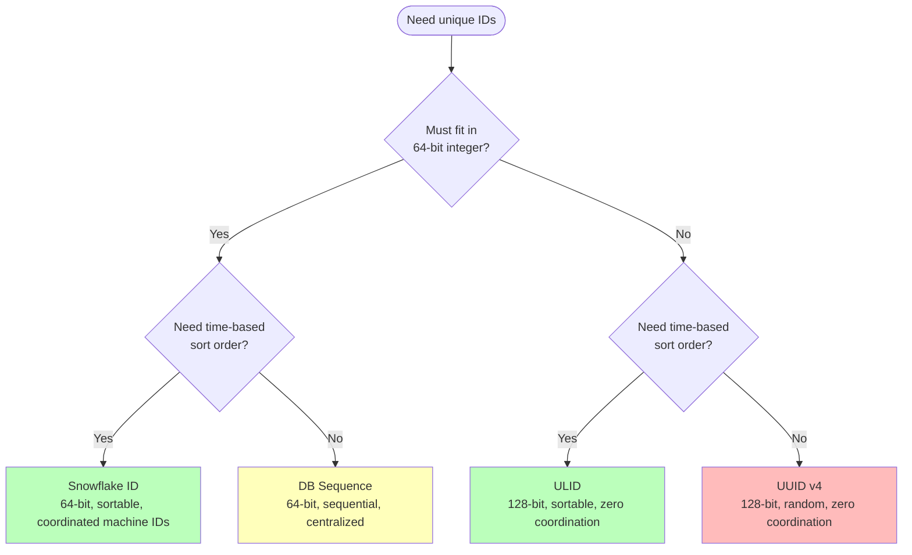

Every row in your database needs an ID. In a single-server world, `AUTO_INCREMENT` works perfectly — the database hands out 1, 2, 3, 4, ... and guarantees uniqueness. Now your system is distributed across 20 database shards, 50 application servers, and 3 regions. There is no single counter to increment. Two servers inserting simultaneously can't coordinate fast enough to avoid collisions without a bottleneck. You need a scheme that generates **globally unique IDs** across all nodes, ideally without any coordination — and depending on your access patterns, those IDs may also need to be **sortable by time**.

## Why Auto-Increment Breaks in Distributed Systems

```
Single database:
  Server A inserts → DB returns id=1001
  Server B inserts → DB returns id=1002
  ✓ Guaranteed unique, sequential, fast

Sharded database (3 shards):
  Server A → Shard 1 → id=1001
  Server B → Shard 2 → id=1001  ← collision!

  "Solution": each shard uses a different step
    Shard 1: 1, 4, 7, 10, ...
    Shard 2: 2, 5, 8, 11, ...
    Shard 3: 3, 6, 9, 12, ...
  Problem: adding Shard 4 requires re-numbering all shards
```

The fundamental tension: **uniqueness requires coordination**, but coordination limits throughput and introduces a single point of failure. Each ID generation scheme makes a different trade-off along this axis.

## UUID v4: Pure Randomness

A UUID (Universally Unique Identifier) version 4 is 128 bits of randomness, formatted as a 36-character hex string with dashes.

```
Format: 550e8400-e29b-41d4-a716-446655440000
        xxxxxxxx-xxxx-4xxx-yxxx-xxxxxxxxxxxx

        4 = version marker (v4)
        y = variant marker (8, 9, a, or b)

Effective randomness: 122 bits (6 bits reserved for version + variant)
Possible values: 2¹²² ≈ 5.3 × 10³⁶
```

```python
import uuid

# Generate a UUID v4 — no coordination needed
id = uuid.uuid4()
print(id)   # e.g., "a1b2c3d4-e5f6-4a7b-8c9d-0e1f2a3b4c5d"
print(len(str(id)))  # 36 characters
```

**Collision probability:** With 122 random bits, you'd need to generate ~2.7 × 10¹⁸ UUIDs (2.7 quintillion) before having a 50% chance of a single collision (birthday paradox). In practice, collisions are not a concern.

### The B-Tree Index Problem

UUIDs are random — they have no ordering relationship with time or insertion order. When used as a primary key in a database with a B-tree index, this causes **page splits and fragmentation**:

```
B-tree with sequential IDs (auto-increment):
  New rows always append to the rightmost leaf page
  → sequential I/O, high page fill factor, efficient

  [1,2,3,4,5] [6,7,8,9,10] [11,12,13,14,15] [16,17,← next insert]

B-tree with random UUIDs:
  New rows insert into random leaf pages across the tree
  → random I/O, frequent page splits, ~50% page fill factor

  [a1b.., c3d.., f7e..] ← insert "b2c.." here → page split!
```

**Impact:** Random UUIDs as primary keys can cause **2–5× slower write performance** on large tables compared to sequential keys, due to cache misses and page splits. Read performance also suffers because related rows (e.g., recently inserted) are scattered across the index rather than being co-located.

| Property | UUID v4 |
|----------|---------|
| Size | 128 bits (36 chars as string, 16 bytes binary) |
| Coordination | None — generate locally |
| Sortable by time | No |
| Index performance | Poor — random inserts cause B-tree fragmentation |
| Collision risk | Negligible (122 bits of randomness) |
| Human readability | Low — long hex string |

## Snowflake ID: Twitter's Solution

Twitter needed IDs that were unique, sortable by time, fit in a 64-bit integer (for efficient storage and indexing), and could be generated without central coordination at thousands of IDs per second. The result was Snowflake.

### Bit Layout

```
64-bit Snowflake ID:

 0                   1                   2                   3
 0 1 2 3 4 5 6 7 8 9 0 1 2 3 4 5 6 7 8 9 0 1 2 3 4 5 6 7 8 9 0 1
├─┼───────────────────────────────────────────┼─────────┼───────────┤
│0│         41-bit timestamp (ms)             │ 10-bit  │  12-bit   │
│ │      (milliseconds since epoch)           │machine  │ sequence  │
│ │                                           │   ID    │  number   │
└─┴───────────────────────────────────────────┴─────────┴───────────┘

Bit 0:      Unused sign bit (always 0 → positive integer)
Bits 1–41:  Milliseconds since custom epoch (not Unix epoch)
            2⁴¹ ms ≈ 69 years from custom epoch
Bits 42–51: Machine/worker ID (0–1023 → up to 1024 workers)
Bits 52–63: Sequence number (0–4095 → up to 4096 IDs per ms per worker)
```

```python
import time
import threading

class SnowflakeGenerator:
    """Twitter-style 64-bit unique ID generator."""

    # Custom epoch: Jan 1, 2020 00:00:00 UTC
    EPOCH = 1577836800000

    MACHINE_ID_BITS = 10
    SEQUENCE_BITS = 12

    MAX_MACHINE_ID = (1 << MACHINE_ID_BITS) - 1   # 1023
    MAX_SEQUENCE = (1 << SEQUENCE_BITS) - 1         # 4095

    MACHINE_ID_SHIFT = SEQUENCE_BITS                # 12
    TIMESTAMP_SHIFT = SEQUENCE_BITS + MACHINE_ID_BITS  # 22

    def __init__(self, machine_id: int):
        if machine_id < 0 or machine_id > self.MAX_MACHINE_ID:
            raise ValueError(f"Machine ID must be 0–{self.MAX_MACHINE_ID}")
        self.machine_id = machine_id
        self.sequence = 0
        self.last_timestamp = -1
        self.lock = threading.Lock()

    def generate(self) -> int:
        with self.lock:
            timestamp = self._current_time()

            if timestamp == self.last_timestamp:
                # Same millisecond — increment sequence
                self.sequence = (self.sequence + 1) & self.MAX_SEQUENCE
                if self.sequence == 0:
                    # Sequence exhausted — wait for next millisecond
                    timestamp = self._wait_next_ms(timestamp)
            elif timestamp > self.last_timestamp:
                self.sequence = 0
            else:
                # Clock moved backward — refuse to generate
                raise ClockMovedBackwardError(
                    f"Clock moved backward by "
                    f"{self.last_timestamp - timestamp}ms"
                )

            self.last_timestamp = timestamp

            return (
                ((timestamp - self.EPOCH) << self.TIMESTAMP_SHIFT)
                | (self.machine_id << self.MACHINE_ID_SHIFT)
                | self.sequence
            )

    def _current_time(self) -> int:
        return int(time.time() * 1000)

    def _wait_next_ms(self, last_ts: int) -> int:
        ts = self._current_time()
        while ts <= last_ts:
            ts = self._current_time()
        return ts


class ClockMovedBackwardError(Exception):
    pass
```

### Extracting Timestamp from a Snowflake ID

Because the timestamp is embedded in the most significant bits, you can extract the creation time from any Snowflake ID:

```python
def extract_timestamp(snowflake_id: int, epoch=1577836800000) -> float:
    """Extract Unix timestamp from a Snowflake ID."""
    timestamp_ms = (snowflake_id >> 22) + epoch
    return timestamp_ms / 1000

# Example:
gen = SnowflakeGenerator(machine_id=42)
sid = gen.generate()
print(f"ID: {sid}")
print(f"Created at: {extract_timestamp(sid)}")
print(f"Machine: {(sid >> 12) & 0x3FF}")
print(f"Sequence: {sid & 0xFFF}")
```

### The Clock Skew Problem

Snowflake depends on a **monotonically increasing clock**. If the system clock jumps backward (NTP correction, VM migration, leap second), the generator would produce IDs with timestamps **earlier** than previously generated IDs — violating the sort order guarantee.

```
t=1000ms: generate ID → timestamp=1000, sequence=0
t=1001ms: generate ID → timestamp=1001, sequence=0
         NTP correction: clock jumps back to 999ms
t=999ms:  generate ID → timestamp=999, sequence=0
          ← This ID sorts BEFORE the t=1001 ID but was created AFTER it
```

**Mitigations:**
- **Refuse to generate:** Throw an error if clock moves backward (the implementation above does this)
- **Wait it out:** If the backward jump is small (< 5ms), spin-wait until the clock catches up
- **Use monotonic clock source:** Linux `CLOCK_MONOTONIC` never goes backward (but isn't wall-clock time)

| Property | Snowflake |
|----------|-----------|
| Size | 64 bits (fits in a `BIGINT`) |
| Coordination | Machine ID assignment only (one-time setup) |
| Sortable by time | Yes — millisecond precision, IDs sort chronologically |
| Index performance | Excellent — roughly sequential inserts, B-tree friendly |
| Throughput | 4,096 IDs/ms per machine = ~4M IDs/s per machine |
| Clock dependency | Critical — clock skew can violate ordering |

## ULID: Sortable + Random

ULID (Universally Unique Lexicographically Sortable Identifier) combines a timestamp with randomness in 128 bits, encoded as a 26-character URL-safe Base32 string.

```
ULID structure (128 bits):

 ├────── 48 bits ──────┼────────── 80 bits ──────────┤
 │    Timestamp (ms)   │        Randomness            │
 │  Unix epoch, ms     │   Cryptographically random   │
 └─────────────────────┴──────────────────────────────┘

Encoded: 01ARZ3NDEKTSV4RRFFQ69G5FAV
         ├──────────┼────────────────┤
         10 chars   16 chars
         timestamp  randomness

Crockford Base32: 0-9 A-Z excluding I L O U (avoids ambiguity)
```

```python
import os
import time

# Crockford Base32 encoding table
ENCODING = "0123456789ABCDEFGHJKMNPQRSTVWXYZ"

def generate_ulid() -> str:
    """Generate a ULID: 48-bit timestamp + 80-bit random."""
    # Timestamp: milliseconds since Unix epoch
    timestamp_ms = int(time.time() * 1000)

    # Encode 48-bit timestamp as 10 Base32 characters
    ts_chars = []
    for _ in range(10):
        ts_chars.append(ENCODING[timestamp_ms & 0x1F])
        timestamp_ms >>= 5
    ts_part = "".join(reversed(ts_chars))

    # 80 bits of randomness as 16 Base32 characters
    random_bytes = os.urandom(10)  # 10 bytes = 80 bits
    random_int = int.from_bytes(random_bytes, "big")
    rand_chars = []
    for _ in range(16):
        rand_chars.append(ENCODING[random_int & 0x1F])
        random_int >>= 5
    rand_part = "".join(reversed(rand_chars))

    return ts_part + rand_part

# Example:
ulid = generate_ulid()
print(ulid)       # e.g., "01HZXK5P9RQCV3Z8KNTDMJ5WGE"
print(len(ulid))  # 26 characters
```

### Why ULID Over UUID?

```
UUIDs sorted:                        ULIDs sorted:
  0a1b2c3d-...  (random)              01ARZ3ND-... (2024-01-15 10:00:00)
  9f8e7d6c-...  (random)              01ARZ3NF-... (2024-01-15 10:00:01)
  3c4d5e6f-...  (random)              01ARZ3NG-... (2024-01-15 10:00:02)
  ← no meaningful order                ← chronological order ✓

SELECT * FROM orders ORDER BY id DESC LIMIT 10;
  UUID:  returns 10 random orders — useless
  ULID:  returns 10 most recent orders — useful
```

ULIDs give you the **zero-coordination property of UUIDs** (just generate locally with randomness) plus the **sort-order property of Snowflake** (chronological ordering). The trade-off: they're 128 bits instead of 64.

**Monotonicity within the same millisecond:** The ULID spec recommends that if multiple ULIDs are generated in the same millisecond, the random component should be **incremented** rather than regenerated — this preserves sort order within a millisecond.

| Property | ULID |
|----------|------|
| Size | 128 bits (26 chars Base32, 16 bytes binary) |
| Coordination | None — generate locally |
| Sortable by time | Yes — millisecond precision, lexicographic sort = chronological sort |
| Index performance | Good — roughly sequential like Snowflake, with slight randomness |
| Collision risk | Within same ms: 2⁸⁰ random space ≈ negligible |
| Clock dependency | Moderate — not sortable across clock-skewed machines |

## Database Sequences

The simplest approach: let the database hand out IDs.

```sql
-- PostgreSQL sequence
CREATE SEQUENCE order_id_seq START 1 INCREMENT 1;

-- Use in a table
CREATE TABLE orders (
    id BIGINT DEFAULT nextval('order_id_seq') PRIMARY KEY,
    ...
);

-- Or explicitly
INSERT INTO orders (id, ...) VALUES (nextval('order_id_seq'), ...);
```

**Advantages:** Strongly ordered, gap-free (mostly), no application logic needed, works perfectly for single-database systems.

**Problems at scale:**

```
Single sequence, 3 app servers:

  Server A: nextval() → 1001  ← round-trip to DB
  Server B: nextval() → 1002  ← round-trip to DB
  Server C: nextval() → 1003  ← round-trip to DB

  Every ID requires a DB round-trip → the sequence is a bottleneck
  At 10K inserts/s, that's 10K round-trips/s just for IDs
```

### Sequence with Block Allocation

To reduce round-trips, each application server pre-allocates a **block** of IDs:

```python
class BlockAllocator:
    """Pre-allocate ID blocks from a central sequence."""

    def __init__(self, db, block_size=1000):
        self.db = db
        self.block_size = block_size
        self.current = 0
        self.ceiling = 0

    async def next_id(self) -> int:
        if self.current >= self.ceiling:
            await self._allocate_block()
        id = self.current
        self.current += 1
        return id

    async def _allocate_block(self):
        """Atomically reserve a block of IDs by bumping a counter row.

        Backed by a one-row-per-namespace table:
            CREATE TABLE id_blocks (
                name        TEXT PRIMARY KEY,
                next_start  BIGINT NOT NULL DEFAULT 1
            );

        The UPDATE acquires a row lock; concurrent allocators serialize
        on it and each gets a distinct, contiguous block.
        """
        row = await self.db.query_one(
            """
            UPDATE id_blocks
               SET next_start = next_start + %s
             WHERE name = %s
            RETURNING next_start - %s AS block_start
            """,
            (self.block_size, "order_ids", self.block_size),
        )
        self.current = row["block_start"]
        self.ceiling = self.current + self.block_size
```

Now each server only contacts the DB once per 1,000 IDs. The trade-off: IDs are no longer gap-free (if a server crashes with 800 unused IDs in its block, those IDs are lost) and IDs from different servers interleave rather than being strictly sequential.

| Property | DB Sequence |
|----------|-------------|
| Size | 64 bits (`BIGINT`) |
| Coordination | Full — centralized sequence |
| Sortable by time | Approximately (within a single DB) |
| Index performance | Excellent — sequential |
| Throughput | Limited by DB round-trips (block allocation helps) |
| Single point of failure | Yes — the sequence DB |

## Choosing the Right Scheme



### Head-to-Head Comparison

| Property | UUID v4 | Snowflake | ULID | DB Sequence |
|----------|---------|-----------|------|-------------|
| **Size** | 128 bit (36 char) | 64 bit (19 digits) | 128 bit (26 char) | 64 bit (up to 19 digits) |
| **Coordination** | None | Machine ID registry | None | Centralized DB |
| **Time-sortable** | No | Yes (ms) | Yes (ms) | Approximately |
| **B-tree friendly** | No (random) | Yes (sequential) | Yes (mostly sequential) | Yes (sequential) |
| **Throughput/node** | Unlimited | 4,096/ms | Unlimited | DB-limited |
| **Clock dependency** | None | Critical | Moderate | None |
| **Uniqueness guarantee** | Statistical (122-bit random) | Structural (machine + sequence) | Statistical (80-bit random/ms) | Structural (single counter) |
| **Cross-region safe** | Yes | Yes (with unique machine IDs) | Yes | No (single DB) |
| **URL friendly** | No (dashes, hex) | Yes (plain integer) | Yes (Base32) | Yes (plain integer) |

### When to Use Each

| Scheme | Best for | Avoid when |
|--------|----------|-----------|
| **UUID v4** | Simple systems, no sort requirement, distributed with no coordination budget | Primary key on write-heavy tables (B-tree fragmentation) |
| **Snowflake** | High-throughput systems needing 64-bit sortable IDs (Twitter, Discord, Instagram) | You can't manage machine ID assignment; clock skew is frequent |
| **ULID** | Need UUID-like simplicity + sort order; Snowflake's 64-bit limit is too tight | You need IDs to fit in a `BIGINT` column |
| **DB Sequence** | Single-region, single-database, simple applications | Multi-region, sharded databases, high write throughput |

### What Real Systems Use

| System | ID scheme | Why |
|--------|----------|-----|
| **Twitter** | Snowflake | 64-bit, sortable, fits in JavaScript `Number.MAX_SAFE_INTEGER` (53-bit) with custom epoch |
| **Discord** | Snowflake variant | 64-bit, sortable by time, used for messages + channels + users |
| **Instagram** | Snowflake variant | 41-bit timestamp + 13-bit shard ID + 10-bit sequence |
| **MongoDB** | ObjectId (96-bit) | 32-bit timestamp + 40-bit random + 24-bit counter — sortable, no coordination |
| **Cassandra** | TimeUUID (v1) | Timestamp-based UUID — sortable, used as clustering key |
| **Stripe** | Prefixed random | `ch_1a2b3c...` — prefix indicates type, body is random; not sortable |


**JavaScript integer precision matters.** JavaScript `Number` is a 64-bit IEEE 754 float, which only has 53 bits of integer precision. A full 64-bit Snowflake ID exceeds `Number.MAX_SAFE_INTEGER` (2⁵³ - 1 = 9,007,199,254,740,991). Solutions: serialize IDs as strings in JSON responses, or use a custom epoch that keeps timestamps within 53 bits for the foreseeable future. Twitter and Discord both serialize Snowflake IDs as strings in their APIs.



**Interview tip:** When asked about ID generation, say: "For a distributed system needing sortable IDs, I'd use Snowflake: 41-bit millisecond timestamp, 10-bit machine ID, 12-bit sequence — gives me 4,096 IDs per millisecond per machine in a 64-bit integer that sorts chronologically and is B-tree friendly. Each machine generates IDs independently with no coordination beyond the one-time machine ID assignment. The main risk is clock skew — if the clock moves backward, I'd refuse to generate IDs until it catches up. If I don't need 64-bit compactness, ULID is simpler — 48-bit timestamp plus 80 bits of randomness, no machine ID management needed, and it's lexicographically sortable. I'd avoid UUID v4 as a primary key on write-heavy tables because random inserts cause B-tree page splits."

