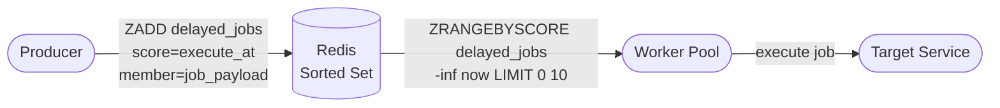
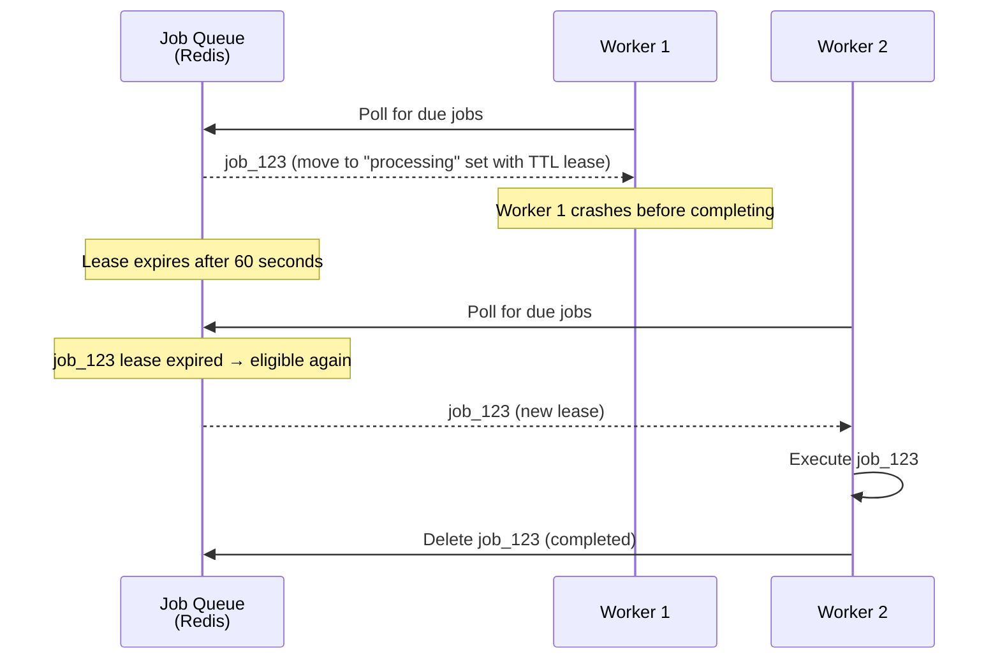
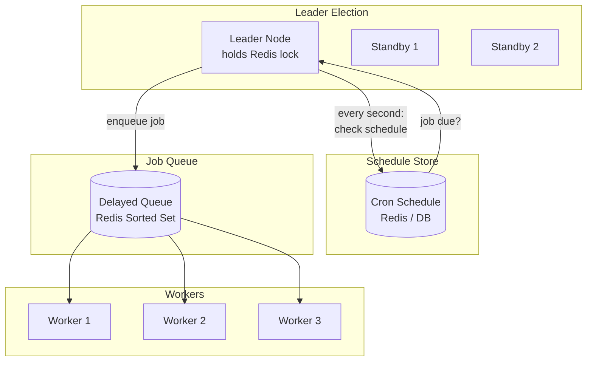
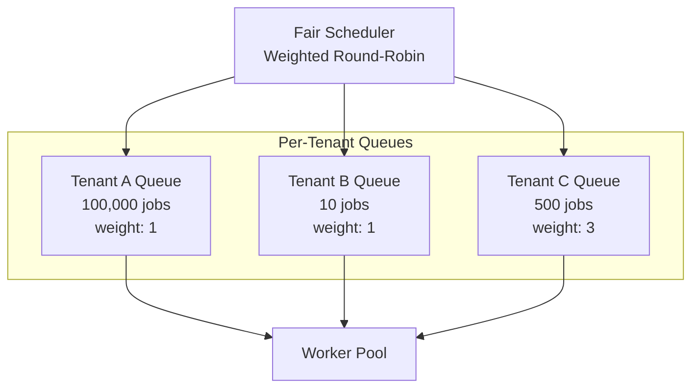
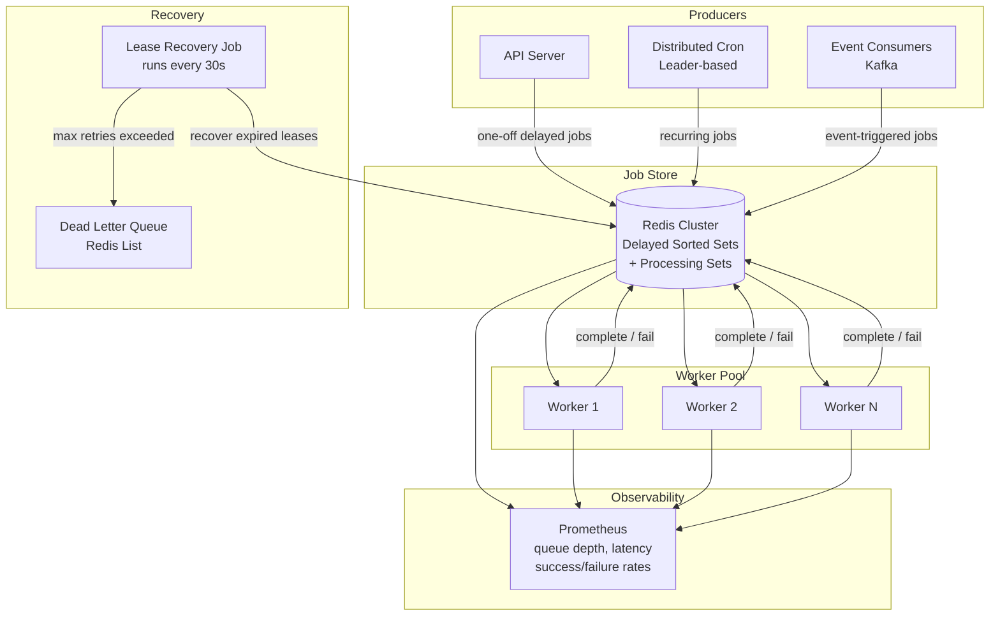

An e-commerce platform needs to send a reminder email 24 hours after a user abandons their cart. A payment system must retry failed charges at increasing intervals — 1 minute, 5 minutes, 30 minutes. A SaaS platform runs a billing job for each of its 50,000 tenants at midnight in their respective time zones. These are all **delayed or scheduled jobs** in a distributed system: work that must happen at a specific future time, exactly once (or at least once with idempotent handling), across a fleet of worker machines that can crash at any moment.

## Delayed Queues with Redis Sorted Sets

The simplest and most common approach for delayed jobs: use a Redis sorted set where the **score is the Unix timestamp** at which the job should execute. Workers poll for jobs whose score is ≤ now.



```python
import time
import json
import uuid

class DelayedQueue:
    """Delayed job queue backed by Redis sorted set."""

    def __init__(self, redis, queue_name="delayed_jobs"):
        self.redis = redis
        self.queue = queue_name

    async def schedule(self, job_type: str, payload: dict,
                       execute_at: float, job_id: str = None):
        """Schedule a job for future execution."""
        job_id = job_id or str(uuid.uuid4())
        job = json.dumps({
            "id": job_id,
            "type": job_type,
            "payload": payload,
            "scheduled_at": time.time(),
            "execute_at": execute_at,
        })
        await self.redis.zadd(self.queue, {job: execute_at})
        return job_id

    async def schedule_after(self, job_type: str, payload: dict,
                             delay_seconds: float):
        """Schedule a job to run after a delay."""
        return await self.schedule(
            job_type, payload, time.time() + delay_seconds
        )

    async def poll(self, batch_size=10) -> list[dict]:
        """Fetch jobs that are due for execution."""
        now = time.time()
        # Get jobs with score <= now
        results = await self.redis.zrangebyscore(
            self.queue, "-inf", now,
            start=0, num=batch_size,
        )
        return [json.loads(r) for r in results]
```

### The Polling Problem

Naive polling has a critical race condition: two workers poll at the same time, both see the same job, both execute it.

```
Worker A: ZRANGEBYSCORE delayed_jobs -inf 1713800000 → job_123
Worker B: ZRANGEBYSCORE delayed_jobs -inf 1713800000 → job_123
Worker A: executes job_123
Worker B: executes job_123 ← duplicate execution!
```

**Solution:** Use `ZPOPMIN` (Redis 5.0+) or an atomic Lua script that reads and removes in one operation:

```lua
-- Atomic: fetch up to N due jobs and remove them from the set
local jobs = redis.call('ZRANGEBYSCORE', KEYS[1], '-inf', ARGV[1],
                        'LIMIT', 0, ARGV[2])
if #jobs > 0 then
    redis.call('ZREM', KEYS[1], unpack(jobs))
end
return jobs
```

```python
ATOMIC_POLL_SCRIPT = """
local jobs = redis.call('ZRANGEBYSCORE', KEYS[1], '-inf', ARGV[1],
                        'LIMIT', 0, ARGV[2])
if #jobs > 0 then
    redis.call('ZREM', KEYS[1], unpack(jobs))
end
return jobs
"""

class AtomicDelayedQueue(DelayedQueue):
    """Delayed queue with atomic poll-and-remove."""

    async def poll_atomic(self, batch_size=10) -> list[dict]:
        """Atomically fetch and remove due jobs."""
        now = str(time.time())
        results = await self.redis.eval(
            ATOMIC_POLL_SCRIPT,
            keys=[self.queue],
            args=[now, str(batch_size)],
        )
        return [json.loads(r) for r in results]
```

Now only one worker gets each job. But what if that worker crashes **after** removing the job from Redis but **before** completing it? The job is lost. This is where leasing comes in.

## Job Leasing

Instead of permanently removing a job from the queue, the worker **acquires a lease** — a time-limited claim on the job. If the worker finishes, it deletes the job. If the worker crashes, the lease expires and the job becomes available for another worker.



```python
class LeasedJobQueue:
    """Job queue with lease-based at-least-once delivery."""

    def __init__(self, redis, queue="delayed_jobs",
                 processing="processing_jobs", lease_ttl=60):
        self.redis = redis
        self.queue = queue
        self.processing = processing
        self.lease_ttl = lease_ttl

    async def poll_with_lease(self, worker_id: str,
                              batch_size=5) -> list[dict]:
        """Atomically move due jobs to processing set with lease."""
        now = time.time()
        # Lua: move due jobs from delayed set to processing set
        jobs = await self.redis.eval("""
            local jobs = redis.call('ZRANGEBYSCORE', KEYS[1],
                                    '-inf', ARGV[1], 'LIMIT', 0, ARGV[2])
            for _, job in ipairs(jobs) do
                redis.call('ZREM', KEYS[1], job)
                -- Score in processing set = lease expiry time
                redis.call('ZADD', KEYS[2], ARGV[3], job)
            end
            return jobs
        """, keys=[self.queue, self.processing],
             args=[str(now), str(batch_size),
                   str(now + self.lease_ttl)])

        return [json.loads(j) for j in jobs]

    async def complete(self, job_data: str):
        """Mark job as completed — remove from processing set."""
        await self.redis.zrem(self.processing, job_data)

    async def recover_expired_leases(self):
        """Move expired leases back to the delayed queue for retry."""
        now = time.time()
        expired = await self.redis.zrangebyscore(
            self.processing, "-inf", str(now)
        )
        for job_data in expired:
            job = json.loads(job_data)
            retry_count = job.get("retry_count", 0) + 1

            if retry_count > 3:
                # Move to dead letter queue after max retries
                await self.redis.lpush("dead_letter_jobs", job_data)
                await self.redis.zrem(self.processing, job_data)
            else:
                job["retry_count"] = retry_count
                updated = json.dumps(job)
                pipe = self.redis.pipeline()
                pipe.zrem(self.processing, job_data)
                # Re-enqueue for immediate execution
                pipe.zadd(self.queue, {updated: time.time()})
                await pipe.execute()
```

### At-Least-Once Delivery

The lease pattern guarantees **at-least-once** execution: if a worker crashes, the job is retried by another worker. This means the job handler **must be idempotent** — running the same job twice should produce the same outcome.

```python
class IdempotentJobHandler:
    """Execute jobs idempotently using a completion record."""

    def __init__(self, db, redis):
        self.db = db
        self.redis = redis

    async def handle(self, job: dict):
        job_id = job["id"]

        # Check if already completed
        if await self.redis.exists(f"job_done:{job_id}"):
            return  # already processed — skip

        # Execute the actual work
        await self.execute(job)

        # Mark as done (TTL = 7 days to prevent re-execution)
        await self.redis.set(f"job_done:{job_id}", "1", ex=7 * 86400)

    async def execute(self, job: dict):
        if job["type"] == "send_email":
            await self.email_service.send(job["payload"])
        elif job["type"] == "retry_payment":
            await self.payment_service.retry(job["payload"])
```

| Delivery guarantee | Behavior | Worker crash | Requirement |
|-------------------|----------|-------------|-------------|
| **At-most-once** | Remove job before execution; no retry on crash | Job lost | Acceptable for non-critical work (analytics events) |
| **At-least-once** | Lease-based; retry on lease expiry | Job re-executed | Consumer must be idempotent |
| **Exactly-once** | At-least-once + deduplication at consumer | Job re-executed but deduped | Idempotency key + completion record |

## Cron-Style Distributed Scheduling

Some jobs aren't one-off delayed tasks — they're recurring: "run billing every midnight," "generate reports every hour," "check certificate expiry daily." In a distributed system, a naive cron on every machine fires the job N times (once per machine).

### Leader-Based Distributed Cron

Only **one node** (the leader) is responsible for firing scheduled jobs. Other nodes are standbys. If the leader dies, a new leader is elected.



```python
class DistributedCron:
    """Leader-based cron scheduler. Only the leader enqueues jobs."""

    def __init__(self, redis, job_queue: DelayedQueue,
                 node_id: str, lock_ttl=30):
        self.redis = redis
        self.queue = job_queue
        self.node_id = node_id
        self.lock_ttl = lock_ttl
        self.schedules: list[dict] = []

    def register(self, name: str, job_type: str, payload: dict,
                 cron_expression: str):
        """Register a recurring job schedule."""
        self.schedules.append({
            "name": name,
            "job_type": job_type,
            "payload": payload,
            "cron": cron_expression,
        })

    async def run(self):
        """Main loop: try to become leader, then fire due jobs."""
        while True:
            is_leader = await self._try_acquire_leadership()

            if is_leader:
                await self._check_and_fire_schedules()
                # Refresh leadership lock
                await self.redis.expire("cron:leader", self.lock_ttl)

            await asyncio.sleep(1)

    async def _try_acquire_leadership(self) -> bool:
        """Attempt to acquire leader lock."""
        result = await self.redis.set(
            "cron:leader", self.node_id,
            nx=True, ex=self.lock_ttl,
        )
        if result:
            return True
        # Check if we already hold the lock
        holder = await self.redis.get("cron:leader")
        return holder == self.node_id

    async def _check_and_fire_schedules(self):
        """Check each schedule and enqueue if due."""
        for schedule in self.schedules:
            if self._is_due(schedule["cron"]):
                # Deduplicate: use schedule name + time bucket as job ID
                time_bucket = int(time.time() / 60)  # minute granularity
                job_id = f"{schedule['name']}:{time_bucket}"

                # Only enqueue if not already enqueued for this time bucket
                if not await self.redis.exists(f"cron_fired:{job_id}"):
                    await self.queue.schedule(
                        job_type=schedule["job_type"],
                        payload=schedule["payload"],
                        execute_at=time.time(),
                        job_id=job_id,
                    )
                    await self.redis.set(
                        f"cron_fired:{job_id}", "1", ex=3600
                    )
```

**Separation of concerns:** The leader only **enqueues** jobs — it doesn't execute them. Execution happens in the worker pool, which can scale independently. This means a slow job doesn't block the cron scheduler from firing other jobs on time.

### Kubernetes CronJob

For containerized workloads, Kubernetes CronJob provides distributed cron natively:

```yaml
apiVersion: batch/v1
kind: CronJob
metadata:
  name: nightly-billing
spec:
  schedule: "0 0 * * *"          # midnight daily
  concurrencyPolicy: Forbid       # don't overlap runs
  successfulJobsHistoryLimit: 3
  failedJobsHistoryLimit: 3
  jobTemplate:
    spec:
      backoffLimit: 3              # retry up to 3 times
      activeDeadlineSeconds: 3600  # kill if running > 1 hour
      template:
        spec:
          containers:
          - name: billing
            image: billing-service:latest
            command: ["python", "run_billing.py"]
          restartPolicy: OnFailure
```

Kubernetes handles leader election, retries, and concurrency control. The trade-off: you're limited to container-granularity scheduling, and the job startup time includes container pull + initialization (seconds to minutes vs. milliseconds for in-process workers).

## Fair Scheduling Across Tenants

A multi-tenant job scheduler must prevent a single tenant from monopolizing worker capacity. If Tenant A enqueues 100,000 jobs and Tenant B enqueues 10, Tenant B's jobs shouldn't wait behind all of Tenant A's.

### The Noisy Neighbor Problem

```
Single shared queue:

  [A, A, A, A, A, A, A, A, A, A, ..., A, B, B, B, ...]
   ↑ 100K jobs from Tenant A         ↑ Tenant B waits hours

Workers process in FIFO order → Tenant B starved
```

### Per-Tenant Queues with Weighted Round-Robin



```python
class FairScheduler:
    """Weighted round-robin across per-tenant job queues."""

    def __init__(self, redis):
        self.redis = redis

    async def enqueue(self, tenant_id: str, job: dict):
        """Add job to tenant-specific queue."""
        queue_key = f"tenant_queue:{tenant_id}"
        await self.redis.zadd(
            queue_key, {json.dumps(job): job["execute_at"]}
        )
        # Register tenant as active
        await self.redis.sadd("active_tenants", tenant_id)

    async def poll_fair(self, batch_size=10) -> list[dict]:
        """Fetch jobs fairly across tenants using round-robin."""
        tenants = await self.redis.smembers("active_tenants")
        if not tenants:
            return []

        jobs = []
        per_tenant_limit = max(1, batch_size // len(tenants))
        now = time.time()

        for tenant_id in tenants:
            queue_key = f"tenant_queue:{tenant_id}"

            # Atomic poll from this tenant's queue
            tenant_jobs = await self.redis.eval("""
                local jobs = redis.call('ZRANGEBYSCORE', KEYS[1],
                                        '-inf', ARGV[1],
                                        'LIMIT', 0, ARGV[2])
                for _, job in ipairs(jobs) do
                    redis.call('ZREM', KEYS[1], job)
                end
                return jobs
            """, keys=[queue_key],
                 args=[str(now), str(per_tenant_limit)])

            jobs.extend([json.loads(j) for j in tenant_jobs])

            # Remove tenant from active set if queue is empty
            if await self.redis.zcard(queue_key) == 0:
                await self.redis.srem("active_tenants", tenant_id)

        return jobs
```

### Priority Queues

Some jobs are more important than others — a password reset email should be processed before a weekly digest email, regardless of queue position.

```python
class PriorityJobQueue:
    """Multiple priority levels with strict ordering."""

    PRIORITIES = {
        "critical": "queue:priority:0",   # processed first
        "high":     "queue:priority:1",
        "normal":   "queue:priority:2",
        "low":      "queue:priority:3",   # processed last
    }

    def __init__(self, redis):
        self.redis = redis

    async def enqueue(self, job: dict, priority="normal"):
        queue_key = self.PRIORITIES[priority]
        await self.redis.zadd(
            queue_key, {json.dumps(job): job["execute_at"]}
        )

    async def poll(self, batch_size=10) -> list[dict]:
        """Poll highest priority queue first, then lower."""
        jobs = []
        remaining = batch_size

        for priority, queue_key in sorted(self.PRIORITIES.items(),
                                          key=lambda x: x[1]):
            if remaining <= 0:
                break

            batch = await self._atomic_poll(queue_key, remaining)
            jobs.extend(batch)
            remaining -= len(batch)

        return jobs
```

| Strategy | How it works | Fairness | Complexity |
|----------|-------------|----------|------------|
| **Single shared queue (FIFO)** | One queue, process in order | None — large tenants starve small ones | Minimal |
| **Per-tenant queues + round-robin** | Separate queue per tenant, pull evenly | Equal share regardless of queue depth | Moderate |
| **Per-tenant queues + weighted** | Tenants get shares proportional to their plan tier | Proportional to weight (paid tier gets more) | Moderate |
| **Priority queues** | Multiple queues by urgency, drain higher priority first | By job importance, not tenant | Moderate |
| **Combined: priority × tenant** | Per-tenant queues within each priority level | Fair across tenants and by priority | Higher |

## End-to-End Architecture



### Monitoring Essentials

| Metric | What to watch | Alert threshold |
|--------|--------------|-----------------|
| **Queue depth** | Total jobs waiting in delayed queue | Growing faster than drain rate → add workers |
| **Processing set size** | Jobs currently leased to workers | Large and growing → workers may be stuck or slow |
| **Schedule delay** | `actual_execution_time - scheduled_time` | > 30s for critical jobs → capacity issue |
| **DLQ depth** | Jobs that exhausted all retries | Any non-zero → investigate and fix root cause |
| **Lease expiry rate** | How often leases expire (worker crashes/timeouts) | > 5% of jobs → workers are unhealthy |


**Interview tip:** When discussing job scheduling, say: "I'd use a Redis sorted set as a delayed queue — score is the execution timestamp, workers poll with an atomic Lua script that reads and removes jobs in one operation to prevent duplicates. Each job gets a lease with a TTL; if the worker crashes, the lease expires and a recovery process re-enqueues it — giving me at-least-once delivery with idempotent consumers. For recurring cron-style jobs, a leader node (elected via Redis SETNX) checks the schedule and enqueues jobs, but doesn't execute them — the worker pool handles execution independently. For multi-tenancy, I'd use per-tenant queues with weighted round-robin to prevent noisy neighbors." This covers the data structure, atomicity, failure handling, cron, and fairness.

