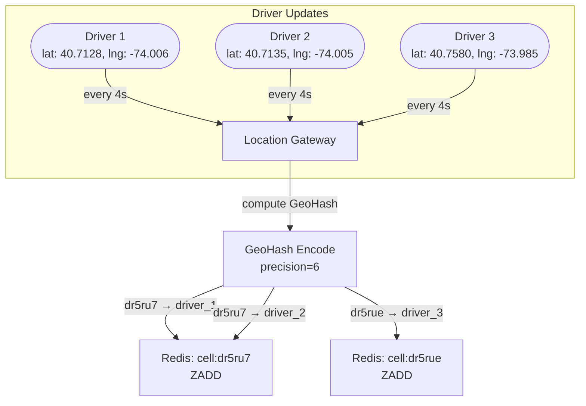
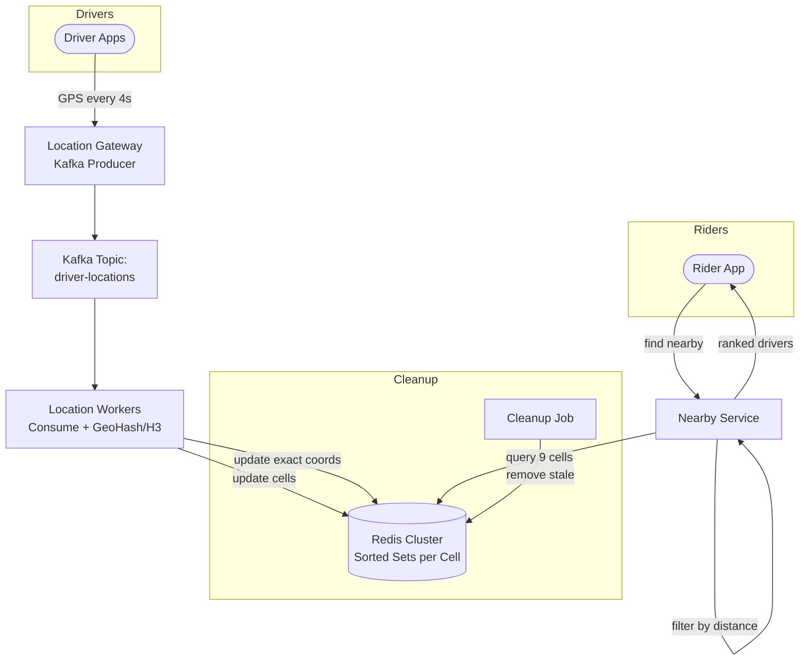

A rider opens the Uber app and taps "Request Ride." Within 2 seconds, the app shows 8 nearby drivers on the map. Behind the scenes, the system must answer: "Which available drivers are within 3km of latitude 40.7128, longitude -74.0060?" — and answer it in under 100ms, while simultaneously ingesting **millions of GPS updates per second** from drivers moving in real-time. This is a fundamentally different problem from static nearby search (Yelp restaurants don't move). The write rate is extreme, the data is constantly stale, and reads must still be fast.

## Access Patterns

| Pattern | Characteristics |
|---------|----------------|
| **Writes** | Every active driver sends GPS coordinates every **4 seconds**. 5 million concurrent drivers = ~1.25 million writes/second. Each write updates a single driver's position. |
| **Reads** | Rider requests nearby drivers. Need all available drivers within radius (e.g., 3km). Must return in <100ms. Read rate depends on active riders — typically 10-100K reads/second. |
| **Staleness** | A driver's stored position is already 0-4 seconds old when used. Acceptable — at city speeds (30 km/h), 4 seconds = 33 meters of error. |

The write rate dominates. Any storage system for this problem must handle **millions of point updates per second** where each update invalidates the previous position.

## Design: GeoHash + Redis Sorted Sets

### Core Idea

1. Hash each driver's location to a [GeoHash](../geohash) cell at a fixed precision
2. Store drivers in Redis sorted sets, one per GeoHash cell
3. To find nearby drivers: compute the 9 surrounding GeoHash cells, query all 9 sorted sets



### Write Path: Driver Location Update

When a driver sends a GPS update:

```python
import geohash2 as geohash
import time

def update_driver_location(driver_id, lat, lng):
    new_cell = geohash.encode(lat, lng, precision=6)
    
    # Get driver's previous cell (stored in a separate hash)
    old_cell = redis.hget("driver:cell", driver_id)
    
    if old_cell and old_cell != new_cell:
        # Driver moved to a different cell — remove from old
        redis.zrem(f"cell:{old_cell}", driver_id)
    
    # Add/update driver in new cell's sorted set
    # Score = current timestamp (for TTL-based cleanup)
    redis.zadd(f"cell:{new_cell}", {driver_id: time.time()})
    
    # Remember which cell this driver is in
    redis.hset("driver:cell", driver_id, new_cell)
    
    # Store exact coordinates for distance calculation
    redis.hset(f"driver:loc:{driver_id}", mapping={
        "lat": lat, "lng": lng, "ts": time.time()
    })
```

**Why sorted set with timestamp as score?** It enables stale location cleanup (see below). The score is not used for ranking in queries — it's used for TTL-like expiry.

### Read Path: Find Nearby Drivers

When a rider requests nearby drivers:

```python
def find_nearby_drivers(rider_lat, rider_lng, radius_km=3):
    # 1. Compute rider's GeoHash cell + 8 neighbors
    center = geohash.encode(rider_lat, rider_lng, precision=6)
    neighbors = geohash.neighbors(center)
    cells = [center] + neighbors  # 9 cells
    
    # 2. Fetch all drivers from these 9 cells
    candidates = []
    now = time.time()
    for cell in cells:
        # Get all drivers in this cell with timestamps
        drivers = redis.zrangebyscore(
            f"cell:{cell}",
            min=now - 30,  # only drivers updated in last 30 seconds
            max=now,
            withscores=True
        )
        candidates.extend(drivers)
    
    # 3. Fetch exact coordinates and compute distance
    nearby = []
    for driver_id, last_seen in candidates:
        loc = redis.hgetall(f"driver:loc:{driver_id}")
        dist = haversine(rider_lat, rider_lng, float(loc["lat"]), float(loc["lng"]))
        if dist <= radius_km:
            nearby.append({
                "driver_id": driver_id,
                "distance_km": round(dist, 2),
                "last_seen": last_seen
            })
    
    # 4. Sort by distance
    return sorted(nearby, key=lambda d: d["distance_km"])
```

### GeoHash Precision Choice

The GeoHash precision must match the search radius. Too fine = too many cells to query. Too coarse = too many false positives to filter.

| Search Radius | GeoHash Precision | Cell Size | Cells Queried | Result |
|--------------|-------------------|-----------|---------------|--------|
| 3 km | 5 (~5km cells) | 4.9 × 4.9 km | 9 cells = ~220 km² | Too many false positives |
| 3 km | **6 (~1km cells)** | 1.2 × 0.6 km | 9 cells = ~6.5 km² | Good balance |
| 3 km | 7 (~150m cells) | 153 × 153 m | 9 cells = ~0.2 km² | Misses drivers 200m-3km away |

**Precision 6 is the sweet spot** for km-scale radius queries. For finer searches (within a building), use precision 7 or 8.

## Stale Location Cleanup

When a driver closes the app or loses connectivity, their location becomes stale. Without cleanup, ghost drivers appear in search results.

**Approach:** use the sorted set scores (timestamps) for implicit TTL.

```python
def cleanup_stale_drivers():
    """Run periodically or triggered per cell on read."""
    cutoff = time.time() - 30  # 30 seconds = stale
    
    # For each active cell, remove drivers with score < cutoff
    for cell_key in redis.scan_iter("cell:*"):
        removed = redis.zremrangebyscore(cell_key, "-inf", cutoff)
```

The read path already filters by timestamp (`zrangebyscore min=now-30`), so stale entries don't appear in results even before cleanup runs. The cleanup job is for memory reclamation.

**Alternative: driver heartbeat resets TTL.** Each GPS update refreshes the score. If a driver's score falls more than 30 seconds behind, they're treated as offline.

## H3: Uber's Production System

Uber's actual production system uses **H3** — a hexagonal hierarchical spatial index — instead of GeoHash. The core design pattern (cell-based indexing + sorted sets) remains the same, but the cell geometry is better.

### Why Hexagons?

```
GeoHash (rectangles):         H3 (hexagons):
┌────┬────┬────┐              ⬡ ⬡ ⬡ ⬡ 
│    │    │    │             ⬡ ⬡ ⬡ ⬡ ⬡
├────┼────┼────┤              ⬡ ⬡ ⬡ ⬡
│    │ ★  │    │             ⬡ ⬡ ★ ⬡ ⬡
├────┼────┼────┤              ⬡ ⬡ ⬡ ⬡
│    │    │    │             ⬡ ⬡ ⬡ ⬡ ⬡
└────┴────┴────┘              ⬡ ⬡ ⬡ ⬡

Rectangle neighbors: 8        Hexagon neighbors: 6
Corner neighbors are farther   All neighbors are equidistant
  than edge neighbors            from center
```

| Property | GeoHash (Rectangle) | H3 (Hexagon) |
|----------|-------------------|---------------|
| Neighbor distance | Corner neighbors are √2× farther than edge neighbors | All 6 neighbors are equidistant from center |
| Cell area uniformity | Varies with latitude (see [GeoHash](../specialized/geohash#limitations)) | Near-uniform globally (icosahedron projection) |
| Cells to search for radius | 9 (including corners that barely overlap) | 7 (center + 6 neighbors, all meaningful) |
| Resolution levels | Determined by string length | 16 predefined resolutions (0-15) |
| Implementation | Simple string encoding | Library required (`h3-py`, `h3-java`) |

```python
import h3

# Encode lat/lng to H3 cell at resolution 9 (~0.1 km² per cell)
cell = h3.latlng_to_cell(40.7128, -74.0060, res=9)
# cell = "892a1008003ffff"

# Get the ring of neighboring cells at distance 1
neighbors = h3.grid_disk(cell, k=1)
# Returns 7 cells: center + 6 surrounding hexagons

# For a larger radius, increase k
ring_2 = h3.grid_disk(cell, k=2)
# Returns 19 cells: center + 2 rings of hexagons
```

The rest of the architecture (Redis sorted sets per cell, write/read paths, stale cleanup) works identically — just swap GeoHash encoding for H3 encoding.

## Full Architecture



### Why Kafka in the Write Path?

Drivers produce ~1.25M location updates/second. Writing all of them directly to Redis risks overwhelming it during spikes. Kafka acts as a buffer:
- **Absorbs write spikes** (surge events, concerts ending)
- **Enables multiple consumers**: location index, trip tracking, analytics, surge pricing all consume the same stream
- **Provides replay**: if the Redis cluster fails and rebuilds, replay the last 30 seconds of locations to repopulate

### Redis Cluster Sharding

With millions of drivers, a single Redis node can't hold all cells. Shard by cell key:

```
cell:dr5ru7 → Redis node A  (consistent hashing)
cell:dr5ru8 → Redis node B
cell:dr5rue → Redis node A
```

The 9-cell read query fans out to at most 9 different Redis nodes (usually fewer, since neighboring cells often hash to the same node). A scatter-gather pattern collects results from all nodes before merging and filtering.


**Hot cells:** a stadium with 50,000 ride requests in 5 minutes means one GeoHash cell gets hammered. Mitigation: for hot cells, replicate the sorted set to multiple Redis nodes and load-balance reads across replicas. Alternatively, use a finer GeoHash precision for the hot area to spread load across more cells.



**Interview tip:** "Drivers send GPS every 4 seconds — that's ~1.25M writes/sec for 5M concurrent drivers. I'd buffer through Kafka and have workers encode each update to a GeoHash cell (or H3 hex), storing driver IDs in Redis sorted sets keyed by cell. The score is the timestamp, which gives implicit TTL for stale cleanup. For 'find nearby drivers,' I compute the 9 surrounding cells, fetch from Redis, and post-filter by exact Haversine distance. In production, Uber uses H3 hexagons for uniform cell areas. Hot cells near stadiums or airports get replicated across Redis nodes to handle read spikes."


## Test Your Understanding


**The read path still works, but quality degrades.** Your `ZRANGEBYSCORE` uses `min=now-30` to filter stale entries. If a driver's timestamp is 34 seconds old, they disappear from search results — riders see fewer available drivers even though drivers are actually nearby.

**Mitigation:** Widen the staleness window during surges (e.g., `min=now-60`), accept coarser results, and auto-scale Kafka consumers. The 30-second TTL is a tunable trade-off between freshness and availability — during surges, availability wins.



**The sorted set timestamp-as-score pattern handles this.** The driver's last GPS update was (at most) 4 seconds before they closed the app. After 30 seconds with no new update, `ZRANGEBYSCORE` with `min=now-30` excludes them. The ghost window is at most ~30 seconds, not 60.

**For the matching service specifically:** After retrieving nearby drivers from Redis, the matching service should ping the driver's app via push notification or WebSocket before confirming a match. If no acknowledgment within 5 seconds, skip to the next driver. This is the "offer timeout" pattern — Uber gives drivers 15 seconds to accept.



**No — at 100K drivers in one city, GeoHash is simpler and sufficient.** H3's advantages (uniform cell area, equidistant neighbors) matter at global scale with billions of queries. At 100K drivers, the 9-cell GeoHash query returns maybe 50 candidates per cell — the post-filter Haversine distance check is trivial.

**Choose H3 when:** you operate globally (cell area varies 2× with latitude for GeoHash), need uniform hexagonal cells for surge pricing algorithms, or your ML models depend on consistent cell geometry. For an MVP, GeoHash with Redis sorted sets gets you to production in a week.
