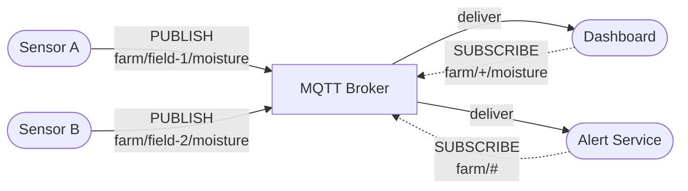
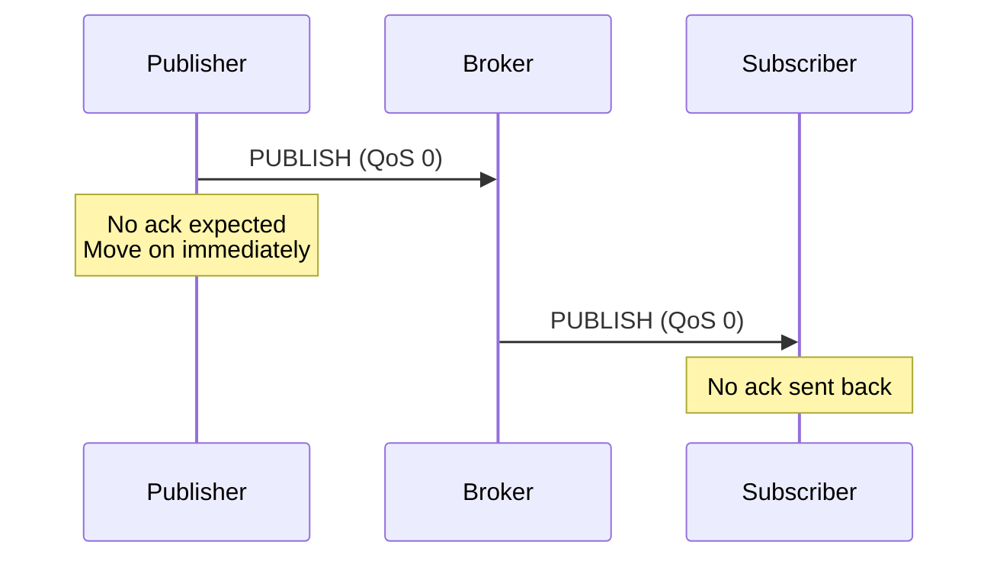
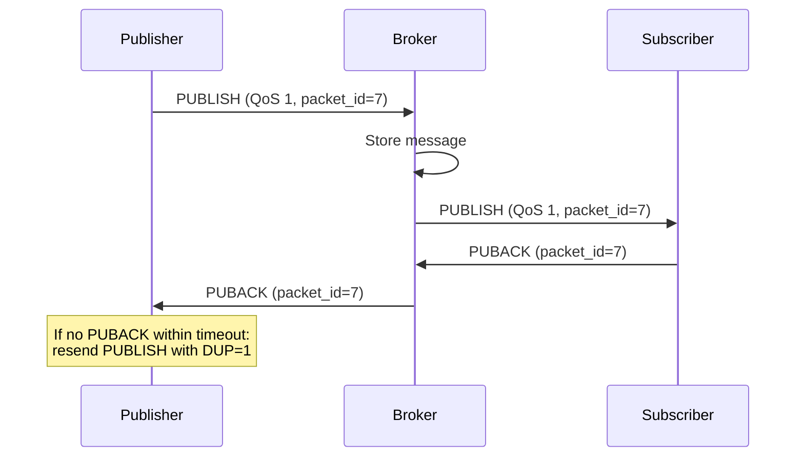
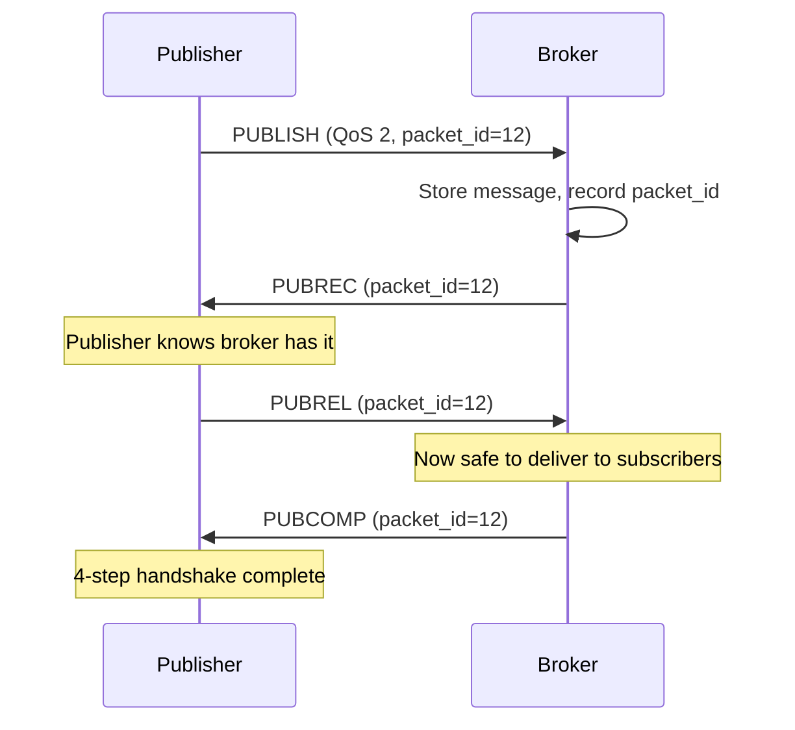
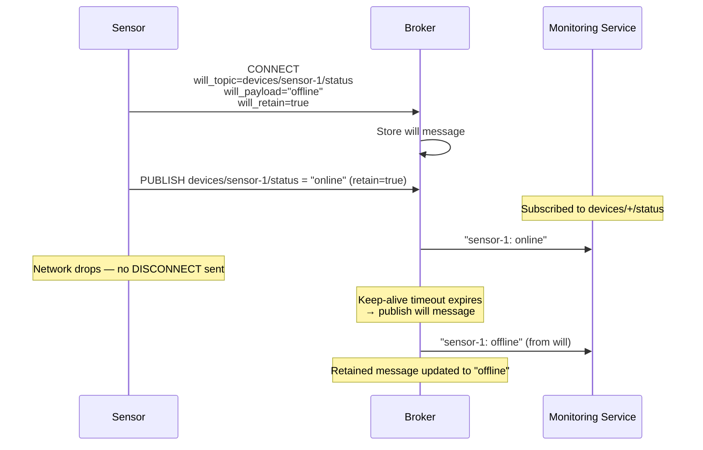
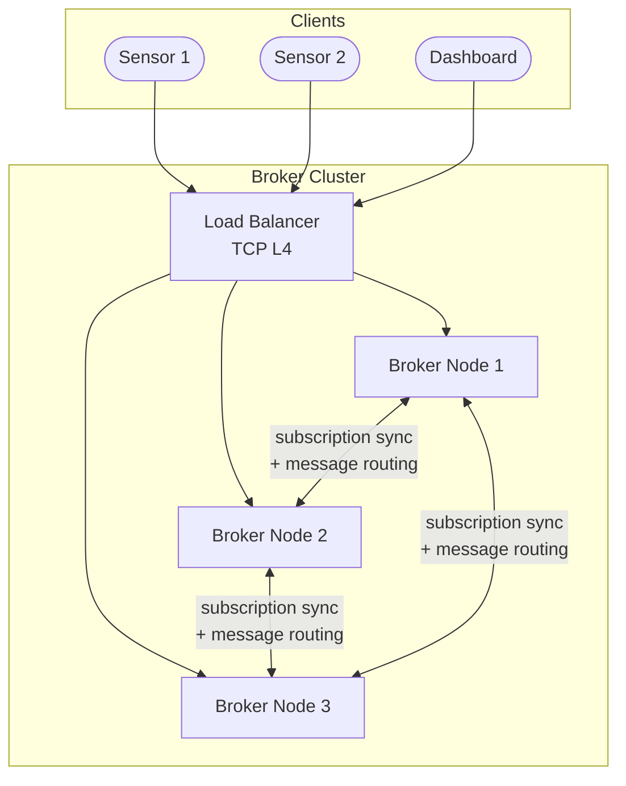

A soil moisture sensor buried in a farm field runs on a coin-cell battery and connects to the internet through a 2G cellular modem. It needs to send a 12-byte reading once every 10 minutes and receive a command to change its reporting interval. HTTP is out of the question — the TLS handshake alone would drain the battery in days, and the TCP overhead per request dwarfs the actual payload. **MQTT** (Message Queuing Telemetry Transport) was designed precisely for this: a lightweight publish-subscribe protocol that delivers messages reliably over constrained networks with minimal overhead.

## Protocol Fundamentals

MQTT runs over TCP (port 1883 unencrypted, 8883 with TLS). The protocol defines a **broker** at the center and **clients** that connect to it. Clients never communicate directly — all messages flow through the broker.



### CONNECT and Keep-Alive

Every MQTT session starts with a `CONNECT` packet. The overhead is minimal compared to HTTP:

```
MQTT CONNECT packet:
  Fixed header:     2 bytes
  Protocol name:    6 bytes ("MQTT" + length)
  Protocol level:   1 byte  (4 for MQTT 3.1.1, 5 for MQTT 5.0)
  Connect flags:    1 byte  (clean session, will, auth)
  Keep-alive:       2 bytes (seconds between pings)
  Client ID:        variable (e.g., "sensor-a-field-1")
  Total:           ~20–50 bytes

HTTP equivalent (minimal GET):
  "GET / HTTP/1.1\r\nHost: api.example.com\r\n\r\n"
  Total:           ~50+ bytes (headers alone, before TLS)
```

The `keep-alive` field tells the broker: "if you don't hear from me within this many seconds, I'm dead." The client sends `PINGREQ` packets to keep the connection alive during idle periods. The broker responds with `PINGRESP`. If the broker receives nothing within 1.5× the keep-alive interval, it closes the connection and triggers the **Last Will and Testament** (LWT).

### Topic Structure

MQTT topics are hierarchical strings separated by `/`. They are not pre-declared — publishing to a topic creates it implicitly.

```
home/living-room/temperature
home/living-room/humidity
home/kitchen/temperature
factory/line-3/machine-42/vibration
fleet/truck-1092/gps
```

**Wildcards** (subscribe only, never publish):
- `+` matches exactly one level: `home/+/temperature` matches `home/living-room/temperature` and `home/kitchen/temperature`
- `#` matches zero or more levels: `home/#` matches everything under `home/`

```python
# Topic matching examples
def topic_matches(subscription: str, topic: str) -> bool:
    sub_parts = subscription.split("/")
    topic_parts = topic.split("/")

    for i, sub in enumerate(sub_parts):
        if sub == "#":
            return True  # matches everything from here
        if i >= len(topic_parts):
            return False
        if sub == "+":
            continue      # matches this single level
        if sub != topic_parts[i]:
            return False

    return len(sub_parts) == len(topic_parts)

# Examples:
# topic_matches("home/+/temp", "home/kitchen/temp")     → True
# topic_matches("home/+/temp", "home/floor/room/temp")  → False
# topic_matches("home/#", "home/kitchen/temp")           → True
# topic_matches("home/#", "home")                        → True
```

## QoS Levels

MQTT defines three Quality of Service levels that control the delivery guarantee per message. The QoS is set per publish and per subscription — the broker delivers at the **minimum** of the two.

### QoS 0: At Most Once (Fire-and-Forget)



The message is sent once. No acknowledgment, no retry, no storage. If the network drops the packet, it's gone.

**Use case:** High-frequency telemetry where individual readings don't matter — temperature every second, GPS coordinates every 4 seconds. Missing one reading is fine because the next one arrives immediately.

### QoS 1: At Least Once



The sender retransmits until it receives a `PUBACK`. This guarantees delivery but **may deliver duplicates** — if the `PUBACK` is lost, the sender retries, and the broker delivers the message again.

**Use case:** Alert notifications, command delivery, state changes — where missing a message is unacceptable but receiving it twice is handled by the consumer (idempotent processing).

### QoS 2: Exactly Once



A four-step handshake ensures exactly-once delivery. The broker stores the `packet_id` to deduplicate retransmissions and only delivers to subscribers after receiving `PUBREL`.

**Use case:** Billing events, actuator commands (unlock a door, dispense medication) — where duplication has real-world consequences.

| QoS | Guarantee | Packets per message | Latency | Use case |
|-----|-----------|-------------------|---------|----------|
| **0** | At most once | 1 | Lowest | High-frequency telemetry, non-critical data |
| **1** | At least once | 2 (PUBLISH + PUBACK) | Low | Alerts, state changes, most IoT use cases |
| **2** | Exactly once | 4 (PUBLISH → PUBREC → PUBREL → PUBCOMP) | Highest | Billing, actuator commands, critical operations |


**QoS 2 is expensive.** Four network round-trips per message is significant on high-latency or lossy networks. In practice, most IoT systems use QoS 1 with idempotent consumers rather than paying the cost of QoS 2. The same "idempotency key" pattern used in HTTP APIs works here — include a unique event ID in the payload and deduplicate on the consumer side.


## Retained Messages

When a sensor publishes `farm/field-1/moisture = 42%`, and a dashboard subscribes 5 minutes later, the dashboard sees nothing — it missed the message. Without retained messages, a new subscriber must wait for the next publish to learn the current state.

A **retained message** tells the broker: "store this message and deliver it immediately to any future subscriber on this topic."

```
# Publish with retain flag
PUBLISH topic=farm/field-1/moisture, payload=42%, retain=true

# Broker stores: topic → last retained message

# 5 minutes later, a new subscriber connects:
SUBSCRIBE farm/field-1/moisture
# Broker immediately delivers the retained message: 42%
# From now on, also delivers new publishes in real-time
```

Only **one** retained message is stored per topic — the latest one. Publishing a new retained message replaces the previous one. Publishing an empty retained message (zero-length payload) clears the retained message for that topic.

```python
class RetainedMessageStore:
    """Broker-side retained message storage."""

    def __init__(self):
        self.retained: dict[str, bytes] = {}

    def on_publish(self, topic: str, payload: bytes, retain: bool):
        if retain:
            if payload:
                self.retained[topic] = payload
            else:
                # Empty payload = clear retained message
                self.retained.pop(topic, None)

    def on_subscribe(self, topic_filter: str) -> list[tuple[str, bytes]]:
        """Return all retained messages matching the subscription."""
        results = []
        for topic, payload in self.retained.items():
            if topic_matches(topic_filter, topic):
                results.append((topic, payload))
        return results
```

**Production pattern:** Retained messages are used for device status (`online`/`offline`), current configuration, and last-known sensor values. They replace the need for a "what's the current state?" API call — the broker serves it from the retained store.

## Last Will and Testament (LWT)

When a client connects, it can register a "will message" — a message the broker publishes **on the client's behalf** if the client disconnects ungracefully (network loss, crash, keep-alive timeout).



The combination of **retained messages + LWT** gives you a complete device presence system:
1. On connect: publish `status = "online"` with `retain=true`
2. Register LWT: `status = "offline"` with `retain=true`
3. If the device disconnects cleanly: explicitly publish `status = "offline"` and send `DISCONNECT`
4. If the device crashes: broker publishes the LWT automatically

Any new subscriber to the device's status topic immediately gets the current state from the retained message — whether the device is online or offline.

## Clean Sessions vs Persistent Sessions

When a client connects with `clean_session=false` (MQTT 3.1.1) or `session_expiry_interval > 0` (MQTT 5.0), the broker maintains a **persistent session**:

- Stores the client's subscriptions
- Queues QoS 1 and QoS 2 messages that arrive while the client is offline
- Delivers queued messages when the client reconnects

```
Scenario: sensor disconnects for 30 minutes

clean_session=true:
  - Subscriptions lost on disconnect
  - Messages during offline period: lost
  - On reconnect: must re-subscribe, missed messages are gone

clean_session=false:
  - Subscriptions preserved by broker
  - QoS 1/2 messages queued by broker (up to broker's limit)
  - On reconnect: broker delivers queued messages automatically
```

| Session type | Subscriptions on reconnect | Offline QoS 0 messages | Offline QoS 1/2 messages | Memory cost |
|-------------|---------------------------|----------------------|------------------------|-------------|
| **Clean** | Must re-subscribe | Lost | Lost | None on broker |
| **Persistent** | Preserved | Lost (QoS 0 = fire-and-forget) | Queued and delivered | Broker stores queued messages |


**Persistent sessions can overwhelm the broker.** If 100K sensors disconnect overnight and each accumulates 1,000 queued messages, that's 100M messages in broker memory. Production brokers enforce per-client queue limits (e.g., EMQX `max_mqueue_len = 1000`) and discard oldest messages when the limit is reached. Always set queue limits and monitor queue depth.


## Broker Clustering

A single MQTT broker can handle 100K–1M concurrent connections. Beyond that, or for high availability, you need a clustered deployment.



### How Cluster Routing Works

1. Sensor 1 connects to Broker 1 and publishes to `farm/field-1/moisture`
2. Dashboard connects to Broker 3 and subscribes to `farm/+/moisture`
3. Broker 3 records the subscription and propagates it to Broker 1 and Broker 2
4. When Broker 1 receives the publish, it checks the cluster subscription table and forwards to Broker 3
5. Broker 3 delivers to the Dashboard

**Subscription synchronization** is the key cost. Each broker maintains a routing table of which subscriptions exist on which other brokers. With wildcard subscriptions, the routing logic must evaluate every publish against all wildcard patterns.

### Production Brokers

| Broker | Language | Clustering | Connections per node | Notable features |
|--------|----------|-----------|---------------------|-----------------|
| **EMQX** | Erlang | Built-in (Mria/Mnesia) | 5M+ | Rule engine, webhook integration, Kubernetes operator |
| **HiveMQ** | Java | Built-in | 10M+ | Enterprise features, control center UI, extension system |
| **VerneMQ** | Erlang | Built-in (Plumtree) | 1M+ | Open-source, Kubernetes-friendly |
| **Mosquitto** | C | None (single node) | 100K | Ultra-lightweight, ideal for edge/testing |
| **NanoMQ** | C | Bridge mode | 1M+ | Edge-focused, low resource footprint |

### Cross-Region Bridging

For global deployments, broker clusters in different regions connect via **bridges** — a bridge is a special client that subscribes to topics on one broker and republishes to another.

```
Region: US-East                    Region: EU-West
┌──────────────┐                   ┌──────────────┐
│ EMQX Cluster │◄── bridge ──────►│ EMQX Cluster │
│  (3 nodes)   │   (bidirectional) │  (3 nodes)   │
└──────────────┘                   └──────────────┘
     ▲                                    ▲
     │                                    │
 US sensors                          EU sensors
```

Bridges selectively forward topics — you don't replicate everything across regions. Typical pattern: bridge `devices/#` for global device management, but keep `local/analytics/#` regional.

## MQTT vs WebSockets

Both are real-time messaging protocols, but they're designed for different environments.

| Property | MQTT | WebSocket |
|----------|------|-----------|
| **Transport** | TCP (binary, compact) | TCP (HTTP upgrade, then binary or text frames) |
| **Message overhead** | 2 bytes minimum header | 2–14 bytes frame header + HTTP upgrade overhead |
| **Messaging pattern** | Pub/sub (topic-based) | Point-to-point (application defines any pattern) |
| **QoS / delivery guarantee** | Built-in (QoS 0/1/2) | None — application must implement |
| **Offline message queuing** | Built-in (persistent sessions) | None — application must implement |
| **Last Will (auto-disconnect notification)** | Built-in | None — must detect via heartbeat |
| **Retained messages (current state)** | Built-in | None — must query API |
| **Browser support** | Via MQTT-over-WebSocket adapter | Native |
| **Client footprint** | ~100 KB library, minimal RAM | Requires HTTP stack + WebSocket library |
| **Best for** | IoT devices, constrained networks, sensor telemetry | Browser apps, chat, collaboration, gaming |

### When to Choose MQTT

- **Constrained devices:** microcontrollers with 256 KB RAM, battery-powered sensors
- **Unreliable networks:** cellular (2G/3G), satellite, mesh networks with frequent disconnections
- **Built-in QoS needed:** delivery guarantees without implementing retry logic in every client
- **Millions of devices with simple publish patterns:** sensors publishing readings on a schedule
- **Offline tolerance:** devices that disconnect for hours and need messages queued

### When to Choose WebSockets

- **Browser clients:** MQTT has no native browser API; WebSockets are built into every browser
- **Bidirectional application protocols:** chat, multiplayer games, collaborative editing
- **Custom message formats:** you need full control over the protocol on top of the transport
- **Existing HTTP infrastructure:** load balancers, API gateways, CDNs all understand WebSockets

### MQTT over WebSockets

For hybrid architectures where browser dashboards need to consume MQTT data, most brokers support **MQTT over WebSockets** — the MQTT binary protocol is tunneled inside WebSocket frames. The browser runs an MQTT.js client that connects via `wss://broker:8084/mqtt`.

```
IoT sensor  ── MQTT (TCP:1883) ──►  ┌──────────┐  ◄── MQTT-over-WS (WSS:8084) ── Browser
                                     │  EMQX    │
IoT sensor  ── MQTT (TCP:1883) ──►  │  Broker  │  ◄── MQTT-over-WS (WSS:8084) ── Mobile App
                                     └──────────┘
```

This gives you the best of both worlds: constrained devices use native MQTT over TCP, while browser clients use MQTT over WebSockets — all connected to the same topic namespace through the same broker.

## MQTT 5.0 Improvements

MQTT 5.0 (released 2019) added significant features over 3.1.1:

| Feature | What it does | Why it matters |
|---------|-------------|---------------|
| **Shared subscriptions** | `$share/group/topic` — load-balance messages across subscribers | Horizontal scaling of consumers without application-level balancing |
| **Message expiry** | TTL per message; broker discards expired messages | Prevents stale data delivery after long offline periods |
| **Request/Response** | `response_topic` + `correlation_data` properties | Enables RPC-style patterns over pub/sub without custom topic conventions |
| **Topic aliases** | Map long topic strings to short integer aliases | Reduces per-message overhead for repeated publishes to the same topic |
| **User properties** | Key-value metadata attached to any packet | Custom headers (trace IDs, content types) without embedding in payload |
| **Session expiry interval** | Configurable session lifetime after disconnect | Replaces binary clean_session flag with fine-grained control |


**Interview tip:** MQTT rarely comes up as a primary system design topic, but it appears when designing IoT platforms, fleet management, or smart home systems. The key differentiator to articulate: "MQTT is a binary pub/sub protocol designed for constrained devices and unreliable networks. It has built-in QoS levels for delivery guarantees, retained messages for current state, persistent sessions for offline queuing, and Last Will for automatic disconnect detection — features that WebSockets require you to build from scratch. I'd use MQTT for device-to-cloud telemetry and WebSockets for browser-to-server real-time communication, bridged through the same MQTT broker if both need the same data."

