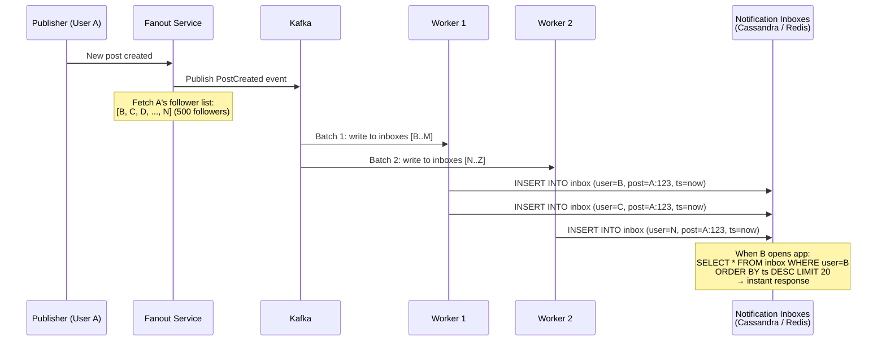
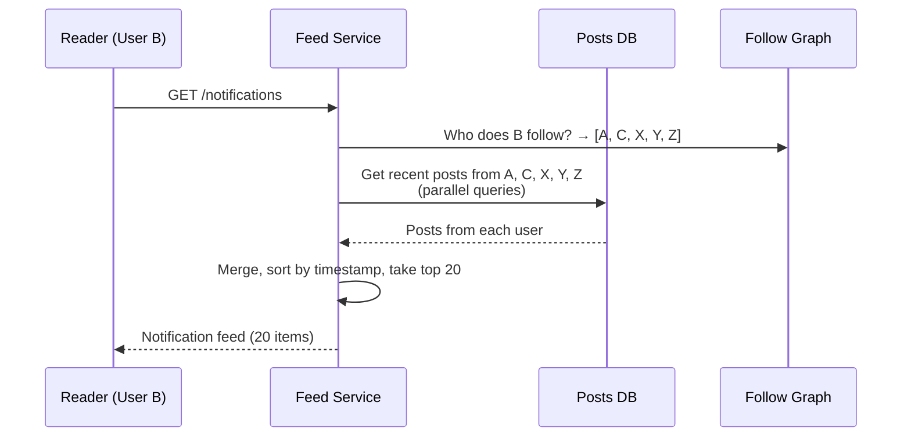
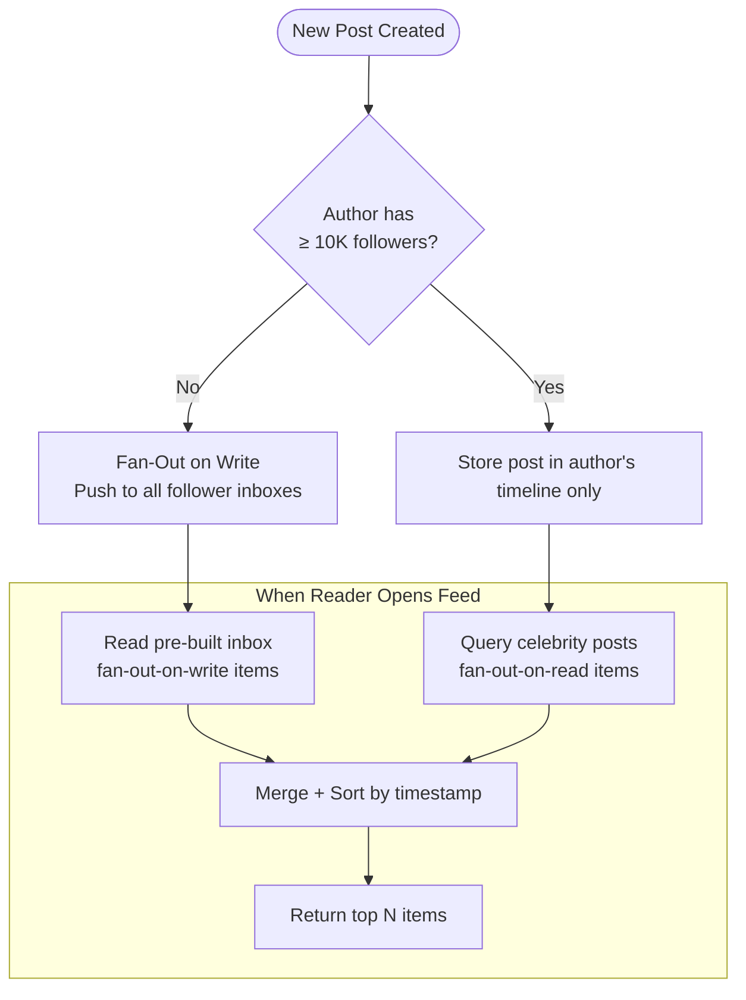
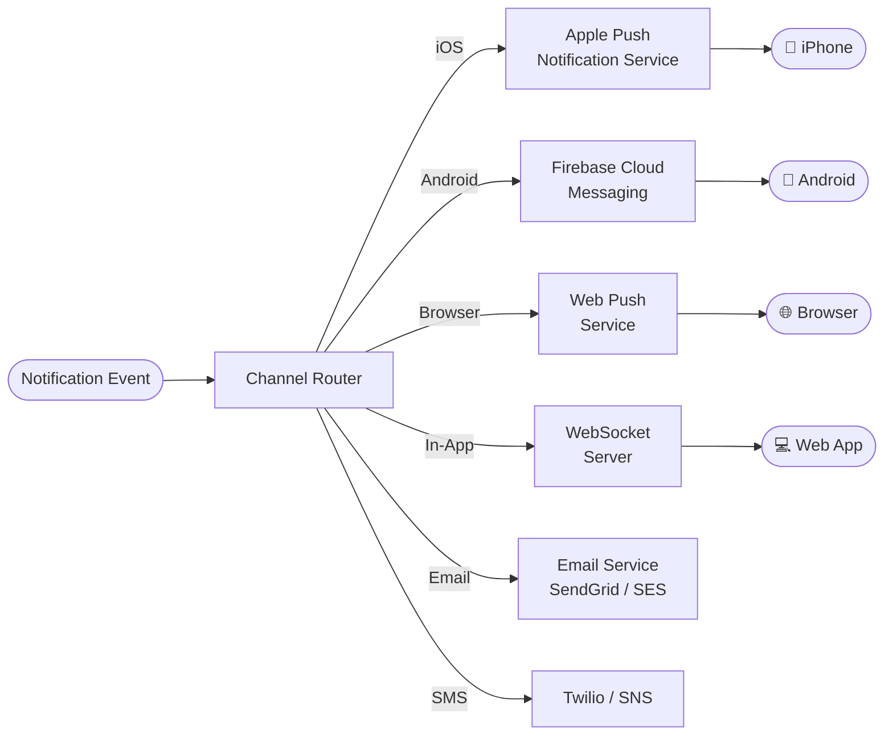
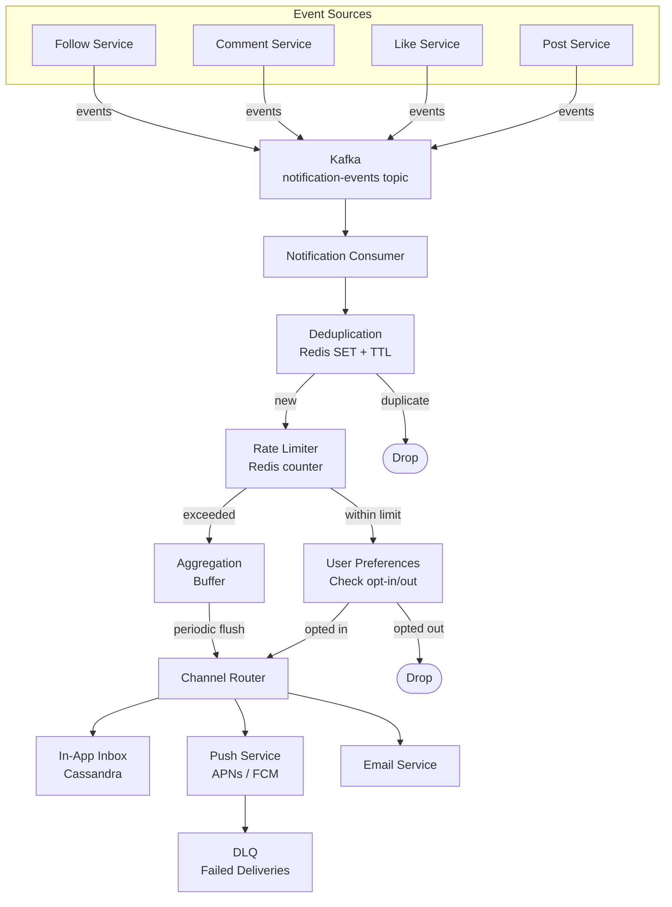

A user with 50 followers posts a photo. The system writes the notification to 50 inboxes in under a second — no problem. Now a celebrity with 30 million followers posts. Writing 30 million notification rows takes minutes, blocks the write path, and the celebrity's post appears in followers' feeds long after the moment has passed. The core design question in any notification or feed system is: **when and where do you pay the cost of distributing content to recipients?**

## Fan-Out on Write (Push Model)

When content is created, **immediately** write it to every follower's notification inbox. Readers simply fetch their pre-built inbox — no computation at read time.



### How It Works

1. User A publishes content (post, comment, like)
2. Fanout service fetches A's follower list
3. For each follower, write a row to their notification inbox (Cassandra, Redis sorted set, or similar)
4. When follower B opens the app, read B's inbox — it's already populated

```python
async def fanout_on_write(event: PostCreatedEvent, follower_store, inbox_store):
    """Push notification to every follower's inbox."""
    followers = await follower_store.get_followers(event.author_id)

    # Batch write to avoid N individual round-trips
    batch = []
    for follower_id in followers:
        batch.append({
            "user_id": follower_id,
            "notification": {
                "type": "new_post",
                "from": event.author_id,
                "post_id": event.post_id,
                "timestamp": event.created_at,
            }
        })
        if len(batch) >= 500:
            await inbox_store.batch_insert(batch)
            batch = []

    if batch:
        await inbox_store.batch_insert(batch)
```

| Advantage | Disadvantage |
|-----------|-------------|
| **Read is O(1)** — inbox is pre-built, just fetch top N | **Write amplification** — 1 post → N inbox writes |
| Simple read path, low read latency | Celebrity with 30M followers → 30M writes per post |
| Notification count (`unread_count`) trivially maintained | Wasted writes for inactive users who never check notifications |
| Works well when follower counts are bounded | Storage grows linearly with (posts × avg followers) |

## Fan-Out on Read (Pull Model)

Write nothing at publish time. When a user opens their notification feed, **compute it on the fly** by querying all the people they follow and merging recent activity.



```python
async def fanout_on_read(user_id: str, follow_store, post_store, limit=20):
    """Compute notification feed at read time."""
    followed_users = await follow_store.get_following(user_id)

    # Parallel fetch recent posts from each followed user
    tasks = [
        post_store.get_recent_posts(uid, limit=limit)
        for uid in followed_users
    ]
    all_posts = await asyncio.gather(*tasks)

    # Merge and sort
    merged = sorted(
        [post for user_posts in all_posts for post in user_posts],
        key=lambda p: p["timestamp"],
        reverse=True,
    )
    return merged[:limit]
```

| Advantage | Disadvantage |
|-----------|-------------|
| **Write is O(1)** — just store the post once | **Read is O(following)** — must query and merge from all followed users |
| No wasted work for inactive users | Read latency grows with number of followed users |
| Celebrity posts don't cause write storms | Requires a merge-sort across multiple data sources at query time |
| Storage-efficient — no denormalization | Harder to maintain accurate unread counts |

### Why Pure Pull Doesn't Work at Scale

If user B follows 500 people, the feed service must issue 500 parallel queries and merge the results on every feed load. With millions of users loading feeds per second, the query fan-out overwhelms the posts database. Caching helps, but cache invalidation on every new post is its own problem.

## The Hybrid Approach

The insight: the write cost problem only exists for users with **many followers**. For the vast majority of users (< 10K followers), fan-out on write is fast and cheap. Only celebrities cause write storms.

```
Fan-out strategy per user:
  followers < 10,000  →  fan-out on write (push to inboxes)
  followers ≥ 10,000  →  fan-out on read  (merge at query time)
```



### Read Path with Hybrid

When user B opens their feed:

1. **Fetch inbox:** Read B's pre-built notification inbox (contains items from non-celebrity followed users) — O(1)
2. **Fetch celebrity posts:** For each celebrity B follows, query their recent posts — O(celebrities followed)
3. **Merge:** Combine both sets, sort by timestamp, return top N

```python
CELEBRITY_THRESHOLD = 10_000

async def hybrid_feed(user_id: str, inbox_store, follow_store,
                      post_store, user_store, limit=20):
    """Hybrid fanout: pre-built inbox + on-demand celebrity merge."""

    # 1. Pre-built inbox (fan-out on write items)
    inbox_items = await inbox_store.get_inbox(user_id, limit=limit)

    # 2. Find celebrities the user follows
    following = await follow_store.get_following(user_id)
    celebrity_ids = [
        uid for uid in following
        if await user_store.get_follower_count(uid) >= CELEBRITY_THRESHOLD
    ]

    # 3. Fetch recent posts from celebrities
    celebrity_posts = []
    if celebrity_ids:
        tasks = [
            post_store.get_recent_posts(uid, limit=limit)
            for uid in celebrity_ids
        ]
        results = await asyncio.gather(*tasks)
        celebrity_posts = [p for posts in results for p in posts]

    # 4. Merge and return
    all_items = inbox_items + celebrity_posts
    all_items.sort(key=lambda x: x["timestamp"], reverse=True)
    return all_items[:limit]
```

This is exactly what Twitter (now X) used in production. The threshold is tunable — 10K is a common starting point, but the right value depends on write throughput capacity and acceptable read latency.

## Push Delivery: APNs, FCM, and Web Push

Beyond in-app notification inboxes, notifications must reach users on their **devices** — even when the app is closed.



### Device Token Lifecycle

Each device that wants push notifications must register a **device token** with the platform provider (APNs/FCM). The token is an opaque identifier that the push service uses to route the notification to the correct device.

```python
class DeviceTokenStore:
    """Manage device tokens per user. Users may have multiple devices."""

    async def register(self, user_id: str, device_id: str,
                       platform: str, token: str):
        """Store or update device token."""
        await self.db.upsert("device_tokens", {
            "user_id": user_id,
            "device_id": device_id,
            "platform": platform,       # "ios", "android", "web"
            "token": token,
            "updated_at": time.time(),
        })

    async def get_tokens(self, user_id: str) -> list[dict]:
        """Get all active device tokens for a user."""
        return await self.db.query(
            "SELECT * FROM device_tokens WHERE user_id = %s",
            (user_id,)
        )

    async def remove_invalid(self, token: str):
        """Remove token that APNs/FCM reported as invalid."""
        await self.db.delete("device_tokens",
                             where={"token": token})
```

**Token invalidation matters.** Tokens become invalid when:
- User uninstalls the app
- User resets the device
- Token expires (APNs tokens can expire after extended inactivity)
- User revokes notification permissions

APNs and FCM return error codes for invalid tokens in their response. The notification service **must** process these responses and remove stale tokens — otherwise, you accumulate millions of dead tokens, wasting delivery attempts and eventually getting throttled by the push provider.

### Platform-Specific Constraints

| Platform | Protocol | Payload limit | Batching | Rate limits |
|----------|----------|--------------|----------|-------------|
| **APNs** (iOS) | HTTP/2 to Apple servers | 4 KB | Send individually, multiplex on HTTP/2 | Per-device throttling; no published global limit |
| **FCM** (Android) | HTTP v1 API | 4 KB | Up to 500 recipients per multicast | 240 messages/min per device; 1M/min per project |
| **Web Push** | RFC 8030 (HTTP) | 4 KB | Individual per subscription | Varies by browser push service |


**Do not embed full content in push payloads.** The 4 KB limit is tight. Send a minimal payload (notification type, sender name, content preview) and let the app fetch full details from the API when opened. This also avoids stale content — if the post was edited or deleted between push send and user tap, the app fetches the current state.


## Deduplication

Users must not receive the same notification twice. Duplicates happen because of:
- **Retry after timeout:** push provider didn't ack in time, so the system retries — but the first attempt actually succeeded
- **Multiple event sources:** the same logical event is published more than once (e.g., outbox pattern with at-least-once delivery)
- **Multi-device:** user has 3 devices, and you send to all 3 — that's intentional. But the in-app notification inbox should show it once.

### Deduplication at the Notification Service

```python
class NotificationDeduplicator:
    """Deduplicate notifications using Redis SET with TTL."""

    def __init__(self, redis, ttl_seconds=3600):
        self.redis = redis
        self.ttl = ttl_seconds

    async def is_duplicate(self, notification_key: str) -> bool:
        """Check if this notification was already processed.
        notification_key = f"{user_id}:{event_type}:{entity_id}"
        Example: "user_123:like:post_456" """
        result = await self.redis.set(
            f"dedup:{notification_key}",
            1,
            nx=True,          # only set if not exists
            ex=self.ttl,      # auto-expire after TTL
        )
        return result is None  # None means key already existed

    # Usage in notification pipeline:
    async def process(self, notification):
        dedup_key = (
            f"{notification.recipient_id}:"
            f"{notification.type}:"
            f"{notification.entity_id}"
        )
        if await self.is_duplicate(dedup_key):
            return  # skip — already sent

        await self.deliver(notification)
```

The dedup key encodes the **logical notification identity**: same recipient + same event type + same entity = same notification. The TTL ensures the dedup set doesn't grow unbounded — after 1 hour, a duplicate would be treated as a new notification (which is usually fine; if user X likes a post, unlikes it, and likes it again 2 hours later, that's a new notification).

## Rate Limiting Notifications

Even with deduplication, users can be overwhelmed by notification volume. A user who posts frequently will trigger "liked your post" notifications from many users — potentially hundreds per minute.

### Per-User Notification Throttling

```python
class NotificationRateLimiter:
    """Cap notification frequency per user per type."""

    LIMITS = {
        "like":    {"max": 10, "window": 300},   # 10 likes per 5 min
        "comment": {"max": 5,  "window": 300},   # 5 comments per 5 min
        "follow":  {"max": 20, "window": 3600},  # 20 follows per hour
        "message": {"max": 50, "window": 3600},  # 50 messages per hour
    }

    def __init__(self, redis):
        self.redis = redis

    async def should_notify(self, user_id: str,
                            notification_type: str) -> bool:
        limit = self.LIMITS.get(notification_type)
        if not limit:
            return True

        key = f"notif_rate:{user_id}:{notification_type}"
        count = await self.redis.incr(key)
        if count == 1:
            await self.redis.expire(key, limit["window"])

        return count <= limit["max"]
```

When the limit is exceeded, notifications aren't lost — they're **aggregated**:

```
Instead of 47 individual "X liked your post" notifications:
→ "X and 46 others liked your post"
```

The aggregation worker collects suppressed notifications and, when the user next opens the app or the next batch window fires, delivers a single summary notification.

### Notification Priority

Not all notifications are equal. A direct message is more important than a "someone you might know joined" suggestion.

| Priority | Examples | Delivery |
|----------|----------|----------|
| **Critical** | Direct message, payment received, security alert | Deliver immediately, always push |
| **High** | Comment on your post, mention, friend request | Deliver immediately, respect quiet hours |
| **Medium** | Like on your post, retweet | Batch if rate limited, aggregate |
| **Low** | "People you follow posted", recommendations | Batch into digest, deliver at optimal time |

## End-to-End Architecture



### Pipeline Stages

| Stage | Purpose | Storage |
|-------|---------|---------|
| **Kafka ingestion** | Decouple event producers from notification logic; buffer during spikes | Kafka topic with retention |
| **Deduplication** | Prevent duplicate notifications from at-least-once event delivery | Redis SET with TTL |
| **Rate limiting** | Cap per-user notification frequency to prevent spam | Redis counters with TTL |
| **User preferences** | Respect opt-out settings per notification type and channel | Postgres or cached in Redis |
| **Channel routing** | Route to correct delivery channel (push, email, SMS, in-app) | Routing rules in config |
| **Delivery** | Send via APNs/FCM/SMTP; handle retries with exponential backoff | Per-channel queues |
| **DLQ** | Capture permanently failed deliveries for investigation | Kafka DLQ topic or SQS |

## Fan-Out Strategy Comparison

| Property | Fan-Out on Write | Fan-Out on Read | Hybrid |
|----------|-----------------|----------------|--------|
| **Write cost** | O(followers) per post | O(1) per post | O(non-celebrity followers) |
| **Read cost** | O(1) — pre-built inbox | O(following) — merge at read | O(1) + O(celebrities followed) |
| **Latency to appear** | Seconds (async write) | Instant (computed on demand) | Seconds for most; instant for celebrity content |
| **Storage** | High (denormalized inboxes) | Low (single copy of each post) | Moderate |
| **Celebrity problem** | 30M writes per celebrity post | Solved — no write amplification | Solved — celebrities use pull |
| **Inactive user waste** | Writes to users who never read | No waste | Minimal waste |
| **Complexity** | Simple read, complex write | Complex read, simple write | Most complex — two code paths |
| **Used by** | Early Twitter, Facebook (pre-2015) | Small-scale apps | Twitter (post-2012), Instagram, Facebook |


**Interview tip:** When asked about notification fan-out, say: "I'd use a hybrid approach. For regular users under 10K followers, fan-out on write — push the notification into each follower's inbox via Kafka workers so reads are instant. For celebrities, fan-out on read — store the post once and merge it into the feed at query time. The notification pipeline deduplicates using Redis SETNX with a key of `user:type:entity`, rate-limits per user per notification type, and routes to the correct channel — APNs for iOS, FCM for Android, WebSocket for in-app. Failed deliveries go to a DLQ for retry." This shows you understand the write amplification problem, the hybrid solution, and the full delivery pipeline.

