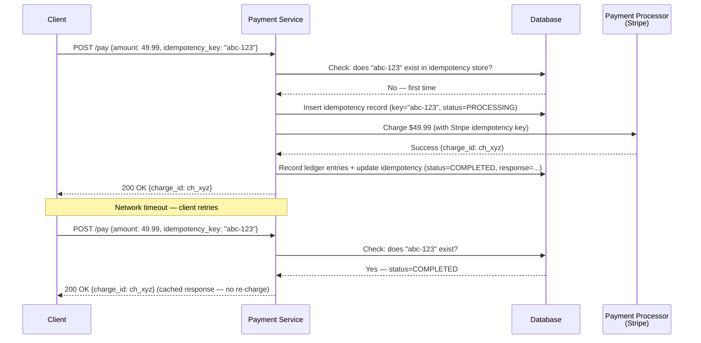
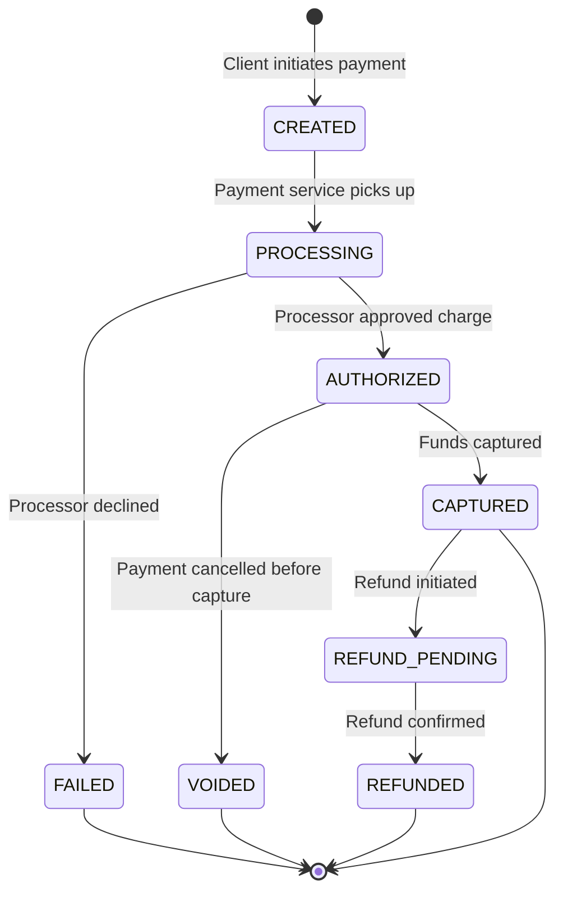
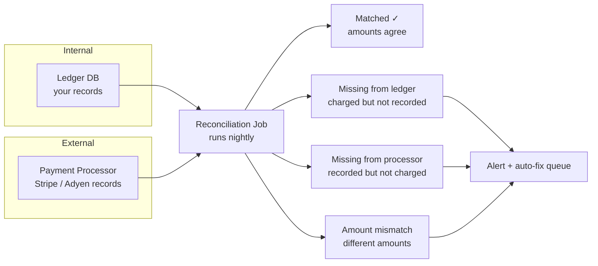
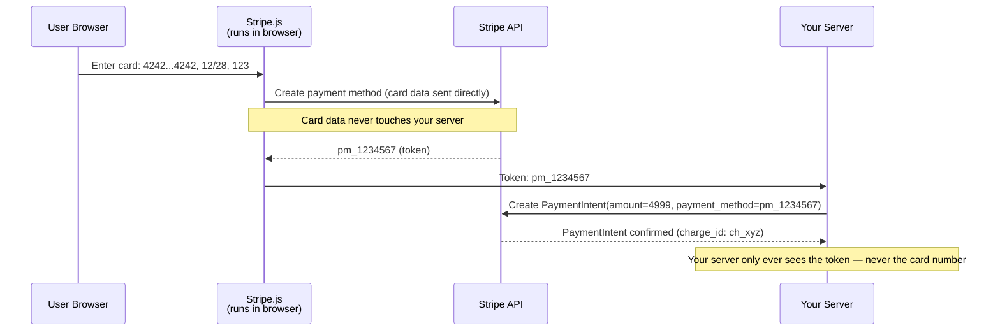
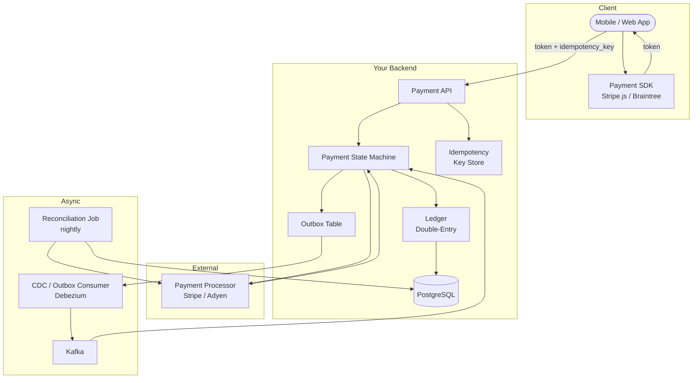

A user taps "Pay $49.99" in your app. The request hits your server, which calls Stripe to charge the card. Stripe returns a success response — but your server crashes before it can record the result in the database. The user's card was charged, but your system has no record of the payment. The user taps "Pay" again. Now they've been charged twice. **Every failure mode in a payment system has real financial consequences.** The design must ensure that money is never lost, never duplicated, and always accounted for — even when servers crash, networks partition, and external APIs timeout.

## Double-Entry Bookkeeping

Every financial system since 15th-century Venice uses the same principle: **every debit has a matching credit.** Money doesn't appear or disappear — it moves between accounts. The sum of all debits must equal the sum of all credits at all times.

```
User pays $49.99 for an order:

  Entry 1 (debit):   user_wallet      -$49.99
  Entry 2 (credit):  merchant_revenue  +$49.99

Refund:

  Entry 3 (debit):   merchant_revenue  -$49.99
  Entry 4 (credit):  user_wallet       +$49.99
```

The ledger is **append-only and immutable**. You never update or delete a ledger entry. Corrections are made by appending new compensating entries (like the refund above). This creates a complete audit trail — you can reconstruct the state of any account at any point in time by replaying entries.

### Why Not Just UPDATE a Balance Column?

```
Naive approach: UPDATE accounts SET balance = balance - 49.99 WHERE id = 'user_123'

Problems:
  - No audit trail — you can't answer "what happened to this account last Tuesday?"
  - Race conditions under concurrent transactions without careful locking
  - A bug that sets balance = balance - 49.99 twice is invisible
  - Regulatory compliance (SOX, PCI) requires transaction-level auditability

Double-entry approach: INSERT two ledger entries atomically

Benefits:
  - Complete history — replay any point in time
  - Self-verifying: sum(debits) must equal sum(credits)
  - Immutable — no one can silently alter past records
  - Balance is a derived view, not a mutable field
```


**Never use floating-point arithmetic for money.** `0.1 + 0.2 = 0.30000000000000004` in IEEE 754 floating-point. Use `Decimal` types in application code and `NUMERIC`/`DECIMAL` column types in the database. Alternatively, store amounts as integers in the smallest currency unit (cents): $49.99 → `4999`.


## Idempotency: Preventing Double Charges

The opening scenario — user charged twice because a retry happened — is the most dangerous failure mode in payments. The solution: **idempotency keys**.

### How Idempotency Keys Work

The client generates a unique identifier (UUID) for each logical payment attempt and sends it with every request. The server uses this key to deduplicate: if the key has been seen before, return the stored result instead of processing again.



{}

### Client generates UUID

Each logical payment attempt gets a unique idempotency key. The client sends this key with every request (including retries).

### Server checks idempotency store

Look up the key in the database. If `COMPLETED` → return the cached response. If `PROCESSING` → return 409 Conflict (another request is in flight). If not found → proceed.

### Mark as PROCESSING

Insert the idempotency record with `status=PROCESSING` before calling the external processor. This prevents concurrent duplicate requests.

### Call payment processor

Send the charge to Stripe/Adyen with the same idempotency key. The processor also deduplicates on its side.

### Record result atomically

In a single DB transaction: record ledger entries, update payment status, and store the response in the idempotency record.

{}

### Idempotency Key Lifecycle

| Status | Meaning | On retry |
|--------|---------|----------|
| `PROCESSING` | Payment in flight — charge sent to processor, result not yet recorded | Return 409 Conflict or wait and poll |
| `COMPLETED` | Payment succeeded — response cached | Return cached response (no re-charge) |
| `FAILED` | Payment failed — processor returned an error | Allow retry with same key (reset to PROCESSING) or return cached error |

**TTL:** Idempotency keys should expire after a reasonable window (24–72 hours). After that, the same key can be reused — but in practice, the client generates a new UUID for each new payment attempt.

## The Distributed Transaction Challenge

The payment flow has a critical atomicity problem: you must **update your internal ledger** AND **call an external payment processor** — but you can't wrap both in a single database transaction.

```
The dual-write problem:

  Step 1: Call Stripe → charge succeeds
  Step 2: Write to ledger DB → server crashes before write
  Result: customer charged, no internal record → money lost from your perspective

  Alternative ordering:
  Step 1: Write to ledger DB → write succeeds
  Step 2: Call Stripe → network timeout, unknown result
  Result: ledger says "paid" but charge may or may not have happened
```

### Solution: Outbox Pattern + Payment State Machine

Instead of trying to make the external call and DB write atomic, use a state machine with the outbox pattern. Each payment transitions through well-defined states, and the system can recover from any crash by examining the current state.



The outbox pattern works as follows: write the payment record and an outbox event in a **single DB transaction**. A separate consumer (CDC or poller) reads the outbox and calls the external processor. The processor's idempotency key is the bridge — if the consumer crashes and retries, the processor returns the original result.

**Crash recovery:** If the server crashes at any point:
- **After CREATED, before calling processor:** The outbox consumer retries → processor call is made with the same idempotency key → safe
- **After processor call, before DB update:** A recovery job scans for payments stuck in PROCESSING for > 5 minutes → queries processor by idempotency key to get the result → updates DB accordingly
- **After DB update:** Payment is complete → no recovery needed

The key insight: **the payment processor's idempotency key is the bridge**. If you're ever unsure whether a charge happened, you can safely retry the charge with the same idempotency key — the processor returns the original result.

## Reconciliation

No matter how carefully you design the system, discrepancies will occur: network issues, bugs, race conditions, processor errors. **Reconciliation** is the safety net that catches them.



The reconciliation job fetches all transactions for a given date from both your internal ledger and the payment processor's API. It builds a map keyed by payment ID from each source, then identifies three categories of discrepancies: charges present in the processor but missing from your ledger, records in your ledger with no matching processor charge, and amount mismatches between the two.

### Reconciliation Frequency and Thresholds

| Metric | Healthy | Warning | Critical |
|--------|---------|---------|----------|
| **Discrepancy rate** | < 0.01% of transactions | 0.01–0.1% | > 0.1% |
| **Missing from ledger** | 0 | 1–5 per day | > 5 per day |
| **Reconciliation lag** | < 24 hours | 24–48 hours | > 48 hours |

Any `MISSING_INTERNAL` discrepancy (customer charged, no internal record) is a **P0 incident** — it means a customer paid and you might not deliver. Reconciliation alerts should page on-call engineers immediately for this case.

## PCI DSS Scope Reduction

The Payment Card Industry Data Security Standard (PCI DSS) imposes strict requirements on any system that stores, processes, or transmits cardholder data (card numbers, CVV, expiration dates). Full PCI compliance requires extensive security audits, network segmentation, encryption, and access controls — costing hundreds of thousands of dollars annually.

### Tokenization: Keep Card Data Out of Your System

The solution: **never let raw card data touch your servers.** Use a payment processor's client-side SDK to collect card details directly from the user's browser or mobile app. The processor returns a **token** — an opaque reference to the stored card — that your server uses for all subsequent operations.



**What your server handles:** tokens (`pm_1234567`), amounts, customer IDs, idempotency keys.
**What your server never sees:** card numbers, CVVs, expiration dates.

This reduces your PCI scope from **SAQ D** (most complex, ~300 requirements) to **SAQ A** (simplest, ~20 requirements) — because cardholder data never enters your environment.

| PCI Scope | What it means | Requirements | Annual cost |
|-----------|--------------|-------------|-------------|
| **SAQ D** | You store/process card data on your servers | ~300 controls, quarterly scans, penetration tests | $50K–$500K+ |
| **SAQ A-EP** | Card data passes through your server but isn't stored | ~140 controls | $20K–$100K |
| **SAQ A** | Card data collected by iframe/SDK, never touches your server | ~20 controls | $5K–$20K |


**Never log, cache, or store raw card numbers — even temporarily.** A single log line containing a card number puts your entire system in PCI scope. Stripe and Braintree SDKs prevent card data from reaching your servers by design. If a developer bypasses the SDK and sends card data through your API, you've accidentally expanded your PCI scope to the most expensive tier.


## End-to-End Payment Architecture



### Request Flow Summary

1. **Client collects card** via Stripe SDK → receives token (card data never hits your server)
2. **Client sends payment request** with token + idempotency key to your API
3. **API checks idempotency key** → if seen, return cached result
4. **Payment state machine creates payment record + outbox event** in a single DB transaction
5. **Outbox consumer** (CDC/Debezium) picks up the event → calls payment processor with idempotency key
6. **Processor returns result** → state machine updates payment status + records ledger entries atomically
7. **Nightly reconciliation** compares your ledger against processor records → alerts on discrepancies

## Common Failure Modes and Mitigations

| Failure | Impact | Mitigation |
|---------|--------|-----------|
| **Server crash after processor charge** | Customer charged, no internal record | Outbox pattern — retry with idempotency key; reconciliation catches misses |
| **Processor timeout** | Unknown charge status | Query processor by idempotency key; recovery job scans PROCESSING payments |
| **Network partition** | Cannot reach processor | Queue payment in outbox; process when connectivity returns; client sees "pending" |
| **Duplicate client request** | Risk of double charge | Idempotency key — server returns cached result on duplicate |
| **Processor returns success, but wrong amount** | Financial discrepancy | Reconciliation detects mismatch; alert + manual review |
| **Refund fails** | Customer doesn't get money back | Retry with backoff; DLQ for manual processing; reconciliation as safety net |


**Interview tip:** When designing a payment system, say: "I'd use double-entry bookkeeping with an append-only immutable ledger — every debit has a matching credit, and balance is a derived view. For idempotency, the client sends a UUID with each payment attempt; the server stores the result keyed by this UUID and returns the cached response on retries. The external processor call uses the outbox pattern — I write the payment intent and the outbox event in a single DB transaction, then a separate consumer calls Stripe with the same idempotency key. If anything crashes, the outbox consumer retries safely because Stripe deduplicates by idempotency key. Card data never touches my servers — Stripe.js collects it directly and gives me a token, keeping me at PCI SAQ-A. Finally, a nightly reconciliation job compares my ledger against Stripe's records and pages on any discrepancies." This covers correctness (double-entry), safety (idempotency), reliability (outbox), security (tokenization), and observability (reconciliation).

