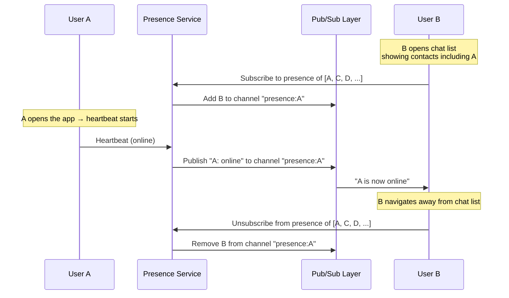
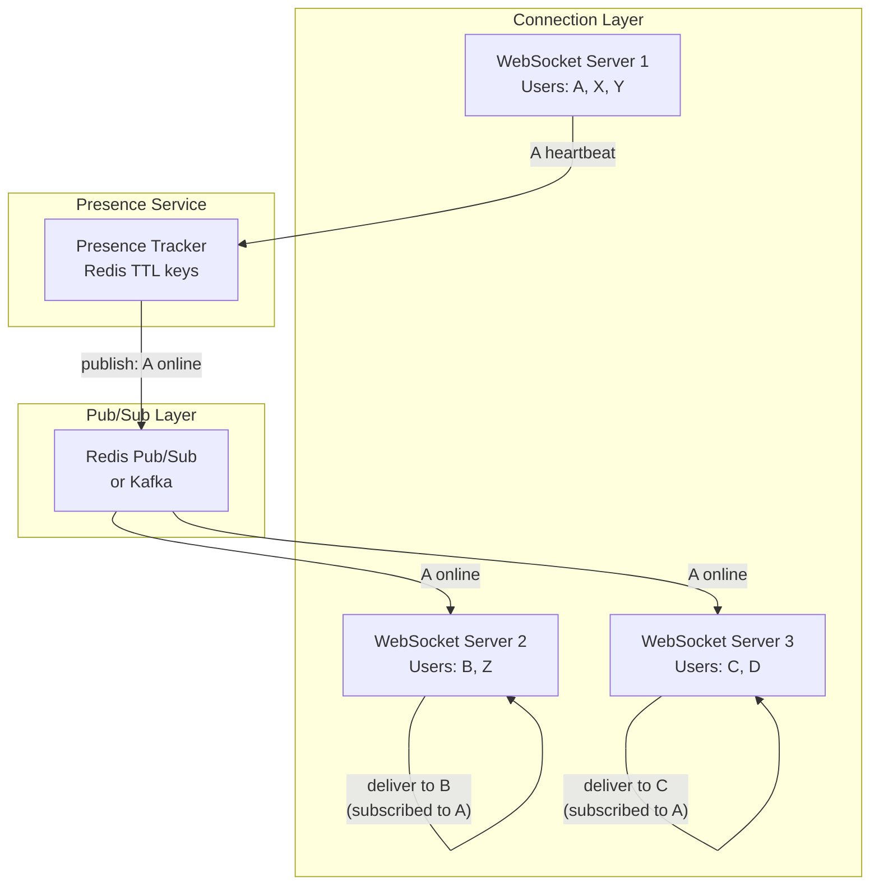
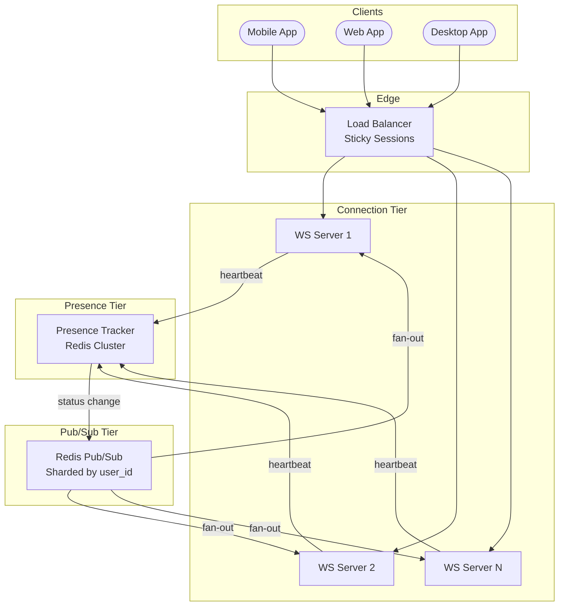

Your chat app shows a green dot next to each contact who is currently online. User A opens the app, sees 47 friends online, and starts a conversation. Meanwhile, user B's phone loses signal in an elevator — 30 seconds later, their dot turns gray. This seems simple until you realize: 500 million users, each with hundreds of contacts, and the system must detect presence changes within seconds while **not** drowning the infrastructure in unnecessary updates.

## Heartbeat-Based Presence Detection

The most common approach: each connected client sends a lightweight heartbeat message to the server at a fixed interval. If the server stops receiving heartbeats, it marks the user as offline after a grace period.

```
Client sends heartbeat every 5 seconds.
Server expects heartbeat within 15 seconds (3 missed heartbeats = offline).

Timeline:
  t=0    heartbeat ✓   → online
  t=5    heartbeat ✓   → online
  t=10   heartbeat ✓   → online
  t=15   (missed)      → still online (grace period)
  t=20   (missed)      → still online (grace period)
  t=25   (missed)      → OFFLINE (3 missed = 15s since last heartbeat)
```

### Why Not Just Use WebSocket Connection State?

A WebSocket disconnect event seems like a natural signal. The moment the TCP connection drops, the server knows the user is gone. But in practice:

| Signal | Problem |
|--------|---------|
| TCP FIN received | Works for clean disconnects (user closes app). Does not work for abrupt network loss — TCP keepalive timeout is minutes, not seconds. |
| TCP RST received | Only if the OS sends a reset. Many mobile disconnects leave the TCP state dangling on the server for 30–120 seconds. |
| WebSocket close frame | Only sent on graceful shutdown. Crash, kill, or network loss = no close frame. |

Heartbeats solve all of these: if the client stops heartbeating for any reason — app crash, network loss, battery death — the server detects absence within the grace period.

### Heartbeat Interval Trade-offs

| Interval | Grace period (3×) | Detection speed | Overhead per user |
|----------|--------------------|-----------------|-------------------|
| 3s | 9s | Fast | High (0.33 msg/s) |
| 5s | 15s | Moderate | Moderate (0.2 msg/s) |
| 10s | 30s | Slow | Low (0.1 msg/s) |
| 30s | 90s | Very slow | Minimal (0.03 msg/s) |

At 500M concurrent users with a 5s heartbeat: **100 million heartbeats per second**. This is a significant load. The heartbeat must be as lightweight as possible — a single byte or a WebSocket ping frame, not a full JSON payload.

```python
import time
import asyncio

class PresenceTracker:
    """Server-side presence tracking using heartbeat timestamps."""

    def __init__(self, redis, heartbeat_timeout=15):
        self.redis = redis
        self.heartbeat_timeout = heartbeat_timeout

    async def heartbeat(self, user_id: str):
        """Record heartbeat — set key with TTL so it auto-expires."""
        key = f"presence:{user_id}"
        now = int(time.time())
        pipe = self.redis.pipeline()
        pipe.set(key, now)
        pipe.expire(key, self.heartbeat_timeout)
        await pipe.execute()

    async def is_online(self, user_id: str) -> bool:
        """Check if user has a non-expired presence key."""
        return await self.redis.exists(f"presence:{user_id}") == 1

    async def get_last_seen(self, user_id: str) -> int | None:
        """Return last heartbeat timestamp, or None if expired."""
        val = await self.redis.get(f"presence:{user_id}")
        return int(val) if val else None
```

The key insight: **Redis TTL is the heartbeat timeout**. If the user heartbeats within the TTL window, the key gets refreshed. If not, Redis automatically deletes the key — no background cleanup job needed. Checking if a user is online is a single `EXISTS` call — O(1).

## Last-Seen Storage

Not every application needs real-time "green dot" presence. Many show "last seen 5 minutes ago" — a simpler problem that requires only storing the most recent activity timestamp.

```python
# Redis hash: single key, one field per user
# More memory-efficient than individual keys for large user sets
await redis.hset("last_seen", user_id, int(time.time()))

# Read last seen
ts = await redis.hget("last_seen", user_id)
last_seen = datetime.fromtimestamp(int(ts)) if ts else None
```

| Storage | Pros | Cons |
|---------|------|------|
| Redis key per user (`presence:{user_id}`) | TTL-based auto-expiry, O(1) lookup | Memory overhead per key (50–80 bytes overhead each) |
| Redis hash (`last_seen` → user_id → timestamp) | Compact for millions of users, single key | No per-field TTL — need cleanup job for stale entries |
| Database column (`users.last_seen_at`) | Persistent, queryable, no extra infra | Too slow for real-time heartbeat writes (disk I/O per heartbeat) |

**Production pattern:** Use Redis key-per-user with TTL for real-time presence detection, and asynchronously update a `last_seen_at` column in the database when the user goes offline (on TTL expiry via Redis keyspace notifications or a periodic sync job).

## The Fan-Out Problem

When user A comes online, who needs to know? All of A's contacts who are currently online and have the chat app open. For a user with 500 contacts, that's potentially 500 notifications. For a celebrity with 10 million followers, it's a storm.

### Naive Approach: Broadcast to All Contacts

```
User A comes online
→ Fetch A's contact list: [B, C, D, E, ..., N]  (500 contacts)
→ For each contact:
    → Check if contact is online
    → If online, find their WebSocket connection server
    → Push "A is now online" notification
```

**Problem:** This is O(contacts) work per status change. At 500M users each changing status several times per day, the volume of fan-out messages is enormous. Worse: users who rapidly toggle between online/offline (flapping) cause amplified fan-out.

### Practical Solution: Subscribe on View, Not Globally

Instead of pushing presence to all contacts at all times, **only push presence updates to users who are actively viewing a screen that shows the contact's status.**



This limits fan-out to only the users who **care right now** — typically a small subset of any user's contact list. Users who have the app in the background or are on a different screen don't receive unnecessary updates.

## Cross-Server Routing

With millions of WebSocket connections spread across hundreds of connection servers, user A's status change on server 1 must reach user B on server 47. The presence service cannot maintain a direct mapping of every user to every server.



**How it works:**

1. Each WebSocket server subscribes to the pub/sub channels for the users whose presence its connected clients care about
2. When the presence service detects a status change (online → offline or vice versa), it publishes to the user's presence channel
3. Only WebSocket servers with subscribers on that channel receive the message
4. The receiving WebSocket server pushes the update to the specific connected clients

### Redis Pub/Sub vs Kafka for Presence

| Criteria | Redis Pub/Sub | Kafka |
|----------|--------------|-------|
| Latency | Sub-millisecond | 5–50ms (batching) |
| Delivery | Fire-and-forget (no persistence) | Persistent log, replay possible |
| Missed messages | Lost if subscriber is down | Consumer reads from offset after recovery |
| Scale | Single Redis node: ~1M messages/s | Partitioned: millions of messages/s |
| Use for presence | Good — presence is ephemeral, loss is acceptable | Overkill unless you need audit log of status changes |

Redis Pub/Sub is the typical choice for presence: the data is ephemeral (a missed "online" notification is harmless — the client can poll on next screen load), and the latency is lower.

## Flapping Prevention

A user on a flaky mobile connection might alternate between online and offline every few seconds. Without mitigation, this generates a storm of status change notifications.

```
Without debounce:
  t=0   online  → notify 200 subscribers
  t=3   offline → notify 200 subscribers
  t=5   online  → notify 200 subscribers
  t=8   offline → notify 200 subscribers
  ...
  = 800 notifications in 10 seconds for one user
```

**Solution: Debounce offline transitions.** When heartbeats stop, wait an extra grace period before declaring the user offline and notifying subscribers.

```python
class DebouncedPresence:
    """Delay offline notification to prevent flapping."""

    def __init__(self, redis, offline_delay=30, heartbeat_timeout=15):
        self.redis = redis
        self.offline_delay = offline_delay
        self.heartbeat_timeout = heartbeat_timeout

    async def heartbeat(self, user_id: str):
        was_pending_offline = await self.redis.exists(
            f"pending_offline:{user_id}"
        )
        pipe = self.redis.pipeline()
        pipe.set(f"presence:{user_id}", int(time.time()))
        pipe.expire(f"presence:{user_id}", self.heartbeat_timeout)
        # Cancel any pending offline notification
        pipe.delete(f"pending_offline:{user_id}")
        await pipe.execute()

        if was_pending_offline:
            # User came back before offline was broadcast — no notification
            pass

    async def mark_pending_offline(self, user_id: str):
        """Called when heartbeat TTL expires (via keyspace notification).
        Schedule offline notification after delay."""
        await self.redis.set(
            f"pending_offline:{user_id}", 1, ex=self.offline_delay
        )
        # When pending_offline TTL expires → truly offline → notify subscribers

    async def confirm_offline(self, user_id: str):
        """Called when pending_offline TTL expires.
        User did not heartbeat during the delay — genuinely offline."""
        await self.publish_status_change(user_id, "offline")
```

The pattern: heartbeat TTL expires → set `pending_offline` with a 30-second TTL → if heartbeat resumes, delete `pending_offline` (no notification sent) → if `pending_offline` expires, publish offline status.

## Scaling Presence to Hundreds of Millions

### Architecture Overview



### Scaling Dimensions

| Component | Scaling strategy |
|-----------|-----------------|
| **WebSocket servers** | Horizontal — add more servers behind sticky load balancer; each holds N connections in memory |
| **Presence store (Redis)** | Redis Cluster with hash slots; shard by `user_id`; each shard handles ~1M users |
| **Pub/Sub** | Shard pub/sub channels across Redis instances by user_id hash; avoids single-node bottleneck |
| **Heartbeat ingestion** | WebSocket servers batch heartbeats locally (e.g., every 1s flush) before writing to Redis — reduces Redis ops |

### Batching Heartbeats

At 500M users × 0.2 heartbeats/s = 100M Redis writes/s. A single Redis cluster cannot absorb this.

**Local batching:** each WebSocket server collects heartbeats from its local connections and flushes them in a single pipeline command every 1 second:

```python
class HeartbeatBatcher:
    def __init__(self, redis, flush_interval=1.0):
        self.redis = redis
        self.flush_interval = flush_interval
        self.pending = set()

    def record(self, user_id: str):
        self.pending.add(user_id)

    async def flush(self):
        """Called every flush_interval seconds."""
        if not self.pending:
            return
        pipe = self.redis.pipeline()
        now = int(time.time())
        for user_id in self.pending:
            key = f"presence:{user_id}"
            pipe.set(key, now)
            pipe.expire(key, 15)
        await pipe.execute()
        self.pending.clear()
```

If a WebSocket server holds 100K connections, this reduces 20K individual Redis commands/s (100K × 0.2) down to a single pipeline of 100K commands every 1s — **orders of magnitude fewer round-trips** to Redis.

## Consistency Trade-offs

Presence is one of the rare cases where **eventual consistency is genuinely acceptable**. A user appearing "online" for 15 extra seconds after closing the app is a negligible UX issue. A user appearing "offline" for 5 seconds after opening the app is similarly harmless.

| Consistency level | Behavior | Cost |
|-------------------|----------|------|
| **Strong** | All observers see the exact same status at the same instant | Requires distributed consensus per status change — unacceptable latency and throughput |
| **Eventual (with bounded staleness)** | Observers converge within heartbeat interval + propagation delay (~5–15s) | Pub/sub + Redis TTL — scalable, simple |
| **Best-effort** | Observers may miss transient status changes entirely | Fire-and-forget pub/sub — cheapest, acceptable for "last seen" |

**Production systems (WhatsApp, Telegram, Discord) use eventual consistency with bounded staleness.** Users tolerate a few seconds of stale presence. The system optimizes for throughput and simplicity over perfect accuracy.


**Do not use strong consistency for presence.** Requiring linearizable reads for "is user X online?" would force every status check through a consensus protocol — destroying throughput for a feature where staleness is perfectly acceptable. This is a textbook case of matching the consistency model to the business requirement.


## Multi-Device Presence

Modern users are logged in on multiple devices simultaneously — phone, tablet, laptop. The presence system must handle this correctly.

**Rule:** A user is online if **any** of their devices is online. A user is offline only when **all** devices are offline.

```python
async def heartbeat_multi_device(redis, user_id: str, device_id: str):
    """Track presence per device. User is online if any device is active."""
    key = f"presence:{user_id}:devices"
    await redis.hset(key, device_id, int(time.time()))
    await redis.expire(key, 30)  # overall key TTL as safety net

async def is_online_multi_device(redis, user_id: str, timeout=15) -> bool:
    """User is online if any device heartbeated within timeout."""
    devices = await redis.hgetall(f"presence:{user_id}:devices")
    now = int(time.time())
    for device_id, last_seen in devices.items():
        if now - int(last_seen) < timeout:
            return True
    return False

async def cleanup_stale_devices(redis, user_id: str, timeout=15):
    """Remove devices that haven't heartbeated recently."""
    devices = await redis.hgetall(f"presence:{user_id}:devices")
    now = int(time.time())
    stale = [d for d, ts in devices.items() if now - int(ts) >= timeout]
    if stale:
        await redis.hdel(f"presence:{user_id}:devices", *stale)
```

The per-device hash also enables richer status like "online on mobile" vs "online on desktop" — useful for apps like Slack that show device-specific indicators.

## Comparison of Approaches

| Approach | Detection speed | Scalability | Complexity | Best for |
|----------|----------------|-------------|------------|----------|
| **WebSocket disconnect event** | Unreliable (seconds to minutes) | High (no extra traffic) | Low | Supplement to heartbeats, not a replacement |
| **Client heartbeat + Redis TTL** | Configurable (5–30s) | High with batching + sharding | Moderate | Real-time presence (chat apps, collaboration tools) |
| **Periodic poll ("pull" model)** | Depends on poll interval (30–60s) | High (amortized) | Low | "Last seen" display, non-real-time presence |
| **Pub/Sub fan-out** | Near-instant propagation | Moderate (fan-out cost) | High | Live status updates to active viewers |


**Interview tip:** When designing presence in a system design interview, say: "Each client heartbeats every 5 seconds. I store the heartbeat as a Redis key with a 15-second TTL — when the key expires, the user is offline. For notifying contacts, I use pub/sub scoped to active viewers: when user B opens a chat screen showing A, B subscribes to A's presence channel. This limits fan-out to only the users who care right now. For flapping prevention, I debounce offline transitions with a 30-second delay before broadcasting." This covers detection, storage, fan-out optimization, and edge case handling — the four things interviewers evaluate on this topic.

