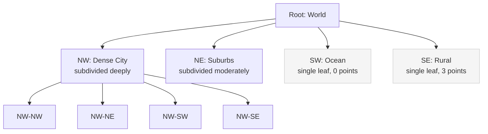
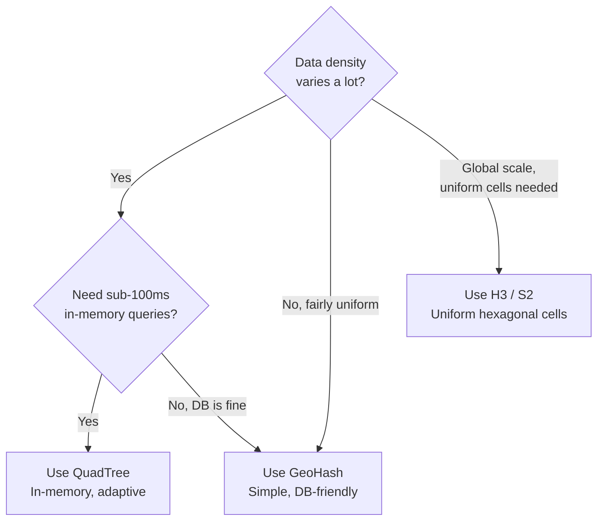
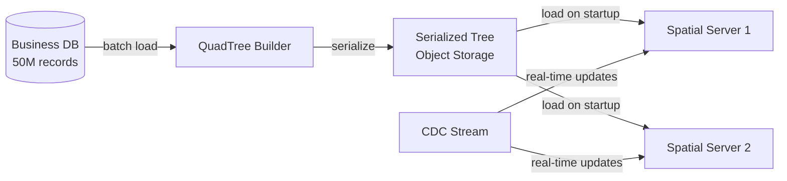

[GeoHash](../specialized/geohash) divides the world into a fixed grid — every cell at a given precision is the same size, whether it covers Manhattan with 10,000 restaurants or the Sahara Desert with none. This wastes precision on empty regions and provides too little resolution in dense ones. A QuadTree solves this by **adapting its resolution to data density**: dense areas are subdivided into smaller cells, sparse areas remain as large cells.

## How a QuadTree Works

A QuadTree recursively divides a 2D region into 4 equal quadrants. Each node in the tree represents a rectangular region. A leaf node stores up to **K** points (e.g., K=100). When a leaf exceeds K points, it **splits** into 4 children.

```
World region: [0,0] to [100,100], K=4

Insert 5 points into the NW quadrant:
Before split:                After split (NW had 5 > K=4):
┌───────────┬───────────┐    ┌─────┬─────┬───────────┐
│           │           │    │ · · │     │           │
│  · · ·    │           │    ├─────┤ ·   │           │
│   · ·     │           │    │ · · │     │           │
├───────────┼───────────┤    ├─────┴─────┼───────────┤
│           │           │    │           │           │
│           │           │    │           │           │
└───────────┴───────────┘    └───────────┴───────────┘
   1 leaf (5 points)         NW split into 4 children
```

### Tree Structure

```python
class QuadTreeNode:
    def __init__(self, boundary, capacity=100):
        self.boundary = boundary   # (x_min, y_min, x_max, y_max)
        self.capacity = capacity
        self.points = []           # only populated in leaf nodes
        self.children = None       # [NW, NE, SW, SE] when split
    
    def is_leaf(self):
        return self.children is None
    
    def insert(self, point):
        if not self.boundary.contains(point):
            return False
        
        if self.is_leaf():
            self.points.append(point)
            if len(self.points) > self.capacity:
                self._split()
            return True
        
        # Internal node: delegate to correct child
        for child in self.children:
            if child.insert(point):
                return True
        return False
    
    def _split(self):
        x_min, y_min, x_max, y_max = self.boundary
        x_mid = (x_min + x_max) / 2
        y_mid = (y_min + y_max) / 2
        
        self.children = [
            QuadTreeNode((x_min, y_mid, x_mid, y_max), self.capacity),  # NW
            QuadTreeNode((x_mid, y_mid, x_max, y_max), self.capacity),  # NE
            QuadTreeNode((x_min, y_min, x_mid, y_mid), self.capacity),  # SW
            QuadTreeNode((x_mid, y_min, x_max, y_mid), self.capacity),  # SE
        ]
        
        # Redistribute points to children
        for point in self.points:
            for child in self.children:
                if child.insert(point):
                    break
        self.points = []  # internal nodes don't hold points
```

### Point Lookup

To find which leaf contains a query point, traverse from root to leaf by checking which quadrant contains the point:

```python
def find_leaf(self, point):
    if self.is_leaf():
        return self
    
    for child in self.children:
        if child.boundary.contains(point):
            return child.find_leaf(point)
```

**Time complexity:** O(log₄ N) in a balanced tree, where N is the number of subdivisions deep. In practice, the tree depth is bounded by the world size divided by minimum cell size.

## Range Query: "Find All Points Within Radius"

This is the primary use case. Given a center point and radius, find all points within that circle.

```python
def range_query(self, center, radius):
    results = []
    self._range_search(center, radius, results)
    return results

def _range_search(self, center, radius, results):
    # Prune: if this node's boundary doesn't intersect the search circle, skip
    if not self.boundary.intersects_circle(center, radius):
        return
    
    if self.is_leaf():
        # Check each point in this leaf
        for point in self.points:
            if distance(center, point) <= radius:
                results.append(point)
        return
    
    # Recurse into children that might intersect
    for child in self.children:
        child._range_search(center, radius, results)
```

**The pruning step is critical.** Without it, the query visits every node. With it, entire subtrees covering regions far from the search area are skipped in O(1).



A radius query centered in the NW quadrant skips SW and SE entirely — they don't intersect the search circle.

## Use Cases

### Nearby Search (Yelp, Google Maps)

Store all business locations in a QuadTree. Dense city centers (Manhattan, Tokyo) subdivide deeply; rural areas remain as large cells. A "restaurants near me" query traverses only a few relevant leaf nodes.

```
Manhattan (1 km²): subdivided 8 levels deep → leaf cells ≈ 50m × 50m
Wyoming (250,000 km²): subdivided 2 levels → leaf cells ≈ 250km × 250km

Same tree handles both — no wasted precision.
```

### Map Rendering (Level of Detail)

At zoom level 1 (world view), render only root-level data. At zoom level 15 (street level), render leaf-level data. Each QuadTree level naturally corresponds to a zoom level.

### Collision Detection (Games)

Game world stored in QuadTree. To check if a bullet hits any enemy, query the bullet's position — only check enemies in the same (or adjacent) leaf cells, not all 10,000 entities.

## QuadTree vs GeoHash

| Property | QuadTree | [GeoHash](../specialized/geohash) |
|----------|----------|---------| 
| **Cell size** | Adaptive — dense areas have small cells, sparse areas have large cells | Fixed — all cells at precision 6 are the same angular size |
| **Storage** | In-memory tree structure (pointers between nodes) | String column in any database with a B-tree index |
| **Index type** | Custom in-memory server | Works with existing DB indexes |
| **Updates** | Fast insert O(log N), but may trigger split | Simple: just store new GeoHash string |
| **Range query** | Tree traversal with pruning — naturally skips empty regions | 9-cell prefix search + post-filter |
| **Rebalancing** | Splits can create skewed trees if data clusters in one quadrant | N/A — fixed grid |
| **Distributed** | Must shard tree across servers (e.g., shard by top-level quadrants) | Natural sharding by prefix range |
| **Best for** | Highly uneven data density, in-memory spatial indexing | Moderate-scale, DB-backed proximity queries |

### When to Choose Which



## Building a QuadTree for a Spatial Service



**Build offline, serve online:** the QuadTree is built from a snapshot of all business locations by a batch job. The serialized tree is loaded into memory on each spatial server at startup. Real-time updates (new business, closed business, moved location) are applied to the in-memory tree via a CDC stream.

**Memory estimate:** 50 million points × (lat: 8 bytes + lng: 8 bytes + ID: 8 bytes + overhead: ~16 bytes) ≈ 2 GB. Fits comfortably in a modern server's RAM.


**Skewed data can degrade performance.** If millions of points cluster in one quadrant (e.g., a stadium event), that quadrant subdivides deeply while others remain shallow. Worst case, the tree degenerates to a linked list for a single dense cluster. Mitigation: set a maximum depth limit and stop splitting beyond it, even if the leaf exceeds capacity. Points beyond capacity in a max-depth leaf are scanned linearly.



**Interview tip:** "For nearby search, I'd use a QuadTree because data density varies — Manhattan has thousands of points per square kilometer while rural areas have almost none. The QuadTree adapts by subdividing dense areas into small cells and keeping sparse areas as large cells. A radius query prunes entire subtrees that don't intersect the search circle, so it's O(log N + k) where k is the number of results. The tree is built offline and loaded into memory on each server; updates flow in via CDC. For simpler requirements where data is more uniformly distributed, GeoHash with a B-tree index in the database is sufficient."
