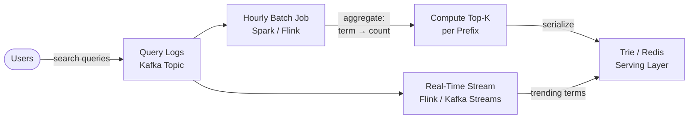
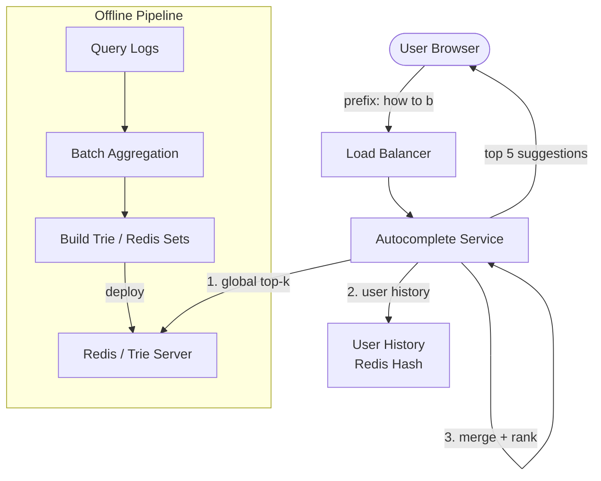

A user types "how to b" into a search bar. Within 100ms, a dropdown shows "how to boil eggs", "how to build a resume", "how to bake a cake" — ranked by popularity. This is typeahead autocomplete. The challenge isn't returning *some* results for a prefix; it's returning the **top-k most popular** completions for any prefix out of billions of search queries, in under 100ms, for millions of concurrent users.

## The Trie Data Structure

A **trie** (prefix tree) is a tree where each node represents a character, and the path from root to a node spells a prefix. Every string that shares a prefix shares the same path in the tree.

```
Insert: "cat", "car", "card", "care", "cap"

        (root)
          |
          c
          |
          a
        / | \
       t  r  p
         / \
        d   e
```

**Lookup for prefix "car":** traverse root → c → a → r in O(L) time where L = prefix length. Then collect all completions in the subtree below "r": "car", "card", "care".

### Naive Problem: Subtree Traversal

For a prefix like "ho", the subtree might contain millions of completions ("hotel", "how to...", "house", ...). Traversing the entire subtree to find the top-k by frequency is too slow.

### Solution: Store Top-K at Each Node

Pre-compute and cache the top-k completions (by frequency) at every trie node. A query for prefix "ho" walks to the "ho" node and immediately returns its cached top-k list — no subtree traversal needed.

```
Node "ho" stores:
  top_5: [
    ("how to boil eggs", 95000),
    ("hotel near me", 87000),
    ("how to build a resume", 82000),
    ("house for sale", 74000),
    ("how to bake a cake", 69000)
  ]
```

| Property | Without top-k cache | With top-k cache |
|----------|-------------------|-----------------|
| Query time | O(L + S) where S = subtree size | O(L + k) where k is fixed (e.g., 10) |
| Memory | Node stores only character + children | Node stores character + children + top-k list |
| Update cost | N/A | Must propagate frequency changes up the trie |

### Compact Trie (Patricia Trie)

When a chain of nodes each have a single child, compress them into one node storing the entire substring. This reduces memory significantly for natural language where many prefixes share long common paths.

```
Standard trie:          Compact trie:
  c → a → r → d          "car" → "d"
              → e                → "e"
         → t              "cat"
         → p              "cap"
```

## Redis Sorted Sets Approach

For moderate scale (millions of terms, not billions), a trie server is overkill. Redis sorted sets provide prefix-based autocomplete with minimal infrastructure.

```
# Store search terms with frequency as score
ZADD autocomplete 95000 "how to boil eggs"
ZADD autocomplete 87000 "hotel near me"
ZADD autocomplete 82000 "how to build a resume"
```

**Prefix query:** Redis `ZRANGEBYLEX` supports lexicographic range queries. To find all terms starting with "how to b":

```python
# Find terms with prefix "how to b"
# \xff is the highest byte — acts as upper bound
results = redis.zrangebylex(
    "autocomplete",
    "[how to b",       # inclusive lower bound
    "[how to b\xff",   # exclusive upper bound (all strings starting with prefix)
    start=0, num=10    # limit to top 10
)
```

**Problem:** `ZRANGEBYLEX` returns results in lexicographic order, not by score. To get results ranked by frequency:

**Solution:** Maintain a separate sorted set per popular prefix, scored by frequency:

```python
# Pre-computed: for each prefix of length 1-6, store top-k by frequency
ZADD "prefix:how to b" 95000 "how to boil eggs"
ZADD "prefix:how to b" 82000 "how to build a resume"
ZADD "prefix:how to b" 69000 "how to bake a cake"

# Query: get top 5 for prefix "how to b", highest score first
results = redis.zrevrange("prefix:how to b", 0, 4, withscores=True)
```

| Approach | Memory | Query Speed | Update Speed | Best For |
|----------|--------|-------------|-------------|----------|
| Trie server | High (top-k at every node) | O(L + k) | Requires propagation | Billions of terms, custom logic |
| Redis sorted set per prefix | Moderate (only popular prefixes) | O(log n + k) | O(log n) per set | Millions of terms, simple infra |
| Single Redis ZRANGEBYLEX | Low | O(log n + k) but lex-ordered | O(log n) | Small term sets where lex order is acceptable |

## Data Collection Pipeline

The autocomplete index must be built from real user search behavior. This is a **batch + incremental** pipeline.



### Batch Path (Primary)

1. **Collect:** search queries logged to Kafka with timestamp, user ID, query text
2. **Aggregate:** hourly Spark job counts distinct queries, computes frequency over rolling 30-day window
3. **Top-k per prefix:** for each prefix of length 1 through max (e.g., 10), keep top-k terms by frequency
4. **Serialize:** build trie structure or populate Redis sorted sets
5. **Deploy:** swap serving index atomically (blue-green) — no downtime during refresh

### Real-Time Path (Trending)

Batch has a lag of 1+ hours. For trending queries (breaking news, viral events), a streaming job watches the query log and boosts terms whose frequency spikes above a threshold:

```python
# Simplified trending detection
def detect_trending(window_counts, historical_avg):
    for term, count in window_counts.items():
        if count > historical_avg[term] * 3:  # 3x spike
            inject_trending(term, boost_score=count)
```

Trending terms are injected into the serving layer with a temporary boost that decays over time.

## Personalization Layer

Global autocomplete returns the same results for all users. Personalization blends user-specific signals:

```
Final score = α × global_popularity + β × user_history_score + γ × recency_boost
```

| Signal | Source | Example |
|--------|--------|---------|
| Global popularity | Batch aggregation of all users | "how to boil eggs" is universally popular |
| User search history | Per-user recent queries stored in Redis | User frequently searches "how to build react apps" |
| Recency | Time decay on historical queries | Recent trending topics boosted |
| Context | Current page, location, device | Shopping site: bias toward product terms |

**Implementation:** at query time, fetch global top-k from the trie/Redis, fetch user's recent queries matching the prefix from a per-user Redis hash, merge and re-rank using the weighted formula above.


**Privacy:** storing per-user search history for personalization requires explicit consent. Some queries are sensitive. Apply query sanitization (strip PII), honor deletion requests, and consider differential privacy for aggregate statistics.


## System Architecture



**Latency budget:** user expects results within 100ms of keystroke. Network round-trip takes ~20ms. Serving must complete in <50ms. This is why top-k caching at each trie node (or pre-computed Redis sorted sets) is essential — no computation at query time.

### Scaling

| Technique | Purpose |
|-----------|---------|
| **Shard by prefix range** | Trie server A handles a-m, server B handles n-z; consistent hashing for finer splits |
| **CDN caching** | Cache top-k results for the most common 1-3 character prefixes at the CDN edge |
| **Client-side debounce** | Don't send a request on every keystroke — wait 100-200ms after last keystroke |
| **Prefix length cutoff** | Don't serve autocomplete for prefixes shorter than 2 characters (too many results, too common) |


**Interview tip:** The key insight interviewers look for: "I'd store the top-k completions at each trie node so lookups are O(prefix length), not O(subtree size). The trie is built offline from aggregated search logs and deployed to serving nodes. For trending queries, a real-time stream detects frequency spikes and injects them into the serving layer. Personalization blends global popularity with per-user history at query time." This covers data structure choice, offline pipeline, real-time adaptation, and personalization — the four dimensions of autocomplete.
