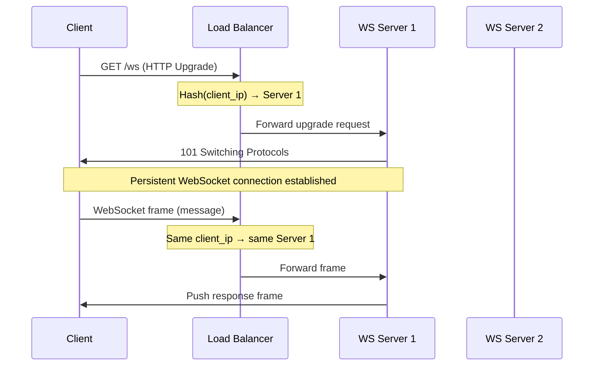
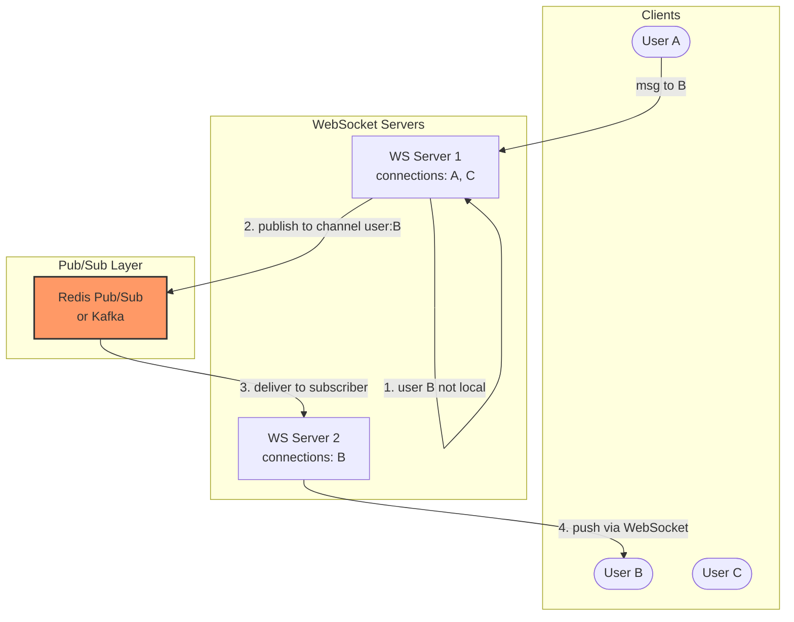
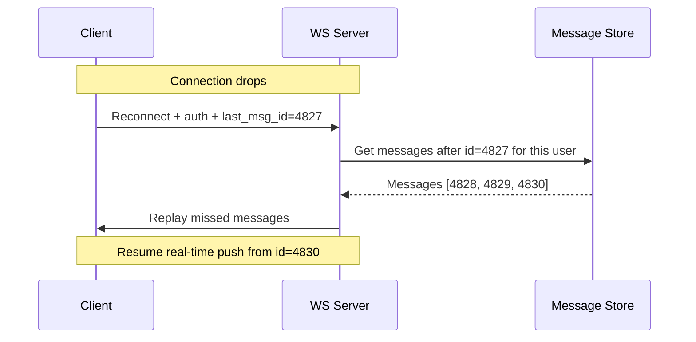
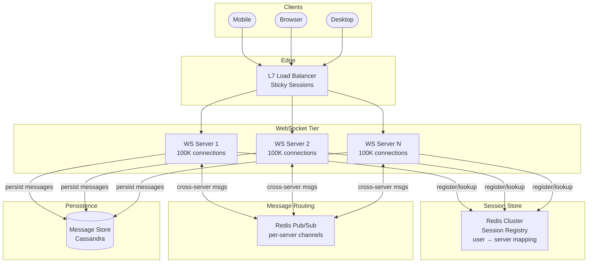

Your chat application works perfectly with 1,000 users on a single server. Every user holds an open WebSocket connection, and when user A sends a message to user B, the server looks up B's connection in a local hash map and pushes the message through. Then you grow to 10 million concurrent users. No single server can hold 10 million open TCP connections. You deploy 200 WebSocket servers behind a load balancer — and suddenly, user A is on server 37 and user B is on server 142. The server holding A's connection has no idea where B's connection lives. **This is the fundamental challenge of scaling WebSockets: connections are stateful, but your infrastructure needs to be horizontally scalable.**

## Why WebSockets Are Stateful

An HTTP request is fire-and-forget: the client sends a request, the server responds, the connection can be reused by any server. A WebSocket connection is a **persistent, long-lived TCP connection** between a specific client and a specific server. The server holds the connection object in memory for the duration of the session — minutes, hours, or even days.

```
HTTP (stateless):
  Client → LB → Server A → Response → done
  Client → LB → Server B → Response → done   ← any server works

WebSocket (stateful):
  Client → LB → Server A → [connection held open in Server A's memory]
  Client sends frame → must reach Server A  ← only Server A works
  Server A pushes frame → reaches Client    ← only Server A can do this
```

This statefulness means a WebSocket server is not interchangeable with any other WebSocket server. The specific server holding a user's connection is the **only** server that can push messages to that user.

## Connection Management

Each WebSocket server maintains an in-memory registry mapping user IDs to their connection objects. A user may have multiple active connections (multiple tabs, multiple devices), so each user ID maps to a *set* of connections. Operations: `connect(user_id, ws)`, `disconnect(ws)`, `send_to_user(user_id, message)`, `is_local(user_id)`.

### How Many Connections Per Server?

A WebSocket connection consumes:
- **File descriptor:** one per TCP connection (Linux default ulimit is 1024; production servers set this to 1M+)
- **Memory:** ~10–50 KB per connection (kernel TCP buffers + application-level state)
- **CPU:** near-zero when idle; cost comes from message processing

| Connections per server | Memory (at ~20 KB each) | Practical? |
|----------------------|------------------------|-----------|
| 10,000 | 200 MB | Easy — any modern server |
| 100,000 | 2 GB | Standard — common in production |
| 500,000 | 10 GB | Achievable with tuned OS settings |
| 1,000,000 | 20 GB | Possible with C10M techniques (epoll, io_uring) |

Production systems typically target **100K–500K connections per server** as a comfortable operating point. Beyond that, kernel tuning (TCP buffer sizes, file descriptor limits, ephemeral port range) and event loop optimization become critical.


```
# Increase file descriptor limit
fs.file-max = 2000000

# Increase ephemeral port range
net.ipv4.ip_local_port_range = 1024 65535

# Reduce TCP memory per socket
net.ipv4.tcp_rmem = 4096 4096 16384
net.ipv4.tcp_wmem = 4096 4096 16384

# Enable connection reuse
net.ipv4.tcp_tw_reuse = 1
```


## Sticky Sessions

When a WebSocket client initiates a connection, it performs an HTTP upgrade handshake. If the load balancer routes the upgrade request to server A, then **all subsequent frames on that connection must also reach server A**. This requires sticky sessions (session affinity) at the load balancer.



### Sticky Session Strategies

| Strategy | How it works | Pros | Cons |
|----------|-------------|------|------|
| **IP hash** | `hash(client_ip) % servers` | Simple, no state in LB | Breaks behind NAT (thousands of users share one IP); uneven distribution |
| **Cookie-based** | LB sets a cookie with server ID on first request | Reliable affinity per browser session | Requires HTTP context; not available for raw TCP |
| **Connection ID** | LB tracks connection → server mapping | Precise per-connection routing | LB must maintain state; memory cost at scale |
| **L4 (TCP-level)** | Route by source IP + port at transport layer | No HTTP inspection needed; fast | Cannot distinguish multiple WebSocket paths on same connection |

**Best practice for WebSockets:** Use L7 load balancing with cookie-based or connection-ID affinity. Nginx, HAProxy, and AWS ALB all support WebSocket sticky sessions natively.


**Sticky sessions create an uneven load distribution problem.** If server A happens to hold connections for several very active chat rooms, it gets disproportionately more message traffic than other servers. Monitor per-server message rates and use connection-count-aware load balancing (least connections) to mitigate.


## Cross-Server Message Routing

This is the core scaling challenge. User A is connected to server 1. User A sends a message to user B, who is connected to server 2. Server 1 has no direct access to B's WebSocket connection on server 2.

### The Naive Approach: Direct Server-to-Server

Each WebSocket server maintains a map of which users are on which servers. When server 1 needs to reach user B, it makes a direct HTTP/gRPC call to server 2.

**Problems:** O(N²) mesh between servers, server discovery on scale changes, one slow server blocks delivery for its users.

### The Solution: Pub/Sub Layer

Insert a message broker between servers. Each WebSocket server subscribes to channels for the users it currently holds connections for. When a message needs to reach user B, it's published to B's channel — and whatever server is subscribed to that channel delivers it.



The routing logic is straightforward: if the target user is connected locally, deliver directly via the local WebSocket connection (fast path). Otherwise, publish to the pub/sub layer for the correct server to pick up.

**Key optimization — per-server channels:** Instead of publishing to a per-user channel (which requires each server to subscribe to channels for all its local users), publish to a **per-server channel**. Each WebSocket server subscribes to exactly one channel — its own. The sender looks up the target server from a Redis session registry and publishes directly to that server's channel. This reduces pub/sub subscriptions from O(users) to O(servers).

### Redis Pub/Sub vs Kafka for Cross-Server Routing

| Property | Redis Pub/Sub | Kafka |
|----------|--------------|-------|
| **Latency** | Sub-millisecond | 5–50ms (batching + disk) |
| **Delivery guarantee** | Fire-and-forget — message lost if subscriber is down | Persistent — consumer reads from offset after recovery |
| **Ordering** | Per-channel ordering | Per-partition ordering |
| **Scalability** | Single node ~1M msg/s; cluster mode for more | Millions of msg/s across partitions |
| **Missed messages** | Gone forever if no subscriber is listening | Retained for configurable period (days/weeks) |
| **Best for** | Real-time chat, presence, ephemeral routing | Audit logs, message history, guaranteed delivery |

**For real-time chat and collaboration:** Redis Pub/Sub is the standard choice. The messages are ephemeral — if user B is offline when A sends a message, the message is stored in the database anyway and B retrieves it on reconnect. The pub/sub layer only handles real-time push to currently connected users.

## Session Metadata in Redis

To make the WebSocket tier horizontally scalable, **externalize connection metadata** out of individual server memory and into Redis. This enables any part of the system to answer "where is user B connected?" without querying every WebSocket server.

Each WebSocket server registers its connected users in Redis as hash keys (`ws_session:{user_id}` → `{server_id, connected_at}`) with a TTL refreshed by heartbeat. When a server needs to route a message, it looks up the target user's server in Redis, then publishes to that server's channel. If the user is offline (no session in Redis), the message is stored for later delivery and a push notification is sent via APNs/FCM.

## Heartbeat and Reconnection

WebSocket connections can silently die. The TCP connection is technically "open" on the server side, but the client has lost network, the intermediary proxy timed out, or the mobile OS suspended the app. Without active health checking, the server holds dead connections indefinitely, wasting memory and file descriptors.

### Server-Side Ping/Pong

The WebSocket protocol (RFC 6455) defines control frames for heartbeating:

```
Server sends:  Ping frame (opcode 0x9)
Client replies: Pong frame (opcode 0xA) — automatically by the browser

If no Pong received within timeout → connection is dead → close it
```

### Why 25-Second Ping Interval?

Most cloud load balancers and reverse proxies have idle connection timeouts:

| Infrastructure | Default idle timeout |
|---------------|---------------------|
| AWS ALB | 60 seconds |
| Nginx | 60 seconds (`proxy_read_timeout`) |
| Cloudflare | 100 seconds |
| HAProxy | 50–60 seconds (depending on version) |

A 25-second ping interval guarantees at least 2 pings within any 60-second idle window, keeping the connection alive through intermediary proxies. Too frequent (5s) wastes bandwidth across millions of connections. Too infrequent (55s) risks the proxy closing the connection before the next ping.

### Client-Side Reconnection with Exponential Backoff

When the client detects a disconnect, it must reconnect — but not all at once. Use **exponential backoff with jitter**: delay starts at ~1s, doubles each attempt (capped at ~30s), with ±50% random jitter.

```
Without jitter (server crashes at t=0):
  t=1s:  100,000 reconnection attempts → new server overwhelmed

With jitter (±50%):
  t=0.5s:  ~16,000 attempts
  t=1.0s:  ~16,000 attempts
  t=1.5s:  ~16,000 attempts
  ...spread over ~3 seconds → manageable
```

**The jitter is critical.** If your WebSocket server crashes and 100K clients all detect the disconnect simultaneously, they'll all reconnect after 1 second — a thundering herd that crashes the new server too. Random jitter spreads reconnections over a time window.

### Resuming After Reconnection

When a client reconnects, it may have missed messages sent while it was disconnected. The client sends its **last received message ID** on reconnect, and the server replays any messages after that point.



This requires that all messages are **persisted before being pushed** — the WebSocket layer is a real-time delivery optimization on top of a durable message store, not a replacement for it.

## Full Architecture



### Request Flow: User A Sends Message to User B

{}

### Client sends message

Client A sends message via WebSocket to WS Server 1.

### Persist first

WS Server 1 persists the message in Cassandra (durability first).

### Route the message

WS Server 1 checks local connections — is B on this server? If yes, push directly (fast path). If no, look up B's server in the Redis session registry.

### Cross-server delivery

Redis returns: B is on WS Server 2. Server 1 publishes message to Redis channel `server:ws2:messages`. WS Server 2 receives it and pushes to B's WebSocket connection.

### Offline fallback

If B is offline (no session in Redis): store as undelivered, send push notification via APNs/FCM.

{}

## Scaling Dimensions

| Component | Scaling approach | Bottleneck |
|-----------|-----------------|-----------|
| **WebSocket servers** | Horizontal — add servers behind sticky LB | Per-server connection limit (~500K); per-server message throughput |
| **Session registry (Redis)** | Redis Cluster — shard by user_id | Hot keys for users with many lookups |
| **Pub/Sub routing (Redis)** | Shard channels across Redis instances by server_id | Single Redis Pub/Sub node: ~1M messages/s |
| **Message store (Cassandra)** | Partition by conversation_id | Hot partitions for viral group chats |
| **Load balancer** | Scale LB tier (AWS ALB auto-scales; Nginx cluster) | WebSocket upgrade connection limits per LB node |

### Capacity Example

```
Target: 10M concurrent WebSocket connections

WebSocket servers:  10M / 100K per server = 100 servers
Session registry:   10M Redis keys × ~200 bytes = 2 GB → single Redis node
Pub/Sub channels:   100 channels (one per server) → trivial
Message throughput:  assume 1 msg/user/min → 166K messages/second
                    Redis Pub/Sub: easily handled
                    Cassandra writes: 166K/s across partitions → feasible
```

## Graceful Shutdown and Draining

When a WebSocket server is being deployed or scaled down, abruptly killing it disconnects all 100K+ users simultaneously, triggering a reconnection storm on other servers.

{}

### Stop accepting new connections

Remove the server from the load balancer.

### Notify clients

Send a `GoAway` message to all connected clients with a reconnect hint.

### Wait for drain

Allow clients to reconnect to other servers (grace period: 30–60 seconds).

### Force-close remaining connections

Shut down the server process after the grace period.

{}

This is essential for zero-downtime deployments. Without graceful draining, every deploy causes a user-visible blip as thousands of connections drop and reconnect.

## Comparison of Scaling Approaches

| Approach | How it works | Connections | Message routing | Complexity |
|----------|-------------|------------|----------------|------------|
| **Single server** | All connections on one machine | ~500K max | Local — trivial | Minimal |
| **Sticky LB + Redis Pub/Sub** | Servers subscribe to per-server channels; session registry in Redis | Millions | O(1) lookup + publish | Moderate — production standard |
| **Sticky LB + Kafka** | Messages routed via Kafka partitions per user | Millions | Persistent, ordered | Higher — justified when delivery guarantees needed |
| **Service mesh sidecar** | Envoy/Istio handles routing between pods | Millions | Transparent service-to-service | High — overkill for most WebSocket use cases |


**Interview tip:** When discussing real-time systems, say: "Each WebSocket server holds up to 100K–500K persistent connections. I use an L7 load balancer with sticky sessions so each client always reaches the same server. For cross-server routing, each server subscribes to its own Redis Pub/Sub channel. When server 1 needs to reach a user on server 2, it looks up the user's server in a Redis session registry and publishes to server 2's channel. Clients heartbeat every 25 seconds to keep connections alive through proxies, and reconnect with exponential backoff plus jitter to avoid thundering herds. Messages are persisted to Cassandra before being pushed — the WebSocket layer is a real-time delivery optimization, not the source of truth." This covers connection management, routing, heartbeat, reconnection, and durability — the five things interviewers evaluate.

