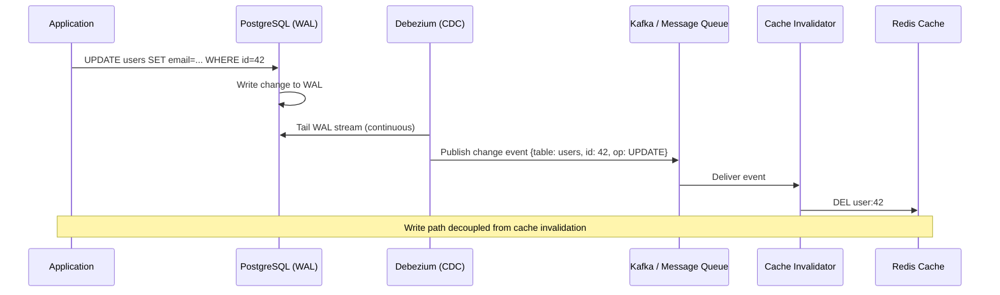
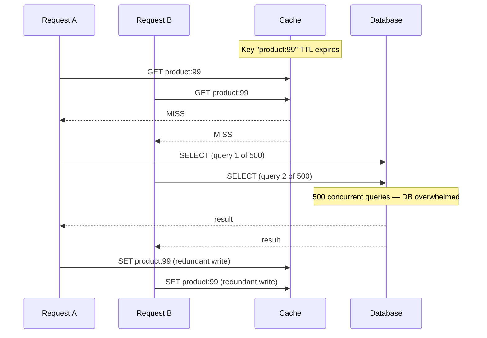
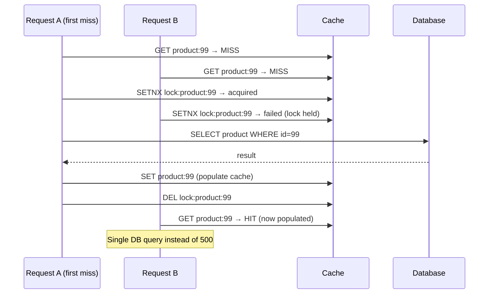

A cache reduces latency and origin load by storing computed or fetched results closer to where they are consumed. The hard part is not reading from a cache — it is keeping the cache consistent with the source of truth and handling the failure modes that emerge at scale.


This file covers read/write patterns, invalidation, and cache failure modes. For eviction policy internals (LRU, LFU, ARC, W-TinyLFU) see [Cache Eviction](../cache-eviction).


## Read Patterns

### Cache-Aside (Lazy Loading)

The application owns the cache interaction. The cache is populated on demand — only data that is actually requested gets cached.

```
READ:
  App ──── GET key ────────────► Cache
  App ◄─── HIT: return value ─── Cache

  App ──── GET key ────────────► Cache
  App ◄─── MISS ──────────────── Cache
  App ──── SELECT * FROM ... ──► DB
  App ◄─── row ───────────────── DB
  App ──── SET key value TTL ──► Cache
  App ────────────────────────── return value to caller

WRITE (invalidate on update):
  App ──── UPDATE ... ──────────► DB
  App ──── DEL key ─────────────► Cache   ← invalidate, not update
```

**Why invalidate instead of update on write?** Writing the new value to cache and the DB in two steps is not atomic. If the DB write succeeds but the cache write fails (or vice versa), the cache holds stale data indefinitely. Invalidation is safer: the worst case of a failed DEL is one stale cache read before the next miss repopulates it from the DB.

**Strengths:**
- Cache only holds data that is actually accessed — no wasted memory on cold data
- Cache failure is non-fatal — the application falls back to the DB
- Works with any cache technology; no coupling between cache and DB

**Weaknesses:**
- First request after a miss (or after startup) is slow — pays the DB round trip
- Race condition on concurrent writes: two requests can fetch stale data from DB simultaneously and both write it to cache, one overwriting the other's fresher value
- Stale-write-after-invalidation race: Thread A reads key → MISS → fetches old value from DB; Thread B writes new value to DB → `DEL key`; Thread A writes the now-stale value back into cache — cache holds stale data indefinitely with no further invalidation until the next write. Mitigate with short TTLs or conditional SET (e.g., `SET key value NX EX ttl` so the stale write loses a race with an empty slot rather than overwriting).

### Read-Through

The cache sits in front of the DB and is responsible for fetching data on a miss. The application only talks to the cache.

```
App ──── GET key ────────────► Cache
Cache ◄── MISS ──────────────
Cache ──── SELECT ... ───────► DB
Cache ◄─── row ──────────────── DB
Cache stores the row
App ◄──── return value ──────── Cache
```

**Difference from cache-aside:** In cache-aside, the application fetches from DB on a miss. In read-through, the cache layer fetches from DB transparently. The application never directly queries the DB.

**Strengths:** Simpler application code — one data access path regardless of hit/miss.

**Weaknesses:** Requires a cache that supports a "loader" or "origin" configuration (e.g., Redis with a read-through library, AWS ElastiCache with DAX for DynamoDB). Harder to control TTL and consistency per-query.

## Write Patterns

### Write-Through

Every write goes to the cache and the DB **synchronously** before the write is acknowledged to the caller. Cache and DB are always in sync.

```
App ──── write(key, value) ──────► Cache
Cache ──── write(key, value) ────► DB
DB ◄──── ACK ────────────────────
Cache ◄── ACK ────────────────────
App ◄──── ACK ────────────────────
```

**Strengths:**
- Cache is always consistent with DB — reads after writes always see current data
- No cache invalidation complexity

**Weaknesses:**
- Write latency = cache write latency + DB write latency (sequential, or parallel with added complexity)
- Cache fills with data that may never be read (every written key is cached regardless of read frequency)
- If the DB write fails after the cache write succeeds, the cache holds data the DB does not

**Used with:** Read-through caches where the cache manages both read and write to the DB (DAX for DynamoDB, some ORM-level caches).

### Write-Back (Write-Behind)

The application writes to the cache only. The cache acknowledges immediately. A background process flushes dirty cache entries to the DB asynchronously, in batches.

```
App ──── write(key, value) ──────► Cache  (marks entry as "dirty")
Cache ◄── ACK immediately ─────────        (DB not yet updated)

Later, asynchronously:
Cache ──── batch write ──────────► DB
DB ◄──── ACK ────────────────────
Cache ──── mark entries clean ────
```

**Strengths:**
- Write latency = cache write latency only (sub-millisecond for Redis) — the DB write is deferred
- Batch DB writes reduce DB load: 1000 individual updates can become one bulk upsert
- Effective for write-heavy workloads (IoT telemetry, counters, session updates)

**Weaknesses:**
- **Data loss on cache failure:** dirty entries not yet flushed to DB are lost if the cache node crashes. Acceptable for counters and session data; unacceptable for financial transactions
- **Consistency gap:** DB lags behind cache during the flush window; reads from DB (e.g., by analytics, replicas, other services not using the cache) see stale data
- Implementation complexity: requires a durable dirty-entry queue and a reliable flush process

**Used for:** high-frequency counters (Redis INCR batched to DB every 5 minutes), game leaderboards, ad impression counters, any metric where approximate accuracy is sufficient and DB write throughput would be the bottleneck.

### Write-Around

Writes bypass the cache entirely and go directly to the DB. The cache is populated only on subsequent reads (via cache-aside or read-through).

```
WRITE:
  App ──── write(key, value) ──────► DB  (cache untouched)

READ (later):
  App ──── GET key ────────────────► Cache → MISS
  App ──── SELECT ... ─────────────► DB
  App ──── SET key value TTL ──────► Cache  (now cached for future reads)
```

**Strengths:**
- Prevents cache pollution from write-once data that will never be read back through the cache
- Useful for large batch imports, log writes, archival data

**Weaknesses:**
- First read after a write always misses — higher read latency for recently written data
- Not suitable for data that is read immediately after being written

**Used for:** bulk data imports, user-generated content uploads (upload to S3 directly, cache the metadata on first view), write-once append-only records (event logs, audit trails).

## Pattern Comparison

| Pattern | Read path | Write path | Consistency | Write latency | Data loss risk |
|---------|-----------|-----------|-------------|--------------|---------------|
| **Cache-aside** | App → Cache → DB on miss | App → DB, then DEL cache | Eventual (miss repopulates) | DB write only | None |
| **Read-through** | App → Cache → DB on miss (transparent) | Varies | Eventual | DB write only | None |
| **Write-through** | App → Cache | App → Cache → DB | Strong | Cache + DB | Low (DB is authoritative) |
| **Write-back** | App → Cache | App → Cache; async → DB | Eventual (flush lag) | Cache only | High (unflushed dirty entries) |
| **Write-around** | App → Cache → DB on miss | App → DB directly | Eventual | DB write only | None |

## Cache Invalidation

Cache invalidation is the hardest problem in caching. Three strategies:

**TTL-based expiry** — set a time-to-live on every cached entry. Simple, requires no coordination. The tradeoff is the staleness window: data can be up to TTL seconds stale after a DB write.

```
SET user:42 <json> EX 300    # expires in 5 minutes
```

**Event-driven invalidation** — on every DB write, explicitly invalidate or update the affected cache keys. No staleness window, but requires the writer to know which cache keys are affected — creates coupling between write paths and cache key design.

```
# After updating user 42 in DB:
DEL user:42                       # cache-aside: invalidate
SET user:42 <new_json> EX 300     # write-through: update
```

**CDC-based invalidation** — a Change Data Capture process (Debezium reading PostgreSQL WAL) publishes DB change events to a message queue. Cache invalidation consumers subscribe and evict affected keys. Decouples the write path from cache invalidation; eventual consistency lag is the queue processing delay.



## Cache Failure Modes

### Cache Stampede (Thundering Herd)

A popular cached key expires. Many concurrent requests all get a cache miss simultaneously and all query the DB at once.



**Mitigation 1 — Mutex / Single-Flight:**

The first request to miss acquires a lock and fetches from DB. Other requests wait for the lock to release, then read from the now-populated cache.



Cost: a brief wait for non-first requests. Risk: if the lock holder crashes, others wait until timeout.

**Mitigation 2 — Probabilistic Early Recomputation (PER):**

Before a key expires, recompute it with increasing probability as the TTL approaches zero. No locking required.

```
# On every cache read:
remaining_ttl = cache.TTL(key)
recompute_probability = exp(-remaining_ttl / β)  # β controls aggressiveness

if random() < recompute_probability:
    value = db.fetch(key)               # recompute early
    cache.SET(key, value, full_TTL)     # reset TTL
    return value
else:
    return cached_value                 # serve current value
```

With β tuned to ~2–5× the recompute cost, entries are refreshed before expiry with high probability — the cache never actually expires for hot keys.

**Mitigation 3 — Background Refresh:**

Cache entries are never allowed to expire during active traffic. A background thread refreshes each key before its TTL elapses. The application always reads a valid (possibly slightly stale) entry.

```
Scheduler: every (TTL - refresh_buffer) seconds:
  value = db.fetch(key)
  cache.SET(key, value, TTL)
```

Effective for known hot keys. Does not scale to millions of distinct keys.

### Cache Penetration

Requests for keys that do not exist in the DB. These always miss the cache and always hit the DB — the cache provides no protection.

Common cause: invalid user input (`GET /users/999999999`), deleted records, or deliberate attacks probing non-existent IDs.

**Mitigation 1 — Cache null results:**

```
value = cache.GET(key)
if value is CACHE_NULL_SENTINEL:
    return 404   # cached absence
if value is MISS:
    value = db.fetch(key)
    if value is None:
        cache.SET(key, CACHE_NULL_SENTINEL, EX=60)  # cache the absence
        return 404
    cache.SET(key, value, EX=300)
```

Risk: an attacker probing many different non-existent keys fills the cache with null sentinels.

**Mitigation 2 — Bloom filter:**

Load a Bloom filter with all existing keys. On a request, check the Bloom filter first. "Definitely not in DB" → return 404 immediately, no cache or DB query.

### Cache Avalanche

Many cache keys expire at the same time, causing a burst of DB queries simultaneously. Common cause: a bulk cache load with the same TTL for all keys — all expire at the same time.

```
# Cache warmed at startup with TTL=3600 for all keys:
for key, value in data.items():
    cache.SET(key, value, EX=3600)

# One hour later: ALL keys expire simultaneously
# Every request misses cache and hits DB
```

**Mitigation — TTL jitter:**

Add a random offset to each key's TTL so expiries are spread across a time window.

```python
base_ttl = 3600
jitter    = random.randint(0, 600)   # ±0–10 minutes of jitter
cache.SET(key, value, EX=base_ttl + jitter)
```

## Cache Warming

Cold caches after a deployment or restart cause a thundering herd against the DB until the cache refills from organic traffic.

**Strategies:**

**Pre-warm before cutover:** Before switching traffic to a new cache, run a background job that pre-populates the most-accessed keys from the DB or from a dump of the old cache.

```python
# Warm top-N most accessed items
hot_keys = analytics.get_top_keys(n=100_000)
for key in hot_keys:
    value = db.fetch(key)
    cache.SET(key, value, EX=3600 + random.randint(0, 300))
```

**Gradual traffic shift:** Route a small percentage of traffic to the new cache first. It warms up on real access patterns before receiving full load. Works well with weighted load balancing.

**Persistent cache:** Use Redis RDB/AOF persistence so the cache survives restarts with its data intact (see [Key-Value Stores](../key-value-stores)). The cache re-serves warm data immediately after restart; TTLs ensure stale entries expire naturally.

## Local vs Distributed Cache

| | Local (in-process) cache | Distributed cache (Redis) |
|---|---|---|
| **Latency** | Nanoseconds (RAM, no network) | 0.5–2ms (network round trip) |
| **Consistency** | Per-process only — other instances have separate caches | Shared across all instances |
| **Memory limit** | JVM heap / process memory | Cluster memory (TBs) |
| **Invalidation** | Trivial (local state) | Requires distributed coordination |
| **Failure mode** | Process restart clears cache | Cluster outage affects all readers |

**Two-tier (L1 + L2) caching:** Use a local in-process cache (Caffeine, Guava, LRU map) as L1 and Redis as L2. L1 absorbs the hottest keys with nanosecond latency; L2 handles the long tail and provides shared state across instances.

```
Request:
  1. Check L1 (local) → HIT: return in <1μs
  2. L1 MISS → Check L2 (Redis) → HIT: populate L1, return in ~1ms
  3. L2 MISS → Query DB → populate L2 and L1
```

**L1 consistency challenge:** Each application instance has its own L1 cache. A write on one instance invalidates L1 on that instance, but other instances' L1 caches remain stale until TTL expires. This is acceptable for data that tolerates a short staleness window (product prices, user profile data). Not acceptable for inventory counts or session data that must be immediately consistent.
