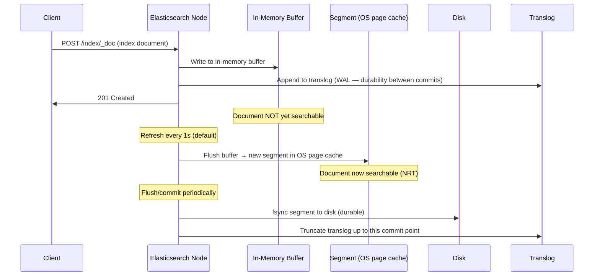

Full-text search is not a database problem — it is an information retrieval problem. The data structures and algorithms that power Elasticsearch and Solr are fundamentally different from those in a relational database. Understanding why requires starting with the inverted index.

## The Inverted Index

A relational database maps rows to columns. Full-text search needs the inverse: given a word, find every document that contains it. The **inverted index** is the data structure that makes this O(1).

```
Documents:
  doc_1: "the quick brown fox"
  doc_2: "the lazy brown dog"
  doc_3: "the quick red fox jumps"

Inverted index (after tokenization and normalization):
  "brown" → [doc_1, doc_2]
  "dog"   → [doc_2]
  "fox"   → [doc_1, doc_3]
  "jump"  → [doc_3]          ← "jumps" stemmed to "jump"
  "lazy"  → [doc_2]
  "quick" → [doc_1, doc_3]
  "red"   → [doc_3]
  "the"   → (removed — stopword)
```

Each term maps to a **posting list**: a sorted list of document IDs that contain the term. Each entry in the posting list also stores:
- **Term frequency (TF):** how many times the term appears in that document (for scoring)
- **Positions:** which positions in the document the term appears (for phrase queries: `"quick fox"` requires "quick" and "fox" to be adjacent)
- **Offsets:** byte positions (for search result highlighting)

**Multi-word query execution (`"quick fox"`):**
1. Look up posting list for "quick": [doc_1, doc_3]
2. Look up posting list for "fox": [doc_1, doc_3]
3. Intersect the two sorted lists: [doc_1, doc_3] — both must match
4. (For phrase query) check positions: are "quick" and "fox" adjacent in doc_1? In doc_3?

Posting list intersection uses merge-sort on the sorted lists: O(n) where n is the smaller posting list size. This is why rare terms in a query (short posting lists) are processed first — they prune the candidate set early.

## Text Analysis Pipeline

Before a document is indexed or a query is executed, text passes through an **analysis pipeline** that transforms raw text into the normalized tokens stored in the inverted index. The same pipeline must be applied at both index time and query time — a mismatch causes missed results.

```
Input: "The Quick-Brown FOX jumped over the LAZY dog!"

1. Character filter:     "The Quick-Brown FOX jumped over the LAZY dog!"
   (strip HTML, replace special chars)

2. Tokenizer (standard): ["The", "Quick", "Brown", "FOX", "jumped", "over", "the", "LAZY", "dog"]
   (split on whitespace and punctuation)

3. Token filters:
   lowercase:            ["the", "quick", "brown", "fox", "jumped", "over", "the", "lazy", "dog"]
   stop words (remove):  ["quick", "brown", "fox", "jumped", "lazy", "dog"]
   stemming (Porter):    ["quick", "brown", "fox", "jump", "lazi", "dog"]
                                                          ↑         ↑
                                             "jumped"→"jump"  "lazy"→"lazi"  ← correct Porter Stemmer output, not a typo

Stored in index: ["quick", "brown", "fox", "jump", "lazi", "dog"]
```

**Key tokenizer types:**

| Tokenizer | Splits on | Use case |
|-----------|----------|---------|
| `standard` | Whitespace, punctuation, Unicode word boundaries | Default; natural language text |
| `whitespace` | Whitespace only | Logs, structured tokens where punctuation is meaningful |
| `keyword` | No splitting — entire field is one token | Exact-match fields (IDs, email, paths) |
| `ngram` | Generates all substrings of min–max length | Prefix autocomplete, search-as-you-type |
| `edge_ngram` | Generates substrings anchored at the start | Autocomplete (prefix only) |

**Why query-time analysis must match index-time:** If you index "jumped" with stemming (stores "jump") but query for "jumping" without stemming, the query term "jumping" does not match the indexed term "jump" — zero results. Elasticsearch applies the same analyzer at query time by default.

## Relevance Scoring: TF-IDF and BM25

Matching documents must be ranked by relevance. Two terms in a query — "the" (common) and "elasticsearch" (rare) — should not contribute equally to relevance.

### TF-IDF

The classic scoring algorithm. Score for a term in a document is proportional to:

- **TF (Term Frequency):** how often the term appears in the document. More occurrences → higher score.
- **IDF (Inverse Document Frequency):** how rare the term is across all documents. Rare terms → higher weight.

```
TF(t, d)  = count of term t in document d / total terms in d
IDF(t)    = log(N / df(t))
             where N = total documents, df(t) = documents containing term t

score(t, d) = TF(t, d) × IDF(t)
```

**IDF example:** "the" appears in 1M of 1M documents → IDF = log(1) = 0 → contributes nothing. "elasticsearch" appears in 100 of 1M → IDF = log(10,000) = 9.2 → high contribution.

**TF-IDF weaknesses:**
1. TF grows without bound — a document that says "fox" 100 times ranks disproportionately high vs one that says it 5 times
2. No length normalization — a 10,000-word document where "fox" appears once has the same TF as a 10-word document where it appears once (but the short document is more relevant — "fox" is more central to its topic)

### BM25 (Best Match 25)

BM25 is the default scoring algorithm in Elasticsearch 5.0+ and most modern search systems. It addresses both TF-IDF weaknesses.

```
BM25(t, d) = IDF(t) × [TF(t,d) × (k1 + 1)] / [TF(t,d) + k1 × (1 - b + b × |d|/avgdl)]

k1: term frequency saturation (default 1.2) — controls how much repeated terms matter
b:  length normalization (default 0.75) — 0 = no normalization, 1 = full normalization
|d|: length of document d
avgdl: average document length across the corpus
```

**TF saturation:** As TF increases, BM25 score increases but asymptotes toward `IDF × (k1+1)`. A document saying "fox" 100 times scores only slightly higher than one saying it 10 times — the difference is not linear.

**Length normalization:** A short document where "fox" appears once ranks higher than a long document where it appears once, because the term is more central to the short document's topic. Parameter `b` controls the strength of this normalization.

## Lucene Internals: Segments

Elasticsearch is built on Apache Lucene. Each Elasticsearch shard is a Lucene index, and each Lucene index is composed of multiple **segments** — immutable sub-indexes.

### Write Path and Near-Real-Time Search



**Why immutable segments?**
- Lock-free concurrent reads: multiple readers can scan a segment simultaneously without coordination
- Simpler consistency: once written, a segment never changes
- Deletions are "soft": deleted document IDs are recorded in a bitset alongside the segment; the segment itself is unchanged. The deleted document is filtered out at query time and its storage reclaimed when the segment is merged.

**Near-real-time (NRT) search:** After a refresh (1 second by default), the new segment becomes visible to search. Documents are *not* immediately searchable on indexing — there is up to 1 second of lag.

For bulk indexing: set `refresh_interval: -1` to disable automatic refresh during ingest, then trigger a single refresh when done. This avoids creating thousands of tiny segments.

### Segment Merging

Over time, many small segments accumulate. A background merge process combines small segments into larger ones:

```
[seg_1: 100 docs] [seg_2: 100 docs] [seg_3: 80 docs + 20 deleted]
        │
        ▼ merge
[seg_merged: 280 docs]   ← deleted docs are permanently removed during merge
```

Merging reclaims disk space from deleted documents, reduces the number of files the OS must open per query, and improves query performance (fewer segments to scan). Merging is I/O intensive — tune `indices.store.throttle.max_bytes_per_sec` to prevent merge I/O from impacting query latency.

## Shard Architecture

An Elasticsearch index is divided into N primary shards. Each primary shard has M replicas. The shard count is **fixed at index creation** — it cannot be changed without reindexing.

```
Index: products  (3 primary shards, 1 replica each)

Node 1: [P0] [R1]          P = primary, R = replica
Node 2: [P1] [R2]          number = shard ID
Node 3: [P2] [R0]
```

**Document routing:** `shard = hash(document_id) % num_primary_shards`. Every node knows the routing formula — any node can route a request to the correct shard without a central coordinator.

**Writes go to primary first:**
1. Coordinator node routes the write to the primary shard for that document ID
2. Primary applies the write to its local Lucene index
3. Primary forwards the write to all replica shards in parallel
4. Once all replicas acknowledge, the coordinator returns success

**Reads can go to primary or any replica:** By default, Elasticsearch round-robins across the primary and all replicas, providing read load distribution. Replicas may lag slightly behind the primary (replication is synchronous for writes above the write consistency threshold, but background refresh creates a brief lag).

### Shard Sizing Guidelines

| Concern | Guideline |
|---------|-----------|
| Shard size | 10–50 GB per shard; smaller shards are faster to recover on node failure |
| Shards per node | Max ~20 shards per GB of heap (e.g., 30 GB heap → 600 shards per node) |
| Over-sharding risk | Each shard is a Lucene index — too many shards consume file descriptors, memory, and CPU even when idle |
| Initial shard count | Start small; use the `_split` API to double shard count if you outgrow initial sizing |
| Hot/warm architecture | Hot nodes (fast SSDs, recent data) + warm nodes (slower disks, historical data); use ILM to move indices |

### The Fixed Shard Count Problem

Because shard count is immutable, choosing the wrong initial shard count is an operational pain:

- **Too few shards:** Can't distribute load further without reindexing; a single shard becomes a bottleneck
- **Too many shards:** Over-sharding degrades performance — each query hits all shards even if results come from one; each shard has its own overhead

The `_reindex` API copies data to a new index with a different shard count but requires double the storage temporarily and takes hours for large indices. Plan shard count based on expected data volume and query throughput from the start.

## Relevance Tuning

### Field Boosting

Apply a multiplier to a field's relevance contribution:

```json
{
  "query": {
    "multi_match": {
      "query": "elasticsearch search",
      "fields": ["title^3", "description^1.5", "body^1"]
    }
  }
}
```

A match in `title` contributes 3× the score of a match in `body`. Adjust boosts based on A/B test results against real user engagement metrics.

### Function Score: Custom Signals

BM25 scores based on text match only. Function score layers additional signals on top:

```json
{
  "query": {
    "function_score": {
      "query": { "match": { "body": "search query" } },
      "functions": [
        { "gauss": { "publish_date": { "origin": "now", "scale": "30d" } } },
        { "field_value_factor": { "field": "popularity_score", "factor": 0.5 } }
      ],
      "score_mode": "multiply"
    }
  }
}
```

This boosts recently published documents and documents with higher popularity scores. The final score is `bm25_score × recency_decay × popularity_boost`.

### Fuzzy Matching

Handles typos and misspellings via Levenshtein edit distance:

```json
{ "query": { "match": { "title": { "query": "elasticsarch", "fuzziness": "AUTO" } } } }
```

`fuzziness: AUTO` allows 1 edit for terms of length 3–5, 2 edits for terms ≥ 6 characters. "elasticsarch" (missing 'e') matches "elasticsearch" with 1 edit. Performance cost: fuzzy matching expands the query into many candidate terms; use `prefix_length: 2` to anchor the first N characters as exact-match, reducing expansion.

### Synonyms

Configured at analysis time via a synonym filter:

```json
{
  "settings": {
    "analysis": {
      "filter": {
        "search_synonyms": {
          "type": "synonym",
          "synonyms": ["car, automobile, vehicle", "nyc, new york city, new york"]
        }
      }
    }
  }
}
```

At **index time:** all synonym variants are stored → broader recall, larger index, cannot update synonyms without reindexing.
At **query time:** synonyms expanded only at search → index stays small, synonyms updated without reindex, but recall depends on analyzer configuration.

Query-time synonyms are generally preferred for flexibility.

## What Elasticsearch Is Not

| Use case | Elasticsearch fit | Reason |
|----------|------------------|--------|
| Full-text search, autocomplete, faceted search | ✅ Excellent | Purpose-built |
| Log analytics (ELK stack) | ✅ Excellent | Time-based indices, aggregations |
| Primary data store | ❌ Poor | No ACID transactions, eventual consistency, data loss risk on ungraceful shutdown |
| Complex multi-entity joins | ❌ Poor | No joins; denormalization required |
| Exact-match lookups by ID | ❌ Overkill | Use a database; GET by _id is fast but Elasticsearch is not optimized for this |
| Real-time data (must be searchable < 100ms after write) | ⚠️ Limited | Default 1s refresh lag; can set `refresh_interval: 1s` but at throughput cost |


In a system design interview, Elasticsearch is the right answer when the question involves full-text search, autocomplete, relevance ranking, or log analytics. It is a **derived data store** — populated from a primary database (PostgreSQL, MySQL) via CDC or dual writes, not the authoritative record of truth. Never let the interviewer assume Elasticsearch replaces your primary database.

