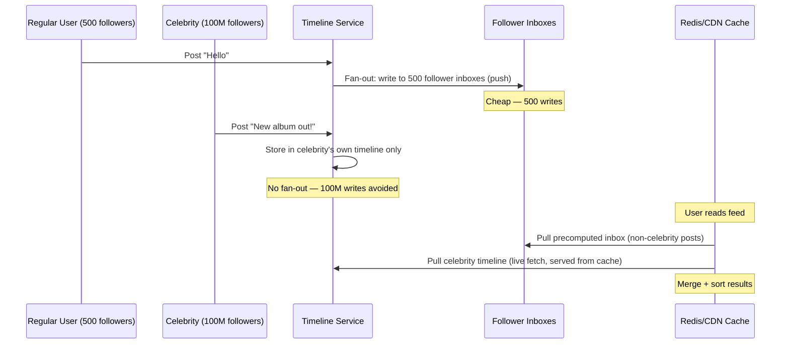

A hotspot occurs when a disproportionate fraction of traffic concentrates on a single key, partition, node, or shard. Consistent hashing and sharding distribute *different keys* across nodes — they cannot distribute *traffic for the same key* across nodes. That distinction is the root of every hotspot problem.

## What Causes Hotspots

| Trigger | Example |
|---------|---------|
| **Viral content** | A tweet goes viral — every client requests the same post ID |
| **Celebrity accounts** | Beyoncé posts — 100M followers all read from the same user record |
| **Trending topics** | A news event drives all traffic to the same hashtag counter |
| **Skewed partition keys** | All US users mapped to the same Cassandra partition because `country_code` was chosen as the partition key |
| **Monotonically increasing keys** | Auto-increment IDs in a range-sharded DB route all new writes to the last shard |
| **Kafka message keys** | All payment events keyed by `payment_provider="stripe"` route to one Kafka partition |
| **Write-heavy counters** | A global like counter or view counter for a viral post |

The pattern is always the same: the distribution mechanism (hash, range, key) maps a single high-traffic entity to a single node. The node saturates; all other nodes sit idle.

## Hotspots in Distributed Caches (Redis)

A Redis Cluster routes each key to a specific shard via `CRC16(key) % 16384`. If `product:99` receives 500k req/s, every one of those requests hits the same Redis shard, regardless of how many shards exist.

### Key Replication with Random Selection

Store N copies of the hot key, each on a different shard. On each read, randomly pick one.

```
Write:
  for i in range(N):
      redis.SET(f"product:99:{i}", value, EX=ttl)

Read:
  shard = random.randint(0, N-1)
  value = redis.GET(f"product:99:{shard}")
```

With N=10 replicas, traffic is spread across 10 shards. 500k req/s becomes 50k req/s per shard.

**Consistency tradeoff:** All N copies must be updated on every write. If a write to one shard fails, that shard serves stale data until the next successful write. For read-heavy, rarely-updated hot keys (product details, celebrity profiles, feature flags) this is acceptable. For write-heavy counters, it is not.

### Local In-Process L1 Cache

Cache the hot key in the application process's memory. Requests for the hottest keys never reach Redis.

```
local_cache = LRU(max_size=1000, ttl=1s)

def get(key):
    value = local_cache.get(key)     # L1: in-process, nanoseconds
    if value:
        return value
    value = redis.GET(key)            # L2: Redis, ~1ms
    local_cache.set(key, value)
    return value
```

A 1-second TTL on the L1 cache means hot data is at most 1 second stale, and Redis sees at most 1 request per second per application instance — regardless of traffic.

**Consistency tradeoff:** Each application instance has an independent L1 cache. A write on one instance invalidates only that instance's L1 entry. Other instances serve stale data until their TTL expires. Acceptable for non-transactional reads (content, profiles); not acceptable for inventory counts or balances.

### Read Replicas with READONLY

In Redis Cluster, replica nodes can serve reads using the `READONLY` command. Combined with a routing policy that sends hot-key reads to replicas, this distributes read traffic without application-level key sharding.

```
# Direct reads to replica for specific hot keys
replica_client = redis.Redis(host=replica_host)
replica_client.execute_command("READONLY")
value = replica_client.GET("product:99")
```

The replica may be slightly behind the primary (replication lag), so this suits workloads that tolerate brief staleness.

## Hotspots in Partitioned Databases

### Cassandra / DynamoDB: Hot Partition

Cassandra and DynamoDB both partition data by a partition key. All rows with the same partition key are stored together on the same node. If one partition key is accessed far more than others, that node becomes the bottleneck.

```
Table: events
Partition key: country_code

US:  60% of all traffic → one partition, one node
EU:  20% of all traffic → another partition
...
```

A single Cassandra node is typically capped at ~50k–100k operations/sec. If the US partition receives 200k req/s, the node is saturated while all other nodes are underloaded.

#### Fix: Write Bucketing (Random Suffix)

Split a hot partition into N sub-partitions by appending a random bucket number to the partition key.

```
# Write
bucket = random.randint(0, N-1)          # N = number of sub-partitions (e.g., 10)
partition_key = f"US#{bucket}"           # "US#0" through "US#9"
write(partition_key, row)

# Read all data for "US" requires N reads:
for bucket in range(N):
    rows = read(f"US#{bucket}")
aggregate(rows)
```

**Tradeoff:** Reads that previously fetched one partition now require N parallel reads and a client-side aggregation step. Choose N based on the write throughput of the hot partition: if one partition can handle 50k req/s and the hot key gets 200k req/s, N=4 suffices.

#### For Counters: Sharded Counters

A single `likes` counter for a viral post cannot be incremented concurrently by millions of users — the counter row becomes a write bottleneck.

```
# Write (increment one of N counter shards randomly)
shard = random.randint(0, N-1)
increment(f"post:99:likes:{shard}", 1)

# Read (sum all shards)
total = sum(read(f"post:99:likes:{i}") for i in range(N))
```

This is the pattern used for like/view/share counters in Cassandra at Facebook/Instagram scale.

#### DynamoDB Adaptive Capacity

DynamoDB automatically detects hot partitions and reallocates read/write capacity units to the hot partition at the expense of colder ones. It also supports **on-demand capacity mode** which eliminates pre-provisioned capacity entirely. For extreme hotspots, DynamoDB still recommends partition key design changes — adaptive capacity is a safety net, not a substitute for good key design.

## Hotspots in Kafka

Kafka partitions a topic into N partitions. Each partition is an ordered log assigned to one broker. If messages are keyed, all messages with the same key go to the same partition (to preserve ordering for that key).

### Skewed Key Distribution

```
Topic: payment-events, 10 partitions
Message key: payment_provider

"stripe":  70% of payments → 70% of traffic → partition 3 → broker overloaded
"paypal":  15% of payments → partition 7
"other":   15% distributed across remaining partitions
```

**Detection:** Kafka's `kafka-consumer-groups.sh --describe` shows per-partition lag. An imbalanced producer rate shows as lag accumulation on some partitions and idle capacity on others.

### Fix 1: Compound Key or Random Suffix

```python
# Instead of keying by provider alone:
key = f"{payment_provider}#{random.randint(0, 9)}"  # "stripe#0" through "stripe#9"
```

Messages for the same provider are now spread across 10 partitions. **Ordering within a provider is lost** — a consumer receiving stripe messages from partitions 0–9 cannot guarantee order across partitions.

If ordering must be preserved, use a more granular key: `user_id` instead of `provider`. Users with `provider=stripe` are spread across many user IDs, each going to their own partition.

### Fix 2: Null Key (Round-Robin)

```python
producer.send(topic, key=None, value=message)
```

Without a key, Kafka's default partitioner uses round-robin (sticky partitioning in batches). All partitions receive equal message counts. **No ordering guarantee at all** — any consumer can receive any message.

### Fix 3: Custom Partitioner

Implement a `Partitioner` that distributes based on message content:

```python
class BalancedPartitioner:
    def partition(self, topic, key, value, partitions):
        payload = json.loads(value)
        # Use a more granular, evenly-distributed attribute
        return hash(payload["user_id"]) % len(partitions)
```

### Fix 4: Repartition Topic

Create a downstream topic with more partitions keyed differently. A Kafka Streams or Flink job reads the original topic, re-keys messages by a less-skewed attribute, and writes to the new topic.

```
payment-events (keyed by provider)  →  Streams job  →  payment-events-by-user (keyed by user_id)
```

Consumers read from the repartitioned topic. This preserves ordering per-user while distributing load across many partitions.

## The Celebrity Problem (Social Graphs)

The celebrity problem is a canonical FAANG interview topic — it appears in any system design involving social feeds (Twitter, Instagram, TikTok).

**The problem:** A celebrity with 100M followers posts a message. How do you deliver it to all followers without hotspotting?

### Push (Fan-Out on Write)

On every write, precompute and store the update in every follower's inbox.

```
Celebrity posts → for each of 100M followers:
    write(f"timeline:{follower_id}", post)
```

- **Read latency:** O(1) — the timeline is precomputed; just read your inbox
- **Write latency / cost:** O(followers) per post — 100M writes per celebrity post
- **Hotspot:** The celebrity's post triggers a write storm across the entire cluster

### Pull (Fan-Out on Read)

Store the post in the celebrity's own timeline. Each user's feed is assembled at read time by querying all accounts they follow.

```
User reads feed → for each of N followed accounts:
    posts = read(f"user_timeline:{account_id}", since=last_seen)
merge_and_sort(posts)
```

- **Write latency:** O(1) — just write to your own timeline
- **Read latency:** O(following_count) — expensive if you follow 1000 accounts
- **Hotspot:** The celebrity's timeline is read by 100M followers; that record is the hotspot

### Hybrid: Pull for Celebrities, Push for Regular Users

Twitter's production approach: users below a follower threshold use push; users above the threshold use pull. The threshold is typically a few thousand followers.



The celebrity's record is still read by many clients, but the reads are served from a Redis replica or CDN cache — not the database — and the write storm is eliminated.

## Detection

| Signal | How to observe |
|--------|---------------|
| **Per-key access frequency** | Redis `redis-cli --hotkeys` (requires `maxmemory-policy allkeys-lfu`); application-level per-key counters via sampling |
| **Node CPU imbalance** | One node at 90% CPU while peers are at 10% — metric in CloudWatch, Datadog, Grafana |
| **Latency percentile spikes on specific nodes** | p99 latency for requests routed to the hot node is 10–100× higher than other nodes |
| **Kafka partition lag imbalance** | `kafka-consumer-groups.sh --describe` — some partitions accumulate lag while others are idle |
| **Cassandra nodetool** | `nodetool tpstats` (thread pool stats), `nodetool cfstats` (per-table stats including read/write rates per partition) |
| **DynamoDB CloudWatch** | `ConsumedReadCapacityUnits` and `ConsumedWriteCapacityUnits` per partition — AWS shows throttled requests per partition |
| **Application tracing** | Distributed traces (Jaeger, Zipkin) for slow requests show which downstream node is slow; correlate slow spans with node ID |

## Summary: Mitigation by System

| System | Hotspot type | Primary mitigation |
|--------|-------------|-------------------|
| **Redis** | Read hot key | Key replication × N + random read selection |
| **Redis** | Read hot key | Local in-process L1 cache (1s TTL) |
| **Redis** | Write hot counter | Sharded counter (N keys, aggregate on read) |
| **Cassandra / DynamoDB** | Hot partition (reads) | Write bucketing: add `#{shard}` suffix, multi-read + aggregate |
| **Cassandra / DynamoDB** | Hot counter | Sharded counter per partition |
| **DynamoDB** | Moderate hot partition | Adaptive capacity (automatic, limited relief) |
| **Kafka** | Skewed key | Compound key, null key (round-robin), custom partitioner, repartition topic |
| **Social feed** | Celebrity write | Hybrid push/pull: push for regular users, pull for celebrities |
| **Any** | Read hot entity | CDN / edge cache the hot object; requests never reach the origin cluster |
