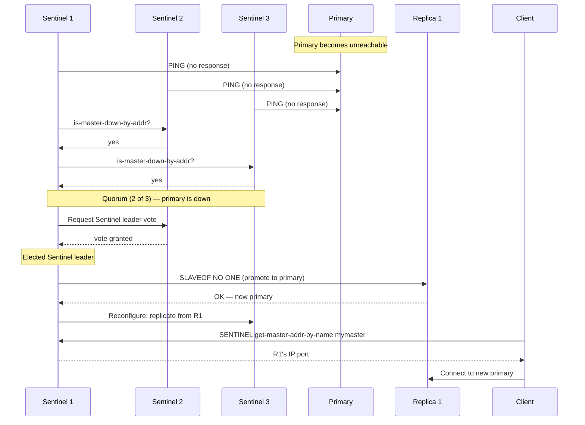
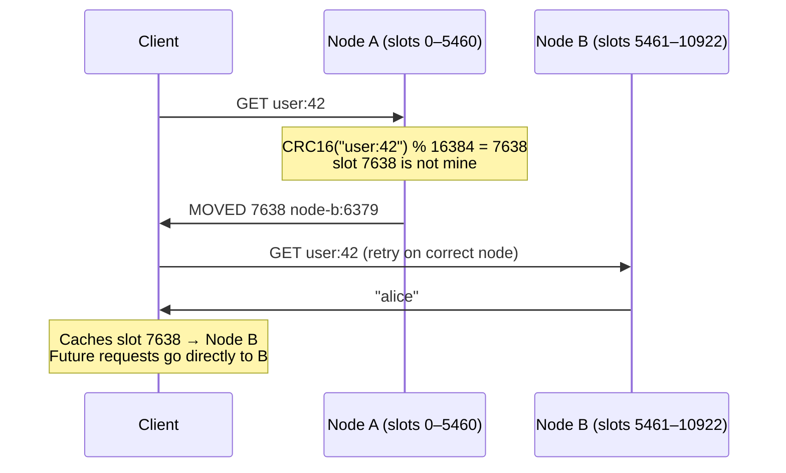

Redis is an in-memory data structure store. It is not just a cache — it is a shared, persistent, structured state layer that multiple services can read and write concurrently. Understanding what Redis actually is (versus what people assume it is) is the difference between using it well and misusing it.

## Why Redis is Fast

Redis executes every command on a **single thread** in an event loop. This eliminates lock contention entirely — no mutex overhead, no deadlocks, no context switching between threads per request. Network I/O is handled via `epoll` / `kqueue` (non-blocking I/O multiplexing), so a single thread serves thousands of clients simultaneously. (Redis 6+ optionally uses a small pool of helper threads for socket reads/writes and protocol parsing — `io-threads` — but command execution itself remains single-threaded, which is what guarantees the per-key serial-order semantics.)

```
Client A ──┐
Client B ──┤──► Event loop (single thread) ──► In-memory data structure ──► Response
Client C ──┘         processes one command
                      at a time, atomically
```

All single-command operations are inherently atomic — no two commands interleave. This is why `INCR`, `SETNX`, and `LPUSH` are safe for concurrent access without client-side locking.

**Pipelining:** Multiple commands can be batched into one network round-trip. Without pipelining, 10 commands at 1ms RTT = 10ms. With pipelining, 10 commands = 1ms + execution time. Critical for high-throughput paths.

```
# Without pipelining: 3 round trips
SET key1 val1
SET key2 val2
SET key3 val3

# With pipelining: 1 round trip
PIPELINE
  SET key1 val1
  SET key2 val2
  SET key3 val3
EXECUTE
```

## Data Structures

Redis exposes typed data structures, not a generic blob store. Choosing the right structure eliminates application-level logic that would otherwise require a separate read-modify-write cycle.

| Type | Encoding (internal) | Key operations | Use case |
|------|---------------------|----------------|---------|
| **String** | Raw bytes, int, embstr | `GET`, `SET`, `INCR`, `EXPIRE`, `SETNX` | Cache, counters, distributed locks, feature flags |
| **List** | Listpack (small) / Quicklist | `LPUSH`, `RPUSH`, `LPOP`, `LRANGE`, `BLPOP` | Message queue (FIFO/LIFO), activity feed, job queue |
| **Set** | Listpack / Hash table | `SADD`, `SREM`, `SISMEMBER`, `SUNION`, `SINTER` | Unique visitor tracking, tag systems, friend graph intersection |
| **Sorted Set (ZSET)** | Listpack / Skip list + hash table | `ZADD`, `ZRANGE`, `ZRANK`, `ZRANGEBYSCORE` | Leaderboards, priority queues, rate limiting windows, geo index |
| **Hash** | Listpack / Hash table | `HGET`, `HSET`, `HMGET`, `HINCRBY` | User profile (field-per-attribute), object storage |
| **Bitmap** | String (bit array) | `SETBIT`, `GETBIT`, `BITCOUNT`, `BITOP` | Daily active user tracking (1 bit per user ID), feature flags |
| **HyperLogLog** | Probabilistic structure | `PFADD`, `PFCOUNT` | Unique count estimation with ±0.81% error, O(1) space (~12 KB) |
| **Stream** | Radix tree of listpacks | `XADD`, `XREAD`, `XREADGROUP`, `XACK` | Durable message log with consumer groups; Kafka-lite |
| **Geo** | Sorted Set (geohash as score) | `GEOADD`, `GEODIST`, `GEORADIUS` | Points-of-interest nearby, delivery radius |

### Sorted Sets in Depth

Sorted sets are the most versatile structure. Each member has an associated float score; members are always iterated in score order.

```
# Leaderboard: score = game points
ZADD leaderboard 9850 "alice"
ZADD leaderboard 8200 "bob"
ZADD leaderboard 9850 "carol"   # tie with alice

ZREVRANGE leaderboard 0 9 WITHSCORES    # top 10, highest score first
ZRANK leaderboard "bob"                  # rank of bob (0-indexed)
ZRANGEBYSCORE leaderboard 8000 9000      # members between score 8000–9000
```

```
# Sliding window rate limiter: score = timestamp (unix ms)
ZADD user:123:requests 1700000000123 "req_abc"
ZREMRANGEBYSCORE user:123:requests 0 (now - window_ms)
ZCARD user:123:requests   # current count in window
```

### Streams in Depth

Streams are a persistent, append-only log with consumer group support. Unlike pub/sub (fire-and-forget), stream messages survive consumer restarts.

```
# Producer
XADD orders * user_id 42 item_id 99 qty 1
           ↑                                  auto-generated ID: timestamp-sequence

# Consumer group (multiple consumers, each gets a unique message)
XGROUP CREATE orders fulfillment $ MKSTREAM
XREADGROUP GROUP fulfillment worker1 COUNT 10 STREAMS orders >
XACK orders fulfillment <message-id>    # mark processed
```

**Stream vs Pub/Sub:** Pub/Sub is fire-and-forget — if no subscriber is listening, the message is lost. Streams persist messages; a consumer that restarts reads from where it left off. Use `XADD key MAXLEN ~ N ...` to cap a stream at approximately N entries — Redis trims old messages as new ones arrive, preventing unbounded memory growth.

## Persistence

Redis is in-memory — a restart loses all data unless persistence is configured.

### RDB (Redis Database Snapshot)

Periodically forks the process and writes the entire dataset to a compact binary file (`dump.rdb`).

```
# redis.conf
save 900 1        # snapshot if at least 1 key changed in 900s
save 300 10       # snapshot if at least 10 keys changed in 300s
save 60 10000     # snapshot if at least 10000 keys changed in 60s
```

**Fork + copy-on-write:** The parent continues serving requests. The child has a point-in-time view of memory (copy-on-write pages). The child writes the snapshot without blocking the parent — but a write-heavy workload doubles memory usage temporarily during the fork.

| | RDB |
|---|---|
| **Recovery time** | Fast (load binary file) |
| **Data loss on crash** | Up to the last snapshot interval (minutes) |
| **Disk size** | Compact |
| **Performance impact** | Fork overhead; brief pause on very large datasets |

### AOF (Append-Only File)

Every write command is appended to a log file (`appendonly.aof`). On restart, Redis replays the log to reconstruct state.

```
# redis.conf
appendonly yes
appendfsync everysec    # flush to disk every second (default, recommended)
# appendfsync always    # flush every command — max durability, lowest throughput
# appendfsync no        # OS decides when to flush — fastest, highest data loss risk
```

**AOF rewrite:** The log grows without bound. `BGREWRITEAOF` compacts it by rewriting the minimal set of commands to reconstruct current state (e.g., 1000 `INCR key` commands become `SET key 1000`).

| | AOF |
|---|---|
| **Recovery time** | Slower (replay every command) |
| **Data loss on crash** | At most 1 second (`appendfsync everysec`) |
| **Disk size** | Larger (command log, compacted by rewrite) |
| **Performance impact** | Continuous write to append log |

### Hybrid Mode (Recommended)

Redis 4.0+. RDB snapshot as the base; AOF records only changes since the last snapshot. Combines fast recovery (load RDB) with minimal data loss (replay short AOF delta).

```
aof-use-rdb-preamble yes    # enable hybrid mode
```

## High Availability: Redis Sentinel

Sentinel is an autonomous HA system — it monitors, notifies, and automatically fails over when a primary becomes unavailable.

```
                    ┌─────────────┐
            ┌──────►│  Sentinel 1 │◄──────┐
            │       └─────────────┘       │
            │                             │
┌───────────┴──┐  quorum (≥2 agree)  ┌───┴──────────┐
│  Sentinel 2  │──────────────────────│  Sentinel 3  │
└───────────┬──┘                      └──┬───────────┘
            │     ┌─────────────┐        │
            └────►│   Primary   │◄───────┘
                  └──────┬──────┘
                   writes│
               ┌─────────┴──────────┐
           ┌───┴───┐           ┌────┴────┐
           │  Rep1 │           │  Rep2   │
           └───────┘           └─────────┘
```

**Failover process:**



**Client requirement:** Clients must be Sentinel-aware — they ask Sentinel for the current primary rather than connecting to a hardcoded IP.

**Sentinel is not horizontal scale** — there is still one primary handling all writes. Sentinel provides automatic failover, not sharding.

## Horizontal Scale: Redis Cluster

Redis Cluster partitions the keyspace across multiple primary nodes using **hash slots**.

```
16384 hash slots distributed across N primary nodes:
  Node A: slots 0–5460      (+ 1 or more replicas)
  Node B: slots 5461–10922  (+ 1 or more replicas)
  Node C: slots 10923–16383 (+ 1 or more replicas)
```

**Key-to-slot mapping:** `slot = CRC16(key) % 16384`. Every client computes this locally. If a request lands on the wrong node, the node returns a `MOVED` redirection.



**Hash tags:** To ensure related keys land on the same slot (required for multi-key commands), use `{tag}`:

```
{user:42}:profile    ─┐
{user:42}:sessions   ─┤─ all hash to the same slot (CRC16 of "user:42")
{user:42}:cart       ─┘

MGET {user:42}:profile {user:42}:sessions   # valid — same slot
MGET user:profile:42 user:sessions:42       # may fail — different slots
```

**Hot key problem:** A single slot cannot be distributed further. If one key (e.g., a viral product page) receives 100k req/s, it saturates one node. Mitigations: local in-process cache, read replicas with `READONLY` commands, key sharding with a suffix (`product:99:{shard_0}`, `product:99:{shard_1}`).

## Use Cases and Patterns

### Distributed Lock

Atomic acquisition with expiry prevents deadlocks if the lock holder crashes.

```
# Acquire: SET key value NX EX ttl_seconds
SET lock:order:42 "worker-uuid-abc" NX EX 30
# NX: only set if key does not exist
# EX: auto-expire after 30s even if worker crashes

# Release: compare-and-delete (Lua for atomicity)
if redis.call("GET", KEYS[1]) == ARGV[1] then
    return redis.call("DEL", KEYS[1])
end
```

**Why check value on release:** Without the check, worker A could acquire the lock, take longer than TTL, the lock expires, worker B acquires it, then worker A releases worker B's lock.

**Redlock:** For multi-node safety, acquire the lock on N/2+1 independent Redis instances within the TTL window. Controversial (Martin Kleppmann argues clock drift undermines the guarantee); in practice, single-node locks suffice for most systems if the worst case (losing the lock on node failure) is acceptable.

### Rate Limiting

```
# Fixed window counter
INCR rate:user:42:2024010115    # key = user + time bucket (hour)
EXPIRE rate:user:42:2024010115 3600

# Sliding window: sorted set (see Sorted Sets above)
```

### Session Store

```
SETEX session:token_abc 3600 '{"user_id":42,"role":"admin"}'
# SETEX = SET + EXPIRE in one command
GET session:token_abc
DEL session:token_abc   # logout
```

### Pub/Sub

```
# Subscriber
SUBSCRIBE notifications:user:42

# Publisher (different connection)
PUBLISH notifications:user:42 '{"type":"order_shipped","order":99}'
```

**Pub/Sub limitations:** Fire-and-forget. A subscriber that disconnects misses all messages sent while offline. For guaranteed delivery, use Streams with consumer groups instead.

### Cache-Aside Pattern

```
# Read
value = redis.GET(key)
if value is None:
    value = db.query(...)
    redis.SETEX(key, ttl, value)
return value

# Write (invalidate on update)
db.update(...)
redis.DEL(key)    # invalidate; next read repopulates from DB
```

**Cache stampede:** When a hot key expires, many concurrent requests all miss and hit the DB simultaneously. Mitigations: staggered TTL with random jitter, probabilistic early recomputation, or locking the first miss (only one request fetches from DB; others wait).

## Memory Management

Redis stores everything in RAM. When `maxmemory` is reached, Redis applies an eviction policy rather than returning errors (unless `noeviction` is set).

```
maxmemory 4gb
maxmemory-policy allkeys-lfu
```

| Policy | What gets evicted | When to use |
|--------|------------------|-------------|
| `noeviction` | Nothing — return error | Persistent data store; cannot afford data loss |
| `allkeys-lru` | Least recently used across all keys | General cache — evict cold data regardless of TTL |
| `volatile-lru` | LRU from keys with TTL set | Mix of persistent and cached data; preserve no-TTL keys |
| `allkeys-lfu` | Least frequently used across all keys | Workloads with long-lived hot keys that LRU would evict after a quiet period |
| `volatile-lfu` | LFU from keys with TTL set | Same as volatile-lru but frequency-based |
| `allkeys-random` | Random across all keys | Uniform access pattern (rarely the right choice) |
| `volatile-random` | Random from keys with TTL | Rarely used |
| `volatile-ttl` | Key with shortest remaining TTL | Evict soonest-to-expire keys first |

**LRU vs LFU:** LRU evicts the key not accessed for the longest time — a key accessed heavily for a week but quiet for 10 minutes could be evicted. LFU tracks access frequency over time and is more resistant to bursty patterns. Prefer `allkeys-lfu` for caches with skewed access distributions.

**Redis memory overhead:** Every key has ~50–80 bytes of overhead (pointer, encoding metadata, expiry). A million small keys adds ~50–80 MB of overhead before storing any values. Monitor `INFO memory` → `mem_fragmentation_ratio`; values above 1.5 indicate memory fragmentation that `MEMORY PURGE` or a restart can reclaim.


**Interview tip:** When asked about Redis, I'd lead with "it's a single-threaded event-loop server, which is why every single-command operation is atomic without locks — that's why `INCR`, `SETNX`, and Lua scripts are safe primitives for distributed locking, rate limiting, and counters." I'd pick the right data structure rather than treating Redis as a JSON blob store: sorted sets for leaderboards and sliding-window rate limiters, streams (not pub/sub) when consumers must survive restarts, hashes for object fields. For HA I'd use Sentinel for automatic failover on a single primary, Redis Cluster with hash slots for horizontal scale — and I'd flag the hot-key problem (`CRC16(key) % 16384` lands one viral key on one shard) as a separate problem that needs an L1 cache or key sharding above Redis.


## Test Your Understanding


Redis uses an **event loop** (epoll/kqueue) that multiplexes thousands of client connections on a single thread without blocking. Each operation executes in microseconds because all data is in memory, data structures are optimized for in-memory access, and there's no thread context switching or lock contention.

The single thread bottlenecks only when: (a) individual commands are slow (e.g., `KEYS *` scanning millions of keys), (b) large Lua scripts block the event loop, or (c) the workload is CPU-bound (rare for KV ops). Redis 6+ uses I/O threads for network read/write, but command execution remains single-threaded — preserving atomicity guarantees.



**They're gone.** Redis pub/sub is fire-and-forget — messages are delivered to currently connected subscribers and immediately discarded. No persistence, no replay, no acknowledgment.

**Fix:** Use **Redis Streams** instead. Streams are a persistent, append-only log (similar to Kafka). Consumers use consumer groups with offset tracking — after a crash, the consumer resumes from its last acknowledged position. Streams provide at-least-once delivery; pub/sub provides at-most-once.



**Eviction pressure.** When Redis hits maxmemory, every new write triggers LRU eviction — Redis must scan keys to find candidates before processing the write. Under heavy write load at the memory limit, every operation pays eviction overhead.

Additionally, **memory fragmentation** (check `mem_fragmentation_ratio` in `INFO memory`) means the allocator reports 8GB used but can't allocate contiguous blocks. Evicting a large sorted set or hash (millions of members) blocks the event loop during deallocation.

**Fix:** Set maxmemory to ~75% of available RAM for headroom. Use `UNLINK` (async, non-blocking) instead of `DEL` for large keys. Consider `allkeys-lfu` if access is skewed — LFU protects frequently accessed keys better than LRU.



`CRC16(key) % 16384` maps the hot key to exactly one hash slot on one node. All traffic for that key hits that single node regardless of cluster size. Adding nodes redistributes hash slots but the hot key's slot stays on one node.

**Fixes:** (1) **Key sharding** — split `product:viral` into `product:viral:{0..9}`, read from a random shard. (2) **L1 in-process cache** with 1–5s TTL so most requests never reach Redis. (3) **Read from replicas** — Redis Cluster supports `READONLY` mode on replica nodes of the hot key's primary.



This is the **lock expiry race condition** — the most common distributed lock bug. Instance A's work took longer than the lock TTL, so the lock expired while A was still working.

**Fixes:**
1. **Fencing tokens:** The lock server returns a monotonically increasing token with each lock grant. The protected resource (database, API) rejects operations with a token lower than the latest seen. Instance A's stale token is rejected even though A believes it holds the lock.
2. **Lock extension:** Instance A periodically refreshes the TTL (watchdog pattern). If A crashes, the extension stops and the lock expires naturally. Redisson (Java Redis client) implements this as a "lock watchdog."
3. **Conservative TTL:** Set the TTL much longer than expected work time. Accept that a crashed holder delays the next acquisition.

Note: Redis-based locks are best-effort. For strict mutual exclusion, use ZooKeeper or etcd (which use consensus protocols).

