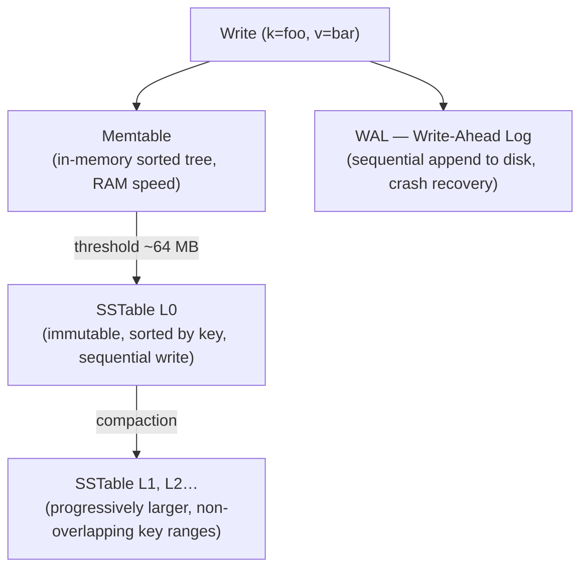

A Log-Structured Merge-tree (LSM tree) is a write-optimized storage structure used by Cassandra, RocksDB, LevelDB, HBase, and InfluxDB. It trades read amplification for dramatically faster writes by converting random I/O into sequential I/O.

## The Core Problem with B-Trees at Write Scale

B-trees store data in fixed-size pages on disk. Every write to an existing page requires a random disk seek to find that page, modify it in-place, and write it back. At high write throughput, random I/O becomes the bottleneck — HDDs especially are ~100× slower for random vs sequential writes, and even NVMe SSDs benefit from sequential write patterns for endurance.

LSM trees eliminate random writes entirely. Every write goes to memory first, then to disk sequentially in sorted batches.

## Write Path



**Memtable:** An in-memory sorted data structure (red-black tree or skip list). Absorbs all writes at RAM speed. Writes are also appended to a WAL for durability — if the process crashes before flushing, the WAL replays the memtable.

**SSTable (Sorted String Table):** An immutable, sorted-by-key file on disk. Once written, it is never modified — updates and deletes create new entries, not in-place changes. Each SSTable has:
- A data file (key-value pairs sorted by key)
- An index file (sparse index: key → byte offset in data file)
- A Bloom filter (probabilistic: "does this SSTable definitely NOT contain key X?")

**Deletion via tombstone:** To delete a key, the memtable records a tombstone marker (key + deletion flag). On read, a tombstone shadows all older versions of that key. Tombstones are physically removed during compaction.

## Read Path

Reads are more expensive than writes because the same key may exist in multiple SSTables at different versions.

```
Read key "foo"

1. Check memtable (most recent writes) → found? return
2. Check L0 SSTables newest → oldest
   │  Bloom filter says "definitely not here"? → skip
   │  Bloom filter says "maybe here"? → binary search in SSTable
3. Check L1, L2… in order until found or exhausted
```

**Read amplification:** In the worst case, every level must be checked. This is why LSM trees have higher read latency than B-trees for point lookups — a B-tree finds any key in O(log n) in a single structure; an LSM tree may check O(L) SSTables.

**Bloom filters** are the key optimization that makes reads practical. A Bloom filter can say "this key is definitely NOT in this SSTable" in O(1), allowing the database to skip the vast majority of SSTables on a point lookup. See [Bloom Filters & HyperLogLog](../bloom-filters) for the mechanics, false positive math, and sizing formulas.

## Compaction

Without compaction, the number of SSTables grows unboundedly and reads degrade. Compaction merges SSTables, discards superseded versions and tombstones, and maintains sorted order.

### Size-Tiered Compaction (Cassandra default)

Group SSTables by size. When N same-sized SSTables accumulate, merge them into one larger SSTable.

```
[1MB] [1MB] [1MB] [1MB]  →  [4MB]
[4MB] [4MB] [4MB] [4MB]  →  [16MB]
```

- **Write-efficient:** low write amplification — each key is rewritten fewer times
- **Space-inefficient:** during compaction, temporary 2× space required (old + new SSTables coexist)
- **Read latency variance:** large SSTables take longer to scan; Bloom filters help but don't eliminate the issue

### Leveled Compaction (RocksDB / LevelDB default)

SSTables are organized into levels (L0, L1, L2…). Each level has a bounded total size (e.g., L1: 10MB, L2: 100MB, L3: 1GB, 10× per level). Within L1 and above, key ranges across SSTables never overlap.

```
L0: [a–z] [a–z] [a–z]         ← overlapping, any key could be anywhere
L1: [a–f] [g–m] [n–z]         ← non-overlapping, bounded size
L2: [a–b] [c–d] … [y–z]       ← non-overlapping, 10× larger
```

When L0 fills up, its SSTables are merged into L1. When L1 overflows, the affected key range is merged into L2, and so on.

- **Read-efficient:** at most one SSTable per level (L1+) contains any given key → bounded read amplification
- **Higher write amplification:** a key may be rewritten O(levels) times as it cascades down
- **Space-efficient:** no temporary 2× space; only the compacting SSTables are duplicated

| | Size-Tiered | Leveled |
|---|---|---|
| **Write amplification** | Low | High |
| **Read amplification** | High | Low |
| **Space amplification** | High (temp 2×) | Low |
| **Best for** | Write-heavy (Cassandra time-series) | Read-heavy (RocksDB, general-purpose) |

## B-Tree vs LSM Tree

| | B-Tree | LSM Tree |
|---|---|---|
| **Write pattern** | Random I/O (in-place page update) | Sequential I/O (append-only) |
| **Write amplification** | High (page splits, COW) | Low (memtable → sequential flush) |
| **Read amplification** | Low (single tree, O(log n)) | Higher (multiple SSTables + Bloom filters) |
| **Space amplification** | Low | Moderate (compaction temp space, tombstones) |
| **Crash recovery** | WAL + redo log | WAL (memtable replay) |
| **Update / delete cost** | In-place (fast for reads after write) | Tombstone + deferred cleanup via compaction |
| **Range scan** | ✅ Efficient (leaf linked list) | ✅ Efficient within a single SSTable; cross-SSTable merge needed |
| **Used by** | PostgreSQL, MySQL (InnoDB), Oracle, SQL Server | Cassandra, RocksDB, LevelDB, HBase, InfluxDB, TiKV |


RocksDB (built on LevelDB, open-sourced by Meta) is the storage engine embedded inside many systems: CockroachDB, TiKV (TiDB), MyRocks (MySQL at Meta), Kafka log storage, and dozens of others. When an interview asks "how does Cassandra handle high write throughput?" — the answer starts with LSM trees.


## Write Stalls

A write stall occurs when the memtable fills faster than it can be flushed to disk, or when L0 SSTable count exceeds the compaction threshold. RocksDB will throttle or fully stall incoming writes to prevent unbounded memory growth.

This is a real operational concern at high write throughput — tuning memtable size, flush thread count, and compaction concurrency is necessary for write-heavy workloads.
